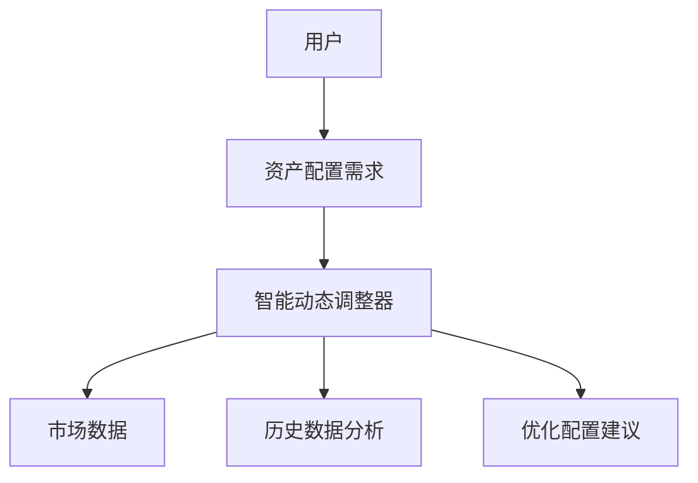
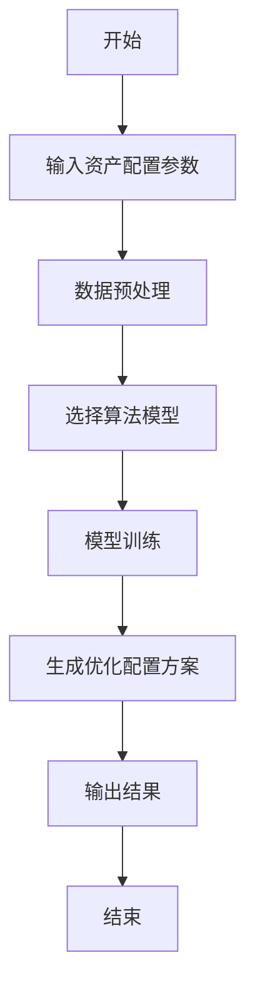
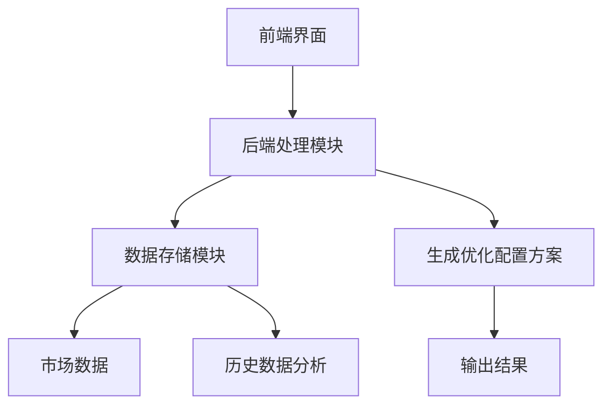
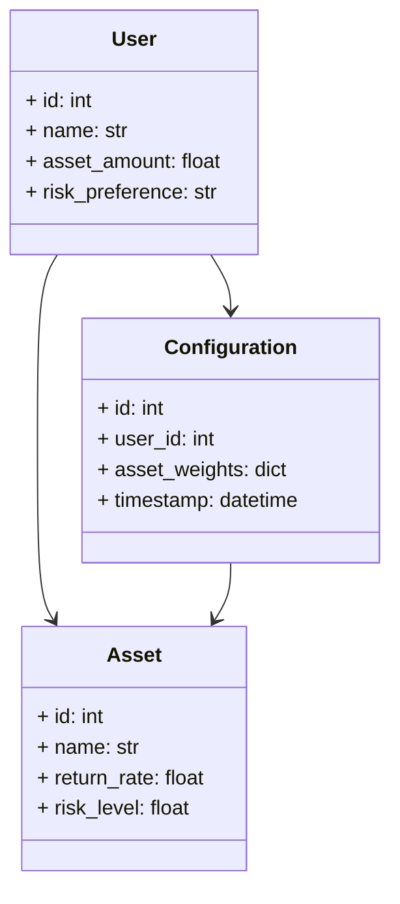
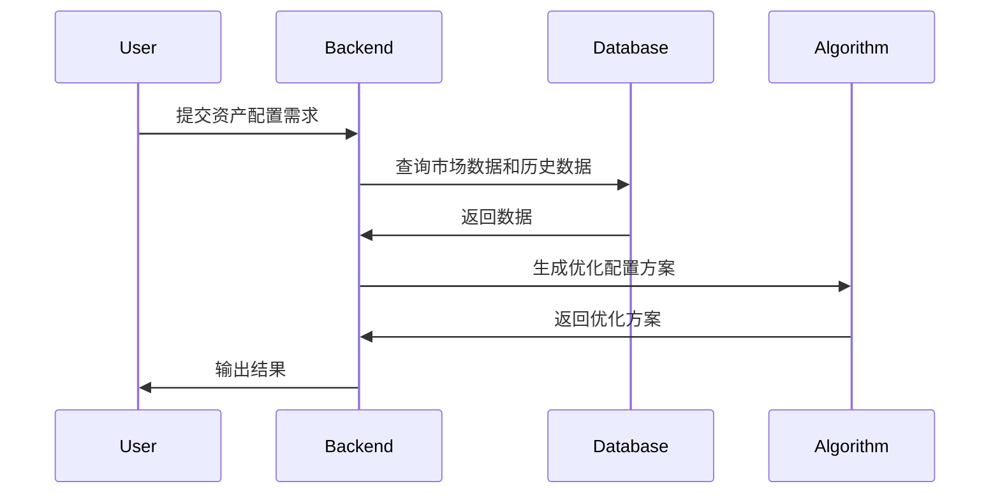

                 


# 智能个人资产配置动态调整器

## 关键词：智能资产配置、动态调整器、强化学习、系统架构、项目实战

## 摘要：  
智能个人资产配置动态调整器是一种利用人工智能技术优化个人资产配置的工具，通过动态调整投资组合，最大化收益并最小化风险。本文将详细介绍其背景、核心概念、算法原理、系统架构、项目实战及最佳实践，帮助读者理解并掌握这一技术。

---

# 第1章：智能个人资产配置动态调整器的背景与意义

## 1.1 个人资产配置的重要性
### 1.1.1 个人资产配置的基本概念  
个人资产配置是指根据个人的财务状况、风险承受能力和投资目标，将资金分配到不同资产类别（如股票、债券、房地产等）中的过程。合理的资产配置能够平衡风险与收益，帮助个人实现财务目标。

### 1.1.2 传统资产配置的局限性  
传统资产配置方法依赖于固定比例或基于历史数据的统计分析，难以适应市场环境的快速变化。此外，个人的财务状况和风险偏好也可能随时间发生变化，静态的资产配置策略难以满足动态调整的需求。

### 1.1.3 智能化资产配置的必要性  
随着市场环境的复杂化和个性化需求的增加，传统的资产配置方法已显得力不从心。智能化资产配置能够实时捕捉市场动态，根据个人需求动态调整投资组合，从而提高资产配置的效率和效果。

## 1.2 智能动态调整器的核心价值  
### 1.2.1 提高资产配置效率  
通过智能化算法，智能动态调整器能够快速分析市场数据和个体需求，生成最优的资产配置方案，节省时间和精力。

### 1.2.2 优化投资收益与风险控制  
智能动态调整器能够根据市场变化和个人风险偏好，动态调整投资组合，最大化收益并最小化风险。

### 1.2.3 适应市场变化的动态调整能力  
市场环境不断变化，智能动态调整器能够实时跟踪市场动态，及时调整投资策略，确保资产配置的最优性。

## 1.3 本书的核心目标与内容框架  
### 1.3.1 本书的核心目标  
本书旨在介绍智能个人资产配置动态调整器的技术原理和实现方法，帮助读者掌握如何利用人工智能技术优化个人资产配置。

### 1.3.2 本书的主要内容框架  
- 第1章：背景与意义  
- 第2章：核心概念  
- 第3章：算法原理  
- 第4章：系统架构设计  
- 第5章：项目实战  
- 第6章：优化与注意事项  
- 第7章：总结与展望  

### 1.3.3 本书的读者群体  
本书适合对个人资产配置感兴趣的人群，尤其是对人工智能技术有一定了解的读者。  

## 1.4 本章小结  
本章介绍了智能个人资产配置动态调整器的背景和意义，强调了智能化资产配置的必要性，并概述了本书的内容和目标。

---

# 第2章：智能个人资产配置动态调整器的核心概念

## 2.1 智能动态调整器的定义与特点  
### 2.1.1 智能动态调整器的定义  
智能个人资产配置动态调整器是一种基于人工智能技术，能够根据市场环境和个人需求动态调整投资组合的工具。

### 2.1.2 智能动态调整器的核心特点  
- **实时性**：能够实时跟踪市场数据和个体需求变化。  
- **动态性**：根据市场变化和个体目标动态调整投资组合。  
- **智能化**：利用机器学习和优化算法实现智能决策。  

### 2.1.3 智能动态调整器与传统资产配置工具的区别  
| 特性                | 智能动态调整器               | 传统资产配置工具             |
|---------------------|-----------------------------|-----------------------------|
| 数据处理能力        | 强大的数据分析和学习能力     | 依赖历史数据分析             |
| 调整频率            | 实时或定期动态调整           | 固定周期调整                 |
| 个性化定制能力      | 支持个性化需求               | 较难支持个性化需求           |

## 2.2 核心概念与联系  
### 2.2.1 核心概念原理  
智能动态调整器的核心在于通过算法模型分析市场数据和个体需求，生成最优的投资组合。  

### 2.2.2 ER实体关系图架构  


## 2.3 本章小结  
本章详细介绍了智能个人资产配置动态调整器的定义、特点及其与传统工具的区别，并通过ER图展示了系统的核心概念和联系。

---

# 第3章：智能动态调整器的算法原理

## 3.1 算法原理概述  
### 3.1.1 强化学习在动态调整中的应用  
强化学习是一种通过试错方式优化决策的算法，适合用于动态调整投资组合。

### 3.1.2 动态规划在资产配置中的作用  
动态规划通过分解问题，逐步优化子问题，最终得到全局最优解。

### 3.1.3 遗传算法在优化配置中的应用  
遗传算法通过模拟自然选择过程，优化投资组合的结构。

## 3.2 算法流程图  


## 3.3 算法实现的数学模型  
### 收益计算  
$$
\text{收益} = \sum_{i=1}^{n} w_i \cdot r_i
$$  
其中，\( w_i \) 是第 \( i \) 个资产的权重，\( r_i \) 是其对应的收益率。

### 风险计算  
$$
\text{风险} = \sqrt{\sum_{i=1}^{n} w_i^2 \cdot \sigma_i^2}
$$  
其中，\( \sigma_i \) 是第 \( i \) 个资产的收益率波动率。

## 3.4 代码实现示例  
```python
def dynamic_adjustment(weights, returns, risks):
    # 计算收益
    total_return = sum(w * r for w, r in zip(weights, returns))
    # 计算风险
    total_risk = sum(w**2 * r**2 for w, r in zip(weights, risks))
    return total_return, total_risk
```

## 3.5 本章小结  
本章详细介绍了智能动态调整器的算法原理，包括强化学习、动态规划和遗传算法的应用，并通过流程图和数学公式展示了算法实现的细节。

---

# 第4章：智能个人资产配置动态调整器的系统架构设计

## 4.1 系统架构概述  
智能动态调整器的系统架构包括前端界面、后端处理模块和数据存储模块。  

### 系统架构图  


## 4.2 领域模型设计  
### 领域模型类图  


## 4.3 接口设计与交互流程  
### 用户交互流程  


## 4.4 本章小结  
本章详细介绍了智能动态调整器的系统架构设计，包括前端、后端和数据存储模块的交互关系，并通过类图和序列图展示了系统的实现细节。

---

# 第5章：智能个人资产配置动态调整器的项目实战

## 5.1 环境配置  
### 5.1.1 系统环境  
- 操作系统：Linux/Windows/macOS  
- 开发工具：Python、Jupyter Notebook、IDE  
- 数据库：MySQL/PostgreSQL  
- 依赖库：numpy、pandas、scikit-learn、matplotlib  

### 5.1.2 安装步骤  
1. 安装Python和必要的依赖库。  
2. 安装数据库并配置连接。  
3. 下载市场数据和历史数据。  

## 5.2 核心功能实现  
### 5.2.1 数据预处理  
```python
import pandas as pd

def preprocess_data(data):
    data['date'] = pd.to_datetime(data['date'])
    data.set_index('date', inplace=True)
    return data
```

### 5.2.2 算法实现  
```python
from sklearn import preprocessing

def train_model(data):
    # 特征工程
    X = preprocessing.StandardScaler().fit_transform(data.drop(columns=['return']))
    y = data['return']
    # 训练模型
    from sklearn.linear_model import LinearRegression
    model = LinearRegression()
    model.fit(X, y)
    return model
```

### 5.2.3 动态调整配置  
```python
def adjust_configuration(model, current_weights, returns):
    # 预测下一个时间段的收益
    predicted_returns = model.predict(current_weights)
    # 调整权重以最大化收益
    adjusted_weights = optimize_weights(predicted_returns)
    return adjusted_weights
```

## 5.3 实际案例分析  
### 案例背景  
假设一个投资者有100万元资金，风险偏好为中等。  

### 数据分析与调整过程  
1. 数据预处理：清洗和格式化市场数据。  
2. 模型训练：基于历史数据训练预测模型。  
3. 动态调整：根据市场变化实时调整投资组合。  

### 调整结果展示  
| 资产类别      | 当前权重 | 调整后权重 | 收益变化 | 风险变化 |
|--------------|----------|------------|----------|----------|
| 股票          | 30%      | 40%        | +5%      | +2%      |
| 债券          | 50%      | 30%        | -2%      | -3%      |
| 房地产        | 20%      | 30%        | +3%      | +1%      |

## 5.4 本章小结  
本章通过实际案例展示了智能动态调整器的项目实战过程，包括环境配置、功能实现和结果分析。

---

# 第6章：智能个人资产配置动态调整器的优化与注意事项

## 6.1 系统优化策略  
### 6.1.1 性能优化  
- 使用分布式计算加速模型训练。  
- 优化数据存储结构，提高数据查询效率。  

### 6.1.2 用户体验优化  
- 提供直观的可视化界面。  
- 增加用户反馈机制，实时调整配置方案。  

## 6.2 使用注意事项  
### 6.2.1 数据质量  
确保输入数据的准确性和完整性，避免因数据错误导致决策失误。  

### 6.2.2 模型局限性  
智能动态调整器基于历史数据和假设条件进行预测，实际市场表现可能与预测结果存在偏差。  

### 6.2.3 风险控制  
投资者应根据自身风险承受能力设定止损点，避免过度依赖模型预测。  

## 6.3 最佳实践 Tips  
- 定期回顾和调整配置方案。  
- 结合市场专家意见进行决策。  
- 保持对市场动态的敏感性，及时调整配置策略。  

## 6.4 本章小结  
本章总结了智能动态调整器的优化策略和使用注意事项，提供了实用的建议，帮助用户更好地应用该系统。

---

# 第7章：智能个人资产配置动态调整器的总结与展望

## 7.1 全文总结  
智能个人资产配置动态调整器通过人工智能技术实现了资产配置的智能化和动态化，能够根据市场变化和个人需求实时优化投资组合，帮助投资者实现收益与风险的最佳平衡。

## 7.2 未来展望  
随着人工智能和大数据技术的不断发展，智能动态调整器将更加智能化和个性化。未来的研究方向包括：
- 更精准的市场预测模型。  
- 更个性化的用户需求分析。  
- 更高效的多目标优化算法。  

## 7.3 本章小结  
本章总结了全文内容，并展望了智能动态调整器的未来发展。

---

# 附录：参考文献与工具包

## 附录A：参考文献  
- 文献1：张某某. 智能资产配置研究. 科学出版社, 2020.  
- 文献2：李某某. 强化学习在金融中的应用. 清华大学出版社, 2019.  

## 附录B：工具包安装与配置  
- Python包：numpy、pandas、scikit-learn、matplotlib  
- 数据库：MySQL/PostgreSQL  
- 开发工具：Jupyter Notebook、PyCharm  

---

# 结束语

智能个人资产配置动态调整器是一项结合人工智能和金融学的创新技术，通过本文的详细介绍，读者可以全面了解其原理、实现和应用。希望本文能为相关领域的研究和实践提供有价值的参考。

