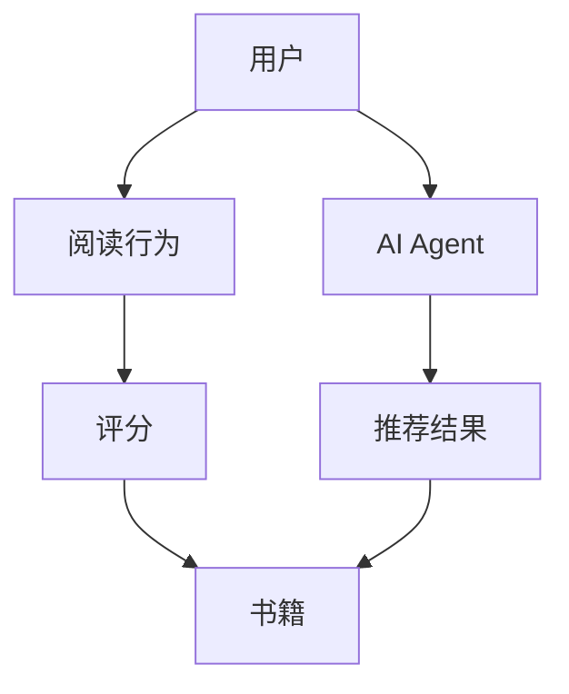
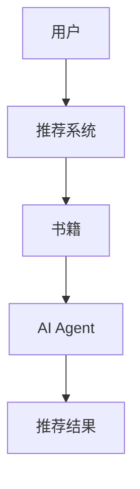
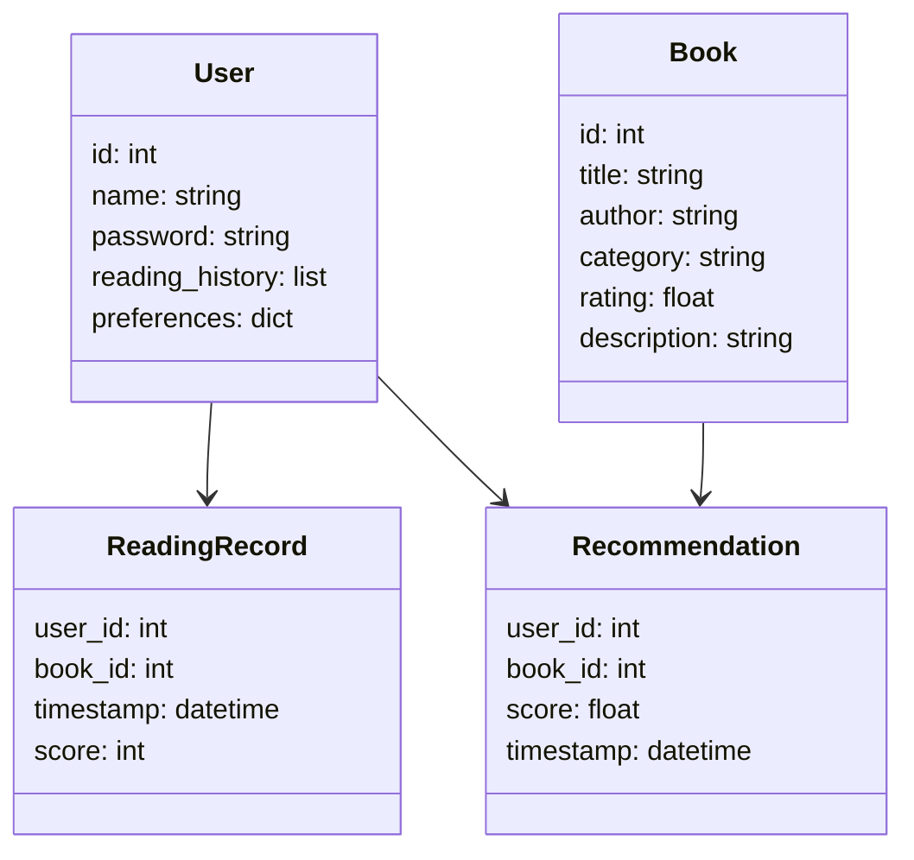
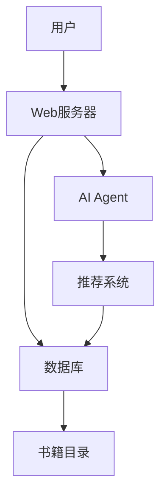
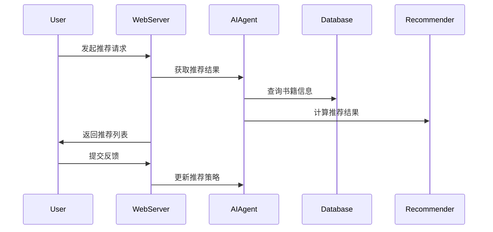

                 


# 智能书架：AI Agent的个性化阅读推荐系统

## 关键词：AI Agent，个性化推荐，阅读推荐系统，协同过滤，基于内容推荐，系统设计

## 摘要：
本文详细探讨了智能书架系统的设计与实现，重点分析了AI Agent在个性化阅读推荐中的应用。文章从背景、核心概念、算法原理、系统设计、项目实战到优化与扩展，全面阐述了智能书架的构建过程。通过协同过滤和基于内容的推荐算法，结合AI Agent的智能化特性，为用户提供精准的阅读推荐服务。

---

# 第1章: 背景与核心概念

## 1.1 问题背景与描述

### 1.1.1 阅读推荐系统的现状与挑战
在信息爆炸的时代，用户面临海量书籍的选择，传统的阅读推荐系统基于简单的规则或统计方法，难以满足个性化需求。推荐系统的性能受到数据稀疏性、冷启动问题和用户偏好变化的限制。

### 1.1.2 AI Agent在阅读推荐中的作用
AI Agent通过自然语言处理、机器学习等技术，能够实时分析用户的阅读行为、偏好和反馈，动态调整推荐策略，提升推荐的准确性和用户体验。

### 1.1.3 个性化阅读推荐的核心问题
个性化推荐需要解决用户画像构建、书籍特征提取、推荐算法优化等问题，同时需要处理数据隐私、计算效率等挑战。

## 1.2 核心概念与问题解决

### 1.2.1 AI Agent的基本概念
AI Agent是一种能够感知环境、执行任务的智能体，具备学习、推理、规划和自适应能力。在阅读推荐中，AI Agent负责数据采集、分析和推荐策略优化。

### 1.2.2 个性化阅读推荐的实现方法
个性化推荐基于用户行为分析和书籍特征提取，采用协同过滤、基于内容的推荐和混合推荐模型，结合AI Agent的智能化特性，提供精准的推荐服务。

### 1.2.3 AI Agent如何优化阅读推荐
AI Agent通过实时数据处理、动态权重调整和多模态数据融合，提升推荐系统的准确性和响应速度。

## 1.3 智能书架的核心要素与结构

### 1.3.1 用户画像与阅读行为分析
用户画像包括用户的兴趣、阅读习惯和偏好，通过分析用户的点击、收藏、购买等行为，构建用户的阅读行为模型。

### 1.3.2 书籍特征提取与分类
书籍特征包括书籍的主题、作者、出版时间等，通过文本挖掘和分类算法，提取书籍的语义特征，构建书籍的知识图谱。

### 1.3.3 AI Agent的推荐机制
AI Agent通过监督学习和强化学习，优化推荐策略，动态调整推荐结果，确保推荐结果的多样性和相关性。

## 1.4 本章小结
本章介绍了智能书架的背景、核心概念和推荐系统的实现方法，重点分析了AI Agent在个性化推荐中的作用，为后续章节奠定了基础。

---

# 第2章: AI Agent与推荐系统的核心原理

## 2.1 AI Agent的基本原理

### 2.1.1 AI Agent的定义与分类
AI Agent可以分为简单反射Agent和基于模型的反射Agent，基于模型的Agent具备更强的学习和推理能力，能够更好地适应动态环境。

### 2.1.2 AI Agent的核心属性对比
| 属性 | 描述 |
|------|------|
| 感知能力 | 通过传感器或API获取环境信息 |
| 行动能力 | 执行任务或触发推荐 |
| 学习能力 | 通过机器学习模型优化推荐策略 |
| 自适应能力 | 根据环境变化调整推荐策略 |

### 2.1.3 AI Agent与推荐系统的联系
AI Agent通过感知用户行为、书籍特征和环境信息，动态调整推荐策略，提升推荐系统的个性化和实时性。

## 2.2 个性化推荐系统的原理

### 2.2.1 协同过滤推荐
协同过滤基于用户相似性或物品相似性，找到与目标用户相似的用户或与目标书籍相似的书籍，推荐给目标用户。

### 2.2.2 基于内容的推荐
基于内容的推荐通过分析书籍的内容特征，找到与用户兴趣相似的书籍，推荐给用户。

### 2.2.3 混合推荐模型
混合推荐模型结合协同过滤和基于内容的推荐方法，利用投票融合或加权融合的方式，提升推荐的准确性和多样性。

## 2.3 AI Agent在推荐系统中的实体关系

### 2.3.1 用户、书籍、推荐的关系图


### 2.3.2 实体关系的Mermaid流程图


---

# 第3章: 推荐算法的数学模型与实现

## 3.1 协同过滤算法

### 3.1.1 基于用户的协同过滤
基于用户的协同过滤通过计算用户之间的相似性，找到相似用户的推荐列表，推荐给目标用户。

### 3.1.2 基于物品的协同过滤
基于物品的协同过滤通过计算物品之间的相似性，找到相似物品的推荐列表，推荐给目标用户。

### 3.1.3 混合推荐模型
混合推荐模型结合协同过滤和基于内容的推荐方法，利用投票融合或加权融合的方式，提升推荐的准确性和多样性。

## 3.2 矩阵分解

### 3.2.1 矩阵分解的基本原理
矩阵分解是一种常用的推荐算法，通过分解用户-物品矩阵，找到隐含特征，进行推荐。

### 3.2.2 矩阵分解的数学模型
矩阵分解的数学模型可以表示为：
$$ X = U \times V^T $$
其中，X是用户-物品评分矩阵，U是用户特征矩阵，V是物品特征矩阵。

### 3.2.3 矩阵分解的实现步骤
1. 初始化用户和物品特征矩阵。
2. 计算矩阵乘积，得到预测评分。
3. 通过梯度下降优化矩阵参数。
4. 得到最终的推荐结果。

## 3.3 基于内容的推荐

### 3.3.1 基于内容的推荐原理
基于内容的推荐通过分析物品的内容特征，找到与用户兴趣相似的物品，进行推荐。

### 3.3.2 基于内容的推荐实现
1. 提取物品的内容特征。
2. 计算用户与物品的相似性。
3. 根据相似性进行推荐。

## 3.4 混合推荐模型

### 3.4.1 混合推荐模型的原理
混合推荐模型结合协同过滤和基于内容的推荐方法，利用投票融合或加权融合的方式，提升推荐的准确性和多样性。

### 3.4.2 混合推荐模型的实现步骤
1. 分别生成协同过滤和基于内容的推荐列表。
2. 根据权重对推荐结果进行融合。
3. 输出最终的推荐结果。

## 3.5 本章小结
本章详细介绍了协同过滤、基于内容的推荐和混合推荐模型的实现方法，重点分析了矩阵分解和基于内容推荐的数学模型和算法流程。

---

# 第4章: 系统分析与架构设计

## 4.1 系统场景介绍

### 4.1.1 系统功能需求
智能书架系统需要实现用户注册、登录、书籍搜索、阅读记录管理、推荐结果展示等功能。

### 4.1.2 系统性能需求
系统需要支持高并发访问，保证推荐结果的实时性和准确性。

## 4.2 系统功能设计

### 4.2.1 领域模型类图


### 4.2.2 系统架构设计


### 4.2.3 系统接口设计
系统接口包括用户认证接口、书籍搜索接口、推荐结果接口和反馈接口。

### 4.2.4 系统交互序列图


## 4.3 本章小结
本章分析了智能书架系统的场景、功能需求和系统架构，重点设计了系统的类图、架构图和交互序列图，为后续的实现奠定了基础。

---

# 第5章: 项目实战

## 5.1 环境安装

### 5.1.1 Python环境配置
安装Python 3.x，安装必要的库，如numpy、pandas、scikit-learn、tensorflow。

### 5.1.2 数据集准备
准备书籍数据和用户行为数据，清洗数据，提取特征。

## 5.2 核心代码实现

### 5.2.1 协同过滤算法实现
```python
import numpy as np
from sklearn.metrics.pairwise import cosine_similarity

def collaborative_filtering(user_item_matrix):
    user_similarity = cosine_similarity(user_item_matrix)
    user_recommendations = []
    for user_id in range(user_item_matrix.shape[0]):
        similar_users = np.argsort(user_similarity[user_id])[-5:]
       推荐书籍 = []
        for similar_user in similar_users:
           推荐书籍.extend(np.where(user_item_matrix[similar_user] > 0)[1])
       推荐书籍 = list(set(推荐书籍))
        user_recommendations.append(推荐书籍)
    return user_recommendations
```

### 5.2.2 基于内容的推荐实现
```python
from sklearn.feature_extraction.text import TfidfVectorizer
from sklearn.metrics.pairwise import cosine_similarity

def content_based_recommendation(books, user_profile):
    vectorizer = TfidfVectorizer()
    book_features = vectorizer.fit_transform(books['description'])
    user_feature = vectorizer.transform([user_profile])
    similarity_scores = cosine_similarity(user_feature, book_features)
   推荐书籍 = np.argsort(similarity_scores)[0][-5:]
    return 推荐书籍
```

### 5.2.3 混合推荐模型实现
```python
import numpy as np

def hybrid_recommendation(user_item_matrix, book_features, user_profile):
   协同过滤推荐 = collaborative_filtering(user_item_matrix)
    基于内容推荐 = content_based_recommendation(book_features, user_profile)
    推荐结果 = []
    for i in range(len(协同过滤推荐)):
       推荐结果.append(协同过滤推荐[i] + 基于内容推荐[i])
   推荐结果 = [list(set(result)) for result in 推荐结果]
    return 推荐结果
```

## 5.3 项目实现细节

### 5.3.1 数据清洗与特征提取
对书籍数据进行清洗，提取书籍的标题、作者、类别和描述特征。

### 5.3.2 推荐结果分析
分析推荐结果的准确性和多样性，调整推荐算法的参数，优化推荐效果。

## 5.4 案例分析与详细讲解
通过具体案例，展示推荐系统的实现过程，分析推荐结果的优缺点，提出改进建议。

## 5.5 本章小结
本章通过项目实战，详细讲解了智能书架系统的实现过程，包括环境配置、代码实现和案例分析，为读者提供了实际操作的经验。

---

# 第6章: 系统优化与扩展

## 6.1 系统优化策略

### 6.1.1 基于实时数据的优化
通过实时数据分析，动态调整推荐策略，提升推荐的实时性和准确性。

### 6.1.2 基于多模态数据的优化
结合文本、图像、视频等多种数据源，提升推荐系统的多样性和准确性。

## 6.2 系统扩展方向

### 6.2.1 实时推荐
基于实时数据流，实现动态推荐，满足用户的实时需求。

### 6.2.2 多模态推荐
结合文本、图像、视频等多种数据源，实现多模态推荐，提升推荐系统的多样性和准确性。

## 6.3 优化与扩展的实现步骤

### 6.3.1 实时推荐的实现
通过流数据处理技术，实时更新推荐结果，提升推荐的实时性和响应速度。

### 6.3.2 多模态推荐的实现
整合多模态数据，构建多模态推荐模型，提升推荐系统的多样性和准确性。

## 6.4 优化与扩展的注意事项

### 6.4.1 数据隐私保护
在实时数据处理和多模态数据整合中，需要注意数据隐私保护，确保用户数据的安全性。

### 6.4.2 系统性能优化
实时推荐和多模态推荐对系统性能要求较高，需要优化算法和系统架构，提升系统的处理能力和响应速度。

## 6.5 本章小结
本章分析了智能书架系统的优化策略和扩展方向，重点讨论了实时推荐和多模态推荐的实现方法，为系统的进一步优化提供了参考。

---

# 第7章: 总结与展望

## 7.1 总结

### 7.1.1 核心内容回顾
本文详细探讨了智能书架系统的构建过程，重点分析了AI Agent在个性化推荐中的应用，详细讲解了推荐算法的数学模型和系统架构设计。

### 7.1.2 经验总结
通过项目实战，总结了推荐系统的实现经验和优化策略，为后续的研究和实践提供了参考。

## 7.2 未来展望

### 7.2.1 技术进步
随着AI技术的不断发展，推荐系统将更加智能化和个性化，推荐算法将更加精准和多样化。

### 7.2.2 应用领域拓展
智能书架系统将在教育、医疗、金融等领域得到广泛应用，为用户提供更加智能化的服务。

## 7.3 最佳实践 Tips

### 7.3.1 系统设计
在系统设计中，需要注重模块化和可扩展性，确保系统的可维护性和可扩展性。

### 7.3.2 算法优化
在算法优化中，需要注重数据的多样性和算法的高效性，确保推荐系统的准确性和响应速度。

### 7.3.3 数据隐私
在数据处理中，需要注重数据隐私保护，确保用户数据的安全性和合规性。

## 7.4 本章小结
本章总结了智能书架系统的实现经验和优化策略，展望了未来的研究方向和应用前景，为读者提供了进一步研究和实践的方向。

---

# 附录

## 附录A: 参考文献

## 附录B: 术语表

## 附录C: 代码仓库地址

---

通过以上内容，本文详细探讨了智能书架系统的构建过程，重点分析了AI Agent在个性化推荐中的应用，详细讲解了推荐算法的数学模型和系统架构设计，为读者提供了全面的技术指导。

