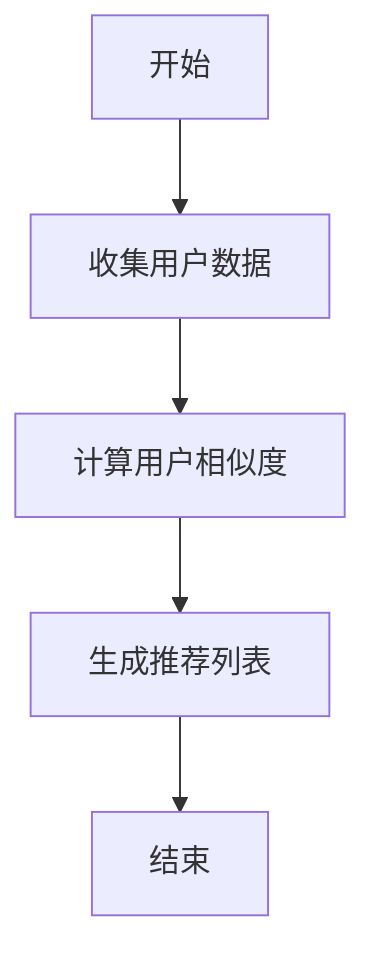
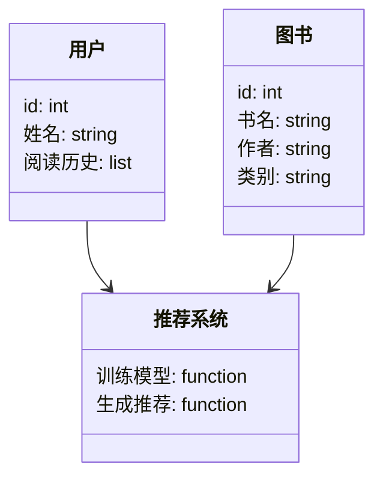
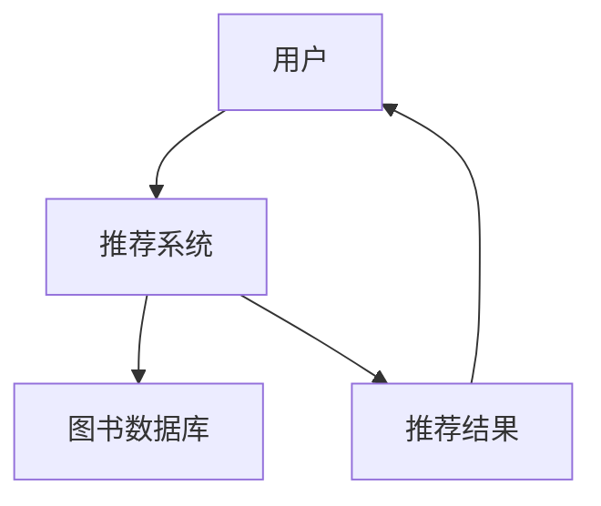

                 


# 智能书架：AI Agent的图书推荐系统

> 关键词：智能书架，AI Agent，推荐系统，协同过滤，深度学习，图书推荐

> 摘要：本文详细探讨了基于AI Agent的智能书架系统，从背景介绍、核心概念、算法原理到系统架构和项目实战，全面解析了如何利用AI技术构建高效的图书推荐系统。文章通过丰富的案例和详细的代码示例，展示了系统的实现过程，并总结了最佳实践和未来发展。

---

## 第一部分：背景介绍

### 第1章：智能书架与AI Agent概述

#### 1.1 问题背景

- **传统图书推荐系统的挑战**：传统推荐系统常面临数据稀疏性、冷启动问题，推荐结果准确性不足，难以满足用户的个性化需求。
- **AI Agent的优势**：AI Agent具备学习和推理能力，能够动态优化推荐策略，提供更精准的服务。

#### 1.2 问题描述

- **用户需求**：用户希望获得符合个人兴趣的图书推荐。
- **系统目标**：构建一个基于AI Agent的智能书架，实现个性化推荐。

#### 1.3 问题解决

- **AI Agent的核心功能**：包括数据收集、用户建模、推荐生成。
- **智能书架的实现方式**：通过分析用户行为和偏好，动态调整推荐策略。

#### 1.4 边界与外延

- **系统边界**：仅关注图书推荐，不涉及借阅管理。
- **相关领域扩展**：可扩展到其他类型内容推荐。

#### 1.5 核心要素组成

- **用户数据**：记录用户的阅读历史和偏好。
- **图书信息**：包括书名、作者、类别、评分等。
- **推荐算法**：采用协同过滤和深度学习模型。

---

## 第二部分：核心概念与联系

### 第2章：AI Agent与推荐系统的核心原理

#### 2.1 核心概念原理

- **AI Agent的基本原理**：通过学习用户行为，生成个性化推荐。
- **推荐系统的算法机制**：基于用户行为和内容进行推荐。

#### 2.2 核心概念属性特征对比

| 特性     | AI Agent                          | 推荐系统                          |
|----------|-----------------------------------|-----------------------------------|
| 数据源   | 用户行为、偏好                   | 用户行为、图书属性                |
| 功能     | 数据分析、推荐生成               | 生成推荐列表                      |
| 学习能力 | 具备自适应学习                   | 依赖预设算法                      |

#### 2.3 ER实体关系图

```mermaid
er
actor: 用户
goal: 图书推荐系统
book: 图书
preference: 用户偏好
rating: 用户评分

actor --> preference
actor --> rating
preference --> book
rating --> book
```

---

## 第三部分：算法原理讲解

### 第3章：协同过滤算法

#### 3.1 算法原理

- **基于用户的协同过滤**：寻找相似用户，推荐他们喜欢的图书。
- **基于物品的协同过滤**：分析图书相似性，推荐相关图书。

#### 3.2 使用Mermaid绘制的流程图



#### 3.3 Python实现示例

```python
from sklearn.metrics.pairwise import cosine_similarity

# 示例数据
user_data = [[1, 0, 1], [0, 1, 1], [1, 1, 0]]
similarity = cosine_similarity(user_data)

print(similarity)
```

---

## 第四部分：数学模型与公式

### 第4章：数学模型与公式

#### 4.1 相似度计算

- **余弦相似度公式**：
  $$\text{余弦相似度} = \frac{\vec{u} \cdot \vec{v}}{|\vec{u}| |\vec{v}|}$$

#### 4.2 矩阵分解

- **矩阵分解公式**：
  $$P \times Q^T = R$$

#### 4.3 深度学习模型

- **神经网络模型公式**：
  $$y = f(x; \theta)$$

---

## 第五部分：系统分析与架构设计

### 第5章：系统架构设计

#### 5.1 问题场景介绍

- **用户需求场景**：用户登录后，系统基于其阅读历史推荐图书。
- **系统运行环境**：基于Python的后端服务，前端Web界面。

#### 5.2 功能设计

- **领域模型类图**：



- **系统架构图**：



#### 5.3 接口设计

- **API接口定义**：RESTful API，如`/api/recommend/{user_id}`。
- **接口交互流程**：用户请求推荐，系统调用推荐算法，返回推荐列表。

---

## 第六部分：项目实战

### 第6章：智能书架的实现

#### 6.1 环境安装

- **安装Python和库**：
  ```bash
  pip install numpy pandas scikit-learn
  ```

#### 6.2 核心实现

- **数据加载和预处理**：
  ```python
  import pandas as pd
  ratings = pd.read_csv('ratings.csv')
  ```

- **模型训练**：
  ```python
  from sklearn.model_selection import train_test_split
  X_train, X_test = train_test_split(ratings)
  ```

- **推荐生成**：
  ```python
  def generate_recommendations(user_id):
      # 实现推荐逻辑
      pass
  ```

#### 6.3 实际案例分析

- **案例分析**：用户A的阅读历史显示喜欢科幻小说，系统推荐《1984》。

#### 6.4 项目小结

- **系统实现步骤**：数据加载、模型训练、接口开发。
- **案例解读**：推荐准确率和用户满意度的提升。

---

## 第七部分：最佳实践

### 第7章：总结与展望

#### 7.1 经验总结

- **数据处理**：确保数据质量和完整性。
- **模型优化**：结合内容过滤和用户反馈提升推荐效果。

#### 7.2 小结

- **系统优势**：高精度推荐，动态调整策略。
- **注意事项**：保护用户隐私，处理数据稀疏性。

#### 7.3 扩展阅读

- 推荐学习深度学习模型，探索NLP技术在推荐中的应用。

---

通过以上详细的内容，本文全面解析了智能书架的构建过程，从理论到实践，为读者提供了丰富的知识和实用的指导。

