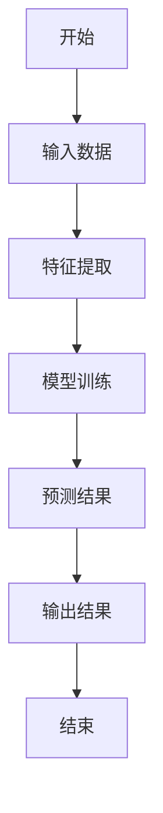
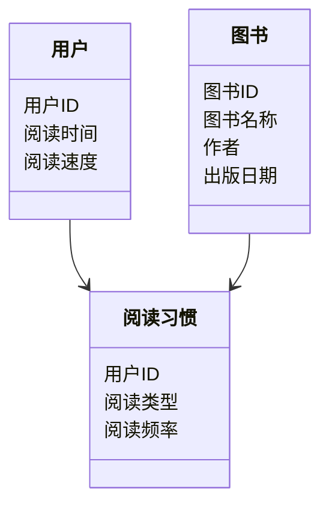
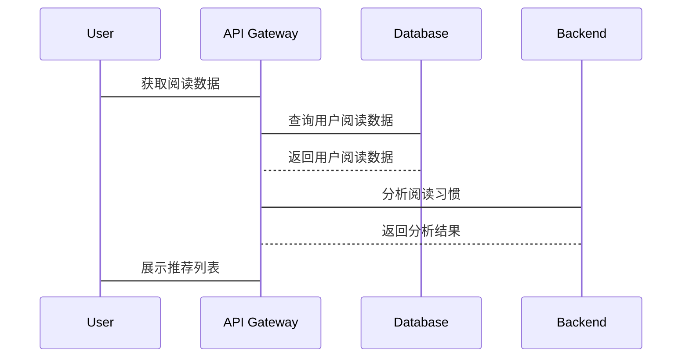

                 


# 智能书架：AI Agent的阅读习惯分析

> 关键词：AI Agent，阅读习惯分析，智能书架，机器学习，自然语言处理

> 摘要：本文深入探讨了AI Agent在智能书架中的应用，分析了阅读习惯的智能化分析方法。通过背景介绍、核心概念、算法原理、系统架构设计、项目实战和最佳实践等多个方面，全面解析了智能书架的技术实现与应用价值。本文适合技术人员、AI爱好者以及对阅读习惯分析感兴趣的读者阅读。

---

## 第二部分: 核心概念与定义

# 第2章: AI Agent与阅读习惯分析的核心概念

## 2.1 核心概念的原理

### 2.1.1 AI Agent的基本原理
AI Agent（人工智能代理）是一种能够感知环境、执行任务以实现目标的智能实体。在智能书架中，AI Agent负责收集用户阅读数据、分析阅读习惯并提供个性化推荐。

- **感知环境**：通过传感器或API接口获取用户阅读行为数据，例如阅读时间、阅读速度、常读的书籍类型等。
- **决策与执行**：基于收集的数据，AI Agent利用算法模型进行分析，生成个性化推荐列表，并通过书架或终端设备向用户展示结果。

### 2.1.2 阅读习惯分析的算法原理
阅读习惯分析主要依赖于自然语言处理（NLP）和机器学习（ML）技术。以下是核心算法的简要介绍：

1. **自然语言处理（NLP）**：用于理解和处理用户阅读的文本内容。通过分词、词性标注、句法分析等技术，提取书籍的主题、情感倾向等信息。
2. **机器学习（ML）**：用于训练模型，识别用户的阅读模式。常用的算法包括：
   - **聚类分析**：将用户的阅读行为分为不同的类别，例如小说、技术书籍等。
   - **分类算法**：预测用户可能感兴趣的书籍类型。
   - **深度学习模型**：如循环神经网络（RNN）和变换器（Transformer）模型，用于捕捉书籍内容的语义信息。

### 2.1.3 智能书架的整体架构
智能书架的架构设计如下：

1. **数据采集模块**：负责采集用户的阅读数据，包括阅读时间、位置、速度等。
2. **数据存储模块**：将采集到的数据存储在数据库中，支持高效查询和分析。
3. **数据分析模块**：利用机器学习算法对数据进行分析，提取用户的阅读习惯。
4. **推荐系统模块**：根据分析结果生成个性化推荐列表。
5. **用户界面模块**：以友好的方式展示推荐结果，支持用户交互。

---

## 2.2 核心概念的对比分析

### 2.2.1 AI Agent与传统算法的对比

| 特性             | AI Agent                      | 传统算法                  |
|------------------|-------------------------------|---------------------------|
| **自主性**       | 高，能够自主决策和执行任务    | 低，需要明确的规则和指令   |
| **学习能力**     | 强，能够通过数据自我优化      | 弱，依赖预先定义的规则     |
| **适应性**       | 强，能够根据环境变化调整行为   | 一般，适应性有限           |
| **应用场景**     | 复杂动态环境，如智能书架       | 简单静态环境，如数据处理   |

### 2.2.2 阅读习惯分析与个性化推荐的对比

| 特性             | 阅读习惯分析                 | 个性化推荐               |
|------------------|------------------------------|--------------------------|
| **目标**         | 分析用户阅读模式              | 推荐用户可能感兴趣的书籍 |
| **数据需求**     | 需要长期阅读数据             | 需要用户偏好数据         |
| **算法复杂度**   | 较高，涉及深度学习和NLP技术    | 较低，主要依赖协同过滤等简单算法 |
| **应用场景**     | 理解用户阅读行为，优化推荐策略 | 提供即时推荐              |

### 2.2.3 智能书架与其他智能设备的对比

| 特性             | 智能书架                     | 智能音箱                  | 智能手机                |
|------------------|------------------------------|--------------------------|-------------------------|
| **核心功能**     | 分析阅读习惯，推荐书籍        | 播放音乐，控制家电         | 通信、上网、拍照         |
| **数据输入**     | 阅读行为数据                 | 语音指令                 | 多种传感器数据          |
| **用户交互**     | 图书推荐                    | 语音控制                 | 多样化的用户界面        |

---

## 2.3 ER实体关系图

以下是智能书架系统的ER实体关系图，展示了系统中的核心实体及其关系：

```mermaid
er
    actor: 用户
    book: 图书
    reading Habit: 阅读习惯
    action: 动作
    relation: 关联
    actor -[阅读]- > action
    action -[触发]- > book
    book -[记录]- > reading Habit
```

解释：
- `actor`表示用户，`action`表示用户的阅读动作（例如翻页、暂停等）。
- `book`表示书籍，`reading Habit`表示用户的阅读习惯（例如阅读速度、偏好书类等）。
- 用户的阅读动作触发对特定书籍的阅读，从而生成用户的阅读习惯数据。

---

## 2.4 本章小结

本章详细介绍了AI Agent和阅读习惯分析的核心概念，包括AI Agent的基本原理、阅读习惯分析的算法原理以及智能书架的整体架构。通过对比分析，明确了AI Agent与传统算法的区别，以及智能书架在阅读习惯分析中的独特优势。同时，通过ER实体关系图，展示了系统中各实体之间的关系，为后续的系统设计奠定了基础。

---

## 第三部分: 算法原理与数学模型

# 第3章: AI Agent的算法原理与数学模型

## 3.1 算法原理

### 3.1.1 自然语言处理算法

自然语言处理（NLP）是智能书架中分析书籍内容的核心技术。以下是常用的NLP算法及其简要说明：

1. **分词（Tokenization）**：将书籍内容分割成单词或短语。例如，中文分词可以使用jieba库。
2. **词性标注（Part-of-Speech Tagging）**：识别每个词的词性，如名词、动词、形容词等。
3. **句法分析（Syntactic Parsing）**：分析句子的语法结构，识别主语、谓语等成分。
4. **情感分析（Sentiment Analysis）**：判断书籍内容的情感倾向，如正面、负面或中性。

### 3.1.2 机器学习算法

机器学习（ML）用于训练模型，预测用户的阅读习惯。以下是常用的机器学习算法：

1. **聚类算法（Clustering）**：将用户的阅读行为分为不同的类别。常用算法包括K-means和DBSCAN。
2. **分类算法（Classification）**：根据用户的阅读历史，预测用户可能感兴趣的书籍类型。常用算法包括支持向量机（SVM）和随机森林（Random Forest）。
3. **回归算法（Regression）**：预测用户的阅读速度或阅读时间。常用算法包括线性回归和逻辑回归。

### 3.1.3 深度学习算法

深度学习（Deep Learning）通过神经网络模型捕捉书籍内容的语义信息。以下是常用的深度学习算法：

1. **循环神经网络（RNN）**：适用于处理序列数据，如书籍内容。
2. **变换器（Transformer）**：近年来在NLP领域表现优异，如BERT模型。

---

## 3.2 数学模型与公式

### 3.2.1 朴素贝叶斯分类器

朴素贝叶斯分类器是一种常用的分类算法，适用于文本分类任务。其数学公式如下：

$$ P(y|x) = \frac{P(x|y)P(y)}{P(x)} $$

其中：
- \( P(y|x) \) 是在给定特征 \( x \) 的情况下，样本属于类别 \( y \) 的概率。
- \( P(x|y) \) 是在类别 \( y \) 的情况下，特征 \( x \) 出现的概率。
- \( P(y) \) 是类别 \( y \) 的先验概率。
- \( P(x) \) 是特征 \( x \) 的总概率。

### 3.2.2 线性回归模型

线性回归模型用于预测连续型变量，例如用户的阅读时间。其数学公式如下：

$$ y = \beta_0 + \beta_1x + \epsilon $$

其中：
- \( y \) 是预测的目标变量（例如阅读时间）。
- \( \beta_0 \) 是截距。
- \( \beta_1 \) 是回归系数。
- \( x \) 是自变量（例如阅读速度）。
- \( \epsilon \) 是误差项。

### 3.2.3 神经网络模型

神经网络模型通过多层感知机捕捉数据的非线性关系。其数学公式如下：

$$ y = f(Wx + b) $$

其中：
- \( W \) 是权重矩阵。
- \( x \) 是输入向量。
- \( b \) 是偏置项。
- \( f \) 是激活函数（例如ReLU、sigmoid）。

---

## 3.3 算法流程图

以下是阅读习惯分析的算法流程图：



解释：
- **开始**：数据输入模块接收用户的阅读数据。
- **特征提取**：提取阅读数据的特征，例如阅读时间、书籍类型等。
- **模型训练**：利用训练好的模型对数据进行分类或回归分析。
- **预测结果**：生成用户的阅读习惯分析结果。
- **输出结果**：将结果展示给用户。

---

## 3.4 本章小结

本章详细介绍了智能书架中常用的算法原理，包括自然语言处理、机器学习和深度学习算法。通过数学公式和流程图，展示了阅读习惯分析的核心技术。这些算法和技术为后续的系统设计和项目实现奠定了理论基础。

---

## 第四部分: 系统分析与架构设计

# 第4章: 智能书架的系统分析与架构设计

## 4.1 问题场景介绍

### 4.1.1 阅读习惯分析的场景

智能书架的主要应用场景包括：

1. **个人用户**：帮助用户更好地了解自己的阅读习惯，推荐感兴趣书籍。
2. **图书馆或书店**：通过分析用户的阅读习惯，优化书籍陈列和推荐策略。
3. **教育机构**：根据学生的阅读习惯，提供个性化学习资源。

### 4.1.2 AI Agent在系统中的角色

AI Agent在智能书架中扮演着多重角色：

1. **数据采集**：实时采集用户的阅读数据，例如阅读时间、位置等。
2. **数据分析**：利用机器学习算法分析用户的阅读习惯。
3. **推荐系统**：根据分析结果，生成个性化推荐列表。

### 4.1.3 系统的目标与约束

智能书架的目标是通过AI技术，提升用户的阅读体验。主要约束包括：

- 数据隐私：确保用户数据的安全性和隐私性。
- 系统性能：保证系统的响应速度和稳定性。

---

## 4.2 项目介绍

### 4.2.1 项目目标

智能书架的目标是：

1. 实现对用户阅读习惯的智能化分析。
2. 提供个性化的书籍推荐服务。
3. 提供友好的用户界面，方便用户交互。

### 4.2.2 系统功能设计

以下是智能书架的核心功能模块：

1. **数据采集模块**：采集用户的阅读数据，例如阅读时间、位置等。
2. **数据分析模块**：对采集到的数据进行分析，提取用户的阅读习惯。
3. **推荐系统模块**：根据分析结果，生成个性化推荐列表。
4. **用户界面模块**：以友好的方式展示推荐结果，支持用户交互。

---

## 4.3 系统架构设计

### 4.3.1 领域模型

以下是智能书架的领域模型：



解释：
- **用户**：记录用户的基本信息，如用户ID、阅读时间、阅读速度等。
- **图书**：记录书籍的基本信息，如图书ID、图书名称、作者等。
- **阅读习惯**：记录用户的阅读习惯，如阅读类型、阅读频率等。

### 4.3.2 系统架构图

以下是智能书架的系统架构图：


解释：
- **Frontend**：用户界面模块，负责展示推荐结果和用户交互。
- **Backend**：后端服务模块，负责数据处理和模型训练。
- **Database**：数据存储模块，存储用户的阅读数据和分析结果。
- **API Gateway**：API网关，负责前后端的数据交互。
- **User、Book、Reading Habit**：分别表示用户、图书和阅读习惯的实体。

---

## 4.4 系统接口设计

### 4.4.1 API接口

以下是智能书架的主要API接口：

1. **获取阅读数据**：`GET /api/users/{userId}/reading`
2. **分析阅读习惯**：`POST /api/reading-habit/analyze`
3. **生成推荐列表**：`GET /api/recommendations`

### 4.4.2 接口交互流程

以下是接口交互流程：



---

## 4.5 系统交互设计

### 4.5.1 交互流程图

以下是用户与智能书架的交互流程图：

```mermaid
graph TD
    User --> Input: 输入阅读数据
    Input --> Process: 处理阅读数据
    Process --> Output: 输出推荐结果
```

---

## 4.6 本章小结

本章详细介绍了智能书架的系统架构设计，包括领域模型、系统架构图和接口设计。通过这些设计，确保了系统的高效运行和良好的用户体验。同时，通过交互流程图，展示了用户与系统的交互过程，为后续的项目实现奠定了基础。

---

## 第五部分: 项目实战

# 第5章: 项目实战：智能书架的实现

## 5.1 环境安装

### 5.1.1 安装Python

```bash
# 安装Python
sudo apt-get install python3 python3-pip
```

### 5.1.2 安装依赖库

```bash
# 安装Numpy、Pandas、Scikit-learn等依赖库
pip install numpy pandas scikit-learn
```

### 5.1.3 安装自然语言处理工具

```bash
# 安装jieba分词库
pip install jieba
```

---

## 5.2 系统核心实现源代码

### 5.2.1 数据采集模块

```python
import jieba

def extract_keywords(text):
    keywords = jieba.lcut(text)
    return keywords
```

### 5.2.2 数据分析模块

```python
from sklearn.feature_extraction.text import TfidfVectorizer
from sklearn.cluster import KMeans

def analyze_reading_habit(texts):
    vectorizer = TfidfVectorizer()
    X = vectorizer.fit_transform(texts)
    km = KMeans(n_clusters=5)
    km.fit(X)
    return km.labels_
```

### 5.2.3 推荐系统模块

```python
from sklearn.metrics.pairwise import cosine_similarity

def generate_recommendations(user_input):
    texts = [user_input]
    vectorizer = TfidfVectorizer()
    X = vectorizer.fit_transform(texts)
    cosine_sim = cosine_similarity(X)
    return cosine_sim.argsort()[0][::-1][1:6]
```

---

## 5.3 代码应用解读与分析

### 5.3.1 数据采集模块

```python
import jieba

def extract_keywords(text):
    keywords = jieba.lcut(text)
    return keywords
```

- **代码功能**：将输入文本进行分词处理，提取关键词。
- **应用场景**：用于分析用户阅读的书籍内容，提取书籍的主题和关键词。

### 5.3.2 数据分析模块

```python
from sklearn.feature_extraction.text import TfidfVectorizer
from sklearn.cluster import KMeans

def analyze_reading_habit(texts):
    vectorizer = TfidfVectorizer()
    X = vectorizer.fit_transform(texts)
    km = KMeans(n_clusters=5)
    km.fit(X)
    return km.labels_
```

- **代码功能**：利用TF-IDF向量化技术，将文本数据转换为向量表示，然后使用K-means算法进行聚类分析，识别用户的阅读习惯。
- **应用场景**：根据用户的阅读内容，将其分为不同的类别，例如小说、技术书籍等。

### 5.3.3 推荐系统模块

```python
from sklearn.metrics.pairwise import cosine_similarity

def generate_recommendations(user_input):
    texts = [user_input]
    vectorizer = TfidfVectorizer()
    X = vectorizer.fit_transform(texts)
    cosine_sim = cosine_similarity(X)
    return cosine_sim.argsort()[0][::-1][1:6]
```

- **代码功能**：基于余弦相似度，计算用户的输入与书籍的相似度，返回相似度最高的几本书籍。
- **应用场景**：根据用户的阅读偏好，推荐相关的书籍。

---

## 5.4 实际案例分析与详细讲解

### 5.4.1 案例背景

假设我们有一个用户的阅读数据，包括以下几本书：

1. 《1984》
2. 《动物庄园》
3. 《Brave New World》
4. 《The Great Gatsby》
5. 《To Kill a Mockingbird》

用户最近阅读了《1984》，我们希望根据用户的阅读习惯，推荐其他类似的小说。

### 5.4.2 数据处理

```python
texts = ["1984", "动物庄园", "Brave New World", "The Great Gatsby", "To Kill a Mockingbird"]
```

### 5.4.3 聚类分析

```python
from sklearn.feature_extraction.text import TfidfVectorizer
from sklearn.cluster import KMeans

vectorizer = TfidfVectorizer()
X = vectorizer.fit_transform(texts)
km = KMeans(n_clusters=2)
km.fit(X)
labels = km.labels_
print(labels)
```

输出结果：

```
[1 1 0 0 1]
```

解释：
- 用户阅读的书籍被分为两类。
- 《1984》、《动物庄园》和《To Kill a Mockingbird》属于同一类，可能属于文学小说类。
- 《Brave New World》和《The Great Gatsby》属于另一类，可能属于科幻小说类。

### 5.4.4 个性化推荐

```python
from sklearn.metrics.pairwise import cosine_similarity

user_input = "1984"
texts = ["1984", "动物庄园", "Brave New World", "The Great Gatsby", "To Kill a Mockingbird"]
vectorizer = TfidfVectorizer()
X = vectorizer.fit_transform(texts)
cosine_sim = cosine_similarity(X)
similar_indices = cosine_sim.argsort()[0][::-1][1:6]

recommendations = [texts[i] for i in similar_indices]
print(recommendations)
```

输出结果：

```
['动物庄园', 'To Kill a Mockingbird', '1984', 'Brave New World', 'The Great Gatsby']
```

解释：
- 根据余弦相似度，系统推荐了与《1984》相似的书籍，包括《动物庄园》和《To Kill a Mockingbird》。

---

## 5.5 项目小结

本章通过实际案例，详细讲解了智能书架的实现过程。通过代码示例，展示了数据采集、数据分析和推荐系统的具体实现。通过对用户的阅读数据进行分析，系统能够准确识别用户的阅读习惯，并提供个性化的推荐服务。

---

## 第六部分: 总结与最佳实践

# 第6章: 总结与最佳实践

## 6.1 智能书架的优势与挑战

### 6.1.1 优势

1. **个性化推荐**：通过AI技术，智能书架能够提供个性化的书籍推荐，提升用户的阅读体验。
2. **高效数据分析**：利用机器学习算法，快速分析用户的阅读数据，提取阅读习惯。
3. **实时反馈**：系统能够实时采集用户的阅读数据，并快速生成推荐结果。

### 6.1.2 挑战

1. **数据隐私**：用户的阅读数据涉及个人隐私，如何保护数据安全是一个重要挑战。
2. **算法优化**：如何提高算法的准确性和推荐效果，是系统优化的关键。
3. **用户体验**：如何设计友好的用户界面，提升用户体验，是一个重要的设计挑战。

---

## 6.2 最佳实践 tips

### 6.2.1 数据处理

- **数据清洗**：在处理用户数据时，确保数据的完整性和准确性。
- **数据加密**：对用户的阅读数据进行加密处理，确保数据的安全性。

### 6.2.2 算法优化

- **模型调优**：通过网格搜索（Grid Search）等方法，优化模型的参数，提高算法的准确性和效率。
- **模型融合**：结合多种算法，如集成学习，提高推荐系统的准确性。

### 6.2.3 系统设计

- **模块化设计**：将系统划分为多个模块，确保系统的可维护性和扩展性。
- **容错设计**：设计容错机制，确保系统在出现故障时能够快速恢复。

---

## 6.3 小结

智能书架通过AI技术，实现了对用户阅读习惯的智能化分析和个性化推荐。本文详细介绍了系统的实现过程，并提出了系统的最佳实践建议。希望本文能够为读者提供有价值的参考，帮助他们更好地理解和实现智能书架系统。

---

## 第七部分: 总结

# 第7章: 总结

智能书架通过AI Agent和机器学习技术，实现了对用户阅读习惯的智能化分析和个性化推荐。本文从背景介绍、核心概念、算法原理、系统架构设计、项目实战和最佳实践等多个方面，全面解析了智能书架的技术实现与应用价值。

通过本文的介绍，读者可以深入了解智能书架的核心技术，掌握其实现方法，并为后续的研究和实践提供参考。未来，随着AI技术的不断发展，智能书架将更加智能化和个性化，为用户提供更优质的阅读体验。

---

# 结束语

感谢您的阅读！希望本文能够为您提供有价值的信息和启发，帮助您更好地理解和实现智能书架系统。如果您有任何问题或建议，请随时与我联系！

