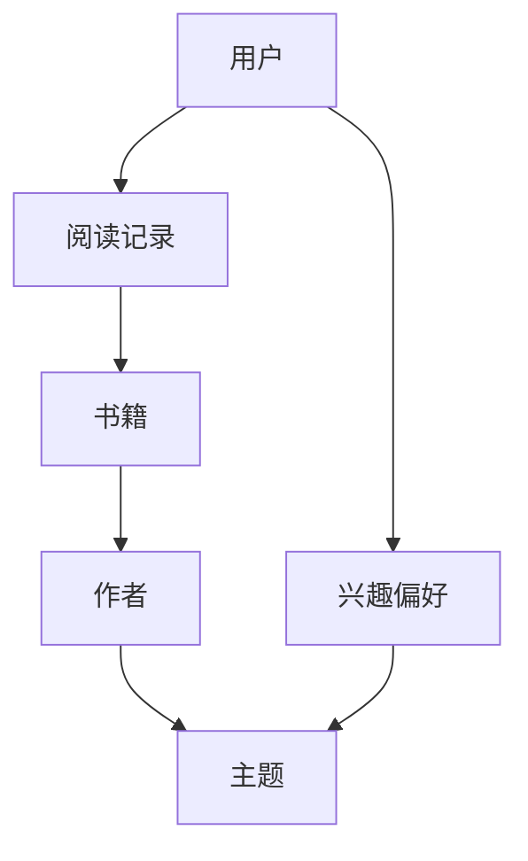
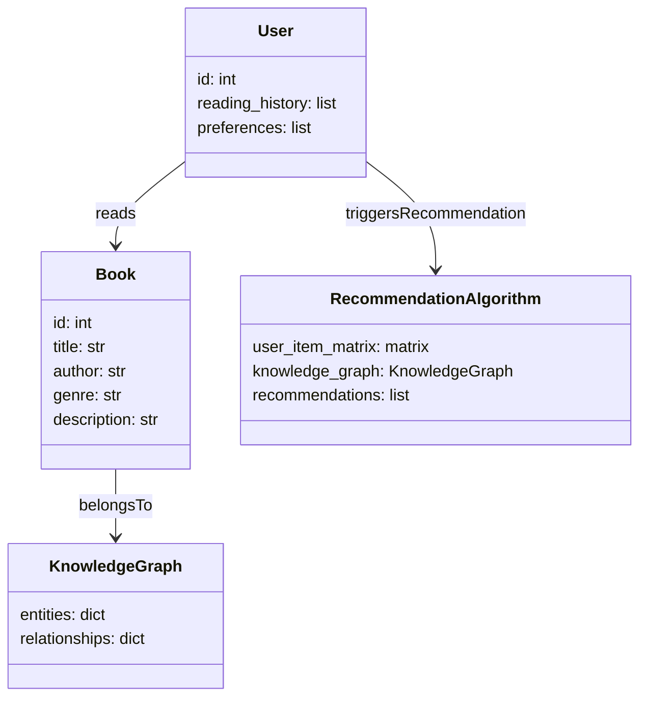
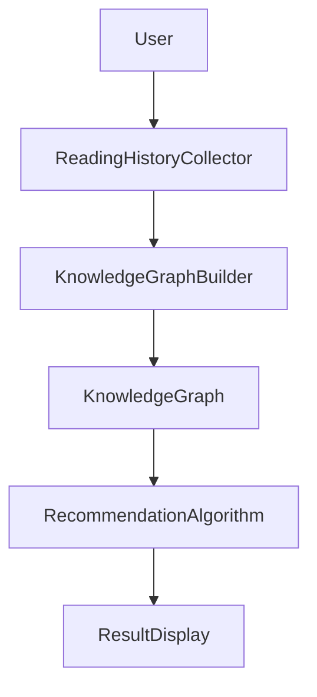
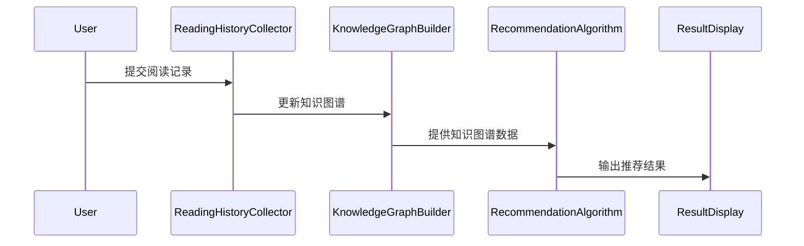

                 


# 智能书架：AI Agent的阅读兴趣推荐系统

## 第一部分：背景介绍

### 第1章：智能书架与AI Agent概述

#### 1.1 问题背景
- 1.1.1 阅读兴趣推荐的必要性
  - 随着信息量的爆炸式增长，用户需要更高效的阅读推荐系统来帮助他们筛选和发现感兴趣的内容。
  - 传统推荐系统存在覆盖率低、精准度不足的问题，难以满足用户的个性化需求。
- 1.1.2 当前推荐系统的局限性
  - 基于协同过滤的推荐系统依赖于大量的用户数据，且容易受到冷启动问题的影响。
  - 基于内容的推荐系统依赖于对文本的准确理解和语义分析，但现有技术在处理复杂文本时仍存在局限性。
- 1.1.3 AI Agent在阅读推荐中的优势
  - AI Agent可以通过知识图谱和自然语言处理技术，更精准地理解和分析用户的阅读偏好。
  - AI Agent可以实现动态更新和自适应学习，提供更个性化的推荐服务。

#### 1.2 问题描述
- 1.2.1 阅读兴趣推荐的核心问题
  - 如何准确理解用户的阅读偏好。
  - 如何高效地匹配用户的兴趣与海量的书籍资源。
  - 如何实时更新和优化推荐结果。
- 1.2.2 用户行为分析的重要性
  - 用户的行为数据（如阅读时间、阅读深度、收藏、评分等）是理解用户兴趣的重要依据。
  - 用户的行为数据可以帮助系统更好地预测用户的阅读偏好。
- 1.2.3 知识图谱在推荐中的作用
  - 知识图谱可以将书籍、作者、主题等实体及其关系进行结构化表示，帮助系统更全面地理解书籍内容。
  - 知识图谱可以用于相似书籍的推荐和主题扩展。

#### 1.3 问题解决
- 1.3.1 AI Agent的基本原理
  - AI Agent是一种能够自主感知环境、理解和推理、自主决策的智能体。
  - 在阅读推荐系统中，AI Agent可以通过分析用户的阅读历史、行为数据和偏好，生成个性化的推荐结果。
- 1.3.2 智能书架的设计目标
  - 提供个性化的阅读推荐服务。
  - 实现高效的知识图谱构建与应用。
  - 支持动态更新和自适应学习。
- 1.3.3 阅读兴趣推荐的实现路径
  - 收集和分析用户行为数据。
  - 构建和应用知识图谱。
  - 设计和实现推荐算法。

#### 1.4 边界与外延
- 1.4.1 智能书架的适用范围
  - 主要适用于在线阅读平台、电子书库、图书馆等场景。
  - 可以用于个性化推荐、用户画像构建、内容分发等领域。
- 1.4.2 与其他推荐系统的区别
  - 传统的推荐系统通常基于协同过滤或基于内容的推荐方法，而智能书架结合了知识图谱和AI Agent的技术，推荐效果更优。
  - 智能书架注重动态更新和自适应学习，能够更好地应对用户的兴趣变化。
- 1.4.3 系统的可扩展性与限制
  - 系统的设计需要考虑可扩展性，以便在用户数量和书籍数量增加时仍能保持较好的性能。
  - 系统的推荐效果受到知识图谱的构建质量和推荐算法的优化水平的限制。

#### 1.5 概念结构与核心要素
- 1.5.1 系统架构的核心要素
  - 用户：系统的核心服务对象。
  - 书籍：系统需要处理的核心内容。
  - 知识图谱：系统理解和推理的基础。
  - AI Agent：系统的核心推荐引擎。
- 1.5.2 用户、书籍、标签的关系
  - 用户通过阅读行为生成偏好数据。
  - 书籍通过知识图谱构建内容关联。
  - 标签用于表示书籍的主题、作者等属性。
- 1.5.3 知识图谱的构建与应用
  - 知识图谱的构建需要对书籍、作者、主题等实体进行结构化表示。
  - 知识图谱的应用包括相似书籍推荐、主题扩展、内容解释等。

---

## 第二部分：核心概念与联系

### 第2章：AI Agent与推荐系统原理

#### 2.1 AI Agent的基本原理
- 2.1.1 AI Agent的定义与分类
  - AI Agent是一种能够感知环境、理解问题、推理解决方案、执行操作的智能体。
  - 分为简单反射式Agent、基于模型的反射式Agent、目标驱动式Agent等多种类型。
- 2.1.2 基于知识图谱的推理机制
  - 知识图谱提供了实体间的关系和属性，AI Agent可以通过图谱推理来生成推荐结果。
  - 示例：如果用户喜欢《1984》，系统可以推理出用户可能对其他同类科幻小说感兴趣。
- 2.1.3 自然语言处理在阅读推荐中的应用
  - NLP技术可以用于书籍内容的理解和分析。
  - 例如，通过文本挖掘提取书籍的主题标签。

#### 2.2 阅读兴趣推荐的核心算法
- 2.2.1 基于协同过滤的推荐算法
  - 基于用户行为数据的相似性计算。
  - 示例：如果用户A和用户B的阅读历史相似，系统可以将用户A喜欢的书籍推荐给用户B。
- 2.2.2 基于内容的推荐算法
  - 基于书籍内容的相似性计算。
  - 示例：如果用户喜欢科幻小说，系统可以推荐其他科幻小说。
- 2.2.3 混合推荐算法的优缺点
  - 混合推荐算法结合了协同过滤和内容推荐的优点，但实现复杂度较高。

#### 2.3 核心概念对比表
| 概念 | 描述 | 示例 |
|------|------|------|
| 用户行为 | 用户的阅读记录、评分、收藏 | 用户阅读了《1984》并评分5星 |
| 知识图谱 | 书籍、作者、主题的关系网络 | 《1984》属于科幻小说，作者是乔治·奥威尔 |
| AI Agent | 能够自主学习和推理的智能体 | 根据用户偏好推荐书籍 |

#### 2.4 实体关系图（Mermaid）



---

## 第三部分：算法原理讲解

### 第3章：推荐算法原理

#### 3.1 协同过滤算法
- 3.1.1 协同过滤算法的数学模型
  - 用户-物品矩阵：$R_{u,i}$ 表示用户 $u$ 对物品 $i$ 的评分。
  - 相似度计算：使用余弦相似度或欧氏距离计算用户之间的相似度。
- 3.1.2 协同过滤算法的实现步骤
  1. 收集用户对物品的评分数据。
  2. 计算用户之间的相似度。
  3. 找到与目标用户相似度最高的用户。
  4. 推荐这些用户评分高的物品。
- 3.1.3 协同过滤算法的优缺点
  - 优点：简单易实现，适合数据量较大的场景。
  - 缺点：存在冷启动问题，计算复杂度较高。

#### 3.2 基于内容的推荐算法
- 3.2.1 基于内容的推荐算法的数学模型
  - 物品表示：将物品表示为向量，例如使用TF-IDF提取关键词向量。
  - 相似度计算：使用余弦相似度计算物品之间的相似度。
- 3.2.2 基于内容的推荐算法的实现步骤
  1. 对物品进行特征提取。
  2. 计算目标物品与所有其他物品的相似度。
  3. 根据相似度排序，推荐相似度最高的物品。
- 3.2.3 基于内容的推荐算法的优缺点
  - 优点：能够处理冷启动问题，推荐结果解释性强。
  - 缺点：依赖于内容特征的准确性，计算复杂度较高。

#### 3.3 混合推荐算法
- 3.3.1 混合推荐算法的数学模型
  - 结合协同过滤和内容推荐的结果，通过加权的方式生成最终的推荐列表。
- 3.3.2 混合推荐算法的实现步骤
  1. 分别使用协同过滤和内容推荐算法生成推荐列表。
  2. 根据一定的权重对两个推荐列表进行加权融合。
  3. 根据用户反馈动态调整权重。
- 3.3.3 混合推荐算法的优缺点
  - 优点：结合了协同过滤和内容推荐的优点，推荐效果更优。
  - 缺点：实现复杂度较高，需要对协同过滤和内容推荐的结果进行融合和优化。

#### 3.4 算法实现代码示例

##### 协同过滤算法实现

```python
import numpy as np

def collaborative_filtering(user_item_matrix):
    # 计算用户之间的相似度
    user_similarity = np.zeros_like(user_item_matrix)
    for i in range(user_item_matrix.shape[0]):
        for j in range(user_item_matrix.shape[0]):
            user_similarity[i, j] = np.corrcoef(user_item_matrix[i, :], user_item_matrix[j, :])[0, 1]
    
    # 推荐书籍
    recommendations = np.zeros_like(user_item_matrix)
    for i in range(user_item_matrix.shape[0]):
        for j in range(user_item_matrix.shape[1]):
            if user_item_matrix[i, j] == 0:
                # 找到相似度最高的用户
                top_k_users = np.argsort(-user_similarity[i, :])[0:5]
                recommendations[i, j] = np.mean(user_item_matrix[top_k_users, j])
    return recommendations
```

##### 基于内容的推荐算法实现

```python
from sklearn.feature_extraction.text import TfidfVectorizer

def content_based_recommendation(books, target_book):
    vectorizer = TfidfVectorizer()
    book_vectors = vectorizer.fit_transform([book['description'] for book in books])
    target_vector = vectorizer.transform([target_book['description']])
    
    # 计算相似度
    similarity = np.dot(target_vector.T, book_vectors).diagonal()
    
    # 推荐相似度最高的书籍
    sorted_indices = np.argsort(-similarity)
    recommendations = [books[i] for i in sorted_indices]
    return recommendations
```

---

## 第四部分：系统分析与架构设计

### 第4章：系统架构设计

#### 4.1 问题场景介绍
- 系统需要为用户提供个性化的阅读推荐服务。
- 系统需要支持海量书籍的存储和管理。
- 系统需要能够实时更新和优化推荐结果。

#### 4.2 系统功能设计
- 4.2.1 系统功能模块
  - 用户行为分析模块：收集和分析用户的阅读行为数据。
  - 知识图谱构建模块：构建和管理书籍、作者、主题等实体的知识图谱。
  - 推荐算法实现模块：基于知识图谱和用户行为数据，生成推荐结果。
  - 系统管理模块：对系统的运行状态进行监控和管理。

- 4.2.2 领域模型类图（Mermaid）



#### 4.3 系统架构设计
- 4.3.1 系统架构图（Mermaid）



#### 4.4 系统接口设计
- 4.4.1 系统接口说明
  - 用户输入阅读行为数据。
  - 系统输出推荐结果。

- 4.4.2 接口交互流程图（Mermaid）



---

## 第五部分：项目实战

### 第5章：智能书架的实现与应用

#### 5.1 环境安装
- 安装Python、TensorFlow、Keras、Scikit-learn、NLTK、networkx等工具。

#### 5.2 系统核心实现
- 5.2.1 用户行为分析模块实现
  - 使用Python编写数据收集和分析脚本。
  - 示例代码：

```python
import pandas as pd

def analyze_user_behavior(data):
    df = pd.DataFrame(data)
    # 统计用户的阅读量
    user_counts = df['user_id'].value_counts()
    # 统计书籍的热门程度
    book_counts = df['book_id'].value_counts()
    return user_counts, book_counts
```

- 5.2.2 知识图谱构建模块实现
  - 使用Networkx库构建知识图谱。
  - 示例代码：

```python
import networkx as nx

def build_knowledge_graph(books):
    G = nx.Graph()
    for book in books:
        G.add_node(book['title'])
        if book['author']:
            G.add_node(book['author'])
            G.add_edge(book['title'], book['author'])
        for genre in book['genres']:
            G.add_node(genre)
            G.add_edge(book['title'], genre)
    return G
```

- 5.2.3 推荐算法实现模块实现
  - 使用协同过滤算法实现推荐功能。
  - 示例代码：

```python
def collaborative_filtering(user_item_matrix):
    # 实现协同过滤算法，返回推荐结果
    pass
```

#### 5.3 代码应用解读与分析
- 5.3.1 用户行为分析代码解读
  - 代码功能：统计用户的阅读量和书籍的热门程度。
  - 实际应用：帮助系统更好地理解用户的行为模式。
- 5.3.2 知识图谱构建代码解读
  - 代码功能：构建书籍、作者、主题的知识图谱。
  - 实际应用：支持基于知识图谱的推荐功能。

#### 5.4 实际案例分析
- 5.4.1 案例背景
  - 系统在实际应用中的运行情况。
- 5.4.2 案例分析
  - 系统如何根据用户的阅读历史和偏好生成推荐结果。
  - 系统如何通过知识图谱实现主题扩展。

#### 5.5 项目小结
- 项目实现的关键点。
- 系统的优势和不足。

---

## 第六部分：最佳实践与小结

### 第6章：最佳实践与注意事项

#### 6.1 注意事项
- 数据质量和完整性对推荐效果的影响。
- 知识图谱构建的准确性和完整性。
- 系统的可扩展性和可维护性。

#### 6.2 小结
- 系统的核心设计理念和实现方法。
- 系统的主要优势和创新点。
- 系统的未来发展方向。

#### 6.3 扩展阅读
- 推荐相关领域的书籍和论文。
- 提供进一步学习的资源和建议。

---

## 附录

### 附录A：常用工具与库
- Python
- TensorFlow
- Keras
- Scikit-learn
- NLTK
- Networkx

### 附录B：参考文献
- [1] 《推荐系统入门》
- [2] 《知识图谱实战》
- [3] 《人工智能导论》

---

通过以上目录大纲，文章内容将从背景介绍、核心概念、算法原理、系统设计、项目实战到最佳实践，全面而系统地阐述智能书架的构建与实现。文章结构清晰，逻辑连贯，内容详实，适合技术爱好者和相关领域的专业人士阅读和参考。

