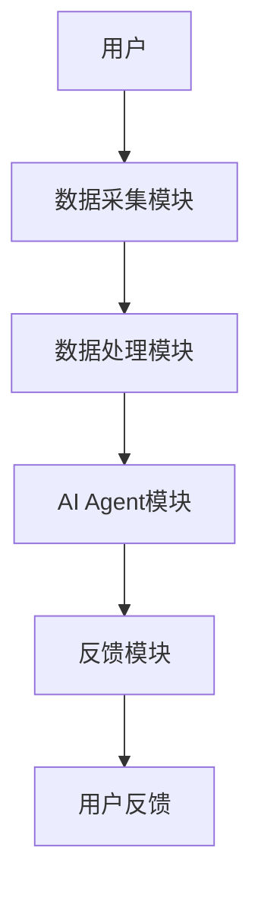

                 


# 智能书桌：AI Agent的姿势提醒系统

## 关键词：智能书桌、AI Agent、姿势提醒、人体工程学、物联网、传感器

## 摘要：  
智能书桌结合了AI Agent技术和人体姿势提醒功能，通过实时监测用户的坐姿，提供智能化的反馈和建议，帮助用户保持正确的姿势，预防健康问题。本文将从背景、技术原理、系统架构到项目实战，详细讲解智能书桌的姿势提醒系统的实现过程。

---

## 第一部分: 背景与概念

### 第1章: 人体姿势问题的背景

#### 1.1 现代工作与学习姿势问题的现状  
在现代生活中，人们长时间坐在桌前工作或学习已经成为常态。由于缺乏运动和姿势不正确，许多人出现了颈椎病、腰椎病等健康问题。根据世界卫生组织的统计，全球约有 1/3 的人因为姿势不正确而出现健康问题。  

#### 1.2 长期不良姿势对人体的危害  
- 长期不良姿势会导致骨骼变形，尤其是脊柱弯曲。  
- 不正确的坐姿会增加椎间盘的压力，导致椎间盘突出。  
- 不良姿势还会影响血液循环，导致肩颈僵硬和疲劳。  

#### 1.3 姿势提醒系统的必要性  
姿势提醒系统通过实时监测用户的坐姿，及时发出提醒，帮助用户纠正不良姿势。这种系统不仅能够预防健康问题，还能提高工作效率和舒适度。

---

### 第2章: AI Agent的基本概念

#### 2.1 什么是AI Agent  
AI Agent（人工智能代理）是一种能够感知环境并采取行动以实现目标的智能系统。它可以理解用户的需求，主动提供服务，并通过学习不断优化自身的行为。  

#### 2.2 AI Agent的核心功能与特点  
- **感知环境**：通过传感器或摄像头获取环境数据。  
- **决策与推理**：基于数据进行分析和决策。  
- **主动行动**：根据决策结果采取行动，如发出提醒或调整设备。  
- **学习与优化**：通过机器学习算法不断优化自身的行为。  

#### 2.3 AI Agent在智能书桌中的应用潜力  
AI Agent可以作为智能书桌的核心模块，实时监测用户的坐姿，并根据监测结果提供反馈和建议。

---

## 第二部分: 智能书桌的姿势提醒系统设计

### 第3章: 姿势提醒系统的总体架构

#### 3.1 系统的功能模块划分  
- 数据采集模块：通过传感器或摄像头采集用户姿势数据。  
- 数据处理模块：对采集的数据进行分析和处理。  
- AI Agent模块：根据处理后的数据，判断用户的姿势是否正确。  
- 反馈模块：通过震动、声音或屏幕提示等方式提醒用户调整姿势。  

#### 3.2 系统的硬件与软件组成  
- **硬件部分**：包括摄像头、加速度传感器、震动马达等。  
- **软件部分**：包括数据处理算法、AI Agent算法和用户界面。  

#### 3.3 系统的交互设计与用户界面  
- 用户界面设计：简洁直观，支持用户自定义提醒方式。  
- 交互流程：用户登录、姿势监测、姿势提醒、数据记录与分析。  

---

### 第4章: AI Agent在姿势提醒中的具体实现

#### 4.1 姿势检测算法的选择与实现  
- **基于图像处理的姿势检测**：使用OpenCV等工具进行图像分析。  
- **基于传感器的姿势检测**：通过加速度传感器和陀螺仪数据进行分析。  

#### 4.2 姿势提醒策略的设计与优化  
- **实时提醒策略**：当检测到用户姿势不正确时，立即发出提醒。  
- **个性化提醒策略**：根据用户的习惯调整提醒的频率和方式。  

#### 4.3 AI Agent的智能化程度与用户需求的匹配  
- **初级AI Agent**：基于规则的提醒系统。  
- **中级AI Agent**：结合机器学习的自适应提醒系统。  
- **高级AI Agent**：具备主动调整设备的能力，如自动调节书桌高度。  

---

## 第三部分: 智能书桌的系统架构与实现

### 第5章: 系统架构设计

#### 5.1 系统的功能模块设计  
- 数据采集模块：负责采集用户的姿势数据。  
- 数据处理模块：对采集的数据进行预处理和特征提取。  
- AI Agent模块：负责姿势检测和判断。  
- 反馈模块：根据检测结果发出提醒或调整设备。  

#### 5.2 系统的分层架构图  


#### 5.3 系统的硬件与软件接口设计  
- **硬件接口**：传感器、摄像头、震动马达等。  
- **软件接口**：API接口用于不同模块之间的通信。  

---

## 第四部分: 项目实战

### 第6章: 环境安装与系统实现

#### 6.1 环境配置  
- **硬件配置**：Raspberry Pi 4 + 摄像头 + 加速度传感器。  
- **软件配置**：安装Python、OpenCV、TensorFlow等工具。  

#### 6.2 系统核心实现  
- 数据采集：编写Python脚本采集姿势数据。  
- 数据处理：使用OpenCV进行图像处理或使用传感器数据进行分析。  
- AI Agent实现：训练一个简单的姿势检测模型。  

#### 6.3 代码示例  
```python
import cv2

# 初始化摄像头
cap = cv2.VideoCapture(0)

# 读取帧
while True:
    ret, frame = cap.read()
    if not ret:
        break
    # 图像处理代码
    cv2.imshow('frame', frame)
    if cv2.waitKey(1) == ord('q'):
        break

cap.release()
cv2.destroyAllWindows()
```

---

## 第五部分: 总结与展望

### 第7章: 总结与优化

#### 7.1 系统的优缺点  
- **优点**：能够实时监测用户姿势，提供及时提醒。  
- **缺点**：目前的姿势检测算法精度有限，需要进一步优化。  

#### 7.2 系统的优化方向  
- 提高姿势检测算法的精度。  
- 增强系统的智能化水平，如引入更复杂的机器学习模型。  
- 支持更多的交互方式，如语音提醒。  

#### 7.3 未来的发展方向  
- 研究更先进的姿势检测技术，如基于深度学习的姿势检测。  
- 探索更智能的反馈机制，如自动调整书桌高度。  

---

## 第六部分: 最佳实践与注意事项

### 第8章: 最佳实践 tips

#### 8.1 传感器选择的注意事项  
- 根据需求选择合适的传感器类型（如摄像头或加速度传感器）。  
- 确保传感器的精度和响应速度。  

#### 8.2 数据隐私保护  
- 确保用户数据的安全性，避免数据泄露。  
- 提供用户隐私保护的选项，如数据加密和匿名化处理。  

#### 8.3 系统维护与升级  
- 定期更新系统软件，修复潜在的安全漏洞。  
- 提供用户友好的升级界面，方便用户操作。  

---

## 结语

智能书桌的姿势提醒系统结合了AI Agent技术和物联网设备，通过实时监测用户的姿势，提供智能化的反馈和建议。这种系统不仅能够预防健康问题，还能提高工作效率和舒适度。未来，随着AI技术的不断发展，智能书桌的姿势提醒系统将变得更加智能化和个性化，为用户提供更好的使用体验。

