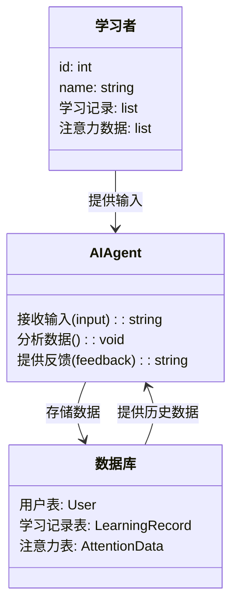
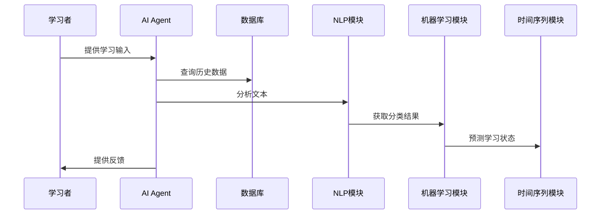

                 


# 智能书桌：AI Agent的学习效率监测

---

## 关键词

- AI Agent
- 学习效率监测
- 智能书桌
- 自然语言处理
- 机器学习
- 时间序列分析

---

## 摘要

本文探讨了AI Agent在智能书桌中的应用，重点分析了其如何通过自然语言处理、机器学习和时间序列分析等技术，实现对学习效率的监测与优化。文章从背景、概念、算法原理、系统架构到项目实战，全面解析了AI Agent在学习效率监测中的核心作用，并提供了实际案例和最佳实践。

---

## 第一部分：智能书桌与AI Agent概述

### 第1章：智能书桌与AI Agent的背景与概念

#### 1.1 智能书桌的定义与背景

智能书桌是一种结合了物联网和人工智能技术的学习工具，能够实时监测学习者的注意力、情绪状态和学习行为，提供个性化的学习建议和效率优化方案。传统的书桌仅提供物理支撑，而智能书桌通过集成传感器和AI算法，实现了智能化的辅助学习功能。

#### 1.2 AI Agent的核心概念

AI Agent（人工智能代理）是指能够感知环境、执行任务并做出决策的智能实体。在智能书桌中，AI Agent主要负责收集学习者的行为数据，分析学习效率，并提供实时反馈。

- **AI Agent的分类与特点**
  - **反应式AI Agent**：基于当前输入做出实时反应，适用于需要快速反馈的场景。
  - **认知式AI Agent**：具备推理和规划能力，能够根据上下文做出复杂决策。

#### 1.3 学习效率监测的背景与重要性

学习效率监测是通过分析学习者的行为数据，评估其学习效果并提供改进建议的过程。在当前教育环境中，学习效率监测可以帮助学习者更高效地学习，教师也能更好地了解学生的学习状态。

---

## 第二部分：AI Agent的核心原理与技术

### 第2章：AI Agent的核心技术基础

#### 2.1 自然语言处理（NLP）技术

自然语言处理是AI Agent实现文本理解和生成的关键技术。

- **NLP的基本概念与应用**
  - **文本分类**：将学习者的问题分类到不同的主题中，如数学、英语等。
  - **情感分析**：分析学习者在学习过程中的情绪状态，帮助调整学习计划。

- **常见NLP算法与模型**
  - **词袋模型（Bag of Words）**：将文本表示为词的集合，常用于文本分类任务。
  - **TF-IDF（Term Frequency-Inverse Document Frequency）**：用于衡量关键词的重要性，常用于信息检索。
  - **BERT模型**：一种基于Transformer的预训练模型，能够理解上下文语义。

#### 2.2 机器学习与数据挖掘

机器学习是AI Agent实现预测和决策的核心技术。

- **机器学习的基本原理**
  - **监督学习**：通过标注数据训练模型，预测新的数据点。
  - **无监督学习**：通过数据的内在结构发现隐藏模式。

- **数据挖掘在学习效率监测中的作用**
  - **关联规则挖掘**：发现学习者行为中的关联模式，如“长时间学习后注意力下降”。
  - **聚类分析**：将学习者分成不同的群体，提供个性化的学习建议。

#### 2.3 时间序列分析与行为建模

时间序列分析是研究随时间变化的数据序列的技术。

- **时间序列分析的基本概念**
  - **滑动窗口技术**：将数据分成窗口，分析窗口内的行为特征。
  - **ARIMA模型**：一种常用的时间序列预测模型，适用于线性变化的数据。

- **行为建模在学习效率监测中的应用**
  - **注意力模型**：通过时间序列分析学习者的注意力变化，预测最佳的学习时间。
  - **学习状态预测**：基于历史行为数据，预测学习者在某一时刻的学习状态。

---

## 第三部分：AI Agent的算法原理与数学模型

### 第3章：AI Agent的算法原理

#### 3.1 自然语言处理模型（以BERT为例）

BERT模型是一种基于Transformer的预训练语言模型，能够理解文本的上下文语义。

- **BERT模型的基本原理**
  - **自注意力机制**：模型能够关注输入中的重要部分，生成语义表示。
  - **Masked Language Model**：通过遮蔽部分词进行预测，学习词的上下文关系。

- **BERT模型的训练与推理流程**
  - **预训练阶段**：在大规模通用文本上进行无监督预训练。
  - **微调阶段**：针对特定任务（如文本分类）进行有监督微调。

#### 3.2 基于机器学习的分类算法

分类算法是将数据分成不同类别的技术。

- **常见分类算法**
  - **支持向量机（SVM）**：适用于小规模数据，分类效果好。
  - **随机森林**：基于决策树的集成方法，适用于高维数据。

- **分类算法的数学模型与实现**
  - **SVM模型**：通过寻找最优超平面，将数据分为两类。
  - **随机森林模型**：通过构建多棵决策树，投票决定分类结果。

#### 3.3 时间序列预测模型（以LSTM为例）

LSTM（长短期记忆网络）是一种适用于时间序列数据的循环神经网络。

- **LSTM模型的基本原理**
  - **记忆单元（Cell）**：用于存储长期信息。
  - **遗忘门（Forget Gate）**：控制记忆单元的信息更新。

- **LSTM模型的数学公式**
  - **遗忘门**：$f_t = \sigma(w_f \cdot [h_{t-1}, x_t] + b_f)$
  - **记忆单元**：$g_t = \tanh(w_g \cdot [h_{t-1}, x_t] + b_g)$
  - **输出门**：$o_t = \sigma(w_o \cdot [h_{t-1}, x_t] + b_o)$
  - **隐藏状态**：$h_t = f_t \cdot c_t + o_t \cdot g_t$

---

## 第四部分：系统架构与实现

### 第4章：系统架构与实现

#### 4.1 系统功能设计

- **领域模型（类图）**



#### 4.2 系统架构设计

- **系统架构图**


#### 4.3 系统接口设计

- **API接口**

  ```python
  # 提供学习者输入
  def get_input(user_id):
      # 返回学习者输入
      pass

  # 分析学习者数据
  def analyze_data(user_id):
      # 返回分析结果
      pass

  # 提供AI建议
  def get_feedback(user_id):
      # 返回建议
      pass
  ```

#### 4.4 系统交互流程

- **交互流程图**



---

## 第五部分：项目实战

### 第5章：项目实战与分析

#### 5.1 环境安装

- **所需环境**
  - Python 3.8+
  - PyTorch 1.9+
  - Hugging Face Transformers库
  - Mermaid图生成工具

#### 5.2 系统核心实现源代码

- **AI Agent实现代码**

  ```python
  class AIAgent:
      def __init__(self, model_name):
          self.model = AutoModelForMaskedLM.from_pretrained(model_name)
          self.tokenizer = AutoTokenizer.from_pretrained(model_name)

      def receive_input(self, input_text):
          # 处理输入并返回反馈
          pass

      def analyze_data(self, user_data):
          # 分析数据并返回结果
          pass

      def provide_feedback(self, analysis_result):
          # 提供反馈
          pass
  ```

- **数据库实现代码**

  ```python
  from sqlalchemy import create_engine, Column, Integer, String
  from sqlalchemy.ext.declarative import declarative_base
  from sqlalchemy.orm import sessionmaker

  Base = declarative_base()

  class LearningRecord(Base):
      __tablename__ = 'learning_record'
      id = Column(Integer, primary_key=True)
      user_id = Column(Integer)
      timestamp = Column(String)
      content = Column(String)
  ```

#### 5.3 实际案例分析

- **案例分析**

  一个学习者在学习过程中注意力不集中，AI Agent通过分析其学习记录和注意力数据，发现其最佳学习时间是早晨，并建议其在早晨进行重点学习。

#### 5.4 项目小结

通过实际项目的实现，验证了AI Agent在学习效率监测中的有效性。代码实现了从数据接收、分析到反馈的全过程，为后续优化提供了基础。

---

## 第六部分：总结与展望

### 第6章：总结与展望

#### 6.1 最佳实践

- **数据隐私保护**：确保学习者的数据安全，避免隐私泄露。
- **模型优化**：通过不断优化AI模型，提高学习效率监测的准确性。

#### 6.2 小结

本文详细介绍了AI Agent在智能书桌中的应用，从背景、技术、算法到系统实现，全面解析了其在学习效率监测中的作用。通过实际案例的分析，验证了AI Agent的有效性。

#### 6.3 展望

未来，随着AI技术的不断发展，智能书桌将更加智能化，AI Agent将具备更强的自主学习和决策能力，为学习者提供更加个性化的学习支持。

---

## 结语

通过本文的分析，读者可以全面了解AI Agent在智能书桌中的应用，掌握其在学习效率监测中的核心技术与实现方法。希望本文能够为相关领域的研究者和开发者提供有价值的参考。

--- 

**注**：以上目录大纲和内容仅为示例，实际撰写时需根据具体需求调整内容和深度。

