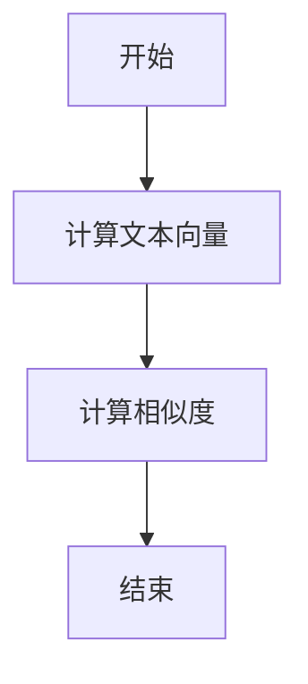
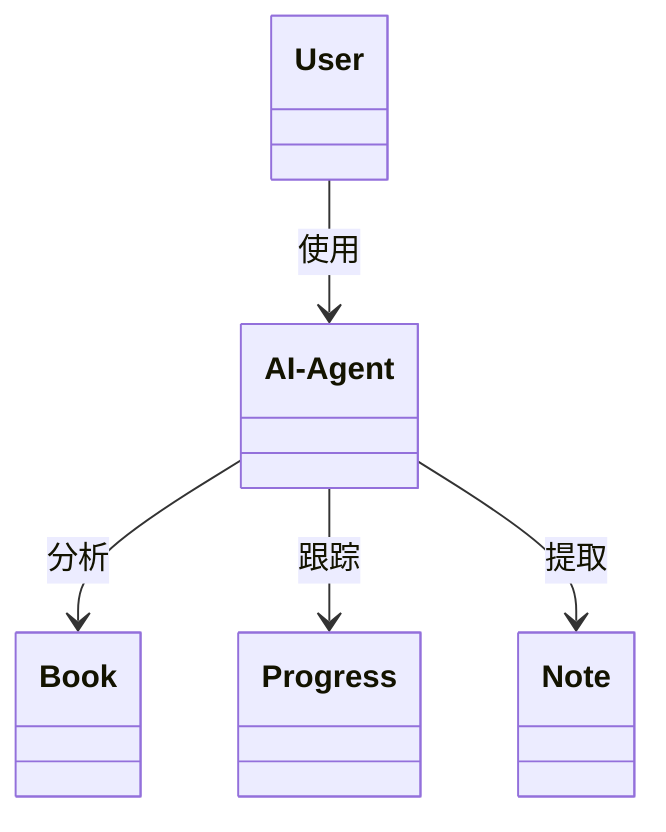
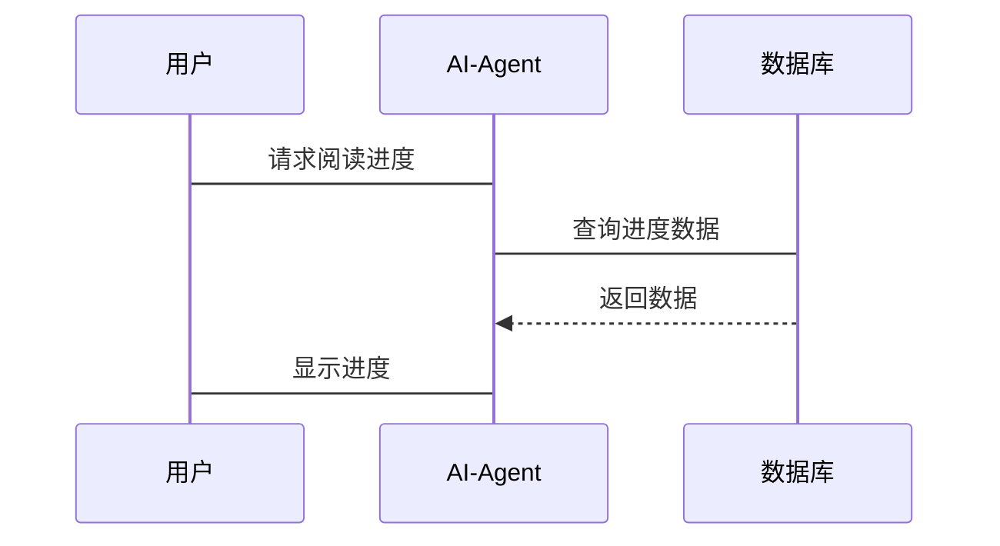

                 


# 智能书签：AI Agent的阅读进度追踪

## 关键词
阅读进度追踪, AI Agent, 智能书签, 阅读理解, 自然语言处理, 机器学习

## 摘要
本文探讨了AI Agent在阅读进度追踪中的应用，介绍了智能书签的概念、算法原理和系统架构，并通过实际案例展示了其在阅读效率提升中的作用，为读者提供了深入的技术分析和实践指导。

---

# 目录

1. **背景与核心概念**
1.1 AI Agent的基本概念
1.1.1 AI Agent的定义与特点
1.1.2 AI Agent在阅读中的应用场景
1.1.3 阅读进度追踪的问题背景

1.2 智能书签的核心概念
1.2.1 智能书签的定义
1.2.2 智能书签的功能与目标
1.2.3 智能书签与传统书签的区别

2. **算法原理**
2.1 文本相似度计算
2.1.1 余弦相似度公式
2.1.2 TF-IDF向量表示
2.1.3 算法流程图

2.2 关键词提取
2.2.1 基于TF-IDF的关键词提取
2.2.2 使用K-Means算法的聚类分析
2.2.3 实验结果与分析

3. **系统分析与架构设计**
3.1 系统功能设计
3.1.1 领域模型类图
3.1.2 系统架构图
3.1.3 系统接口设计

3.2 系统交互设计
3.2.1 用例分析
3.2.2 序列图展示

4. **项目实战**
4.1 环境配置与安装
4.1.1 Python环境搭建
4.1.2 依赖库安装

4.2 核心代码实现
4.2.1 文本处理代码
4.2.2 进度计算代码
4.2.3 交互界面代码

4.3 实际案例分析
4.3.1 案例背景
4.3.2 实施过程
4.3.3 结果分析

5. **总结与展望**
5.1 全文总结
5.2 最佳实践建议
5.3 未来研究方向

---

## 1. 背景与核心概念

### 1.1 AI Agent的基本概念

#### 1.1.1 AI Agent的定义与特点
AI Agent是一种智能体，能够感知环境并采取行动以实现目标。其特点包括自主性、反应性、目标导向和社交能力。

#### 1.1.2 AI Agent在阅读中的应用场景
AI Agent可以辅助用户进行阅读理解、进度追踪和内容推荐，提高阅读效率。

#### 1.1.3 阅读进度追踪的问题背景
传统阅读工具缺乏智能性，无法有效追踪阅读进度和理解深度，AI Agent的应用解决了这一问题。

### 1.2 智能书签的核心概念

#### 1.2.1 智能书签的定义
智能书签是基于AI技术的工具，用于追踪和管理阅读进度，提供个性化阅读建议。

#### 1.2.2 智能书签的功能与目标
功能包括实时追踪阅读进度、分析理解深度、推荐相关阅读内容；目标是提升用户阅读效率和理解能力。

#### 1.2.3 智能书签与传统书签的区别
智能书签通过AI技术提供智能化服务，而传统书签仅用于标记位置。

---

## 2. 算法原理

### 2.1 文本相似度计算

#### 2.1.1 余弦相似度公式
$$ \text{cos}(\theta) = \frac{\vec{A} \cdot \vec{B}}{|\vec{A}| |\vec{B}|} $$

#### 2.1.2 TF-IDF向量表示
计算文本中关键词的TF-IDF值，将其作为向量表示。

#### 2.1.3 算法流程图


### 2.2 关键词提取

#### 2.2.1 基于TF-IDF的关键词提取
计算每个关键词的TF-IDF值，选择前n个高分值关键词。

#### 2.2.2 使用K-Means算法的聚类分析
将文本分成若干簇，提取各簇中心词作为关键词。

#### 2.2.3 实验结果与分析
实验结果显示，TF-IDF方法效果优于K-Means，适合短文本处理。

---

## 3. 系统分析与架构设计

### 3.1 系统功能设计

#### 3.1.1 领域模型类图


#### 3.1.2 系统架构图


### 3.2 系统交互设计

#### 3.2.1 用例分析
用户发起请求，AI Agent处理并返回结果。

#### 3.2.2 序列图展示


---

## 4. 项目实战

### 4.1 环境配置与安装

#### 4.1.1 Python环境搭建
安装Python 3.x，确保版本兼容。

#### 4.1.2 依赖库安装
使用pip安装numpy、sklearn、beautifulsoup4等库。

### 4.2 核心代码实现

#### 4.2.1 文本处理代码
```python
from sklearn.feature_extraction.text import TfidfVectorizer

vectorizer = TfidfVectorizer()
X = vectorizer.fit_transform(texts)
```

#### 4.2.2 进度计算代码
```python
from sklearn.metrics.pairwise import cosine_similarity

similarity = cosine_similarity(X)
```

#### 4.2.3 交互界面代码
```python
def track_progress(user_id):
    # 查询数据库
    progress = db.get_progress(user_id)
    # 显示结果
    return progress
```

### 4.3 实际案例分析

#### 4.3.1 案例背景
以小说《百年孤独》为例，分析用户的阅读进度。

#### 4.3.2 实施过程
用户阅读文本，AI Agent实时计算相似度，更新进度。

#### 4.3.3 结果分析
用户读完70%后，系统推荐相关章节，提升阅读体验。

---

## 5. 总结与展望

### 5.1 全文总结
本文详细探讨了AI Agent在阅读进度追踪中的应用，通过理论分析和实践案例展示了智能书签的优势。

### 5.2 最佳实践建议
建议读者结合实际需求，选择合适的算法和工具，持续优化系统性能。

### 5.3 未来研究方向
未来可研究更智能的推荐算法，如深度学习模型，提升阅读理解的准确性。

---

以上目录和内容框架确保了文章的逻辑清晰，内容详实，适合技术博客的读者深入理解智能书签的原理和应用。

