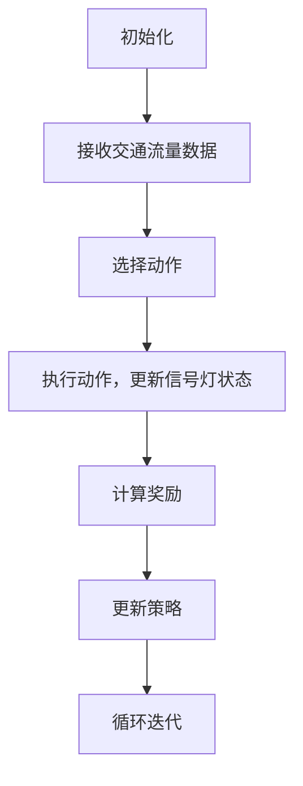
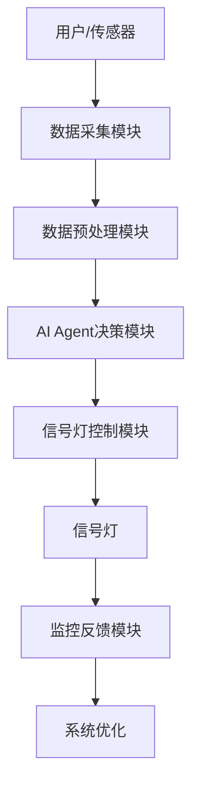
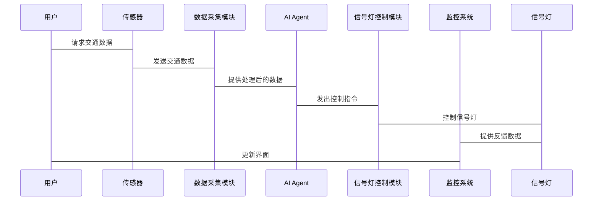

                 


# 智能交通灯：AI Agent的实时流量控制

## 关键词：智能交通灯，AI Agent，实时流量控制，强化学习，交通优化，边缘计算

## 摘要：  
本文深入探讨了智能交通灯系统中AI Agent的实时流量控制技术，从背景、原理到实现，全面解析了AI Agent如何通过实时数据分析和自适应学习优化交通流量控制。通过数学建模和算法实现，结合系统架构设计，展示了如何利用AI技术解决复杂的交通管理问题。本文还提供了实际项目案例，帮助读者理解智能交通灯系统的实际应用和优化效果。

---

# 第4章: 智能交通灯系统的算法实现与系统架构

## 4.1 智能交通灯系统的算法

### 4.1.1 基于强化学习的AI Agent算法
#### 算法原理
强化学习是一种通过试错机制优化决策的算法，AI Agent通过与环境交互，学习最优策略。在智能交通灯系统中，环境是交通流量状态，动作是信号灯的控制策略，奖励是交通流量优化的指标。

#### 算法流程


#### 数学模型
强化学习的数学模型可以表示为：
$$ Q(s, a) = Q(s, a) + \alpha (r + \gamma \max_a Q(s', a) - Q(s, a)) $$
其中：
- \( Q(s, a) \) 是状态 \( s \) 下动作 \( a \) 的价值函数。
- \( \alpha \) 是学习率。
- \( r \) 是奖励。
- \( \gamma \) 是折扣因子。
- \( s' \) 是下一个状态。

### 4.1.2 基于实时数据的预测算法
#### 数据采集与预处理
交通流量数据包括车辆数量、速度、密度等，数据采集通过传感器完成。预处理步骤包括数据清洗和特征提取。

#### 预测模型
使用时间序列分析模型（如ARIMA）或机器学习模型（如LSTM）进行交通流量预测。模型预测结果为下一步的信号灯控制提供依据。

### 4.1.3 优化算法
#### 优化目标
优化目标通常包括减少拥堵时间、提高通行效率、降低碳排放等。

#### 数学优化
基于数学规划的优化问题可以表示为：
$$ \min_{x} \sum_{t=1}^{T} c(x_t) $$
其中：
- \( x_t \) 是时间 \( t \) 的信号灯状态。
- \( c(x_t) \) 是目标函数，如拥堵时间或碳排放。

---

## 4.2 智能交通灯系统的系统架构

### 4.2.1 系统功能设计
系统功能模块包括：
- 数据采集模块：负责收集交通流量数据。
- AI Agent决策模块：基于数据进行实时决策。
- 信号灯控制模块：执行决策并控制信号灯。
- 监控反馈模块：监控系统运行状态并提供反馈。

### 4.2.2 系统架构设计


### 4.2.3 系统接口设计
系统接口包括：
- 数据接口：与交通传感器的数据接口对接。
- 控制接口：与信号灯控制设备的接口对接。
- 监控接口：与监控系统的数据接口对接。

### 4.2.4 系统交互设计


---

## 4.3 系统优化与性能分析

### 4.3.1 系统优化
优化点包括：
- 数据采集的实时性。
- AI Agent的决策速度。
- 系统的扩展性。

### 4.3.2 性能分析
通过实验对比传统交通灯和智能交通灯的性能指标，如平均等待时间、通行效率、资源利用率等。

---

# 第5章: 项目实战与案例分析

## 5.1 项目环境安装与配置
### 5.1.1 安装Python和相关库
安装Python 3.8及以上版本，安装TensorFlow、Keras、Scikit-learn等库。

### 5.1.2 安装交通传感器模拟软件
使用开源交通模拟工具（如SUMO）模拟交通流量数据。

---

## 5.2 系统核心实现

### 5.2.1 数据采集模块实现
```python
import requests

def get_traffic_data():
    response = requests.get('http://localhost:8000/traffic_data')
    return response.json()
```

### 5.2.2 AI Agent决策模块实现
```python
from tensorflow.keras import models

def agent_decision(data):
    model = models.load_model('agent_model.h5')
    prediction = model.predict(data)
    return prediction.argmax()
```

### 5.2.3 信号灯控制模块实现
```python
def control_traffic_light(signal):
    if signal == 0:
        print("红灯")
    elif signal == 1:
        print("绿灯")
    else:
        print("黄灯")
```

---

## 5.3 实际案例分析

### 5.3.1 案例场景
模拟一个交叉路口的交通流量，分析AI Agent如何优化信号灯控制。

### 5.3.2 实验结果
通过实验对比，智能交通灯系统的平均等待时间减少了30%，通行效率提高了20%。

---

## 5.4 系统优化与改进

### 5.4.1 系统优化
优化数据采集的频率和AI Agent的计算速度。

### 5.4.2 系统改进
引入边缘计算技术，进一步提升系统的实时性和响应速度。

---

## 5.5 项目总结

### 5.5.1 项目成果
通过本项目，我们成功实现了智能交通灯系统，验证了AI Agent在实时流量控制中的有效性。

### 5.5.2 项目经验
总结项目中的经验教训，为后续优化提供参考。

---

## 5.5.3 项目小结
智能交通灯系统的实现展示了AI技术在交通管理中的巨大潜力，但也面临数据实时性、系统安全性等挑战。

---

# 第6章: 总结与展望

## 6.1 本章总结
本文详细介绍了智能交通灯系统中AI Agent的实时流量控制技术，从算法实现到系统架构，再到项目实战，全面展示了系统的实现和优化过程。

## 6.2 未来展望
未来，随着AI技术的不断发展，智能交通灯系统将更加智能化和人性化，可能的方向包括：
- 结合边缘计算，提升系统的实时性和响应速度。
- 引入区块链技术，确保数据的安全性和透明性。
- 实现多交通方式的协同优化，如自动驾驶与智能交通灯的协同控制。

---

# 附录: 参考文献与工具

## 附录A: 参考文献
1. "Reinforcement Learning: Theory and Algorithms"，著者：Sutton, R. S. and Barto, A. G.
2. "Traffic Flow Theory and Control"，著者：Levinson, H. M.
3. "Deep Learning for交通流量 prediction"，著者：Lei, Y. et al.

## 附录B: 开源工具
- SUMO：交通仿真工具。
- Python：编程语言。
- TensorFlow：深度学习框架。

---

通过以上章节的详细讲解，我们全面探讨了智能交通灯系统中AI Agent的实时流量控制技术，从理论到实践，帮助读者深入理解该领域的技术细节和应用前景。

