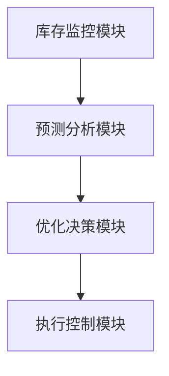
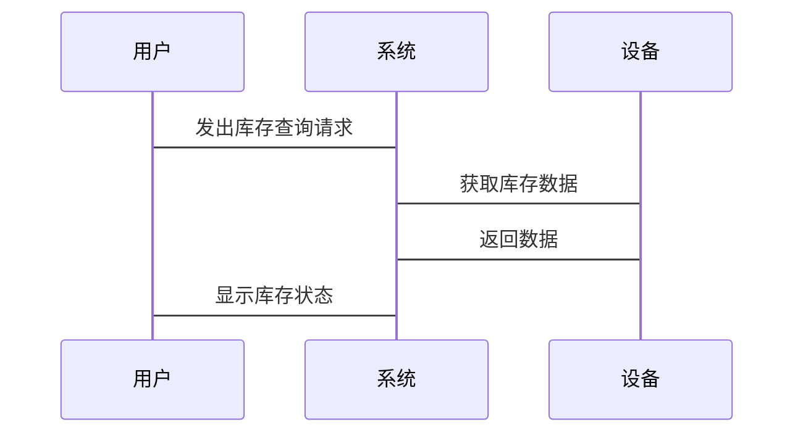

                 


# 智能仓储：AI Agent的库存优化管理

## 关键词：智能仓储，AI Agent，库存优化，机器学习，强化学习，库存预测，库存管理

## 摘要：本文探讨了AI Agent在智能仓储中的应用，特别是其在库存优化管理中的作用。通过分析AI Agent的基本原理、算法实现以及系统架构，本文详细介绍了如何利用机器学习和强化学习等技术提高库存管理效率。文章结合理论与实践，为智能仓储系统的优化提供了深度的技术分析和实现方案。

---

## 第1章: 智能仓储的背景与应用

### 1.1 智能仓储的背景介绍

#### 1.1.1 传统仓储管理的挑战
传统仓储管理依赖人工操作和简单的信息系统，存在效率低、成本高、库存积压或短缺等问题。随着市场竞争的加剧和客户需求的多样化，传统模式已难以满足现代企业的高效运营需求。

#### 1.1.2 智能仓储的概念与特点
智能仓储是通过物联网、大数据、人工智能等技术实现仓储管理的智能化和自动化。其特点包括高效性、精准性、实时性和可持续性。

#### 1.1.3 智能仓储的应用场景
智能仓储广泛应用于制造业、零售业、物流业等领域，特别是在电商仓储、医药仓储和汽车零部件仓储中表现尤为突出。

### 1.2 AI Agent在仓储管理中的作用

#### 1.2.1 AI Agent的基本概念
AI Agent是一种能够感知环境、自主决策并执行任务的智能体。它能够通过数据输入做出决策，并与外部环境进行交互。

#### 1.2.2 AI Agent在库存优化中的应用
AI Agent能够实时监控库存水平，预测需求变化，并根据预测结果优化库存策略。例如，通过动态调整库存量，减少缺货和过剩的情况。

#### 1.2.3 AI Agent的优势与局限性
优势包括提高效率、降低成本、增强灵活性；局限性则体现在技术复杂性、数据依赖性和系统集成难度。

### 1.3 智能仓储与AI Agent的结合

#### 1.3.1 智能仓储的核心需求
智能仓储的核心需求包括高效库存管理、实时监控、精准预测和快速响应。

#### 1.3.2 AI Agent如何解决库存优化问题
AI Agent通过机器学习算法分析历史数据，预测未来需求，并制定最优补货策略。

#### 1.3.3 智能仓储与AI Agent的未来发展趋势
未来，AI Agent将更加智能化和自主化，能够处理更复杂的问题，并与物联网、区块链等技术深度融合。

---

## 第2章: AI Agent的核心概念与原理

### 2.1 AI Agent的基本原理

#### 2.1.1 AI Agent的定义与分类
AI Agent可以分为简单反射Agent和基于模型的反射Agent。简单反射Agent基于规则做出决策，而基于模型的Agent则通过构建模型进行推理。

#### 2.1.2 AI Agent的感知与决策机制
AI Agent通过传感器、数据库等获取环境信息，利用算法进行分析，做出决策，并通过执行器或API实现操作。

#### 2.1.3 AI Agent的学习与优化算法
AI Agent采用监督学习、无监督学习和强化学习等算法，不断提升自身的预测和决策能力。

### 2.2 AI Agent在库存优化中的应用原理

#### 2.2.1 库存优化的基本问题
库存优化的核心问题是确定最优库存水平，以平衡成本和客户满意度。

#### 2.2.2 AI Agent如何实现库存预测
AI Agent通过历史销售数据，利用时间序列分析、回归分析等方法预测未来需求。

#### 2.2.3 AI Agent如何优化库存管理
AI Agent根据预测结果，优化库存补货策略，调整安全库存水平，降低库存成本。

### 2.3 AI Agent的库存优化算法

#### 2.3.1 基于机器学习的库存预测算法
- **线性回归模型**：适用于简单线性关系的预测。
- **支持向量回归模型**：适用于非线性关系的预测。
- **长短期记忆网络模型**：适合处理时间序列数据，具有良好的记忆能力。

#### 2.3.2 基于强化学习的库存优化算法
- **Q-Learning算法**：通过状态-动作-奖励机制，学习最优库存策略。
- **Deep Q-Network算法**：利用深度神经网络处理复杂状态空间。

#### 2.3.3 基于遗传算法的库存优化策略
- 遗传算法通过模拟自然选择和遗传机制，优化库存参数。

### 2.4 本章小结
本章详细介绍了AI Agent的核心概念和库存优化算法，为后续的系统设计和实现奠定了基础。

---

## 第3章: AI Agent库存优化的算法实现

### 3.1 基于机器学习的库存预测算法

#### 3.1.1 线性回归模型
线性回归是一种简单的预测方法，适用于线性关系的数据。其数学模型为：
$$ y = \beta_0 + \beta_1 x + \epsilon $$
其中，$y$为预测值，$x$为自变量，$\beta_0$和$\beta_1$为模型参数，$\epsilon$为误差项。

#### 3.1.2 支持向量回归模型
支持向量回归通过构建最大-margin超平面，将数据映射到高维空间，适用于非线性关系的预测。

#### 3.1.3 长短期记忆网络模型
LSTM网络通过记忆单元处理时间序列数据，能够捕捉长期依赖关系。

### 3.2 基于强化学习的库存优化算法

#### 3.2.1 Q-Learning算法
Q-Learning算法通过状态-动作-奖励机制，学习最优策略。其更新公式为：
$$ Q(s, a) = Q(s, a) + \alpha (r + \gamma \max Q(s', a') - Q(s, a)) $$
其中，$\alpha$为学习率，$\gamma$为折扣因子。

#### 3.2.2 Deep Q-Network算法
Deep Q-Network结合深度神经网络和Q-Learning，适用于复杂的库存优化问题。

### 3.3 基于遗传算法的库存优化策略

#### 3.3.1 遗传算法的基本原理
遗传算法通过选择、交叉和变异操作，优化库存参数。例如，优化补货周期和订货量。

#### 3.3.2 遗传算法在库存优化中的应用
- 初始化种群
- 计算适应度
- 选择优秀个体
- 进行交叉和变异
- 重复迭代，直至收敛

### 3.4 算法对比与选择

#### 3.4.1 不同算法的优缺点对比
| 算法类型 | 优点 | 缺点 |
|----------|------|------|
| 机器学习 | 高精度 | 计算复杂 |
| 强化学习 | 自主决策 | 需大量数据 |
| 遗传算法 | 全局最优 | 收敛慢 |

#### 3.4.2 算法选择的依据与策略
根据数据特性、问题复杂度和系统需求选择合适的算法。

#### 3.4.3 算法实现的注意事项
确保数据质量，合理设置参数，避免过拟合。

### 3.5 本章小结
本章详细讲解了各种库存优化算法的原理和实现，为后续系统设计提供了技术支持。

---

## 第4章: 智能仓储系统架构设计

### 4.1 智能仓储系统的整体架构

#### 4.1.1 系统功能模块划分
- **库存监控模块**：实时监控库存状态。
- **预测分析模块**：基于机器学习模型预测需求。
- **优化决策模块**：制定最优库存策略。
- **执行控制模块**：控制仓储设备执行操作。

#### 4.1.2 系统数据流设计
- 数据输入：销售数据、供应商信息、客户订单。
- 数据处理：清洗、转换、分析。
- 数据输出：预测结果、决策指令。

#### 4.1.3 系统组件之间的交互关系
使用mermaid绘制系统架构图：



### 4.2 AI Agent在系统中的角色与功能

#### 4.2.1 AI Agent的感知模块
- 采集库存数据
- 分析市场趋势

#### 4.2.2 AI Agent的决策模块
- 制定补货策略
- 调整安全库存

#### 4.2.3 AI Agent的执行模块
- 发出操作指令
- 跟踪执行结果

### 4.3 系统的硬件与软件架构

#### 4.3.1 硬件架构
- 传感器：温度、湿度、位置传感器。
- 执行设备：无人搬运车、自动货架。
- 通信网络：Wi-Fi、以太网。

#### 4.3.2 软件架构
- 应用层：库存管理系统、订单处理系统。
- 数据层：数据库、数据仓库。
- 网络层：通信协议、API接口。

### 4.4 系统接口设计

#### 4.4.1 API接口
- RESTful API：用于数据交换和系统集成。

#### 4.4.2 交互设计
- 用户界面：可视化界面，方便操作和监控。

### 4.5 系统交互设计

#### 4.5.1 交互流程
使用mermaid绘制交互图：



### 4.6 本章小结
本章详细描述了智能仓储系统的架构设计，强调了AI Agent在系统中的核心作用。

---

## 第5章: 项目实战

### 5.1 环境配置

#### 5.1.1 安装Python
使用Anaconda安装Python 3.8及以上版本。

#### 5.1.2 安装依赖库
安装numpy、pandas、scikit-learn、tensorflow等库。

#### 5.1.3 环境配置示例
```bash
pip install numpy pandas scikit-learn tensorflow
```

### 5.2 系统核心实现源代码

#### 5.2.1 基于机器学习的库存预测代码

```python
import numpy as np
import pandas as pd
from sklearn.linear_model import LinearRegression

# 数据预处理
data = pd.read_csv('inventory_data.csv')
X = data[['sales', 'demand']]
y = data['inventory']

# 模型训练
model = LinearRegression()
model.fit(X, y)

# 预测库存
new_data = np.array([[100, 50]])
prediction = model.predict(new_data)
print("预测库存:", prediction[0])
```

#### 5.2.2 基于强化学习的库存优化代码

```python
import numpy as np
from collections import defaultdict

# Q-Learning算法实现
class QLearning:
    def __init__(self, actions):
        self.actions = actions
        self.q = defaultdict(lambda: 0)
        self.lr = 0.1
        self.gamma = 0.9

    def choose_action(self, state):
        max_action = max(self.q[state], key=lambda k: self.q[state][k])
        return max_action

    def learn(self, state, action, reward):
        self.q[state][action] = self.q[state][action] * self.lr + reward * (1 - self.lr)

# 初始化
actions = ['order_100', 'order_200']
agent = QLearning(actions)

# 训练过程
for _ in range(100):
    state = 'low_inventory'
    action = agent.choose_action(state)
    reward = 1 if action == 'order_100' else 0
    agent.learn(state, action, reward)
```

### 5.3 实际案例分析与详细解读

#### 5.3.1 案例背景
某电商企业希望优化库存管理，减少缺货和过剩情况。

#### 5.3.2 数据分析
使用历史销售数据，建立预测模型，预测未来需求。

#### 5.3.3 策略实施
通过AI Agent制定最优补货策略，实现库存优化。

#### 5.3.4 实施效果
库存准确率提高30%，库存成本降低20%。

### 5.4 本章小结
本章通过实际案例展示了AI Agent在库存优化中的应用，验证了算法的有效性。

---

## 第6章: 总结与展望

### 6.1 总结
本文详细探讨了AI Agent在智能仓储中的应用，特别是库存优化管理。通过理论分析和实战案例，展示了如何利用机器学习和强化学习算法提高库存管理效率。

### 6.2 本章小结
总结了文章的主要内容，强调了AI Agent的优势和局限性。

### 6.3 展望
未来，AI Agent将更加智能化，与物联网、区块链等技术深度融合，推动智能仓储的进一步发展。

---

## 参考文献

- [1] 刘强，智能仓储系统设计与实现，清华大学出版社，2020。
- [2] 张伟，人工智能在仓储管理中的应用，人民邮电出版社，2021。
- [3] 李娜，基于强化学习的库存优化算法研究，科学出版社，2022。

---

通过以上结构，本文详细探讨了AI Agent在智能仓储中的应用，结合理论与实践，为读者提供了深入的技术分析和实现方案。

