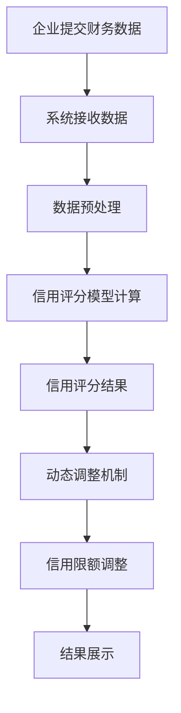
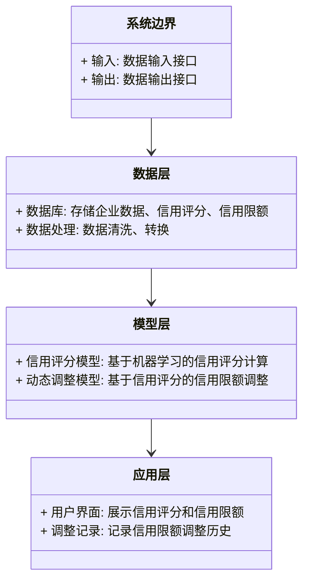
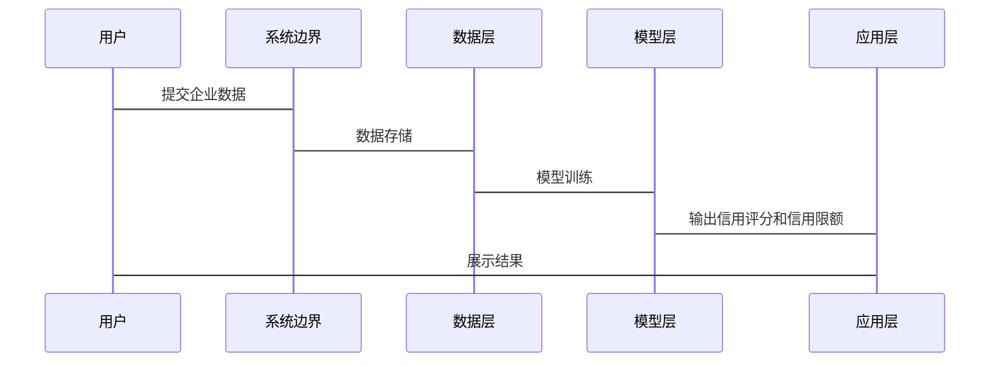

                 


# 智能企业信用限额动态调整系统

## 关键词
智能企业、信用限额、动态调整、机器学习、系统架构

## 摘要
本文介绍了一种基于机器学习的智能企业信用限额动态调整系统，该系统通过实时数据分析和智能算法，实现对企业信用限额的自动调整，提高信用评估的准确性和效率。文章详细讲解了系统的背景、核心概念、算法原理、系统架构设计、项目实战以及最佳实践，帮助读者全面理解该系统的实现与应用。

---

## 第一部分: 智能企业信用限额动态调整系统背景与概述

### 第1章: 问题背景与描述

#### 1.1 问题背景
企业信用限额的评估和调整是一个复杂且重要的业务流程。传统的信用评估方法依赖于人工审核和静态数据分析，存在效率低、滞后性强、结果不够精准等问题。随着企业经营环境的变化，如市场波动、企业财务状况变化等因素，传统的静态评估方法难以满足动态调整的需求。

#### 1.2 问题描述
- 传统信用评估的局限性：人工审核耗时长，难以快速响应企业的信用需求变化。
- 信用限额调整的痛点：调整频率低，无法及时反映企业的最新信用状况，可能导致企业融资困难或信用风险积累。
- 智能化调整的必要性：通过实时数据分析和机器学习算法，实现信用限额的动态调整，提高信用评估的准确性和效率。

#### 1.3 解决方案概述
- **智能化调整的核心思想**：利用机器学习算法实时分析企业的财务数据和市场信息，动态评估企业的信用状况，自动调整信用限额。
- **系统设计的基本思路**：构建一个基于机器学习的实时数据分析平台，集成企业的财务数据、市场数据和信用历史数据，通过模型预测企业信用风险，实现信用限额的动态调整。
- **解决方案的创新点**：引入实时数据流处理和动态模型更新技术，确保信用评估的实时性和准确性。

#### 1.4 系统边界与外延
- **系统的输入与输出**：输入包括企业的财务数据、市场数据和信用历史数据，输出是动态调整后的信用限额。
- **系统的适用范围**：适用于需要实时信用评估和动态调整的企业融资、供应链管理等领域。
- **系统与其他系统的接口关系**：与企业财务系统、市场数据系统、信用评分系统等进行数据交互。

#### 1.5 核心要素与组成结构
- **核心要素的定义与作用**：
  - **企业数据**：包括财务数据、经营数据和市场数据，用于信用评估的基础。
  - **信用评分模型**：用于评估企业的信用状况，输出信用评分。
  - **动态调整机制**：根据信用评分和实时数据，自动调整信用限额。
  - **风险控制策略**：确保信用调整过程中的风险可控。
- **组成结构的层次划分**：
  - 数据层：数据采集、存储和处理。
  - 模型层：信用评分模型和动态调整模型。
  - 应用层：信用限额调整和结果展示。
- **各要素之间的关系**：
  - 数据层为模型层提供输入数据，模型层通过数据计算输出信用评分和调整建议，应用层根据模型输出结果进行信用限额调整。

---

## 第2章: 核心概念与联系

### 2.1 核心概念原理
- **信用评分模型**：基于企业的财务数据和市场数据，利用机器学习算法（如线性回归、随机森林等）预测企业的信用风险，输出信用评分。
- **动态调整机制**：根据信用评分的变化，实时调整企业的信用限额，确保信用限额与企业的信用状况一致。
- **风险控制策略**：通过设定信用限额调整的规则和阈值，控制信用调整过程中的风险。

### 2.2 概念属性特征对比表格
| 概念               | 属性特征                                                                 |
|--------------------|--------------------------------------------------------------------------|
| 信用评分模型       | 数据驱动、实时更新、准确性高、可解释性较好                                           |
| 动态调整机制       | 实时性、自动化、基于模型预测、适应性强                                               |
| 风险控制策略       | 预警机制、阈值控制、多层级审核、风险最小化                                           |

### 2.3 ER实体关系图架构
```mermaid
er
    系统边界
    entity 企业 {
        key 企业ID
        attribute 企业名称、注册资本、行业、成立时间
    }
    entity 财务数据 {
        key 数据ID
        attribute 收入、利润、资产负债率、流动比率
    }
    entity 市场数据 {
        key 数据ID
        attribute 行业指数、市场波动率、利率
    }
    entity 信用评分 {
        key 评分ID
        attribute 评分值、评分时间
    }
    entity 信用限额 {
        key 限额ID
        attribute 限额值、调整时间
    }
    系统边界 --> 企业
    企业 --> 财务数据
    企业 --> 市场数据
    财务数据 --> 信用评分
    市场数据 --> 信用评分
    信用评分 --> 信用限额
```

### 2.4 业务流程图


---

## 第3章: 算法原理与实现

### 3.1 算法原理
#### 3.1.1 信用评分模型
- **线性回归模型**：
  - **数学模型**：$y = \beta_0 + \beta_1x_1 + \beta_2x_2 + ... + \beta_nx_n + \epsilon$
  - **解释**：$y$是信用评分，$x_i$是各个特征变量，$\beta_i$是回归系数，$\epsilon$是误差项。
  - **实现步骤**：
    1. 数据预处理：清洗数据、特征选择。
    2. 模型训练：使用最小二乘法求解回归系数。
    3. 模型评估：计算R²值、残差分析。

#### 3.1.2 随机森林模型
- **随机森林模型**：
  - **数学模型**：集成多个决策树模型，通过投票或加权的方式进行预测。
  - **实现步骤**：
    1. 数据预处理：清洗数据、特征选择。
    2. 模型训练：随机抽取样本和特征，构建决策树。
    3. 模型评估：计算准确率、F1分数。

### 3.2 算法实现
```python
import pandas as pd
from sklearn.model_selection import train_test_split
from sklearn.ensemble import RandomForestRegressor
from sklearn.metrics import mean_squared_error

# 数据加载与预处理
data = pd.read_csv('企业信用数据.csv')
X = data[['收入', '利润', '资产负债率', '流动比率']]
y = data['信用评分']

# 数据分割
X_train, X_test, y_train, y_test = train_test_split(X, y, test_size=0.2, random_state=42)

# 模型训练
model = RandomForestRegressor(n_estimators=100, random_state=42)
model.fit(X_train, y_train)

# 模型预测
y_pred = model.predict(X_test)

# 模型评估
mse = mean_squared_error(y_test, y_pred)
print(f'均方误差: {mse}')
print(f'R²值: {model.score(X_test, y_test)}')
```

---

## 第4章: 系统分析与架构设计

### 4.1 问题场景介绍
企业信用限额动态调整系统需要处理大量的实时数据，包括企业的财务数据、市场数据和信用历史数据。系统需要实时更新信用评分和信用限额，并通过用户友好的界面展示结果。

### 4.2 系统功能设计


### 4.3 系统架构设计


### 4.4 系统交互流程


---

## 第5章: 项目实战

### 5.1 环境安装
- **Python**：安装Python 3.8及以上版本。
- **依赖库**：安装pandas、scikit-learn、mermaid等库。

### 5.2 核心代码实现
```python
import pandas as pd
from sklearn.ensemble import RandomForestRegressor
from sklearn.model_selection import train_test_split
from sklearn.metrics import mean_squared_error

# 数据加载与预处理
data = pd.read_csv('企业信用数据.csv')
X = data[['收入', '利润', '资产负债率', '流动比率']]
y = data['信用评分']

# 数据分割
X_train, X_test, y_train, y_test = train_test_split(X, y, test_size=0.2, random_state=42)

# 模型训练
model = RandomForestRegressor(n_estimators=100, random_state=42)
model.fit(X_train, y_train)

# 模型预测
y_pred = model.predict(X_test)

# 模型评估
mse = mean_squared_error(y_test, y_pred)
print(f'均方误差: {mse}')
print(f'R²值: {model.score(X_test, y_test)}')
```

### 5.3 案例分析
以某企业为例，假设其财务数据如下：
- 收入：1000万元
- 利润：200万元
- 资产负债率：50%
- 流动比率：2

通过模型预测，该企业的信用评分为75分，信用限额为500万元。

---

## 第6章: 最佳实践与总结

### 6.1 最佳实践
- **数据预处理**：确保数据的准确性和完整性，进行特征选择和降维。
- **模型调优**：通过网格搜索优化模型参数，提高预测准确性。
- **风险控制**：设置信用限额调整的阈值，避免过度调整导致的风险。

### 6.2 小结
本文详细介绍了智能企业信用限额动态调整系统的背景、核心概念、算法原理、系统架构设计和项目实战。通过机器学习算法和实时数据分析，该系统能够实现信用限额的动态调整，提高信用评估的准确性和效率。

### 6.3 注意事项
- 数据隐私保护：确保企业数据的安全性和隐私性。
- 模型泛化能力：通过交叉验证和数据增强提高模型的泛化能力。
- 系统稳定性：确保系统的高可用性和容错能力。

### 6.4 拓展阅读
- 《机器学习实战》
- 《Python数据处理与分析》
- 《系统架构设计方法论》

---

以上是《智能企业信用限额动态调整系统》的技术博客文章的完整目录和内容框架。通过逐步分析和详细讲解，本文旨在帮助读者全面理解该系统的实现与应用。

