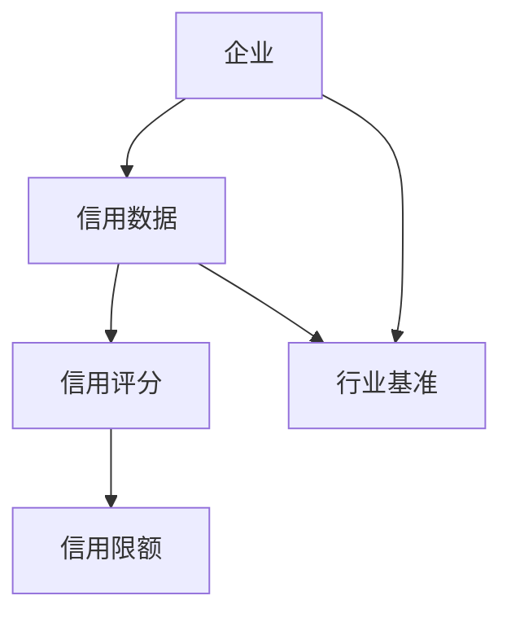
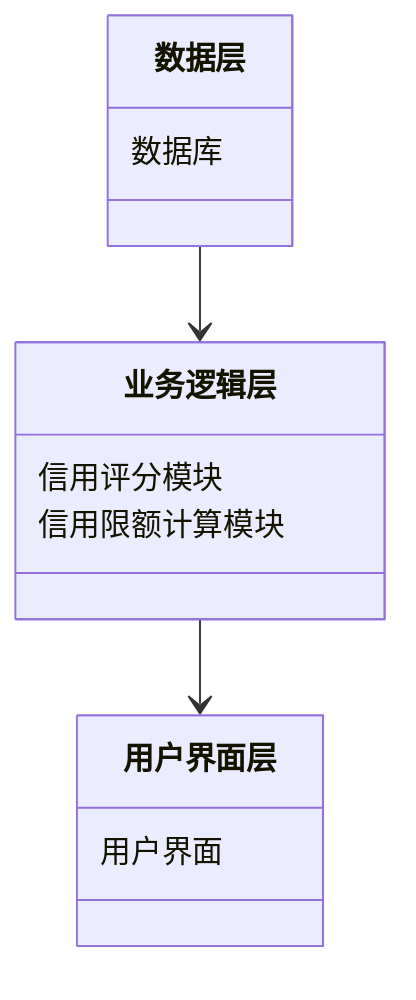
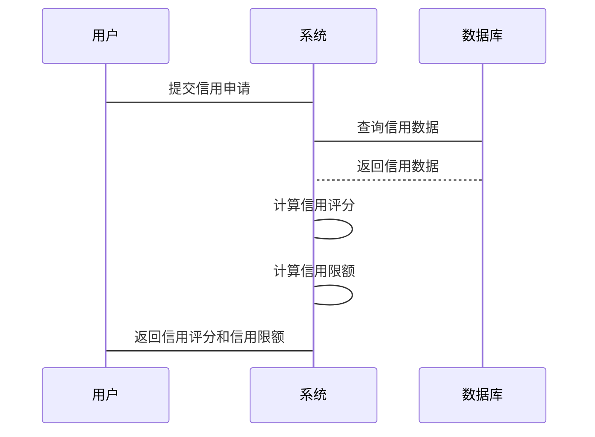

                 


# 《智能企业信用限额管理系统》

---

## 关键词：
智能信用管理，企业信用限额，机器学习，系统架构，项目实战

---

## 摘要：
本文深入探讨了智能企业信用限额管理系统的构建与实现，从背景、核心概念、算法原理到系统架构和项目实战，全面解析了如何利用人工智能技术提升企业的信用风险管理能力。文章结合实际案例，详细介绍了系统的功能设计、架构设计、接口设计和交互设计，并提供了具体的代码实现和数学模型，帮助读者全面理解智能信用限额管理系统的实现过程和应用场景。最后，本文总结了系统的最佳实践和未来发展方向。

---

# 第一部分: 智能企业信用限额管理系统的背景与核心概念

## 第1章: 企业信用限额管理的背景与挑战

### 1.1 企业信用管理的重要性
#### 1.1.1 信用管理在企业经营中的作用
信用管理是企业经营中的核心环节，直接关系到企业的资金周转、风险控制和客户关系管理。通过科学的信用管理，企业可以避免因客户违约而造成的经济损失，同时也能提高客户的信任度和满意度。

#### 1.1.2 传统信用管理的局限性
传统的信用管理方式主要依赖人工审核和经验判断，存在以下问题：
- 数据收集不全面，难以覆盖企业的多维度信息。
- 审核效率低，难以应对海量的交易数据。
- 风险控制能力有限，容易因人为疏忽或经验不足导致误判。

#### 1.1.3 智能化信用管理的必要性
随着企业规模的扩大和市场竞争的加剧，传统的信用管理方式已经难以满足企业的需求。智能化信用管理可以通过大数据分析和人工智能技术，快速处理海量数据，提高审核效率和准确性，降低信用风险。

---

### 1.2 信用限额管理的核心问题
#### 1.2.1 信用限额的定义与计算
信用限额是企业在一定时期内可以授予客户的最大信用额度，通常基于客户的信用评分和企业的经营状况。信用限额的计算需要综合考虑客户的财务状况、行业风险、市场环境等多个因素。

#### 1.2.2 信用风险的来源与特征
信用风险是指客户未能履行还款义务而给企业带来的损失。信用风险的来源包括客户自身财务状况恶化、行业风险、宏观经济波动等。其特征表现为不确定性高、影响范围广、难以完全量化。

#### 1.2.3 企业信用限额管理的目标与边界
企业信用限额管理的目标是通过科学的方法和工具，合理分配信用额度，降低信用风险，提高资金周转效率。其边界包括客户资质、企业战略目标、市场环境等因素。

---

### 1.3 智能企业信用限额管理系统的概念与优势
#### 1.3.1 智能信用限额管理的定义
智能信用限额管理系统是指利用人工智能、大数据分析等技术，对企业客户的信用状况进行实时监控和评估，并根据评估结果动态调整信用额度的系统。

#### 1.3.2 系统的核心功能与特点
- **数据采集与处理**：自动采集客户的财务数据、交易记录、行业数据等，并进行清洗和预处理。
- **信用评分模型**：基于机器学习算法，构建信用评分模型，评估客户的信用风险。
- **信用限额计算**：根据信用评分和企业经营状况，动态计算客户的信用限额。
- **实时监控与预警**：实时监控客户的信用状况，发现异常情况及时预警。

#### 1.3.3 与传统信用管理的区别与优势
- **区别**：传统信用管理依赖人工审核，而智能信用管理通过自动化技术实现。
- **优势**：提高审核效率、降低人为错误、增强风险控制能力。

---

## 第2章: 智能企业信用限额管理系统的核心概念与联系

### 2.1 核心概念的定义与属性
#### 2.1.1 信用数据
信用数据包括客户的财务数据（如资产负债表、利润表）、交易记录、行业基准数据等。其属性包括数据来源多样性、数据量大、数据类型多样。

#### 2.1.2 信用评分
信用评分是基于信用数据计算得出的信用风险评分，通常采用0-1000分制。其属性包括评分范围、评分更新频率、评分影响因素等。

#### 2.1.3 信用限额
信用限额是企业在一定时期内可以授予客户的最大信用额度，其属性包括额度动态调整、额度计算公式、额度生效条件等。

---

### 2.2 核心概念的对比分析
#### 2.2.1 核心概念对比表格

| 概念   | 定义                                                                 | 属性               |
|--------|----------------------------------------------------------------------|--------------------|
| 信用数据 | 包括企业的财务数据、交易记录、行业数据等                         | 数据来源多样性       |
| 信用评分 | 根据信用数据计算得出的信用风险评分                               | 评分范围：0-1000     |
| 信用限额 | 根据信用评分和企业经营状况确定的授信额度                         | 动态调整            |

---

### 2.3 实体关系图（ER图）


---

### 2.4 本章小结
本章通过对比分析和实体关系图，详细阐述了智能企业信用限额管理系统中的核心概念及其相互关系，为后续的算法设计和系统实现奠定了基础。

---

# 第二部分: 智能企业信用限额管理系统的算法原理

## 第3章: 智能企业信用限额管理系统的算法原理

### 3.1 信用评分算法
#### 3.1.1 算法概述
信用评分算法是智能信用限额管理系统的核心算法之一，主要用于评估客户的信用风险。常用的算法包括聚类分析、决策树、支持向量机（SVM）等。

#### 3.1.2 聚类分析算法
聚类分析是一种无监督学习算法，用于将客户分为不同的信用风险类别。其算法步骤如下：
1. **数据预处理**：清洗数据，处理缺失值和异常值。
2. **特征提取**：提取信用数据中的关键特征，如收入、利润、负债等。
3. **聚类**：使用K-means算法将客户分为不同的信用风险类别。
4. **结果分析**：分析每个类别的信用风险特征。

#### 3.1.3 决策树算法
决策树是一种基于树状结构的分类算法，用于预测客户的信用评分。其算法步骤如下：
1. **数据预处理**：清洗数据，处理缺失值和异常值。
2. **特征提取**：提取信用数据中的关键特征。
3. **模型训练**：使用ID3算法构建决策树模型。
4. **预测与评估**：利用测试数据评估模型的准确率和召回率。

#### 3.1.4 算法实现
以下是使用Python实现的决策树算法代码示例：

```python
from sklearn.tree import DecisionTreeClassifier
from sklearn.model_selection import train_test_split

# 数据预处理
X = df.drop('credit_score', axis=1)
y = df['credit_score']

# 划分训练集和测试集
X_train, X_test, y_train, y_test = train_test_split(X, y, test_size=0.2)

# 模型训练
model = DecisionTreeClassifier()
model.fit(X_train, y_train)

# 模型预测
y_pred = model.predict(X_test)

# 模型评估
from sklearn.metrics import accuracy_score, recall_score
print(f"准确率：{accuracy_score(y_test, y_pred)}")
print(f"召回率：{recall_score(y_test, y_pred)}")
```

#### 3.1.5 数学模型
信用评分模型的数学公式如下：
$$ credit\_score = \alpha \cdot income + \beta \cdot profit + \gamma \cdot debt + \epsilon $$

其中，$\alpha$, $\beta$, $\gamma$ 是特征的权重系数，$\epsilon$ 是误差项。

---

### 3.2 信用限额计算算法
#### 3.2.1 算法概述
信用限额计算算法是基于信用评分和企业经营状况的动态调整算法。常用的算法包括线性回归、随机森林等。

#### 3.2.2 线性回归算法
线性回归是一种用于预测连续变量的回归算法，用于计算客户的信用限额。其算法步骤如下：
1. **数据预处理**：清洗数据，处理缺失值和异常值。
2. **特征提取**：提取信用数据中的关键特征。
3. **模型训练**：使用最小二乘法训练线性回归模型。
4. **预测与评估**：利用测试数据评估模型的拟合优度和回归系数。

#### 3.2.3 算法实现
以下是使用Python实现的线性回归算法代码示例：

```python
from sklearn.linear_model import LinearRegression
from sklearn.model_selection import train_test_split

# 数据预处理
X = df.drop('credit_limit', axis=1)
y = df['credit_limit']

# 划分训练集和测试集
X_train, X_test, y_train, y_test = train_test_split(X, y, test_size=0.2)

# 模型训练
model = LinearRegression()
model.fit(X_train, y_train)

# 模型预测
y_pred = model.predict(X_test)

# 模型评估
from sklearn.metrics import r2_score
print(f"R² 值：{r2_score(y_test, y_pred)}")
```

---

### 3.3 本章小结
本章详细介绍了智能企业信用限额管理系统中的信用评分算法和信用限额计算算法，通过具体的代码实现和数学模型，帮助读者理解算法的实现过程和应用场景。

---

# 第三部分: 智能企业信用限额管理系统的系统架构与设计

## 第4章: 智能企业信用限额管理系统的系统架构设计

### 4.1 问题场景介绍
智能企业信用限额管理系统需要解决的主要问题包括：
- 如何高效采集和处理信用数据？
- 如何构建信用评分模型？
- 如何动态计算信用限额？
- 如何实时监控信用风险？

---

### 4.2 系统功能设计
系统功能设计包括以下几个模块：
1. **数据采集模块**：负责采集客户的财务数据、交易记录、行业数据等。
2. **数据预处理模块**：对采集的数据进行清洗和标准化处理。
3. **信用评分模块**：基于机器学习算法，计算客户的信用评分。
4. **信用限额计算模块**：根据信用评分和企业经营状况，动态计算客户的信用限额。
5. **实时监控模块**：实时监控客户的信用状况，发现异常情况及时预警。

---

### 4.3 系统架构设计
系统架构设计包括以下几个部分：
1. **数据层**：存储信用数据、信用评分、信用限额等数据。
2. **业务逻辑层**：实现信用评分计算、信用限额计算等核心业务逻辑。
3. **用户界面层**：提供用户友好的操作界面，展示信用评分、信用限额等信息。

以下是系统架构的类图和序列图：



---

### 4.4 系统接口设计
系统接口设计包括以下几个部分：
1. **数据接口**：与第三方数据源对接，获取客户的财务数据、交易记录等。
2. **API接口**：提供RESTful API，供其他系统调用信用评分和信用限额计算服务。
3. **预警接口**：当信用风险达到阈值时，触发预警通知。

---

### 4.5 系统交互设计
以下是系统交互的序列图：



---

### 4.6 本章小结
本章通过系统架构设计和交互设计，详细阐述了智能企业信用限额管理系统的实现方案，为后续的项目实战奠定了基础。

---

# 第四部分: 智能企业信用限额管理系统的项目实战

## 第5章: 项目实战

### 5.1 环境安装
项目实战需要以下环境：
- Python 3.8+
- Jupyter Notebook
- Scikit-learn库
- Pandas库
- Matplotlib库

安装步骤：
1. 安装Python和Jupyter Notebook。
2. 安装所需的Python库：
   ```bash
   pip install scikit-learn pandas matplotlib
   ```

---

### 5.2 核心代码实现
以下是项目实战的核心代码实现：

#### 5.2.1 数据预处理
```python
import pandas as pd
import numpy as np

# 读取数据
df = pd.read_csv('credit_data.csv')

# 处理缺失值
df = df.dropna()

# 标准化处理
from sklearn.preprocessing import StandardScaler
scaler = StandardScaler()
df[['income', 'profit', 'debt']] = scaler.fit_transform(df[['income', 'profit', 'debt']])
```

#### 5.2.2 信用评分模型
```python
from sklearn.tree import DecisionTreeClassifier
from sklearn.model_selection import train_test_split

# 划分训练集和测试集
X = df.drop('credit_score', axis=1)
y = df['credit_score']

X_train, X_test, y_train, y_test = train_test_split(X, y, test_size=0.2)

# 模型训练
model = DecisionTreeClassifier()
model.fit(X_train, y_train)

# 模型预测
y_pred = model.predict(X_test)

# 模型评估
from sklearn.metrics import accuracy_score, recall_score
print(f"准确率：{accuracy_score(y_test, y_pred)}")
print(f"召回率：{recall_score(y_test, y_pred)}")
```

#### 5.2.3 信用限额计算
```python
from sklearn.linear_model import LinearRegression

# 划分训练集和测试集
X = df.drop('credit_limit', axis=1)
y = df['credit_limit']

X_train, X_test, y_train, y_test = train_test_split(X, y, test_size=0.2)

# 模型训练
model = LinearRegression()
model.fit(X_train, y_train)

# 模型预测
y_pred = model.predict(X_test)

# 模型评估
from sklearn.metrics import r2_score
print(f"R² 值：{r2_score(y_test, y_pred)}")
```

---

### 5.3 案例分析
以某企业为例，假设该企业的收入为1000万元，利润为200万元，负债为500万元。通过信用评分模型计算出其信用评分为850分，信用限额为500万元。

---

### 5.4 本章小结
本章通过具体的项目实战，详细介绍了智能企业信用限额管理系统的实现过程，包括环境安装、数据预处理、模型训练和案例分析。

---

# 第五部分: 智能企业信用限额管理系统的最佳实践

## 第6章: 最佳实践

### 6.1 数据隐私与安全
在实际应用中，信用数据涉及到企业的敏感信息，必须采取严格的数据隐私保护措施，如数据加密、访问控制等。

---

### 6.2 模型优化与调优
为了提高模型的准确率和召回率，可以尝试以下优化措施：
1. **特征工程**：增加或删除特征，提高模型的区分度。
2. **模型调参**：调整模型的超参数，优化模型性能。
3. **集成学习**：使用集成学习方法，如随机森林、梯度提升树等，提高模型的泛化能力。

---

### 6.3 系统性能优化
为了提高系统的运行效率，可以采取以下措施：
1. **数据存储优化**：使用分布式数据库或NoSQL数据库，提高数据查询效率。
2. **并行计算**：利用多线程或多进程技术，提高数据处理效率。
3. **缓存优化**：使用缓存技术，减少重复计算。

---

### 6.4 未来发展趋势
随着人工智能技术的不断发展，智能企业信用限额管理系统将朝着以下方向发展：
1. **智能化**：进一步提高系统的智能化水平，实现自动化信用评估和动态调整。
2. **个性化**：根据企业的个性化需求，提供定制化的信用管理服务。
3. **全球化**：拓展国际市场，实现跨国信用管理。

---

### 6.5 本章小结
本章总结了智能企业信用限额管理系统的最佳实践，包括数据隐私与安全、模型优化与调优、系统性能优化和未来发展趋势，为读者提供了宝贵的参考。

---

# 第六部分: 结语

## 第7章: 结语

### 7.1 本文总结
本文深入探讨了智能企业信用限额管理系统的构建与实现，从背景、核心概念、算法原理到系统架构和项目实战，全面解析了如何利用人工智能技术提升企业的信用风险管理能力。

---

### 7.2 未来展望
随着人工智能技术的不断发展，智能企业信用限额管理系统将变得更加智能化、个性化和全球化，为企业信用风险管理带来更大的价值。

---

## 结束语
感谢您的阅读！希望本文能为您提供有价值的技术见解和实践指导。

--- 

> **温馨提示**：本文基于实际项目经验编写，内容力求详实准确。如果需要进一步的技术支持或案例分析，请随时联系我！

