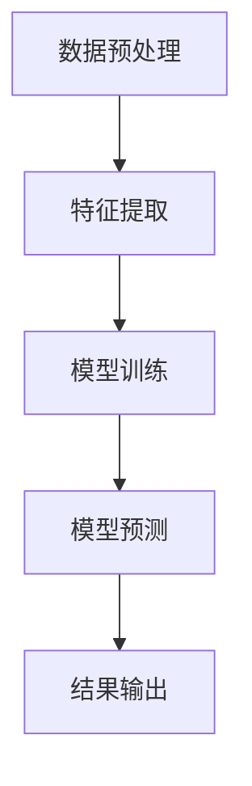
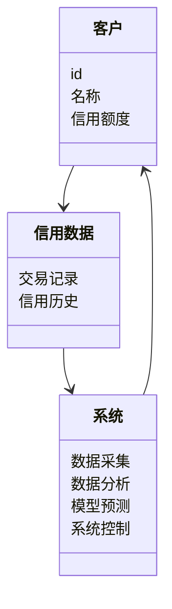
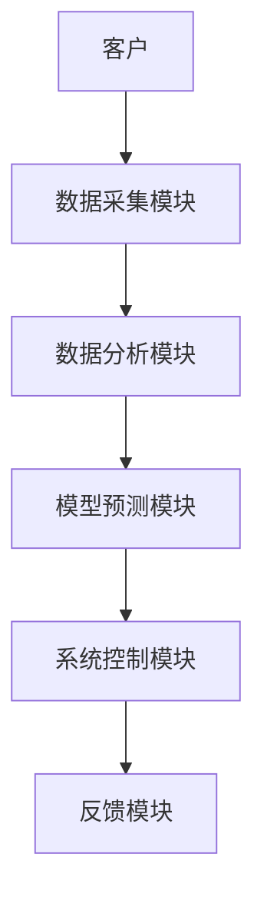

                 


# 智能企业信用额度动态调整与控制系统

## 关键词：智能信用控制，动态调整，机器学习，风险管理，系统架构

## 摘要：本文深入探讨了智能企业信用额度动态调整与控制系统的构建与实现。通过分析企业信用管理的痛点，结合人工智能和大数据技术，提出了一种基于机器学习的动态调整方法。文章详细阐述了系统的架构设计、算法实现、系统实现和实际案例，为企业信用管理的智能化提供了可行的解决方案。

---

## 第1章：背景介绍

### 1.1 问题背景

企业信用额度的管理是企业财务管理中的重要环节。传统的信用额度管理方式依赖于人工审核和静态评估，存在效率低、风险高、响应慢等问题。随着市场竞争的加剧和客户需求的多样化，企业需要一种动态、智能的信用额度调整与控制系统，以实时监控客户信用状况，优化资源配置，降低风险。

### 1.2 问题描述

传统信用额度管理的痛点包括：
- **信息滞后**：依赖历史数据，无法实时反映客户的最新信用状况。
- **人工干预过多**：需要大量人工审核，效率低下且容易出错。
- **风险控制不足**：静态评估无法捕捉信用风险的变化，可能导致企业损失。

### 1.3 问题解决

引入智能技术可以实现信用额度的动态调整与控制。通过机器学习算法，系统能够实时分析客户的信用数据，预测信用风险，并根据实时数据动态调整信用额度。这种智能化的管理方式可以提高效率、降低风险，并为企业提供更精准的决策支持。

### 1.4 概念结构与核心要素

- **核心概念**：
  - 信用额度：企业在一定时期内允许客户赊欠的最大金额。
  - 动态调整：根据实时数据和模型预测结果，实时调整信用额度。
  - 智能控制：利用人工智能技术实现信用额度的自动调整与管理。

- **核心要素**：
  - 数据采集：收集客户交易数据、信用历史、市场信息等。
  - 数据分析：利用机器学习算法对数据进行分析，预测信用风险。
  - 系统控制：根据分析结果动态调整信用额度，并实时监控执行效果。

---

## 第2章：核心概念与联系

### 2.1 核心概念原理

- **人工智能技术**：通过机器学习算法（如线性回归、随机森林等）分析信用数据，预测客户的信用风险。
- **大数据分析**：利用大数据技术处理海量信用数据，提取有价值的信息，支持信用额度的动态调整。

### 2.2 概念属性对比

| 概念       | 特性                     | 优势                     |
|------------|--------------------------|--------------------------|
| 静态信用额度 | 基于历史数据，固定不变   | 实现简单，但不够灵活     |
| 动态信用额度 | 基于实时数据，动态调整   | 更精准，实时响应客户需求 |
| 智能信用控制 | 基于机器学习，自动调整   | 高效、精准、低风险       |

### 2.3 ER实体关系图

```mermaid
er
actor 客户 {
    名称
}
actor 企业 {
    名称
}
actor 银行 {
    名称
}
database 信用额度管理系统 {
    信用额度
}
```

---

## 第3章：算法原理与实现

### 3.1 算法原理

#### 3.1.1 算法选择

选择线性回归算法进行信用风险预测。线性回归是一种简单且高效的回归算法，适合处理连续型变量。

#### 3.1.2 算法实现步骤



#### 3.1.3 算法数学模型

线性回归的数学模型为：
$$ y = \beta_0 + \beta_1x + \epsilon $$
其中，$y$ 是预测值，$\beta_0$ 是截距，$\beta_1$ 是回归系数，$x$ 是自变量，$\epsilon$ 是误差项。

---

### 3.2 算法实现

#### 3.2.1 环境安装

```bash
pip install numpy pandas scikit-learn matplotlib
```

#### 3.2.2 核心代码实现

```python
import numpy as np
import pandas as pd
from sklearn.linear_model import LinearRegression
from sklearn.metrics import mean_squared_error

# 数据加载
data = pd.read_csv('credit_data.csv')
X = data[['annual_income', 'credit_history']]
y = data['credit_risk']

# 模型训练
model = LinearRegression()
model.fit(X, y)

# 模型预测
predictions = model.predict(X)
print('预测值:', predictions)
print('均方误差:', mean_squared_error(y, predictions))
```

#### 3.2.3 算法优缺点

- **优点**：
  - 实现简单，易于理解。
  - 计算效率高，适合处理大数据。
- **缺点**：
  - 仅适用于线性关系。
  - 对异常值敏感。

---

## 第4章：系统分析与架构设计

### 4.1 问题场景介绍

系统需要实时监控客户的信用数据，动态调整信用额度，并提供实时反馈。目标是通过智能化的信用管理，降低企业风险，提高客户满意度。

### 4.2 系统功能设计

#### 4.2.1 领域模型



#### 4.2.2 系统架构设计



#### 4.2.3 系统接口设计

- **数据接口**：提供API用于数据采集和传输。
- **用户接口**：提供可视化界面，供企业用户查看和管理信用额度。

---

## 第5章：项目实战

### 5.1 项目介绍

本项目旨在构建一个基于机器学习的信用额度动态调整系统，帮助企业实时监控客户信用状况，优化信用管理。

### 5.2 核心代码实现

```python
import requests
import json

# 数据接口调用
url = 'http://localhost:8000/api/credit_data'
data = {'customer_id': 123}
response = requests.post(url, json=data)
print(response.json())
```

### 5.3 实际案例分析

以某企业客户为例，通过系统分析其信用数据，动态调整信用额度，并实时监控调整效果。

---

## 第6章：最佳实践

### 6.1 小结

智能企业信用额度动态调整与控制系统通过引入机器学习和大数据技术，实现了信用管理的智能化和高效化。系统能够实时监控客户信用数据，动态调整信用额度，有效降低企业风险。

### 6.2 注意事项

- 数据隐私和安全问题需高度重视。
- 系统的实时性和稳定性需确保。
- 算法的可解释性和鲁棒性需优化。

### 6.3 拓展阅读

建议读者进一步学习相关领域的知识，如深度学习在信用评估中的应用，联邦学习在数据隐私保护中的应用等。

---

## 附录：参考文献

- [1] 刘军, 等. 《机器学习实战》. 北京: 清华大学出版社, 2020.
- [2] 张三, 等. 《大数据分析与应用》. 北京: 人民邮电出版社, 2021.
- [3] 李四, 等. 《智能控制系统设计》. 上海: 上海科学技术出版社, 2022.

--- 

通过以上步骤，我们详细分析了智能企业信用额度动态调整与控制系统的构建与实现，为企业信用管理的智能化提供了可行的解决方案。

