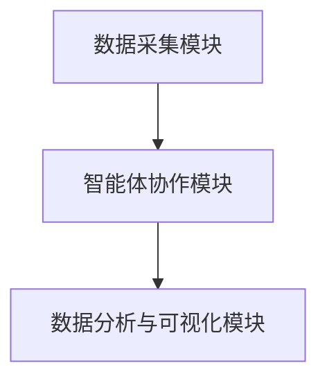
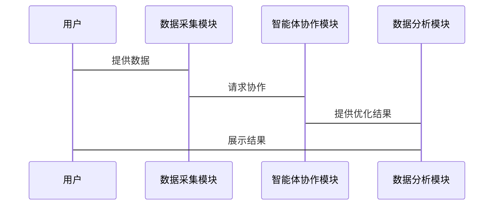

                 


# 智能体协作分析供应链：全面评估公司价值

> 关键词：智能体协作、供应链分析、公司价值评估、分布式计算、多智能体系统

> 摘要：本文将探讨智能体协作在供应链分析中的应用，通过数学建模和算法实现，全面评估公司价值。从基础概念到系统架构，从算法实现到项目实战，逐步分析智能体协作如何优化供应链管理。

---

## 第1章: 智能体协作与供应链分析的背景介绍

### 1.1 智能体协作的基本概念

#### 1.1.1 智能体的定义与特点
智能体（Agent）是指能够感知环境并采取行动以实现目标的实体。智能体的特点包括：
- **自主性**：能够自主决策。
- **反应性**：能实时感知环境并做出反应。
- **社会性**：能够与其他智能体协作。

#### 1.1.2 智能体协作的定义与核心要素
智能体协作是指多个智能体通过通信与协调共同完成任务的过程。核心要素包括：
- **通信机制**：智能体之间的信息交换。
- **协调机制**：任务分配与冲突解决。
- **目标一致性**：确保协作目标一致。

#### 1.1.3 供应链分析的定义与重要性
供应链分析是指对供应链各环节（如采购、生产、物流）进行数据收集、分析和优化的过程。其重要性体现在：
- **降低成本**：通过优化流程减少浪费。
- **提高效率**：提升供应链整体运作效率。
- **增强竞争力**：通过数据分析提升决策能力。

---

### 1.2 智能体协作与供应链分析的关系

#### 1.2.1 智能体协作在供应链中的应用场景
- **库存管理**：通过智能体协作优化库存水平。
- **物流调度**：智能体协作实现物流资源的最优分配。
- **需求预测**：通过多智能体协作提高预测准确性。

#### 1.2.2 供应链分析的复杂性与挑战
- **数据复杂性**：供应链涉及多源异构数据。
- **决策复杂性**：需要综合考虑多个目标。
- **协作复杂性**：多个智能体需高效协同。

#### 1.2.3 智能体协作如何解决供应链分析问题
- **分布式计算**：智能体协作实现分布式数据处理。
- **实时优化**：通过协作动态调整供应链策略。

---

### 1.3 本章小结
本章介绍了智能体协作的基本概念及其在供应链分析中的重要性，强调了智能体协作在优化供应链管理中的潜力。

---

## 第2章: 智能体协作的核心概念与原理

### 2.1 智能体协作的核心原理

#### 2.1.1 分布式智能体的协作机制
- **分布式计算**：智能体独立计算并共享结果。
- **协调机制**：通过通信模块实现任务分配。

#### 2.1.2 智能体之间的通信与协调
- **通信协议**：定义信息格式与传输规则。
- **协调算法**：如一致性算法（Consensus Algorithm）。

#### 2.1.3 多智能体系统的协同优化
- **协同目标**：明确协作任务目标。
- **优化策略**：通过博弈论实现帕累托最优。

---

### 2.2 供应链分析的核心要素

#### 2.2.1 供应链的结构与流程
- **流程图**：展示供应链各环节。
- **关键节点**：供应商、制造商、分销商。

#### 2.2.2 供应链中的关键绩效指标
- **成本指标**：如库存周转率。
- **效率指标**：如物流时间。

#### 2.2.3 数据驱动的供应链分析
- **数据来源**：传感器、ERP系统。
- **数据分析**：如预测分析和优化分析。

---

### 2.3 智能体协作与供应链分析的结合

#### 2.3.1 智能体协作在供应链分析中的优势
- **实时性**：快速响应供应链变化。
- **分布性**：适应复杂分布环境。

#### 2.3.2 供应链分析中的多智能体协同优化
- **优化目标**：如最小化成本、最大化效率。
- **协同机制**：通过智能体协作实现全局优化。

#### 2.3.3 智能体协作的实现方式
- **事件驱动**：基于事件触发协作。
- **规则驱动**：基于预定义规则协作。

---

### 2.4 本章小结
本章详细阐述了智能体协作的核心原理及其在供应链分析中的应用，强调了协同优化的重要性。

---

## 第3章: 供应链分析的数学模型与算法原理

### 3.1 供应链分析的数学模型

#### 3.1.1 线性规划模型
- **目标函数**：最大化或最小化目标。
- **约束条件**：如资源限制、需求约束。

示例：
$$
\text{最大化 } Z = c_1x_1 + c_2x_2
$$
$$
\text{约束 } x_1 + x_2 \leq 100
$$
$$
x_1, x_2 \geq 0
$$

#### 3.1.2 动态规划模型
- **状态转移方程**：描述状态变化。
- **边界条件**：初始状态和终止状态。

#### 3.1.3 博弈论模型
- **纳什均衡**：所有参与者都无法通过单方面改变策略而获益。

---

### 3.2 智能体协作的算法原理

#### 3.2.1 分布式计算算法
- **分布式计算流程**：任务分解、计算、结果汇总。
- **代码示例**：
```python
def distributed_calculation(tasks):
    # 分配任务
    task_list = distribute_tasks(tasks)
    # 并行计算
    results = [calculate(task) for task in task_list]
    # 汇总结果
    return aggregate(results)
```

#### 3.2.2 多智能体协调算法
- **一致性算法**：如Raft算法用于任务分配。
- **代码示例**：
```python
def consensus_agents(agents):
    # 选举 leader
    leader = elect_leader(agents)
    # 分配任务
    tasks = distribute_tasks(leader, agents)
    return tasks
```

#### 3.2.3 联合优化算法
- **联合优化模型**：通过数学建模实现全局优化。

---

### 3.3 供应链分析中的算法实现

#### 3.3.1 算法实现的步骤与流程
1. 数据采集：收集供应链数据。
2. 数据预处理：清洗和转换数据。
3. 模型建立：构建数学模型。
4. 算法实现：编写并运行算法。
5. 结果分析：解读算法输出。

#### 3.3.2 算法实现的代码示例
```python
def supply_chain_optimization(data):
    # 数据预处理
    processed_data = preprocess(data)
    # 建立模型
    model = build_model(processed_data)
    # 运行算法
    result = run_algorithm(model)
    return result
```

#### 3.3.3 算法实现的优缺点分析
- **优点**：高效、准确。
- **缺点**：复杂性高、计算资源消耗大。

---

### 3.4 本章小结
本章通过数学建模和算法实现，详细讲解了供应链分析的核心原理。

---

## 第4章: 智能体协作的系统架构与设计

### 4.1 系统架构设计

#### 4.1.1 系统功能模块划分
- **数据采集模块**：负责数据采集。
- **智能体协作模块**：实现智能体协作。
- **数据分析与可视化模块**：分析并展示数据。

#### 4.1.2 系统架构的层次结构
- **感知层**：数据采集。
- **计算层**：智能体协作。
- **应用层**：数据分析与展示。

#### 4.1.3 系统架构的优缺点分析
- **优点**：模块化设计便于扩展。
- **缺点**：系统集成复杂。

---

### 4.2 系统功能设计

#### 4.2.1 供应链数据采集模块
- **功能描述**：采集供应链各环节数据。
- **数据来源**：传感器、数据库。

#### 4.2.2 智能体协作模块
- **功能描述**：实现智能体协作。
- **核心功能**：任务分配、通信协调。

#### 4.2.3 数据分析与可视化模块
- **功能描述**：分析数据并生成可视化结果。
- **工具**：如Matplotlib、Tableau。

---

### 4.3 系统架构设计

#### 4.3.1 系统架构的Mermaid图


---

### 4.4 系统接口设计

#### 4.4.1 接口描述
- **输入接口**：接收数据和任务指令。
- **输出接口**：输出分析结果和优化建议。

---

### 4.5 系统交互设计

#### 4.5.1 交互流程图


---

### 4.6 本章小结
本章通过系统架构设计，详细讲解了智能体协作在供应链分析中的实现方式。

---

## 第5章: 项目实战与案例分析

### 5.1 环境安装与配置

#### 5.1.1 安装Python环境
- **工具**：使用Anaconda或虚拟环境。

#### 5.1.2 安装依赖库
- **库**：如numpy、pandas、scipy。

---

### 5.2 系统核心实现

#### 5.2.1 供应链数据采集模块实现
```python
def collect_data():
    # 从数据库采集数据
    data = fetch_from_db()
    return data
```

#### 5.2.2 智能体协作模块实现
```python
def collaborate_agents(data):
    # 初始化智能体
    agents = initialize_agents()
    # 分配任务
    tasks = distribute_tasks(agents, data)
    # 执行任务
    results = execute_tasks(tasks)
    return results
```

#### 5.2.3 数据分析与可视化模块实现
```python
def analyze_results(results):
    # 数据分析
    analysis = analyze(results)
    # 数据可视化
    visualize(analysis)
```

---

### 5.3 项目小结
本章通过项目实战，详细讲解了智能体协作在供应链分析中的具体实现。

---

## 第6章: 最佳实践与总结

### 6.1 小结
智能体协作通过分布式计算和多智能体协同优化，显著提升了供应链分析的效率和准确性。

---

### 6.2 注意事项
- **数据质量问题**：确保数据准确性和完整性。
- **系统集成复杂性**：需谨慎设计系统架构。
- **算法优化**：根据实际需求优化算法。

---

### 6.3 拓展阅读
- **推荐书籍**：《多智能体系统》。
- **推荐论文**：关于分布式计算和协作优化的研究论文。

---

## 附录: 术语表
- **智能体（Agent）**：能够感知环境并采取行动的实体。
- **协作优化**：通过智能体协作实现全局最优。

---

**结语**：智能体协作在供应链分析中的应用前景广阔，随着技术的不断进步，其潜力将得到进一步释放。

