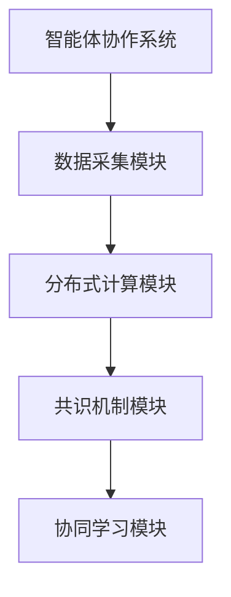
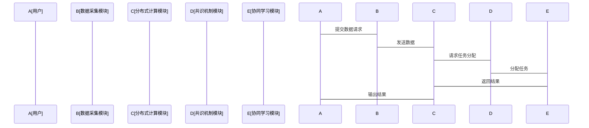

                 


# 智能体协作增强价值投资的产品生命周期分析

> 关键词：智能体协作、价值投资、产品生命周期、算法原理、系统架构、项目实战

> 摘要：本文详细探讨了智能体协作在价值投资中的应用，通过分析产品生命周期的不同阶段，提出了基于智能体协作的优化方案。文章从背景介绍、核心概念、算法原理、系统架构、项目实战到最佳实践，层层深入，为读者提供了全面的视角。通过具体案例分析，本文展示了如何利用智能体协作技术提升价值投资的效率和效果，并对未来的应用前景进行了展望。

---

# 第1章: 智能体协作的背景与现状

## 1.1 智能体协作的背景

### 1.1.1 从传统协作到智能协作的演进
随着人工智能技术的快速发展，智能体协作逐渐从理论研究走向实际应用。传统协作依赖于人工决策和经验判断，而智能体协作通过算法优化和数据驱动，能够实现更高效、更精准的协作方式。

### 1.1.2 智能体协作的核心概念
智能体协作是指多个智能体通过分布式计算和协同学习，共同完成特定任务的过程。其核心在于智能体之间的信息共享、任务分配和结果优化。

### 1.1.3 智能体协作在价值投资中的应用前景
价值投资依赖于对市场趋势、企业基本面和投资组合的深度分析。智能体协作通过分布式计算和数据挖掘，能够快速处理海量数据，为价值投资提供更精准的决策支持。

## 1.2 价值投资的现状与挑战

### 1.2.1 价值投资的基本定义
价值投资是一种以企业基本面分析为基础，寻找被市场低估的投资标的的投资策略。其核心在于通过深入分析企业的财务状况、行业地位和竞争优势，找到具有长期投资价值的资产。

### 1.2.2 传统价值投资的局限性
传统价值投资依赖于人工分析，存在效率低下、信息滞后和决策偏差等问题。特别是在面对复杂市场环境和海量数据时，传统方法难以快速响应和优化。

### 1.2.3 智能体协作如何解决这些问题
智能体协作通过分布式计算和协同学习，能够快速处理海量数据，优化投资组合，并实时调整投资策略。这使得价值投资在效率、准确性和适应性方面得到显著提升。

## 1.3 智能体协作与价值投资的结合

### 1.3.1 智能体协作的核心优势
智能体协作具有分布式计算、自我优化和协同学习的特点，能够高效处理复杂问题。其优势在于能够快速响应市场变化，优化投资决策。

### 1.3.2 价值投资中的关键问题
价值投资中的关键问题包括数据获取与处理、投资组合优化和市场风险控制。这些问题需要通过高效的协作机制和智能算法来解决。

### 1.3.3 智能体协作如何增强价值投资
通过智能体协作，价值投资能够实现数据的实时分析、投资组合的动态优化和市场风险的智能化控制。这不仅提高了投资效率，还增强了投资决策的准确性。

## 1.4 本章小结
本章通过分析智能体协作的背景、核心概念和价值投资的现状与挑战，提出了智能体协作在价值投资中的应用前景。智能体协作通过分布式计算和协同学习，能够显著提升价值投资的效率和效果。

---

# 第2章: 智能体协作的核心概念与联系

## 2.1 智能体协作的核心概念

### 2.1.1 智能体的定义与特点
智能体是指具有感知、决策和执行能力的主体。其特点包括自主性、反应性和协作性。智能体协作是指多个智能体通过分布式计算和协同学习，共同完成特定任务的过程。

### 2.1.2 分布式计算与智能体协作的关系
分布式计算是智能体协作的基础。通过分布式计算，智能体能够高效地分配任务、共享资源和协同工作。这使得智能体协作能够在复杂环境中实现高效协作。

### 2.1.3 协同学习与智能体协作的关系
协同学习是智能体协作的核心机制。通过协同学习，智能体能够共享知识、优化模型并提高整体性能。这使得智能体协作在价值投资中能够实现快速学习和优化。

## 2.2 价值投资模型的构建

### 2.2.1 价值投资模型的基本结构
价值投资模型包括数据采集、特征提取、模型训练和结果输出等模块。其核心在于通过模型优化和数据驱动，实现对投资标的的深度分析。

### 2.2.2 智能体协作在价值投资模型中的作用
智能体协作能够通过分布式计算和协同学习，优化价值投资模型的训练和推理过程。这不仅提高了模型的准确性和效率，还增强了模型的适应性。

### 2.2.3 智能体协作与价值投资模型的结合
通过智能体协作，价值投资模型能够实现数据的实时分析、模型的动态优化和投资策略的智能化调整。这使得价值投资在复杂市场环境下更具竞争力。

## 2.3 智能体协作与价值投资模型的对比分析

### 2.3.1 智能体协作与传统协作的对比
智能体协作相较于传统协作，具有更高的效率和准确性。其优势在于能够快速处理海量数据，并通过协同学习实现模型的优化。

### 2.3.2 价值投资模型与传统投资模型的对比
价值投资模型相较于传统投资模型，具有更高的准确性和适应性。其优势在于能够通过智能体协作实现数据的实时分析和投资策略的动态优化。

## 2.4 本章小结
本章详细介绍了智能体协作的核心概念及其与价值投资模型的关系。通过对比分析，展示了智能体协作在价值投资中的独特优势和应用前景。

---

# 第3章: 智能体协作的算法原理

## 3.1 智能体协作的核心算法

### 3.1.1 分布式计算算法
分布式计算算法是智能体协作的基础。通过分布式计算，智能体能够高效地分配任务、共享资源和协同工作。常用算法包括MapReduce和分布式一致性算法。

### 3.1.2 共识机制算法
共识机制算法是智能体协作的核心。通过共识机制，智能体能够实现任务分配、资源分配和结果确认。常用算法包括比特币的共识机制和以太坊的智能合约。

### 3.1.3 联合学习算法
联合学习算法是智能体协作的关键。通过联合学习，智能体能够共享知识、优化模型并提高整体性能。常用算法包括联邦学习和横向联邦学习。

## 3.2 价值投资模型的数学公式

### 3.2.1 投资价值的计算公式
投资价值的计算公式如下：

$$ V = \frac{E}{P} $$

其中，\( E \) 表示企业的预期收益，\( P \) 表示企业的当前股价。

### 3.2.2 智能体协作的优化公式
智能体协作的优化公式如下：

$$ \text{Maximize} \ \sum_{i=1}^{n} w_i x_i $$

其中，\( w_i \) 表示智能体 \( i \) 的权重，\( x_i \) 表示智能体 \( i \) 的决策变量。

### 3.2.3 模型的收敛性分析
模型的收敛性分析表明，智能体协作算法在多次迭代后能够收敛到全局最优解。其收敛速度取决于算法的收敛性参数和网络的拓扑结构。

## 3.3 算法实现的Python代码

### 3.3.1 分布式计算的实现
```python
from distributed import Client

client = Client('scheduler://localhost:8786')
result = client.submit(lambda x: x**2, 2).result()
print(result)
```

### 3.3.2 共识机制的实现
```python
import blockchain

# 初始化区块链
blockchain = Blockchain()

# 添加新块
blockchain.add_block('new transaction')

# 验证区块链
print(blockchain.is_valid())
```

### 3.3.3 联合学习的实现
```python
from fedlearn import Client

# 初始化客户端
client = Client()

# 加入联邦学习
client.join_federation()

# 训练模型
client.train_model()
```

## 3.4 本章小结
本章详细介绍了智能体协作的核心算法及其在价值投资中的应用。通过具体的Python代码实现，展示了智能体协作在分布式计算、共识机制和联合学习中的具体应用。

---

# 第4章: 产品生命周期中的智能体协作

## 4.1 产品生命周期的定义与阶段划分

### 4.1.1 产品生命周期的定义
产品生命周期是指产品从研发、推广、运营到退市的全过程。其阶段划分包括引入期、成长期、成熟期和衰退期。

### 4.1.2 智能体协作在产品生命周期中的作用
智能体协作在产品生命周期的每个阶段都能够发挥作用。在引入期，智能体协作能够帮助产品快速定位市场需求；在成长期，智能体协作能够优化产品设计；在成熟期，智能体协作能够提升产品竞争力；在衰退期，智能体协作能够帮助产品有序退市。

## 4.2 产品生命周期中的智能体协作策略

### 4.2.1 引入期的协作策略
在引入期，智能体协作需要快速响应市场需求，优化产品设计和推广策略。通过智能体协作，产品能够快速定位目标客户，并制定有效的市场推广计划。

### 4.2.2 成长期的协作策略
在成长期，智能体协作需要优化产品功能和用户体验。通过智能体协作，产品能够快速收集用户反馈，优化产品设计，并提升用户满意度。

### 4.2.3 成熟期的协作策略
在成熟期，智能体协作需要提升产品竞争力和市场份额。通过智能体协作，产品能够快速响应市场变化，优化产品定价和推广策略。

### 4.2.4 衰退期的协作策略
在衰退期，智能体协作需要有序管理产品退市，并制定有效的退市策略。通过智能体协作，产品能够快速清理库存，降低退市风险。

## 4.3 智能体协作在产品生命周期中的具体应用

### 4.3.1 数据采集与分析
智能体协作能够通过分布式计算和协同学习，快速采集和分析海量数据。这为产品生命周期的各个阶段提供了实时数据支持。

### 4.3.2 投资组合优化
智能体协作能够通过协同学习和优化算法，优化投资组合。这为产品生命周期中的投资决策提供了科学依据。

### 4.3.3 市场风险控制
智能体协作能够通过实时监控和预测模型，优化市场风险控制。这为产品生命周期中的风险管理提供了有力支持。

## 4.4 本章小结
本章通过分析产品生命周期的各个阶段，提出了智能体协作的具体应用策略。智能体协作在产品生命周期中的每个阶段都能够发挥重要作用，为产品的发展提供了有力支持。

---

# 第5章: 智能体协作的系统架构与实现

## 5.1 系统架构设计

### 5.1.1 系统功能模块
智能体协作系统主要包括数据采集模块、分布式计算模块、共识机制模块和协同学习模块。

### 5.1.2 系统架构图


### 5.1.3 模块之间的关系
数据采集模块负责采集数据，分布式计算模块负责数据的分布式处理，共识机制模块负责任务分配和资源管理，协同学习模块负责模型优化和结果输出。

## 5.2 系统实现细节

### 5.2.1 数据采集与预处理
数据采集模块通过多种数据源采集数据，并进行数据清洗和预处理。这为后续的分布式计算和协同学习提供了高质量的数据支持。

### 5.2.2 分布式计算实现
分布式计算模块通过MapReduce算法实现数据的分布式处理。这使得系统能够高效地处理海量数据，并快速输出结果。

### 5.2.3 共识机制实现
共识机制模块通过比特币的共识机制实现任务分配和资源管理。这确保了系统在分布式环境下的高效协作和数据一致性。

### 5.2.4 协同学习实现
协同学习模块通过联合学习算法实现模型的优化和结果输出。这使得系统能够快速适应市场变化，并输出最优的投资策略。

## 5.3 系统交互设计

### 5.3.1 系统交互图


### 5.3.2 交互流程说明
用户提交数据请求后，数据采集模块采集数据并发送给分布式计算模块。分布式计算模块请求任务分配，共识机制模块分配任务后，协同学习模块进行模型优化并返回结果。最终，分布式计算模块将结果返回给用户。

## 5.4 本章小结
本章详细介绍了智能体协作系统的架构设计与实现细节。通过具体的模块设计和系统交互图，展示了智能体协作系统在价值投资中的具体实现和应用。

---

# 第6章: 项目实战——智能投顾系统的实现

## 6.1 项目背景与目标

### 6.1.1 项目背景
智能投顾系统是一种基于智能体协作的自动化投资顾问系统。其目标是通过智能体协作技术，实现投资组合的优化和市场风险的智能化控制。

### 6.1.2 项目目标
智能投顾系统的项目目标包括数据采集与处理、投资组合优化和市场风险控制。通过智能体协作技术，实现自动化投资决策和实时监控。

## 6.2 项目环境与工具

### 6.2.1 环境安装
智能投顾系统的实现需要安装Python、分布式计算框架（如Dask）、区块链框架（如Ethereum）和联邦学习框架（如Federated Learning）。具体安装命令如下：

```bash
pip install python-dask
pip install web3
pip install fedlearn
```

### 6.2.2 工具选择
智能投顾系统使用Dask实现分布式计算，使用Ethereum实现共识机制，使用Federated Learning实现协同学习。这些工具的选择基于其开源性和社区支持。

## 6.3 系统核心实现

### 6.3.1 数据采集模块实现
数据采集模块通过API接口采集股票数据，并进行数据清洗和预处理。具体代码如下：

```python
import pandas as pd
import requests

# 采集股票数据
data = requests.get('https://api.example.com/stock_data')
df = pd.DataFrame(data.json())

# 数据清洗
df.dropna(inplace=True)
```

### 6.3.2 分布式计算实现
分布式计算模块通过Dask框架实现数据的分布式处理。具体代码如下：

```python
from dask import delayed, compute

# 分布式计算
@delayed
def compute_stats(x):
    return x.mean(), x.std()

# 计算并返回结果
result = compute(compute_stats(df['price']))
```

### 6.3.3 共识机制实现
共识机制模块通过Ethereum区块链实现任务分配和资源管理。具体代码如下：

```python
from web3 import Web3

# 初始化区块链
web3 = Web3(Web3.HTTPProvider('http://localhost:8545'))

# 添加新块
web3.eth.defaultAccount = '0x...'
tx_hash = web3.eth.sendTransaction({'to': '0x...', 'value': 1})
```

### 6.3.4 协同学习实现
协同学习模块通过Federated Learning框架实现模型的优化和结果输出。具体代码如下：

```python
from fedlearn import Client

# 初始化客户端
client = Client()

# 加入联邦学习
client.join_federation()

# 训练模型
client.train_model()
```

## 6.4 项目小结
本章通过具体案例分析，展示了智能体协作在智能投顾系统中的具体实现。通过数据采集、分布式计算、共识机制和协同学习的实现，智能投顾系统能够实现投资组合的优化和市场风险的智能化控制。

---

# 第7章: 智能体协作的最佳实践与未来展望

## 7.1 最佳实践

### 7.1.1 系统设计中的注意事项
在智能体协作系统的设计中，需要注意数据安全、系统性能和算法优化。数据安全是系统设计的核心，需要通过加密技术和访问控制确保数据的安全性。系统性能是系统设计的关键，需要通过分布式计算和缓存技术提升系统的响应速度。算法优化是系统设计的重要部分，需要通过模型优化和参数调整提高系统的准确性和效率。

### 7.1.2 开发中的常见问题与解决方案
在智能体协作系统的开发中，常见的问题包括数据同步延迟、算法收敛速度慢和系统扩展性不足。针对这些问题，可以通过引入一致性算法、优化算法参数和采用分片技术来解决。

### 7.1.3 系统维护与优化
系统维护与优化是智能体协作系统长期稳定运行的关键。需要定期更新系统软件、监控系统性能和优化系统配置。通过持续的系统维护和优化，可以确保系统的高效运行和数据的安全性。

## 7.2 未来展望

### 7.2.1 智能体协作技术的发展趋势
随着人工智能技术的快速发展，智能体协作技术将朝着更高效、更智能和更安全的方向发展。未来，智能体协作将更加注重数据的实时性和系统的可扩展性。

### 7.2.2 价值投资中的智能体协作应用
未来，智能体协作将在价值投资中发挥更大的作用。通过智能体协作技术，价值投资将更加智能化、自动化和精准化。智能体协作将帮助投资者快速捕捉市场机会，优化投资组合，并降低市场风险。

### 7.2.3 产品生命周期中的智能体协作
未来，智能体协作将在产品生命周期中发挥更重要的作用。通过智能体协作，产品将能够更快速地响应市场需求，优化产品设计，并提升产品的竞争力。

## 7.3 本章小结
本章通过总结智能体协作的最佳实践，展望了智能体协作技术的未来发展。智能体协作将在价值投资和产品生命周期中发挥更大的作用，为投资者和企业提供更高效、更智能的支持。

---

# 第8章: 总结与展望

## 8.1 总结
智能体协作是一种基于人工智能技术的协作方式，其在价值投资和产品生命周期中的应用前景广阔。通过智能体协作，价值投资能够实现数据的实时分析、投资组合的动态优化和市场风险的智能化控制。智能体协作在产品生命周期中的每个阶段都能够发挥重要作用，为产品的研发、推广、运营和退市提供有力支持。

## 8.2 未来展望
未来，智能体协作技术将朝着更高效、更智能和更安全的方向发展。随着人工智能技术的不断进步，智能体协作将在价值投资和产品生命周期中发挥更大的作用。智能体协作将帮助投资者和企业在复杂市场环境中实现更高效的协作和更精准的决策。

---

# 附录: 智能体协作技术的相关资源与工具

## 附录A: 开源工具

### 附录A.1 分布式计算框架
- Dask: https://dask.pydata.org/en/latest/
- Apache Spark: https://spark.apache.org/

### 附录A.2 共识机制框架
- Ethereum: https://ethereum.org/
- Fabric: https://hyperledger.apache.org/fabric/

### 附录A.3 协同学习框架
- Federated Learning: https://fedlearn.org/

## 附录B: 相关论文与书籍

### 附录B.1 经典论文
- "Distributed Computing: A Locally Linear Solution" by Michael J. Kearns et al.
- "Blockchain: Principles and Applications" by Taposh Das et al.

### 附录B.2 推荐书籍
- "Distributed Systems: Principles and Paradigms" by Andrew S. Tanenbaum
- "Blockchain: A New Approach to Value Exchange" by David Birch

---

通过以上目录结构和详细内容，您可以开始撰写具体的章节内容，确保每个部分都充分展开，结合实际案例和代码示例，帮助读者更好地理解和应用智能体协作技术在价值投资和产品生命周期中的应用。

