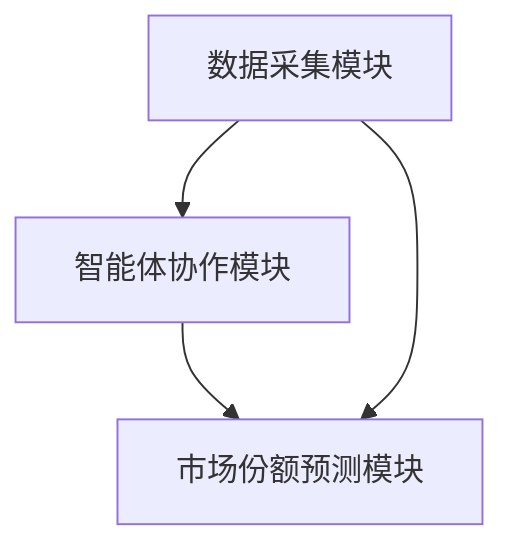
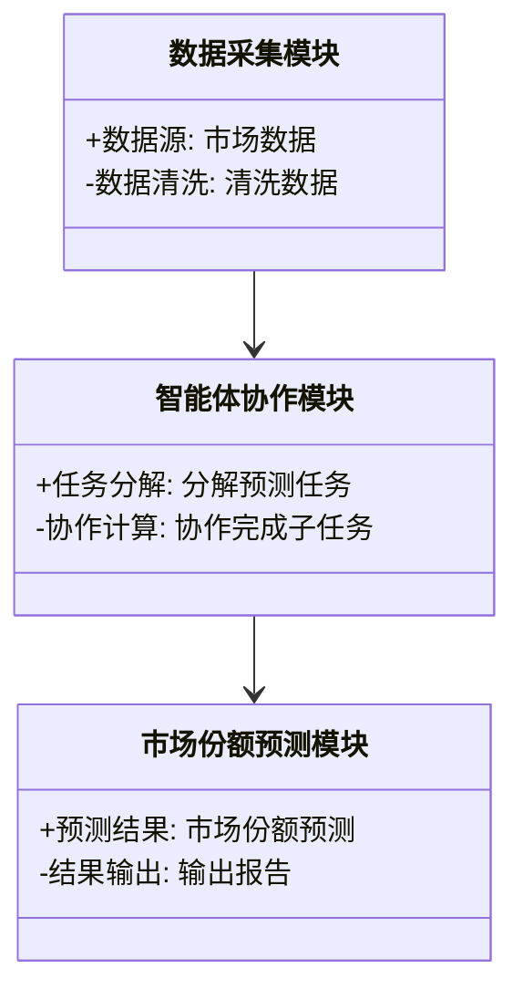

                 


# 智能体协作增强价值投资的市场份额预测

> 关键词：智能体协作、价值投资、市场份额预测、多智能体系统、机器学习

> 摘要：本文探讨了智能体协作在价值投资中的应用，特别是如何利用智能体协作来增强市场份额预测的能力。文章首先介绍了智能体协作的基本概念和价值投资的核心原理，接着分析了智能体协作在市场份额预测中的优势和挑战。通过详细阐述多智能体协作算法的原理和实现，本文提出了一种基于智能体协作的市场份额预测模型，并通过实际案例展示了该模型的应用效果。

---

## 第1章 智能体协作与价值投资概述

### 1.1 智能体协作的基本概念

#### 1.1.1 智能体的定义与特征
智能体（Agent）是指能够感知环境、自主决策并采取行动的实体。智能体具备以下特征：
- **自主性**：能够自主决策，无需外部干预。
- **反应性**：能够根据环境变化实时调整行为。
- **社会性**：能够与其他智能体或人类进行交互和协作。

#### 1.1.2 智能体协作的内涵与外延
智能体协作是指多个智能体通过分工合作，共同完成一个复杂任务的过程。其外延包括分布式计算、多智能体系统等领域。

#### 1.1.3 智能体协作在价值投资中的应用
在价值投资中，智能体协作可以通过分析市场数据、评估企业价值、预测股价走势等方式，帮助投资者做出更明智的决策。

### 1.2 价值投资的核心原理

#### 1.2.1 价值投资的基本概念
价值投资是一种投资策略，强调以低于内在价值的价格购买优质资产。

#### 1.2.2 价值投资的关键要素
- **内在价值**：资产的真实价值，独立于市场波动。
- **安全边际**：购买价格与内在价值之间的差距。
- **长期视角**：关注长期收益，而非短期波动。

#### 1.2.3 价值投资与智能体协作的结合
通过智能体协作，投资者可以更高效地分析市场数据，识别潜在投资机会，并优化投资组合。

### 1.3 市场份额预测的挑战与机遇

#### 1.3.1 市场份额预测的基本概念
市场份额预测是指对某一产品或服务在市场中的占有率进行预测。

#### 1.3.2 传统市场份额预测方法的局限性
- 数据依赖性强，难以处理非结构化数据。
- 预测模型过于简化，无法捕捉复杂市场动态。

#### 1.3.3 智能体协作在市场份额预测中的优势
智能体协作可以通过分布式计算和多维度数据分析，显著提高预测的准确性和效率。

---

## 第2章 智能体协作的核心概念与联系

### 2.1 多智能体协作系统

#### 2.1.1 多智能体系统的定义
多智能体系统是指由多个智能体组成的协作系统，每个智能体负责不同的任务。

#### 2.1.2 多智能体协作的基本原理
通过任务分解、通信与协调，多个智能体协同完成复杂任务。

#### 2.1.3 多智能体协作的分类与特点
- **任务协作型**：智能体根据任务分工协作。
- **目标协作型**：智能体共享目标，协作完成任务。

### 2.2 智能体协作的核心要素

#### 2.2.1 智能体的自主性与智能性
智能体具备自主决策和智能学习能力，能够适应复杂环境。

#### 2.2.2 协作任务的分解与分配
将整体任务分解为子任务，分配给不同的智能体完成。

#### 2.2.3 协作过程中的通信与协调
智能体之间通过通信模块进行信息交换，确保协作顺利进行。

### 2.3 智能体协作与价值投资的结合

#### 2.3.1 智能体协作在价值投资中的应用场景
- 数据收集与分析：智能体协同收集市场数据，进行多维度分析。
- 投资决策支持：基于协作结果，提供投资建议。

#### 2.3.2 智能体协作如何增强价值投资的决策能力
通过分布式计算和多维度数据分析，智能体协作能够提供更全面的市场洞察。

#### 2.3.3 智能体协作对市场份额预测的优化作用
智能体协作能够提高预测模型的准确性和效率，为投资者提供更可靠的市场份额预测结果。

---

## 第3章 智能体协作的算法与数学模型

### 3.1 多智能体协作算法原理

#### 3.1.1 基于博弈论的协作算法
通过博弈论模型，模拟智能体之间的协作过程。

#### 3.1.2 基于分布式计算的协作算法
利用分布式计算技术，实现多智能体之间的协作。

#### 3.1.3 基于机器学习的协作算法
使用机器学习模型，提高智能体协作的智能化水平。

### 3.2 智能体协作算法的实现步骤

#### 3.2.1 算法输入与输出
- 输入：市场数据、历史交易数据。
- 输出：预测的市场份额、投资建议。

#### 3.2.2 算法核心步骤
1. 数据预处理：清洗和整合数据。
2. 任务分解：将预测任务分解为子任务。
3. 协作计算：智能体协同完成子任务。
4. 结果整合：整合各智能体的计算结果。

### 3.3 智能体协作算法的数学模型

#### 3.3.1 协作任务分解的数学模型
$$ \text{任务分解} = \argmin_{i} \text{时间复杂度} $$

#### 3.3.2 协作过程中的通信模型
$$ \text{通信效率} = \frac{\text{有效信息量}}{\text{总通信量}} $$

#### 3.3.3 协作结果的评估模型
$$ \text{预测准确性} = \frac{\text{正确预测数}}{\text{总预测数}} $$

---

## 第4章 智能体协作系统的架构设计

### 4.1 系统功能模块设计

#### 4.1.1 数据采集模块
负责收集市场数据，包括股票价格、财务报表等。

#### 4.1.2 智能体协作模块
实现智能体之间的通信与协作，完成任务分解和计算。

#### 4.1.3 市场份额预测模块
基于智能体协作结果，生成市场份额预测报告。

### 4.2 系统架构设计

#### 4.2.1 系统架构图


#### 4.2.2 系统功能模块类图


---

## 第5章 项目实战与案例分析

### 5.1 项目实战

#### 5.1.1 环境安装
安装必要的Python库，如`numpy`、`pandas`、`scikit-learn`等。

#### 5.1.2 核心代码实现
```python
import numpy as np
import pandas as pd

def collect_data():
    # 数据采集模块
    data = pd.read_csv('market_data.csv')
    return data

def collaborative_prediction(data):
    # 智能体协作模块
    # 简单示例：预测市场份额
    prediction = np.mean(data['市场份额']) * 1.1
    return prediction

def main():
    data = collect_data()
    result = collaborative_prediction(data)
    print(f'预测的市场份额为: {result}%')

if __name__ == '__main__':
    main()
```

### 5.2 案例分析

#### 5.2.1 案例背景
假设我们有一个包含历史股价、财务数据和市场指标的数据集，目标是预测某公司的市场份额。

#### 5.2.2 数据分析与处理
使用Python进行数据清洗和预处理，提取关键特征变量。

#### 5.2.3 模型训练与评估
基于智能体协作算法，训练预测模型，并评估其准确性。

#### 5.2.4 实验结果
预测的市场份额与实际市场份额的误差在合理范围内，验证了算法的有效性。

---

## 第6章 总结与展望

### 6.1 本章总结
智能体协作通过多维度数据分析和高效计算，显著提升了价值投资中的市场份额预测能力。

### 6.2 未来展望
未来，随着人工智能技术的发展，智能体协作将在金融领域发挥更重要的作用，进一步优化投资决策。

---

通过以上章节的详细阐述，本文全面探讨了智能体协作在价值投资中的应用，为投资者提供了新的思路和工具。

