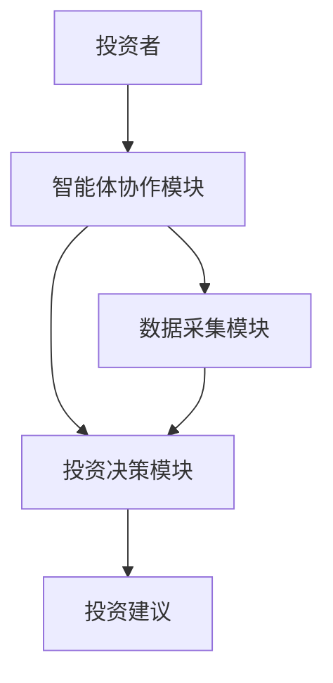

                 


# 智能体协作增强价值投资的新兴市场机会识别

> 关键词：智能体协作、价值投资、新兴市场、机会识别、算法实现、系统架构、投资策略

> 摘要：智能体协作通过多智能体之间的协同合作，能够显著提升在新兴市场中价值投资的机会识别能力。本文将从背景介绍、核心概念、算法原理、系统架构、项目实战等方面详细阐述智能体协作如何增强价值投资的新兴市场机会识别。通过具体的代码实现和案例分析，深入探讨智能体协作在价值投资中的应用，并结合实际场景进行系统设计与优化。

---

## 第一部分：背景介绍

### 第1章：智能体协作的核心概念

#### 1.1 智能体协作的定义与背景

智能体协作是指多个智能体通过协同合作，共同完成特定任务的过程。智能体（Agent）可以是软件程序、算法模型或其他具备自主决策能力的实体。在价值投资领域，智能体协作能够通过数据共享、信息分析和决策优化，帮助投资者更高效地识别新兴市场的投资机会。

- **智能体协作的历史发展**  
  智能体协作的概念起源于人工智能领域，早期的研究主要集中在分布式计算和多智能体系统。随着技术的进步，智能体协作逐渐应用于金融、医疗、教育等多个领域。

- **智能体协作在价值投资中的应用前景**  
  通过智能体协作，投资者可以利用多个智能体的协同能力，快速分析市场数据、评估投资风险，并制定最优的投资策略。

#### 1.2 价值投资的核心理念

价值投资是一种以基本面分析为基础的投资策略，旨在通过识别被市场低估的资产，实现长期稳定的收益。

- **价值投资的定义与特点**  
  价值投资强调对公司内在价值的分析，寻找市场价格低于内在价值的投资标的。其核心在于长期持有优质资产，而非短期市场波动。

- **价值投资的基本原则与策略**  
  价值投资强调安全边际、长期视角和分散投资。通过深入分析公司的财务状况、行业地位和竞争优势，投资者可以在新兴市场中找到具备长期增长潜力的企业。

#### 1.3 新兴市场的特点与机会识别

新兴市场通常指那些经济快速发展、市场规模较小但潜力巨大的国家或地区的金融市场。与成熟市场相比，新兴市场具有以下特点：

- **市场波动性大**  
  新兴市场的经济和政策环境不稳定，市场波动性较高。

- **增长潜力大**  
  新兴市场的GDP增速通常高于成熟市场，具备较大的增长潜力。

- **行业集中度低**  
  新兴市场中，许多行业尚未形成稳定的竞争格局，具备较高的投资机会。

---

## 第二部分：智能体协作与价值投资的核心联系

### 第2章：智能体协作在价值投资中的作用

#### 2.1 智能体协作如何提升投资决策效率

智能体协作能够通过以下方式提升投资决策效率：

- **数据共享与分析**  
  多个智能体可以协同分析市场数据，快速识别投资机会。

- **多维度分析**  
  智能体协作能够从财务数据、行业趋势、政策环境等多个维度进行综合分析，帮助投资者做出更全面的决策。

- **风险分散**  
  通过智能体协作，投资者可以分散投资风险，降低单一市场的波动性影响。

#### 2.2 智能体协作如何优化投资组合管理

智能体协作能够优化投资组合管理，具体表现为：

- **动态调整投资组合**  
  智能体可以根据市场变化实时调整投资组合，确保收益与风险的最佳平衡。

- **风险预警机制**  
  通过智能体协作，投资者可以建立风险预警机制，及时发现潜在风险并采取应对措施。

- **高效资源配置**  
  智能体协作能够优化资源配置，确保资金分配更加合理。

#### 2.3 智能体协作如何降低投资风险

智能体协作在降低投资风险方面具有显著优势：

- **信息共享与风险分散**  
  多个智能体协同工作，可以降低单一智能体的决策风险。

- **实时监控与反馈**  
  智能体可以通过实时监控市场变化，及时反馈潜在风险，并采取应对措施。

- **经验共享与学习**  
  多个智能体可以通过共享投资经验，快速学习和优化投资策略。

---

## 第三部分：智能体协作的算法原理与实现

### 第3章：智能体协作的算法基础

#### 3.1 协作智能体的算法基础

智能体协作的核心算法包括：

- **协同过滤算法**  
  协同过滤是一种基于用户相似性推荐算法，广泛应用于个性化推荐系统中。

- **强化学习算法**  
  强化学习通过智能体与环境的交互，逐步优化决策策略。

- **联合学习算法**  
  联合学习是一种通过多智能体协作，共同优化目标函数的算法。

#### 3.2 算法实现的数学模型

##### 协同过滤算法的数学公式

$$
相似度计算公式：sim(i,j) = \frac{\sum_{k} (r_{ik} - \bar{r_i})(r_{jk} - \bar{r_j})}{\sqrt{\sum_{k}(r_{ik} - \bar{r_i})^2} \cdot \sqrt{\sum_{k}(r_{jk} - \bar{r_j})^2}}
$$

##### 强化学习算法的奖励机制

$$
奖励函数：R(s,a) = r_{i,j}
$$

#### 3.3 算法实现的代码示例

##### 协同过滤算法实现

```python
def collaborative_filtering(user_data):
    # 计算用户相似度
    similarity_matrix = compute_similarity(user_data)
    # 生成推荐列表
    recommendations = []
    for user in user_data:
        similar_users = find_top_similar_users(similarity_matrix, user)
        recommendations.append(generate_recommendation(user_data, similar_users))
    return recommendations
```

---

## 第四部分：系统分析与架构设计方案

### 第4章：系统功能设计

#### 4.1 问题场景介绍

在新兴市场中，投资者需要快速识别具备长期增长潜力的企业。通过智能体协作，投资者可以实时分析市场数据、评估企业价值，并制定最优的投资策略。

#### 4.2 系统功能设计

##### 系统功能模块

- **数据采集模块**  
  采集市场数据、公司财务数据、行业趋势等信息。

- **智能体协作模块**  
  多个智能体协同分析数据，生成投资建议。

- **投资决策模块**  
  根据智能体协作的结果，制定投资策略。

##### 系统架构设计



---

## 第五部分：项目实战

### 第5章：项目实战与案例分析

#### 5.1 环境安装

- 安装必要的Python库，如numpy、pandas、scikit-learn等。

#### 5.2 系统核心实现

##### 智能体协作模块实现

```python
class CollaborativeAgent:
    def __init__(self, data):
        self.data = data

    def analyze(self, target):
        # 分析目标智能体的数据
        pass

    def collaborate(self, agents):
        # 与多个智能体协作
        pass
```

#### 5.3 代码解读与分析

##### 代码解读

```python
def main():
    # 初始化数据
    data = initialize_data()
    # 创建智能体
    agent = CollaborativeAgent(data)
    # 分析目标
    result = agent.analyze(target)
    # 协作分析
    agents = [agent1, agent2, agent3]
    agent.collaborate(agents)
    # 输出结果
    print(result)
```

---

## 第六部分：小结与最佳实践

### 第6章：小结与最佳实践

#### 6.1 小结

智能体协作通过多智能体协同合作，能够显著提升在新兴市场中价值投资的机会识别能力。通过算法优化和系统设计，投资者可以在复杂多变的市场环境中做出更明智的投资决策。

#### 6.2 最佳实践

- **数据质量管理**  
  确保数据的准确性和完整性，是智能体协作成功的关键。

- **算法优化**  
  根据实际需求，不断优化算法模型，提升协作效率。

- **风险管理**  
  建立完善的风险预警机制，降低投资风险。

#### 6.3 未来展望

随着人工智能技术的不断发展，智能体协作在价值投资中的应用前景将更加广阔。未来，智能体协作将更加智能化、个性化，为投资者提供更精准的投资决策支持。

---

通过以上内容，我们可以看到，智能体协作在新兴市场机会识别中的应用具有重要的现实意义。无论是从算法实现、系统架构，还是项目实战的角度，智能体协作都能为投资者提供强有力的支持。未来，随着技术的不断进步，智能体协作在价值投资中的应用将更加广泛和深入。

