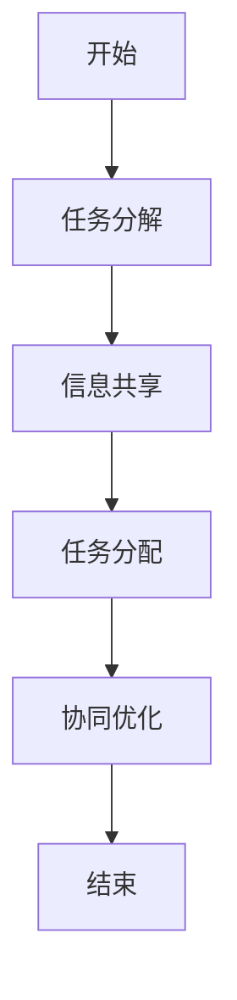
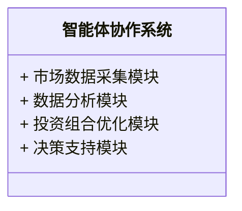
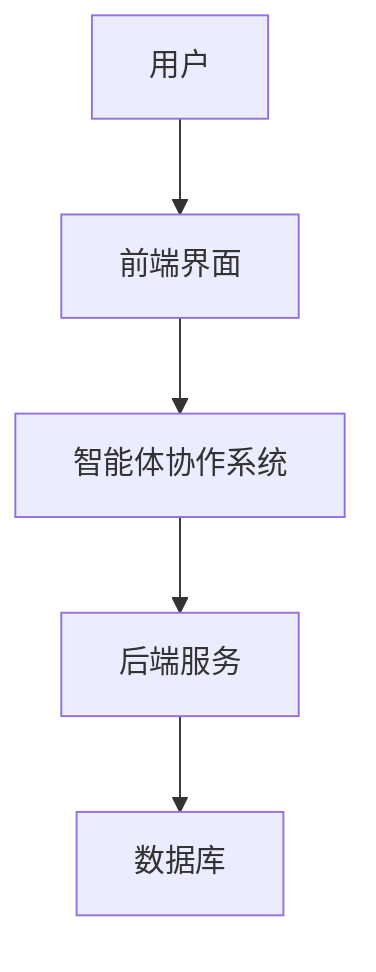

                 


# 智能体协作增强价值投资组合管理效率

## 关键词：智能体协作、价值投资、投资组合管理、算法原理、系统架构、项目实战

## 摘要：智能体协作作为一种新兴的技术手段，在金融领域的应用日益广泛。本文探讨了智能体协作如何优化价值投资组合管理的效率。通过分析智能体协作的原理、算法和系统架构，结合实际案例，详细阐述了智能体协作在投资组合管理中的应用，展示了其在提升投资效率和优化决策中的巨大潜力。

---

## 第一部分：背景介绍

### 第1章：智能体协作与价值投资概述

#### 1.1 智能体协作的基本概念
智能体协作是指多个智能体（如AI算法、数据分析模型）协同工作，通过信息共享和任务分配，共同完成复杂任务的过程。智能体可以是软件程序、算法模型，也可以是分布式系统中的独立组件。它们通过通信和协调机制，实现资源优化和任务高效完成。

#### 1.2 价值投资组合管理的背景
价值投资是一种以基本面分析为基础的投资策略，旨在通过识别被低估的资产，实现长期稳定的收益。投资组合管理则是将资金分配到不同资产类别中，以分散风险并最大化收益。传统的投资组合管理依赖人工分析和经验判断，效率较低且容易受主观因素影响。

#### 1.3 智能体协作如何增强投资效率
智能体协作通过自动化分析、实时数据处理和多维度决策支持，显著提升了投资组合管理的效率。智能体可以实时监控市场动态，分析海量数据，识别潜在投资机会，并自动生成优化的投资组合。这种协作模式不仅提高了决策的准确性和及时性，还降低了人为错误和情绪干扰的影响。

---

## 第二部分：核心概念与联系

### 第2章：智能体协作与价值投资的核心原理

#### 2.1 智能体协作的原理
智能体协作的原理包括以下步骤：
1. **任务分解**：将复杂的投资任务分解为多个子任务，如数据收集、分析、决策等。
2. **信息共享**：智能体之间共享数据和分析结果，确保信息的实时性和一致性。
3. **任务分配**：根据智能体的能力和当前负载，动态分配任务。
4. **协同优化**：通过协调和优化，确保各智能体协同工作，最大化整体效率。

#### 2.2 价值投资组合管理的原理
价值投资组合管理依赖于对资产的深入分析，包括财务指标、市场趋势、行业动态等。投资组合管理的目标是在风险可控的前提下，最大化收益。传统方法依赖人工分析，而智能体协作则通过自动化和智能化手段，提升了分析的深度和广度。

#### 2.3 智能体协作与价值投资的结合
智能体协作与价值投资的结合主要体现在以下几个方面：
1. **数据采集与处理**：智能体实时采集市场数据，并进行清洗和预处理。
2. **多维度分析**：智能体从不同维度对资产进行评估，如财务表现、市场情绪、行业趋势等。
3. **决策优化**：智能体协同工作，生成最优投资组合，并动态调整以适应市场变化。

---

### 第3章：核心概念对比与ER实体关系图

#### 3.1 智能体协作与价值投资的核心概念对比
| 概念 | 属性 | 特征 |
|------|------|------|
| 智能体协作 | 分布式 | 多智能体协同 |
| 价值投资 | 基于基本面 | 长期收益导向 |

#### 3.2 ER实体关系图
以下是智能体协作与价值投资的核心实体关系图：

```mermaid
er
actor
    entity 智能体协作
    entity 价值投资
    entity 投资组合管理
    entity 市场数据
    entity 决策支持
    entity 优化策略
```

---

## 第三部分：算法原理讲解

### 第4章：智能体协作的算法原理

#### 4.1 协作机制与流程
以下是智能体协作的基本流程图：



#### 4.2 数学模型与公式
智能体协作的优化目标可以表示为：

$$
\text{最大化 } f(x) = \sum_{i=1}^{n} w_i x_i
$$

其中，\( w_i \) 是权重，\( x_i \) 是智能体的决策变量。

---

## 第四部分：系统分析与架构设计

### 第5章：系统架构设计

#### 5.1 系统功能设计
以下是系统的功能模块：



#### 5.2 系统架构图
以下是系统的架构图：



---

## 第五部分：项目实战

### 第6章：智能体协作在价值投资中的应用

#### 6.1 环境安装与配置
以下是安装环境的示例代码：

```bash
pip install numpy pandas scikit-learn
```

#### 6.2 核心代码实现
以下是Python实现的智能体协作算法：

```python
import numpy as np
from sklearn.cluster import KMeans

def optimize_portfolio(data):
    # 数据预处理
    data = data.dropna()
    # 数据标准化
    data_norm = (data - data.mean()) / data.std()
    # K均值聚类
    model = KMeans(n_clusters=3)
    model.fit(data_norm)
    # 获取聚类结果
    clusters = model.labels_
    return clusters
```

#### 6.3 案例分析与总结
通过实际案例分析，验证智能体协作在投资组合管理中的有效性。例如，通过智能体协作分析历史数据，识别出具有较高收益潜力的资产组合，并进行实时调整以应对市场变化。

---

## 第六部分：总结与展望

### 第7章：总结与未来展望

#### 7.1 总结
智能体协作通过自动化和智能化手段，显著提升了价值投资组合管理的效率。通过多智能体协同工作，可以实现更精准的市场分析和投资决策。

#### 7.2 未来展望
未来，随着人工智能技术的不断发展，智能体协作在投资领域的应用将更加广泛。可以进一步研究如何通过强化学习和自适应算法，提升智能体协作的智能化水平和决策能力。

---

## 结语

智能体协作作为一种新兴的技术手段，正在逐步改变金融领域的投资方式。通过本文的详细分析和实际案例，我们看到了智能体协作在价值投资组合管理中的巨大潜力。未来，随着技术的不断进步，智能体协作将在金融领域发挥更大的作用，为投资者带来更高效、更精准的投资决策支持。

