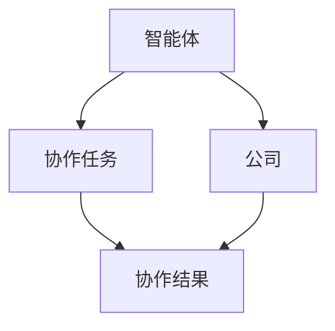
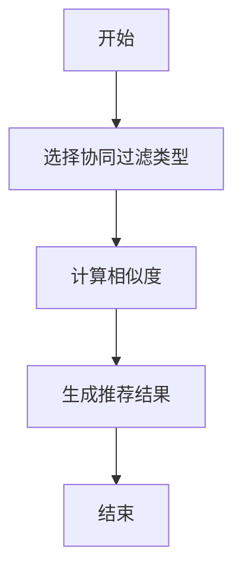
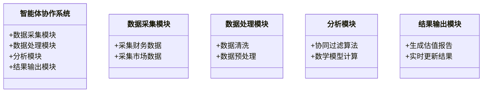
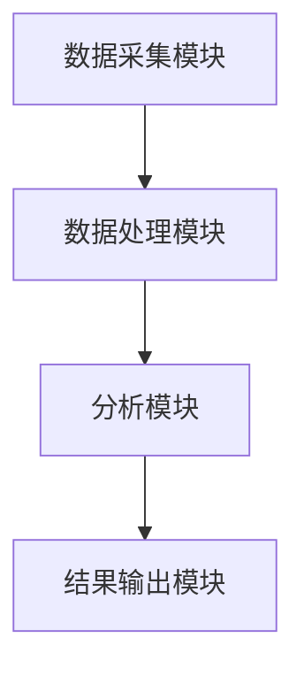

                 


# 智能体协作实现全面的公司估值

> 关键词：智能体协作、公司估值、协同过滤、多智能体系统、分布式计算

> 摘要：本文深入探讨了智能体协作在公司估值中的应用，通过系统分析和算法实现，展示了如何利用智能体协作技术提升公司估值的全面性和准确性。文章从背景介绍、核心概念、算法原理到系统设计和项目实战，层层递进，为读者提供了一个完整的解决方案。

---

# 第一部分: 智能体协作实现全面的公司估值基础

## 第1章: 背景介绍与问题背景

### 1.1 智能体协作的定义与背景

#### 1.1.1 问题背景
公司估值是企业管理和金融领域中的核心问题之一。传统的估值方法依赖于人工分析和经验判断，存在效率低、主观性强、数据覆盖不全等局限性。随着人工智能技术的发展，智能体协作（Multi-Agent Collaboration, MAC）技术逐渐被引入到公司估值领域，为解决这些问题提供了新的思路。

#### 1.1.2 问题描述
公司估值需要综合考虑财务数据、市场环境、行业趋势等多种因素。然而，传统方法往往难以实时处理海量数据，且难以动态调整估值模型。此外，不同领域的专家在估值过程中可能存在信息孤岛和协作效率低的问题。

#### 1.1.3 问题解决方法
通过引入智能体协作技术，可以将复杂的估值问题分解为多个智能体协同完成的任务。每个智能体负责特定领域的数据处理和分析，最终通过协作生成全面的估值结果。

#### 1.1.4 边界与外延
智能体协作在公司估值中的应用边界包括数据采集、分析、模型构建和结果输出。外延则涉及与外部数据源的交互、专家系统的集成以及实时估值的更新。

#### 1.1.5 核心概念结构与组成
公司估值的智能体协作系统由以下几个核心模块组成：
- 数据采集模块：负责收集公司财务数据、市场数据等。
- 数据处理模块：对数据进行清洗和预处理。
- 分析模块：利用智能体协作技术进行多维度分析。
- 结果输出模块：生成最终的估值报告。

---

### 1.2 公司估值的基本概念

#### 1.2.1 公司估值的定义
公司估值是指通过对公司财务状况、市场表现、行业地位等多方面因素的综合分析，确定公司价值的过程。

#### 1.2.2 公司估值的核心要素
- 财务数据：收入、利润、资产负债等。
- 市场数据：行业趋势、竞争环境、宏观经济指标。
- 公司战略：未来发展规划、投资方向等。

#### 1.2.3 传统公司估值方法的局限性
传统方法通常基于静态数据，难以实时更新，且依赖人工判断，存在主观性和片面性。

#### 1.2.4 智能体协作在公司估值中的优势
智能体协作能够通过分布式计算和协同学习，实时整合多源数据，提高估值的全面性和准确性。

---

## 第2章: 智能体协作的核心概念与联系

### 2.1 智能体的基本概念

#### 2.1.1 智能体的定义
智能体（Agent）是指能够感知环境、做出决策并采取行动的实体。在公司估值中，智能体可以是专门负责数据采集、分析或优化的模块。

#### 2.1.2 智能体的分类
- **反应式智能体**：基于当前环境信息做出决策。
- **认知式智能体**：具有推理和规划能力。
- **协作式智能体**：专门用于协同完成任务。

#### 2.1.3 智能体的核心属性
- 感知能力：获取环境信息。
- 决策能力：基于信息做出决策。
- 行动能力：执行决策。

---

### 2.2 智能体协作的原理

#### 2.2.1 协作的基本原理
智能体协作通过分布式计算和任务分配，将复杂问题分解为多个子任务，由多个智能体协同完成。

#### 2.2.2 协作机制的分类
- **基于规则的协作**：通过预定义规则进行协作。
- **基于目标的协作**：根据目标动态调整协作策略。
- **基于学习的协作**：通过机器学习优化协作过程。

#### 2.2.3 协作过程中的信息传递
智能体之间通过消息传递进行信息交流，确保协作过程的高效性和准确性。

---

### 2.3 智能体协作与公司估值的关系

#### 2.3.1 协作在公司估值中的作用
智能体协作能够整合多源数据，提高估值的全面性和准确性。

#### 2.3.2 协作对估值结果的影响
通过智能体协作，可以实时更新估值结果，适应市场变化。

#### 2.3.3 协作与传统估值方法的对比
智能体协作具有更高的效率和准确性，能够处理更复杂的数据。

---

### 2.4 智能体协作的ER实体关系图



---

### 2.5 本章小结

---

# 第3章: 智能体协作的算法原理

## 3.1 协同过滤算法

### 3.1.1 协同过滤的基本原理
协同过滤是一种基于用户或物品相似性推荐相关结果的技术。

### 3.1.2 基于用户的协同过滤
通过计算用户之间的相似性，推荐与之相似的用户的偏好。

### 3.1.3 基于物品的协同过滤
通过计算物品之间的相似性，推荐与之相似的物品。

### 3.1.4 混合协同过滤
结合基于用户的协同过滤和基于物品的协同过滤。

---

## 3.2 协同过滤的数学模型

### 3.2.1 相似度计算公式
$$sim(i,j) = \frac{\sum_{k} (r_{ik} - \bar{r_i})(r_{jk} - \bar{r_j})}{\sqrt{\sum_{k} (r_{ik} - \bar{r_i})^2} \cdot \sqrt{\sum_{k} (r_{jk} - \bar{r_j})^2}}$$

### 3.2.2 预测评分公式
$$\hat{r}_{ij} = \bar{r_i} + \sum_{k} w_{ikj} (r_{kj} - \bar{r_k})$$

---

## 3.3 协同过滤的算法流程图



---

## 3.4 协同过滤的Python实现

```python
import numpy as np

def compute_cosine_similarity(matrix):
    # 计算余弦相似度
    n_rows, n_cols = matrix.shape
    similarity = np.zeros((n_rows, n_rows))
    for i in range(n_rows):
        for j in range(n_rows):
            if i != j:
                dot_product = np.dot(matrix[i], matrix[j])
                norm_i = np.linalg.norm(matrix[i])
                norm_j = np.linalg.norm(matrix[j])
                similarity[i, j] = dot_product / (norm_i * norm_j)
    return similarity

# 示例数据
data = np.array([[1, 2, 3], [4, 5, 6], [7, 8, 9]])
similarity = compute_cosine_similarity(data)
print(similarity)
```

---

## 3.5 本章小结

---

# 第4章: 智能体协作的系统分析与架构设计

## 4.1 问题场景介绍

---

## 4.2 项目介绍

---

## 4.3 系统功能设计

### 4.3.1 领域模型类图



---

## 4.4 系统架构设计

### 4.4.1 模块划分与功能描述

---

### 4.4.2 系统架构图



---

## 4.5 系统接口设计

---

## 4.6 系统交互设计

---

## 4.7 本章小结

---

# 第5章: 智能体协作的项目实战

## 5.1 环境安装与配置

---

## 5.2 系统核心实现

### 5.2.1 数据采集模块实现

```python
import requests
import json

def fetch_financial_data(company):
    url = f"https://api.example.com/financial_data?company={company}"
    response = requests.get(url)
    return json.loads(response.text)
```

### 5.2.2 数据处理模块实现

```python
def preprocess_data(data):
    # 数据清洗和预处理
    pass
```

### 5.2.3 分析模块实现

```python
def collaborative_filtering(matrix):
    # 协同过滤算法实现
    pass
```

### 5.2.4 结果输出模块实现

```python
def generate_report(results):
    # 生成估值报告
    pass
```

---

## 5.3 案例分析与结果解读

---

## 5.4 本章小结

---

# 第6章: 智能体协作的最佳实践与总结

## 6.1 最佳实践 tips

---

## 6.2 小结与展望

---

## 6.3 注意事项与风险提示

---

## 6.4 拓展阅读与学习资源

---

# 第7章: 附录与索引

---

# 参考文献

---

通过以上目录结构和内容安排，我们可以系统地探讨智能体协作在公司估值中的应用，从理论到实践，逐步深入，为读者提供一个完整的解决方案。

