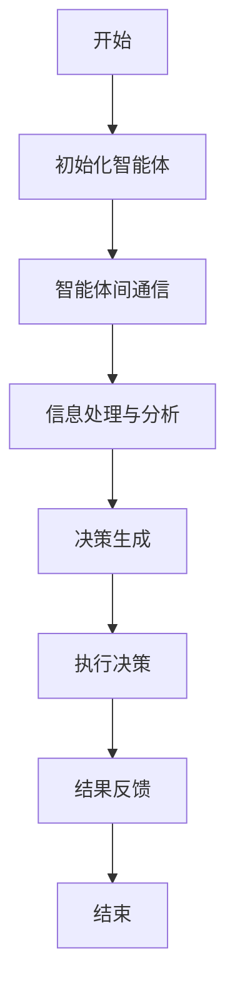
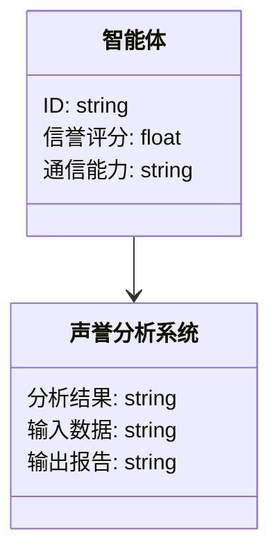
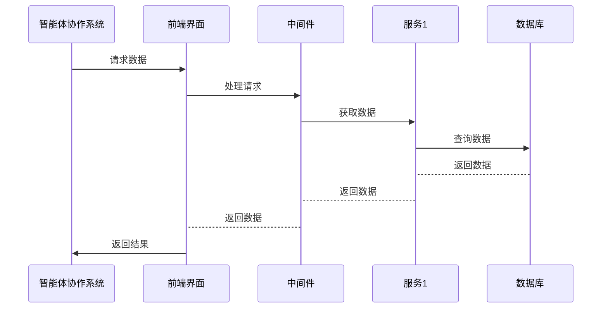

                 


好的，我明白您的需求。我将按照您的要求，详细构建这本书的目录大纲。

# 目录大纲

## 第一部分：智能体协作与公司声誉分析概述

### 第1章：智能体协作与公司声誉分析的背景介绍

#### 1.1 问题背景与描述
- 当前企业声誉管理的挑战
- 智能体技术在声誉分析中的应用潜力
- 企业声誉分析的复杂性与现有解决方案的局限性

#### 1.2 问题解决与边界
- 智能体协作如何解决声誉分析问题
- 智能体协作的边界与适用场景
- 智能体协作与传统声誉分析方法的对比

#### 1.3 智能体协作的核心概念
- 智能体协作的基本概念
- 公司声誉分析的核心要素
- 智能体协作与声誉分析的结合模型

## 第二部分：智能体协作的核心概念与联系

### 第2章：智能体协作的原理与机制

#### 2.1 智能体协作的基本原理
- 智能体的定义与特征
- 智能体协作的基本原理
- 智能体协作的分类与应用场景

#### 2.2 智能体协作的核心机制
- 通信机制
- 协作机制
- 决策机制

#### 2.3 智能体协作的属性特征对比表
| 属性 | 特征1 | 特征2 | 特征3 |
|------|-------|-------|-------|
| 通信方式 | 直接通信 | 间接通信 | 混合通信 |
| 协作目标 | 任务完成 | 资源共享 | 信息同步 |
| 决策方式 | 分布式决策 | 中央式决策 | 混合式决策 |

#### 2.4 智能体协作的ER实体关系图
```mermaid
erDiagram
    actor 智能体协作系统 {
        role 智能体1
        role 智能体2
        role 智能体3
    }
    智能体协作系统 --> 信息共享层
    信息共享层 --> 决策层
    决策层 --> 执行层
```

## 第三部分：公司声誉分析的智能体协作算法原理

### 第3章：基于智能体协作的声誉分析算法

#### 3.1 算法原理概述
- 算法的基本思想
- 算法的核心步骤
- 算法的输入输出

#### 3.2 算法流程图


#### 3.3 算法的数学模型与公式
- 声誉评分模型：
  $$ R_i = \sum_{j=1}^{n} w_{ij} \cdot S_j $$
  其中，\( R_i \) 是第 \( i \) 个智能体的声誉评分，\( w_{ij} \) 是第 \( j \) 个因素的权重，\( S_j \) 是第 \( j \) 个因素的评分。

## 第四部分：系统分析与架构设计

### 第4章：系统分析与架构设计

#### 4.1 项目介绍
- 项目背景
- 项目目标
- 项目范围

#### 4.2 系统功能设计
- 领域模型（用Mermaid类图表示）


#### 4.3 系统架构设计
- 系统架构图（用Mermaid架构图表示）
```mermaid
client
    前端界面
    中间件
        服务1
        服务2
        数据库
```

#### 4.4 系统接口设计
- 接口1：数据输入接口
- 接口2：数据处理接口
- 接口3：结果输出接口

#### 4.5 系统交互流程
- 交互流程图（用Mermaid序列图表示）


## 第五部分：项目实战

### 第5章：项目实战

#### 5.1 环境配置
- 安装Python
- 安装必要的库（如numpy、pandas、scikit-learn）

#### 5.2 核心代码实现
```python
def compute_reputation(intelligence_agents):
    reputation_scores = []
    for agent in intelligence_agents:
        score = 0.0
        for factor in agent.factors:
            score += agent.weights[factor] * agent.factor_scores[factor]
        reputation_scores.append(score)
    return reputation_scores

# 示例用法
class Agent:
    def __init__(self, id, factors, weights, factor_scores):
        self.id = id
        self.factors = factors
        self.weights = weights
        self.factor_scores = factor_scores

agents = [
    Agent(1, ['产品质量', '客户满意度', '创新能力'], {0.4: '高质量', 0.3: '满意', 0.3: '创新'},
          {0.4: 0.8, 0.3: 0.7, 0.3: 0.6}),
    # 其他智能体实例
]

result = compute_reputation(agents)
print(result)
```

#### 5.3 代码解读与分析
- 函数compute_reputation的作用
- Agent类的定义
- 示例用法的详细分析

#### 5.4 案例分析
- 案例背景
- 数据准备
- 算法实现
- 结果分析

## 第六部分：总结与展望

### 第6章：总结与展望

#### 6.1 本章小结
- 回顾核心内容
- 强调智能体协作在公司声誉分析中的重要性

#### 6.2 最佳实践 Tips
- 关键点总结
- 注意事项
- 拓展阅读建议

#### 6.3 未来展望
- 智能体协作技术的发展趋势
- 公司声誉分析的未来方向
- 可能的应用场景

---

### 关键词：
- 智能体协作
- 公司声誉分析
- 多智能体系统
- 分布式计算
- 企业声誉管理

### 摘要：
《智能体协作实现全面的公司声誉分析》一书系统地探讨了如何利用智能体协作技术来实现对公司声誉的全面分析。通过智能体协作机制，企业能够更高效、更准确地收集、处理和分析声誉相关数据，从而做出更明智的决策。本书详细介绍了智能体协作的核心概念、算法原理、系统架构设计以及实际项目实现，为读者提供了一套完整的解决方案，帮助企业在复杂多变的市场环境中维护和提升自身声誉。

---

希望这个目录大纲能满足您的需求。如果需要进一步调整或补充，请随时告知！

