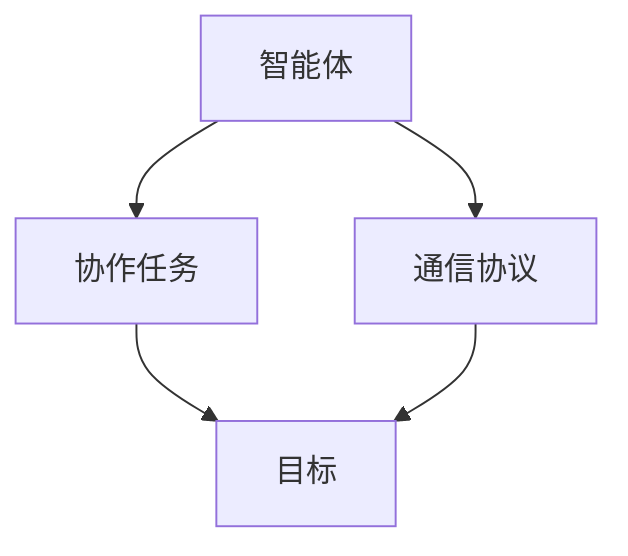
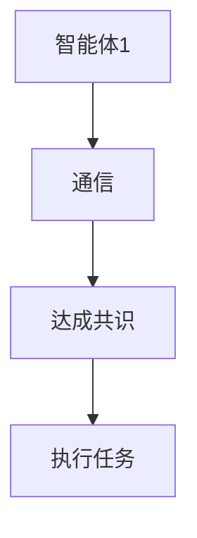
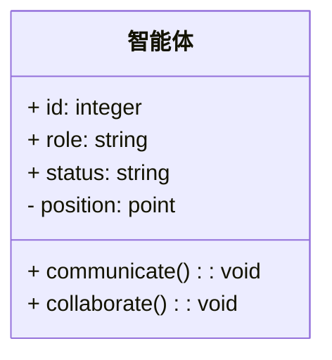
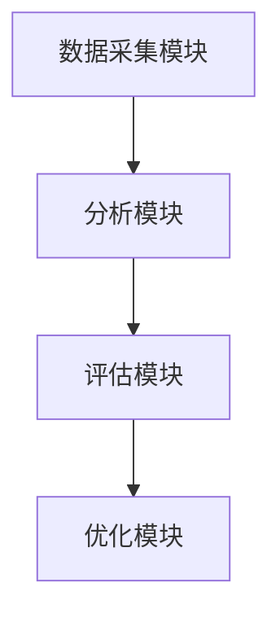
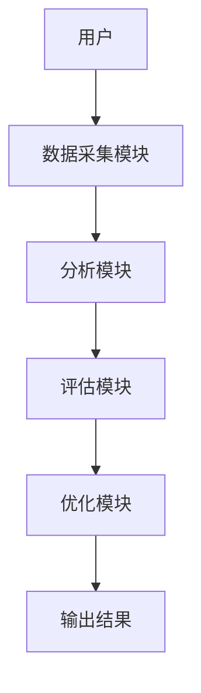

                 


# 智能体协作实现全面的公司社会责任分析

## 关键词：智能体协作，公司社会责任，多智能体系统，一致性协议，博弈论

## 摘要：本文深入探讨了智能体协作在公司社会责任分析中的应用，从基本概念、算法原理到系统架构设计，结合实际案例，全面解析智能体协作如何助力企业实现社会责任的智能化分析与管理。

---

# 第1章: 智能体协作与公司社会责任分析概述

## 1.1 智能体协作的定义与背景

### 1.1.1 智能体协作的定义

智能体协作是指多个智能体通过通信和协作完成共同目标的过程。智能体（Agent）是一种能够感知环境并采取行动以实现目标的实体，可以是软件程序、机器人或其他智能系统。

### 1.1.2 智能体协作的历史发展

智能体协作的概念起源于分布式人工智能领域，随着多智能体系统（MAS，Multi-Agent Systems）的发展，协作智能体在各个领域的应用日益广泛。近年来，随着人工智能技术的快速发展，智能体协作在公司社会责任分析中的应用逐渐成为研究热点。

### 1.1.3 公司社会责任分析的背景与意义

公司社会责任（Corporate Social Responsibility, CSR）是指企业在追求经济利益的同时，还需要关注环境、社会和治理（ESG）等方面的影响。随着全球可持续发展目标的推进，企业越来越重视社会责任的履行，而智能体协作技术为企业提供了高效、智能化的分析工具。

## 1.2 智能体协作的核心概念

### 1.2.1 智能体的定义与特征

智能体具有以下特征：
1. **自主性**：智能体能够自主决策和行动。
2. **反应性**：智能体能够感知环境并做出实时响应。
3. **协作性**：智能体能够与其他智能体或人类进行协作。
4. **社会性**：智能体能够理解和遵守社会规范。

### 1.2.2 智能体协作的基本原理

智能体协作的核心在于通过通信机制实现信息共享和任务分配。协作过程通常包括以下步骤：
1. **任务分解**：将整体目标分解为多个子任务。
2. **任务分配**：根据智能体的能力和环境信息分配任务。
3. **协作执行**：智能体协同完成分配的任务。
4. **反馈与调整**：根据执行结果反馈信息，调整协作策略。

### 1.2.3 公司社会责任分析的框架与流程

公司社会责任分析的框架通常包括数据收集、分析、评估和优化四个阶段：
1. **数据收集**：收集企业的环境、社会和治理数据。
2. **分析**：通过智能体协作技术对数据进行分析和建模。
3. **评估**：评估企业在社会责任方面的表现。
4. **优化**：提出改进建议，优化企业社会责任管理。

---

## 1.3 本章小结

本章从智能体协作的基本概念出发，介绍了智能体的定义与特征，并详细阐述了智能体协作的基本原理。同时，结合公司社会责任分析的背景与意义，提出了智能体协作在社会责任分析中的应用框架与流程。

---

# 第2章: 智能体协作的核心概念与联系

## 2.1 智能体协作的核心原理

### 2.1.1 多智能体系统的基本原理

多智能体系统（MAS）是由多个智能体组成的分布式系统，智能体之间通过通信和协作完成共同目标。多智能体系统的核心在于智能体之间的协作与协调。

### 2.1.2 智能体协作的通信机制

通信机制是智能体协作的基础，主要包括以下几种方式：
1. **直接通信**：智能体之间直接交换信息。
2. **间接通信**：通过中间媒介进行信息传递。
3. **发布-订阅模型**：智能体发布任务需求，其他智能体订阅并响应。

### 2.1.3 公司社会责任分析中的协作机制

在公司社会责任分析中，智能体协作可以通过以下机制实现：
1. **数据共享**：智能体之间共享环境、社会和治理数据。
2. **任务分配**：根据智能体的能力分配数据分析任务。
3. **结果整合**：整合各智能体的分析结果，形成综合评估报告。

---

## 2.2 智能体协作的核心概念对比

### 2.2.1 智能体与传统算法的对比

| 特性                | 智能体协作                | 传统算法                  |
|---------------------|--------------------------|---------------------------|
| 自主性              | 高                      | 低                        |
| 反应性              | 高                      | 低                        |
| 协作性              | 高                      | 低                        |
| 适应性              | 高                      | 中                        |

### 2.2.2 协作智能体与独立智能体的对比

| 特性                | 协作智能体                | 独立智能体                |
|---------------------|--------------------------|---------------------------|
| 协作性              | 高                      | 低                        |
| 信息共享            | 高                      | 低                        |
| 任务分配            | 协调完成                | 独立完成                 |

### 2.2.3 智能体协作的优缺点分析

**优点**：
- 提高任务执行效率。
- 增强系统的灵活性和适应性。
- 优化资源利用。

**缺点**：
- 协作过程可能增加复杂性。
- 需要高效的通信机制。

---

## 2.3 智能体协作的ER实体关系图



---

## 2.4 本章小结

本章深入分析了智能体协作的核心概念，通过对比智能体与传统算法、协作智能体与独立智能体的差异，进一步明确了智能体协作的优势与挑战。同时，通过ER实体关系图展示了智能体协作的基本架构。

---

# 第3章: 智能体协作算法原理

## 3.1 多智能体协作算法概述

### 3.1.1 多智能体协作的基本算法

多智能体协作算法主要包括以下几种：
1. **一致性协议**：通过一致性算法确保智能体之间达成共识。
2. **博弈论算法**：通过博弈论模型优化智能体的协作策略。
3. **分布式算法**：通过分布式计算实现智能体协作。

---

## 3.2 基于一致性协议的协作算法

### 3.2.1 一致性协议的数学模型

一致性协议的目标是确保所有智能体达成共识，其数学模型如下：

$$ \text{一致性协议的目标是确保所有智能体达成共识} $$

### 3.2.2 一致性协议的流程图



---

## 3.3 基于博弈论的协作算法

### 3.3.1 博弈论的基本概念

博弈论是一种分析决策冲突的数学理论，主要包括玩家、策略和收益等基本概念。

### 3.3.2 博弈论在协作中的应用

在协作智能体中，博弈论可以用于优化智能体的协作策略，确保各智能体的利益最大化。

### 3.3.3 博弈论协作算法的数学模型

收益函数：

$$ \text{收益函数：} R(i) = \sum_{j \neq i} \text{贡献度} $$

---

## 3.4 本章小结

本章详细介绍了多智能体协作算法的基本原理，重点分析了一致性协议和博弈论算法的应用，通过数学模型和流程图进一步阐述了协作算法的实现过程。

---

# 第4章: 智能体协作系统架构设计

## 4.1 系统功能设计

### 4.1.1 领域模型



### 4.1.2 系统功能模块

- **数据采集模块**：负责采集企业社会责任相关的数据。
- **分析模块**：对数据进行分析和建模。
- **评估模块**：评估企业在社会责任方面的表现。
- **优化模块**：提出改进建议。

---

## 4.2 系统架构设计

### 4.2.1 系统架构图



---

## 4.3 系统接口设计

### 4.3.1 接口定义

- **输入接口**：接收企业社会责任数据。
- **输出接口**：输出分析结果和优化建议。

---

## 4.4 系统交互设计

### 4.4.1 交互流程图



---

## 4.5 本章小结

本章从系统功能设计到架构设计，详细阐述了智能体协作系统的整体架构，并通过模块划分和流程图进一步明确了系统的实现过程。

---

# 第5章: 智能体协作项目实战

## 5.1 项目背景与需求分析

### 5.1.1 项目背景

某企业希望通过智能体协作技术优化其社会责任分析流程，提高分析效率和准确性。

### 5.1.2 项目需求

- 数据采集模块：实时采集企业社会责任数据。
- 分析模块：利用智能体协作技术对数据进行分析。
- 评估模块：评估企业在社会责任方面的表现。
- 优化模块：提出改进建议。

---

## 5.2 环境配置与安装

### 5.2.1 环境要求

- 操作系统：Linux/Windows/MacOS
- 开发工具：Python、Jupyter Notebook、Git
- 依赖库：numpy, pandas, matplotlib, scikit-learn

---

## 5.3 核心代码实现

### 5.3.1 智能体协作代码实现

```python
class Agent:
    def __init__(self, id):
        self.id = id
        self.role = "analyst"
        self.status = "idle"
    
    def communicate(self, message):
        print(f"Agent {self.id} received message: {message}")
    
    def collaborate(self, task):
        print(f"Agent {self.id} is working on task: {task}")
```

### 5.3.2 数据分析代码实现

```python
import pandas as pd

def analyze_data(data):
    # 数据分析逻辑
    pass

if __name__ == "__main__":
    data = pd.read_csv("社会责任数据.csv")
    agents = [Agent(i) for i in range(4)]
    for agent in agents:
        agent.collaborate("analyze data")
        agent.communicate("Start analysis")
```

---

## 5.4 项目实战案例分析

### 5.4.1 案例背景

某制造企业希望通过智能体协作技术分析其在环境、社会和治理方面的表现。

### 5.4.2 数据分析与评估

通过智能体协作技术，企业能够实时分析其社会责任数据，并生成详细的评估报告。

### 5.4.3 优化建议

根据评估结果，企业可以优化其社会责任管理策略，进一步提升社会责任表现。

---

## 5.5 本章小结

本章通过一个实际案例，详细展示了智能体协作技术在公司社会责任分析中的应用，从环境配置到核心代码实现，再到案例分析，全面解析了智能体协作项目的实施过程。

---

# 第6章: 智能体协作的最佳实践与小结

## 6.1 最佳实践

### 6.1.1 系统设计

- 确保系统的可扩展性和可维护性。
- 优化智能体之间的通信机制。

### 6.1.2 算法选择

- 根据具体需求选择合适的协作算法。
- 定期优化协作算法。

### 6.1.3 项目管理

- 明确项目目标和任务分解。
- 建立有效的沟通机制。

---

## 6.2 小结

智能体协作技术在公司社会责任分析中的应用为企业提供了高效、智能化的分析工具。通过合理的系统设计和算法选择，企业能够更好地履行社会责任，提升企业的可持续发展能力。

---

## 6.3 注意事项

- 确保数据的安全性和隐私性。
- 定期监控系统运行状态。
- 及时优化协作算法。

---

## 6.4 拓展阅读

- 《Multi-Agent Systems: Complexity Decomposition and Its Applications》
- 《Game Theory and Its Applications in Social Networks》

---

# 第7章: 附录

## 7.1 术语表

- **智能体（Agent）**：能够感知环境并采取行动以实现目标的实体。
- **一致性协议**：通过一致性算法确保智能体之间达成共识。
- **博弈论**：分析决策冲突的数学理论。

## 7.2 参考文献

1. 书籍：《Multi-Agent Systems: Complexity Decomposition and Its Applications》
2. 书籍：《Game Theory and Its Applications in Social Networks》
3. 论文：智能体协作在公司社会责任分析中的应用研究

---

# 结语

智能体协作技术在公司社会责任分析中的应用为企业提供了智能化、高效的分析工具。通过合理的系统设计和算法选择，企业能够更好地履行社会责任，提升企业的可持续发展能力。未来，随着人工智能技术的不断发展，智能体协作在公司社会责任分析中的应用将更加广泛和深入。

