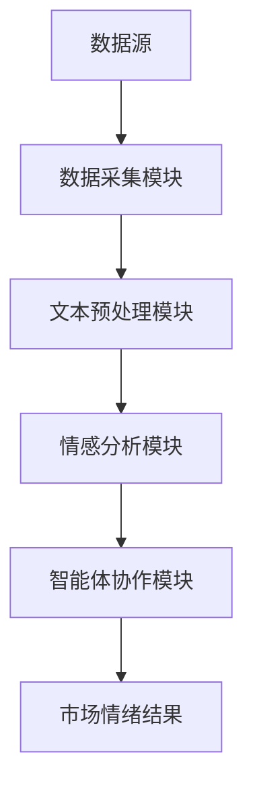

                 


```markdown
# 智能体协作实现全面的市场情绪分析

> 关键词：市场情绪分析、智能体协作、分布式系统、情感分析、大数据分析

> 摘要：本文详细探讨了智能体协作在市场情绪分析中的应用，通过分析市场情绪的核心算法、智能体协作机制，结合系统架构设计和项目实战，展示了如何利用分布式智能体实现全面的市场情绪分析。文章还提供了数学模型、系统流程图和代码实现，帮助读者深入理解并实际应用这些技术。

---

## 第一部分：智能体协作实现全面的市场情绪分析概述

### 第1章：市场情绪分析的背景与问题

#### 1.1 市场情绪分析的背景
市场情绪分析是指通过分析市场参与者的情绪（如投资者、交易员、媒体等）来预测市场走势的一种方法。情绪分析的核心在于捕捉市场参与者的情感变化，从而帮助投资者做出更明智的决策。

#### 1.2 智能体协作的基本概念
智能体（Agent）是一种能够感知环境并采取行动以实现目标的实体。智能体协作是指多个智能体通过合作完成共同目标的过程。在市场情绪分析中，智能体协作可以帮助我们从多个数据源收集信息，并通过协作来提高分析的准确性和全面性。

---

## 第二部分：核心概念与算法

### 第2章：市场情绪分析的核心算法

#### 2.1 文本预处理与特征提取
文本预处理是市场情绪分析的第一步，包括文本清洗、分词和特征选择。例如，我们可以使用自然语言处理技术（如分词工具）将文本分割成词语，并提取与市场情绪相关的关键词。

#### 2.2 情感分析算法
情感分析算法用于判断文本中包含的情感倾向（如正面、负面或中性）。常用算法包括基于规则的算法（如情感词典）、基于机器学习的算法（如支持向量机）和基于深度学习的算法（如LSTM）。

#### 2.3 智能体协作算法
智能体协作算法用于多个智能体之间的协作，以提高市场情绪分析的准确性和全面性。例如，分布式协作算法允许多个智能体在不同的数据源上进行分析，并将结果汇总以获得更全面的市场情绪。

---

## 第三部分：系统架构与设计

### 第3章：系统架构设计

#### 3.1 模块划分
市场情绪分析系统可以划分为以下几个模块：数据采集模块、文本预处理模块、情感分析模块和智能体协作模块。

#### 3.2 系统流程图
以下是市场情绪分析系统的流程图：



#### 3.3 实体关系图
以下是市场情绪分析系统的实体关系图：

```mermaid
er
actor 投资者
actor 交易员
actor 媒体
actor 市场情绪分析系统
```

---

## 第四部分：项目实战

### 第4章：项目实战

#### 4.1 环境安装
首先，我们需要安装必要的Python库，如`numpy`、`pandas`、`tensorflow`等。

#### 4.2 代码实现
以下是市场情绪分析系统的部分代码示例：

```python
import numpy as np
import pandas as pd
from tensorflow.keras import layers

# 数据预处理
data = pd.read_csv('market_comments.csv')
X = data['comment'].values
y = data['sentiment'].values

# 模型训练
model = tf.keras.Sequential()
model.add(layers.Embedding(input_dim=10000, output_dim=16))
model.add(layers.LSTM(64))
model.add(layers.Dense(1, activation='sigmoid'))
model.compile(optimizer='adam', loss='binary_crossentropy', metrics=['accuracy'])

model.fit(X, y, epochs=10, batch_size=32)
```

#### 4.3 案例分析
以下是市场情绪分析系统的实际案例分析：

```plaintext
案例：某公司发布了季度财报，市场评论中出现了大量正面情绪，模型预测市场将上涨。
```

---

## 第五部分：总结与展望

### 第5章：总结与展望

#### 5.1 总结
本文详细探讨了智能体协作在市场情绪分析中的应用，通过分析市场情绪的核心算法、智能体协作机制，结合系统架构设计和项目实战，展示了如何利用分布式智能体实现全面的市场情绪分析。

#### 5.2 注意事项
在实际应用中，需要注意数据的质量和智能体的协作效率。同时，还需要关注隐私保护和数据安全问题。

#### 5.3 未来展望
未来的研究方向包括：提高智能体协作的效率、探索新的市场情绪分析算法、以及将智能体协作应用于更多领域。

---

### 参考文献
1. 智能体协作的相关研究
2. 市场情绪分析的经典论文
3. 相关技术的最新进展

---

### 最佳实践 Tips

1. 在进行市场情绪分析时，建议结合多种数据源（如社交媒体、新闻媒体、交易数据等）进行分析，以提高分析的全面性。
2. 使用分布式系统可以提高智能体协作的效率，同时需要注意系统的扩展性和容错性。
3. 在实际应用中，建议先进行小规模测试，再逐步扩大应用范围，以确保系统的稳定性和准确性。

---

### 作者简介

作者：[您的姓名]
简介：[您的简介，包括您的研究领域、著作和相关经验]

---

### 拓展阅读

1. 《分布式系统与智能体协作》
2. 《深度学习在自然语言处理中的应用》
3. 《市场情绪分析的理论与实践》

---

感谢您的阅读！希望本文对您理解智能体协作在市场情绪分析中的应用有所帮助！
```

