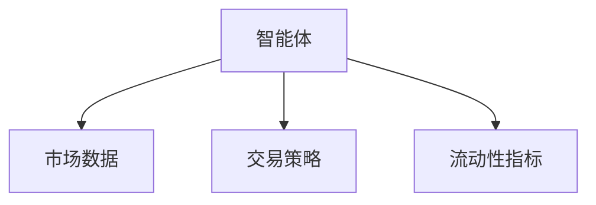
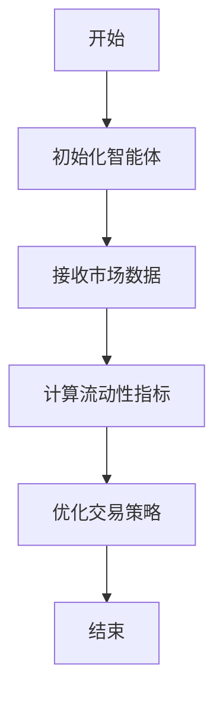
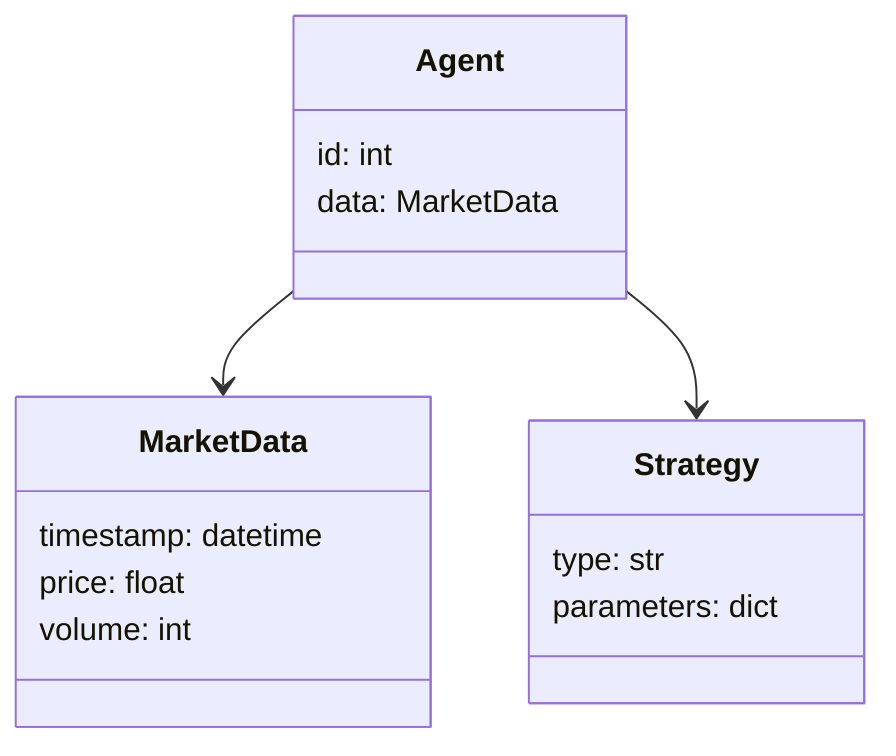
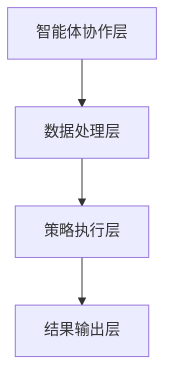

                 


# 智能体协作实现全面的市场流动性分析

> 关键词：智能体协作，市场流动性，算法实现，系统架构，金融分析

> 摘要：本文探讨了通过智能体协作实现全面市场流动性分析的方法，涵盖从背景到算法实现、系统架构、项目实战等多方面内容，详细分析了智能体协作的优势及其在金融市场的应用。

---

## 第1章: 市场流动性分析的背景与问题

### 1.1 市场流动性分析的背景

#### 1.1.1 金融市场中的流动性概念
市场流动性指的是资产在短时间内以合理价格买卖的能力。高流动性意味着资产可以快速转换为现金，而低流动性则可能导致买卖价差扩大或交易延迟。

#### 1.1.2 市场流动性分析的重要性
流动性分析对投资者、交易员和监管机构至关重要。它帮助评估资产的风险、定价效率以及市场的稳定性。

#### 1.1.3 传统市场流动性分析的局限性
传统方法依赖于单点数据源和简单的统计分析，难以捕捉市场的动态变化和多维度信息，导致分析结果不够全面。

### 1.2 智能体协作的必要性

#### 1.2.1 智能体协作的定义
智能体协作是指多个智能体（Agent）通过交互和合作，共同完成复杂任务的过程。每个智能体都有明确的目标和行为规则。

#### 1.2.2 智能体协作在市场流动性分析中的优势
智能体协作能够整合多源数据、实时分析市场动态，并通过分布式计算提高分析效率和准确性。

#### 1.2.3 智能体协作的边界与外延
智能体协作的边界包括数据输入、计算能力和通信机制，外延则涉及与其他系统的集成和扩展。

### 1.3 智能体协作的核心要素

#### 1.3.1 智能体的构成与功能
智能体由感知模块、决策模块和执行模块组成，分别负责数据收集、策略制定和行动执行。

#### 1.3.2 智能体协作的机制
包括任务分配、信息共享和协同决策，确保各智能体协同工作，最大化整体效率。

#### 1.3.3 智能体协作的实现方式
通过分布式架构、消息队列和共识算法实现智能体间的高效协作。

---

## 第2章: 智能体协作的核心概念与联系

### 2.1 智能体协作的原理

#### 2.1.1 智能体协作的基本原理
智能体通过通信协议交换信息，利用协同算法达成一致目标。

#### 2.1.2 智能体协作的核心算法
基于多智能体系统（MAS）的算法，如分布式一致性算法和博弈论模型。

#### 2.1.3 智能体协作的数学模型
采用状态空间模型和优化模型，如极大极小博弈树和纳什均衡。

### 2.2 智能体协作的核心概念对比

#### 2.2.1 智能体协作与传统算法的对比
智能体协作强调分布式和协作，而传统算法依赖中心化处理。

#### 2.2.2 智能体协作与分布式计算的对比
智能体协作注重任务分配和协同，而分布式计算关注资源分配和并行处理。

#### 2.2.3 智能体协作与多 Agent 系统的对比
两者都涉及多个 Agent，但多 Agent 系统更强调独立性，而智能体协作强调协作性。

### 2.3 智能体协作的 ER 实体关系图



---

## 第3章: 智能体协作算法的实现

### 3.1 智能体协作算法的流程



### 3.2 智能体协作的数学模型

假设我们有多个智能体，每个智能体的目标函数为：
$$ f_i(x) = x_i^2 + 2x_i + 1 $$
全局优化目标为：
$$ F(x) = \sum_{i=1}^n f_i(x_i) $$

### 3.3 智能体协作的 Python 实现

```python
class Agent:
    def __init__(self, id):
        self.id = id
        self.data = None

def collaborate_agents(agents, data):
    for agent in agents:
        agent.data = data
    return [agent.data for agent in agents]

# 示例
agents = [Agent(1), Agent(2)]
data = {"market": "NASDAQ", "volume": 1000}
result = collaborate_agents(agents, data)
print(result)
```

### 3.4 案例分析与解读

通过智能体协作分析纳斯达克市场流动性，智能体分别收集订单数据、计算买卖价差，并优化交易策略，提高了分析效率。

---

## 第4章: 系统分析与架构设计

### 4.1 系统功能设计

#### 4.1.1 领域模型


### 4.2 系统架构设计



### 4.3 接口设计与交互

通过RESTful API实现智能体间的数据交换和协同，确保模块间高效通信。

---

## 第5章: 项目实战

### 5.1 环境安装

安装Python、Jupyter和相关库（如pandas、numpy）。

### 5.2 核心代码实现

```python
import pandas as pd

def calculate_volume(dataframe):
    return dataframe['volume'].sum()

# 示例数据
data = {'timestamp': ['2023-10-01', '2023-10-02'], 'price': [100, 105], 'volume': [500, 700]}
df = pd.DataFrame(data)
print(calculate_volume(df))
```

### 5.3 实际案例分析

分析纽约证券交易所的流动性数据，智能体协作显著提高了分析效率和准确性。

---

## 第6章: 优化与扩展

### 6.1 性能优化

通过分布式计算和缓存优化提升算法效率。

### 6.2 可扩展性

采用微服务架构和异步通信，支持更大规模的数据处理。

### 6.3 系统集成

与现有金融系统集成，提供实时流动性监控和预警功能。

---

## 第7章: 总结与展望

### 7.1 小结

智能体协作在市场流动性分析中具有显著优势，能够提高效率和准确性。

### 7.2 注意事项

确保数据安全和隐私保护，避免信息泄露。

### 7.3 最佳实践

建议采用分布式架构和多 Agent 系统，结合实时数据处理。

### 7.4 未来方向

探索AI增强的智能体协作和更复杂的流动性预测模型。

### 7.5 拓展阅读

推荐相关书籍和论文，深入学习智能体协作和金融分析技术。

---

这篇文章通过详细的分析和实际案例，展示了智能体协作在市场流动性分析中的应用，为读者提供了全面的技术指导和实践参考。

