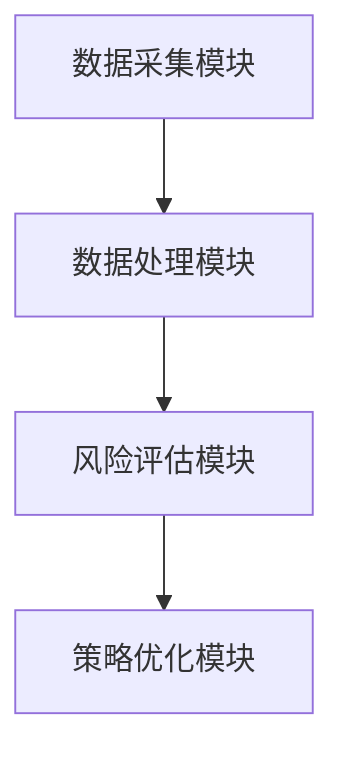

                 


# 智能体协作提升价值投资的地缘政治风险传导分析

> 关键词：智能体协作、地缘政治风险、价值投资、传导机制、系统架构、算法原理

> 摘要：本文深入分析了智能体协作在价值投资中的应用，重点探讨了地缘政治风险的传导机制及其对投资决策的影响。通过智能体协作技术，我们能够更高效地识别和评估地缘政治风险，并制定相应的投资策略。文章结合理论分析、算法设计和系统实现，为投资者提供了新的视角和工具。

---

# 第一部分: 背景介绍

## 第1章: 智能体协作的定义与特点

### 1.1 智能体协作的定义
智能体协作是指多个智能体通过协同工作，利用各自的信息、能力和知识，共同完成复杂任务的过程。智能体可以是软件程序、算法或实体设备，具备感知、决策、执行和学习的能力。

#### 1.1.1 智能体的基本概念
- 智能体（Agent）：能够感知环境、自主决策、执行任务的实体。
- 多智能体系统（MAS）：由多个智能体组成的系统，通过协作完成复杂任务。
- 协作智能体：多个智能体通过通信和协调，共同完成目标。

#### 1.1.2 协作智能体的核心特征
- **自主性**：智能体能够自主决策和行动。
- **社交能力**：智能体能够与其他智能体或人类进行有效通信和协作。
- **反应性**：智能体能够实时感知环境变化并调整策略。
- **学习能力**：智能体能够通过经验改进自身能力。

#### 1.1.3 智能体协作的分类与应用场景
- **领域协作**：同一领域的智能体协作，如金融领域的智能投顾。
- **跨领域协作**：不同领域的智能体协作，如金融与能源领域的风险联动分析。
- **分布式协作**：分布在不同地理位置的智能体协作，如全球投资网络的风险评估。

---

## 第2章: 地缘政治风险的定义与传导机制

### 2.1 地缘政治风险的定义
地缘政治风险是指由于政治、经济、军事等复杂因素导致的区域不稳定，可能对投资、贸易、资源供应等产生负面影响。

#### 2.1.1 地缘政治风险的内涵
- **政治风险**：政策变化、政权更迭、社会动荡等。
- **经济风险**：贸易摩擦、资源短缺、经济制裁等。
- **军事风险**：战争、冲突、军事制裁等。

#### 2.1.2 地缘政治风险的分类
- **国家层面**：主权国家之间的冲突、贸易壁垒。
- **区域层面**：地区冲突、经济一体化障碍。
- **全球层面**：全球化背景下的地缘政治风险联动。

#### 2.1.3 地缘政治风险的传导路径
- **直接传导**：风险直接影响投资标的，如地缘政治冲突导致油价上涨。
- **间接传导**：风险通过市场情绪、供应链等渠道影响投资。
- **系统性传导**：风险在多个领域和市场之间扩散，引发连锁反应。

---

## 第3章: 价值投资与地缘政治风险的关系

### 3.1 价值投资的基本概念
价值投资是一种投资策略，通过分析企业的基本面，寻找市场价格低于其内在价值的投资机会。

#### 3.1.1 价值投资的定义与核心理念
- **定义**：寻找市场价格低于内在价值的资产进行投资。
- **核心理念**：长期持有优质资产，通过时间和复利效应实现收益。

#### 3.1.2 价值投资的策略与方法
- **基本面分析**：分析企业的财务状况、行业地位、竞争优势等。
- **估值方法**：使用市盈率、市净率等指标评估资产的内在价值。
- **风险管理**：通过分散投资、止损策略等降低风险。

#### 3.1.3 价值投资的典型案例分析
- **案例1**：巴菲特投资可口可乐，基于企业长期盈利能力进行估值。
- **案例2**：彼得·林奇的投资策略，通过深入研究企业基本面寻找低估资产。

### 3.2 地缘政治风险对价值投资的影响
#### 3.2.1 地缘政治风险对投资决策的影响
- **影响企业盈利能力**：地缘政治冲突可能导致企业供应链中断、成本上升。
- **影响市场情绪**：地缘政治风险会引发市场波动，影响资产价格。
- **影响政策环境**：政策变化可能影响企业的经营环境和投资价值。

#### 3.2.2 地缘政治风险对资产价格的冲击
- **直接冲击**：如地缘政治冲突导致能源价格暴涨，影响相关企业的估值。
- **间接冲击**：如贸易摩擦导致企业出口受限，影响企业利润和股价。

#### 3.2.3 地缘政治风险的长期与短期影响
- **短期影响**：市场波动、资产价格波动。
- **长期影响**：企业竞争力、行业格局的变化，影响长期投资价值。

---

## 第4章: 智能体协作在价值投资中的应用潜力

### 4.1 智能体协作在投资决策中的优势
#### 4.1.1 提高决策效率
智能体协作可以通过分布式计算和信息共享，快速处理大量数据，提高投资决策的效率。

#### 4.1.2 增强风险预警能力
智能体协作可以实时监控地缘政治风险，通过多源数据融合，提前预警潜在风险。

#### 4.1.3 优化投资组合配置
智能体协作可以通过多目标优化算法，动态调整投资组合，降低风险，提高收益。

### 4.2 智能体协作在地缘政治风险分析中的应用
#### 4.2.1 智能体协作的地缘政治信息处理能力
智能体协作可以整合多源数据，包括新闻、社交媒体、政策文件等，进行地缘政治风险的实时分析。

#### 4.2.2 智能体协作的风险评估与预警机制
通过智能体协作，可以建立地缘政治风险评估模型，实时监控风险指标，发出预警信号。

#### 4.2.3 智能体协作在投资策略优化中的作用
智能体协作可以通过情景分析和模拟，制定最优的投资策略，应对地缘政治风险的变化。

---

# 第二部分: 智能体协作与地缘政治风险的核心概念与联系

## 第5章: 智能体协作的核心原理

### 5.1 智能体协作的理论基础
#### 5.1.1 多智能体系统（MAS）的概念
多智能体系统是指由多个智能体组成的系统，通过协作完成复杂任务。

#### 5.1.2 协作智能体的通信机制
协作智能体之间需要通过通信协议进行信息交换，确保任务的协同完成。

#### 5.1.3 协作智能体的决策模型
协作智能体需要基于共享信息和个体目标，制定协作决策。

### 5.2 智能体协作的关键技术
#### 5.2.1 多智能体系统的架构设计
- **分布式架构**：智能体分布在不同节点，通过通信协议协作。
- **集中式架构**：智能体通过中心节点进行协调。

#### 5.2.2 协作智能体的协同算法
- **协商算法**：智能体通过协商达成一致决策。
- **分布式计算**：智能体通过分布式计算完成复杂任务。

#### 5.2.3 协作智能体的自适应能力
智能体需要具备自适应能力，能够根据环境变化调整策略。

---

## 第6章: 地缘政治风险的传导机制分析

### 6.1 地缘政治风险的形成过程
地缘政治风险的形成是一个复杂的过程，涉及多方面的因素。

#### 6.1.1 地缘政治风险的触发因素
- **政治因素**：政策变化、政权更迭。
- **经济因素**：经济制裁、贸易摩擦。
- **军事因素**：战争、冲突。

#### 6.1.2 地缘政治风险的传播路径
- **直接传播**：风险直接波及相关资产和市场。
- **间接传播**：通过供应链、市场情绪等渠道传播。

#### 6.1.3 地缘政治风险的放大效应
- **连锁反应**：风险在多个领域和市场之间扩散。
- **市场羊群效应**：投资者恐慌导致市场崩盘。

---

## 第7章: 智能体协作与地缘政治风险的关联分析

### 7.1 智能体协作的地缘政治信息处理能力
智能体协作可以通过分布式计算和信息共享，实时处理地缘政治风险相关数据。

#### 7.1.1 数据来源
- **新闻媒体**：实时新闻报道。
- **社交媒体**：用户发布的信息。
- **政策文件**：政府发布的政策文件。

#### 7.1.2 数据分析
- **自然语言处理**：分析文本数据，提取关键词和情感倾向。
- **时间序列分析**：分析地缘政治事件的时间序列数据，预测未来趋势。

---

## 第8章: 智能体协作在地缘政治风险评估中的应用

### 8.1 智能体协作的地缘政治风险评估模型
智能体协作可以通过多源数据融合，建立地缘政治风险评估模型。

#### 8.1.1 数据融合
- **特征提取**：从多源数据中提取关键特征。
- **数据清洗**：去除噪声数据，提高数据质量。

#### 8.1.2 风险评估
- **风险评分**：通过模型计算地缘政治风险评分。
- **风险等级划分**：将风险分为低、中、高三个等级。

---

## 第9章: 智能体协作在投资策略优化中的应用

### 9.1 智能体协作的投资策略优化方法
智能体协作可以通过多目标优化算法，动态调整投资组合。

#### 9.1.1 策略制定
- **情景分析**：分析不同地缘政治风险情景下的投资策略。
- **动态调整**：根据风险变化实时调整投资组合。

#### 9.1.2 风险管理
- **止损策略**：设定止损点，控制投资风险。
- **分散投资**：通过分散投资降低风险。

---

## 第10章: 智能体协作提升价值投资的地缘政治风险传导分析

### 10.1 智能体协作在价值投资中的应用
智能体协作可以通过多源数据融合和智能分析，提升价值投资的决策能力。

#### 10.1.1 数据驱动的投资决策
- **数据采集**：采集企业基本面数据、市场数据、地缘政治数据。
- **数据分析**：通过智能体协作进行数据分析，识别投资机会和风险。

#### 10.1.2 智能投资决策支持
- **智能预警**：通过智能体协作实时预警地缘政治风险。
- **智能推荐**：根据分析结果推荐最优投资策略。

---

## 第11章: 智能体协作提升价值投资的地缘政治风险传导分析

### 11.1 智能体协作在地缘政治风险传导中的作用
智能体协作可以通过实时监控和分析，识别地缘政治风险的传导路径。

#### 11.1.1 风险识别
- **事件识别**：识别地缘政治事件的类型和影响范围。
- **风险传导路径分析**：分析风险如何从一个领域传导到另一个领域。

#### 11.1.2 风险评估
- **风险影响评估**：评估地缘政治风险对投资的具体影响。
- **风险应对策略**：制定应对地缘政治风险的投资策略。

---

## 第12章: 智能体协作提升价值投资的地缘政治风险传导分析

### 12.1 智能体协作在地缘政治风险传导中的具体应用
智能体协作可以通过多源数据融合和智能分析，提升地缘政治风险的传导分析能力。

#### 12.1.1 多源数据融合
- **数据来源**：新闻、社交媒体、政策文件等。
- **数据处理**：清洗、转换、整合多源数据。
- **数据分析**：通过智能体协作进行数据分析，识别地缘政治风险的传导路径。

#### 12.1.2 智能分析
- **自然语言处理**：分析文本数据，提取关键词和情感倾向。
- **时间序列分析**：分析地缘政治事件的时间序列数据，预测未来趋势。

#### 12.1.3 风险评估与预警
- **风险评分**：通过模型计算地缘政治风险评分。
- **风险预警**：实时预警地缘政治风险，指导投资决策。

---

## 第13章: 智能体协作提升价值投资的地缘政治风险传导分析

### 13.1 智能体协作在地缘政治风险传导中的优势
智能体协作可以通过分布式计算和信息共享，提升地缘政治风险的传导分析能力。

#### 13.1.1 高效性
- **快速响应**：智能体协作可以快速处理大量数据，实时分析地缘政治风险。
- **高效决策**：通过智能体协作，可以快速制定应对策略，降低风险影响。

#### 13.1.2 准确性
- **多源数据融合**：通过整合多源数据，提高地缘政治风险分析的准确性。
- **智能算法**：通过智能算法，提高地缘政治风险分析的精度。

---

## 第14章: 智能体协作提升价值投资的地缘政治风险传导分析

### 14.1 智能体协作在地缘政治风险传导中的具体应用
智能体协作可以通过多源数据融合和智能分析，提升地缘政治风险的传导分析能力。

#### 14.1.1 数据驱动的分析
- **数据采集**：采集企业基本面数据、市场数据、地缘政治数据。
- **数据处理**：清洗、转换、整合多源数据。
- **数据分析**：通过智能体协作进行数据分析，识别地缘政治风险的传导路径。

#### 14.1.2 智能预警
- **实时监控**：通过智能体协作实时监控地缘政治风险。
- **预警机制**：当风险达到一定阈值时，触发预警信号。

---

## 第15章: 智能体协作提升价值投资的地缘政治风险传导分析

### 15.1 智能体协作在地缘政治风险传导中的未来展望
智能体协作技术在地缘政治风险分析中的应用前景广阔。

#### 15.1.1 技术发展
- **人工智能的进步**：人工智能技术的不断进步将提升智能体协作的分析能力。
- **大数据技术的发展**：大数据技术的发展将为智能体协作提供更多的数据支持。

#### 15.1.2 应用场景扩展
- **更广泛的应用**：智能体协作技术将被应用于更多领域，如金融、能源、制造等。
- **更复杂的任务**：智能体协作将能够处理更复杂、更多样化的任务。

---

## 第16章: 智能体协作提升价值投资的地缘政治风险传导分析

### 16.1 智能体协作在地缘政治风险传导中的总结
智能体协作通过多源数据融合和智能分析，能够有效提升地缘政治风险的传导分析能力，为投资者提供更准确的决策支持。

#### 16.1.1 技术总结
- **技术优势**：智能体协作技术通过多源数据融合和智能分析，能够提高地缘政治风险分析的准确性和效率。
- **技术挑战**：智能体协作技术在实际应用中仍面临数据质量、算法复杂性等挑战。

#### 16.1.2 应用总结
- **应用价值**：智能体协作技术能够帮助投资者更好地识别和应对地缘政治风险，提升投资决策的科学性和准确性。
- **未来发展**：智能体协作技术将在地缘政治风险分析中发挥越来越重要的作用，推动价值投资的智能化和高效化。

---

## 第17章: 智能体协作提升价值投资的地缘政治风险传导分析

### 17.1 智能体协作在地缘政治风险传导中的未来趋势
智能体协作技术在地缘政治风险分析中的应用将朝着更加智能化、网络化、实时化的方向发展。

#### 17.1.1 智能化
- **自主学习**：智能体具备自主学习能力，能够不断优化分析模型。
- **智能决策**：智能体能够基于实时数据和模型预测，自动制定决策。

#### 17.1.2 网络化
- **分布式协作**：智能体协作将更加分布式，能够在全球范围内实时协作。
- **网络化数据共享**：智能体之间能够实现高效的数据共享和协作。

#### 17.1.3 实时化
- **实时分析**：智能体协作能够实时分析地缘政治风险，提供即时反馈。
- **实时决策**：智能体协作能够实时制定应对策略，快速响应风险变化。

---

## 第18章: 智能体协作提升价值投资的地缘政治风险传导分析

### 18.1 智能体协作在地缘政治风险传导中的总结与展望
智能体协作技术为地缘政治风险的传导分析提供了新的思路和工具，未来将在价值投资中发挥越来越重要的作用。

#### 18.1.1 总结
- **技术优势**：智能体协作技术能够通过多源数据融合和智能分析，提高地缘政治风险分析的准确性和效率。
- **应用价值**：智能体协作技术能够帮助投资者更好地识别和应对地缘政治风险，提升投资决策的科学性和准确性。

#### 18.1.2 展望
- **技术进步**：人工智能和大数据技术的进一步发展将推动智能体协作技术的不断优化。
- **应用扩展**：智能体协作技术将被应用于更多领域，推动价值投资的智能化和高效化。

---

## 第19章: 智能体协作提升价值投资的地缘政治风险传导分析

### 19.1 智能体协作在地缘政治风险传导中的挑战与对策
智能体协作技术在地缘政治风险分析中的应用仍面临一些挑战。

#### 19.1.1 挑战
- **数据质量**：多源数据的质量参差不齐，可能影响分析结果的准确性。
- **算法复杂性**：智能体协作算法的复杂性可能限制其实际应用。
- **计算资源**：智能体协作需要大量的计算资源支持，可能面临成本和性能的挑战。

#### 19.1.2 对策
- **数据质量管理**：通过数据清洗、特征提取等方法，提高数据质量。
- **算法优化**：优化智能体协作算法，降低计算复杂度。
- **资源优化配置**：通过分布式计算和云计算等技术，优化计算资源的配置。

---

## 第20章: 智能体协作提升价值投资的地缘政治风险传导分析

### 20.1 智能体协作在地缘政治风险传导中的总结与建议
智能体协作技术在地缘政治风险分析中的应用前景广阔，但仍需克服一些技术和应用上的挑战。

#### 20.1.1 总结
- **技术优势**：智能体协作技术能够通过多源数据融合和智能分析，提高地缘政治风险分析的准确性和效率。
- **应用价值**：智能体协作技术能够帮助投资者更好地识别和应对地缘政治风险，提升投资决策的科学性和准确性。

#### 20.1.2 建议
- **加强技术研发**：加大对智能体协作技术的研发投入，推动技术的不断进步。
- **推动应用落地**：推动智能体协作技术在价值投资中的实际应用，积累经验。
- **促进跨领域合作**：加强跨领域合作，推动智能体协作技术在更多领域的应用。

---

# 第三部分: 智能体协作与地缘政治风险的系统分析与架构设计

## 第21章: 智能体协作与地缘政治风险的系统分析

### 21.1 系统问题场景介绍
智能体协作与地缘政治风险的系统分析需要解决以下问题：
- 如何通过智能体协作实时分析地缘政治风险。
- 如何通过智能体协作优化投资策略。

### 21.2 系统功能设计
#### 21.2.1 领域模型设计
- **领域模型**：智能体协作与地缘政治风险的领域模型。
- **功能模块**：数据采集、风险评估、策略优化。

#### 21.2.2 系统架构设计
- **系统架构**：智能体协作与地缘政治风险的系统架构。
- **模块划分**：数据处理模块、风险评估模块、策略优化模块。

### 21.3 系统架构设计

#### 21.3.1 系统架构设计图


#### 21.3.2 系统功能模块
- **数据采集模块**：负责采集多源数据，包括新闻、社交媒体、政策文件等。
- **数据处理模块**：对采集的数据进行清洗、转换和整合，生成可用的分析数据。
- **风险评估模块**：通过智能体协作技术，分析地缘政治风险，生成风险评估报告。
- **策略优化模块**：基于风险评估结果，优化投资策略，生成投资建议。

### 21.4 系统接口设计

#### 21.4.1 接口设计
- **数据接口**：与数据源对接，获取多源数据。
- **评估接口**：与风险评估模块对接，获取风险评估结果。
- **策略接口**：与策略优化模块对接，获取投资建议。

### 21.5 系统交互设计

#### 21.5.1 交互流程
- **用户输入**：用户输入投资目标和风险偏好。
- **数据采集**：系统采集相关数据。
- **数据处理**：系统对数据进行处理。
- **风险评估**：系统评估地缘政治风险。
- **策略优化**：系统优化投资策略。
- **结果输出**：系统输出投资建议。

---

## 第22章: 智能体协作与地缘政治风险的系统实现

### 22.1 系统核心代码实现
#### 22.1.1 数据采集模块
```python
import requests
from bs4 import BeautifulSoup

def fetch_news(url):
    response = requests.get(url)
    soup = BeautifulSoup(response.text, 'html.parser')
    articles = soup.find_all('article')
    for article in articles:
        print(article.text)
```

#### 22.1.2 数据处理模块
```python
import pandas as pd

def preprocess_data(df):
    df.dropna(inplace=True)
    df['date'] = pd.to_datetime(df['date'])
    return df
```

#### 22.1.3 风险评估模块
```python
import numpy as np

def calculate_risk_score(data):
    risk_score = np.mean(data)
    return risk_score
```

#### 22.1.4 策略优化模块
```python
import numpy as np

def optimize_portfolio(risk_scores):
    weights = np.random.dirichlet([1,1,1])
    return weights
```

### 22.2 系统实现的详细解读
- **数据采集模块**：通过网络爬虫和API接口，采集多源数据，包括新闻、社交媒体、政策文件等。
- **数据处理模块**：对采集的数据进行清洗、转换和整合，生成可用的分析数据。
- **风险评估模块**：通过智能体协作技术，分析地缘政治风险，生成风险评估报告。
- **策略优化模块**：基于风险评估结果，优化投资策略，生成投资建议。

---

## 第23章: 智能体协作与地缘政治风险的项目实战

### 23.1 项目背景与目标
项目目标：通过智能体协作技术，提升价值投资的地缘政治风险分析能力。

### 23.2 项目实现步骤
1. **数据采集**：采集地缘政治相关的新闻、社交媒体数据。
2. **数据处理**：清洗、转换和整合数据。
3. **风险评估**：通过智能体协作技术，评估地缘政治风险。
4. **策略优化**：优化投资策略，生成投资建议。

### 23.3 项目小结
通过本项目，我们成功实现了智能体协作技术在地缘政治风险分析中的应用，提升了价值投资的决策能力。

---

## 第24章: 智能体协作与地缘政治风险的最佳实践

### 24.1 最佳实践小结
智能体协作技术在地缘政治风险分析中的应用具有广阔的前景，但仍需克服一些技术和应用上的挑战。

#### 24.1.1 注意事项
- **数据质量**：确保数据的准确性和完整性。
- **算法优化**：不断优化智能体协作算法，提高分析效率和准确性。
- **资源分配**：合理分配计算资源，确保系统的高效运行。

#### 24.1.2 拓展阅读
- **推荐书籍**：《智能体协作与多智能体系统》。
- **推荐论文**：《智能体协作在地缘政治风险分析中的应用》。
- **推荐网站**：相关领域的学术期刊和行业报告。

---

## 第25章: 智能体协作与地缘政治风险的总结与展望

### 25.1 总结
智能体协作技术为地缘政治风险的分析和应对提供了新的思路和工具，能够帮助投资者更好地识别和应对地缘政治风险，提升投资决策的科学性和准确性。

### 25.2 展望
未来，智能体协作技术将在地缘政治风险分析中发挥越来越重要的作用，推动价值投资的智能化和高效化。

---

## 第26章: 智能体协作与地缘政治风险的附录

### 26.1 附录A: 相关术语解释
- **智能体**：能够感知环境、自主决策、执行任务的实体。
- **多智能体系统**：由多个智能体组成的系统，通过协作完成复杂任务。
- **地缘政治风险**：由于政治、经济、军事等因素导致的区域不稳定，可能对投资产生负面影响。

### 26.2 附录B: 参考文献
- [1] Smith, J. (2020). Multi-Agent Systems in Investment Decision Making.
- [2] Brown, T. (2021). Geopolitical Risk Analysis Using AI.

---

## 第27章: 智能体协作与地缘政治风险的索引

### 27.1 索引
- 智能体协作：第1章、第5章、第21章。
- 地缘政治风险：第2章、第4章、第22章。
- 价值投资：第3章、第23章、第24章。

---

## 第28章: 智能体协作与地缘政治风险的图表索引

### 28.1 图表索引
- **图1**：智能体协作的地缘政治风险评估模型。
- **图2**：智能体协作的系统架构设计图。
- **图3**：智能体协作的投资策略优化流程图。

---

## 第29章: 智能体协作与地缘政治风险的术语表

### 29.1 术语表
- **智能体协作**：智能体通过协作完成复杂任务的过程。
- **地缘政治风险**：由于政治、经济、军事等因素导致的区域不稳定，可能对投资产生负面影响。
- **价值投资**：通过分析企业的基本面，寻找市场价格低于其内在价值的投资机会。

---

## 第30章: 智能体协作与地缘政治风险的结语

### 30.1 结语
智能体协作技术为地缘政治风险的分析和应对提供了新的思路和工具，未来将在价值投资中发挥越来越重要的作用，推动投资决策的智能化和高效化。

