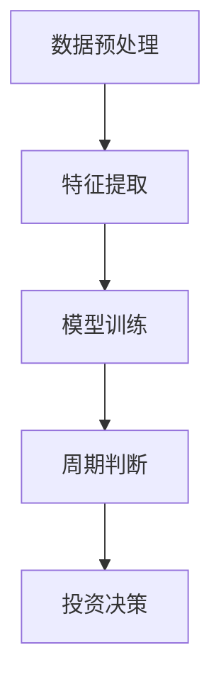
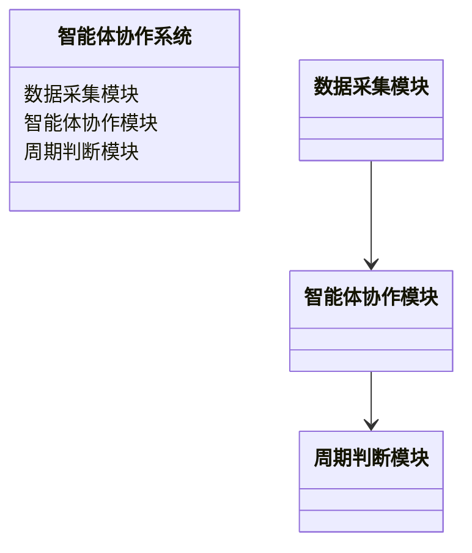
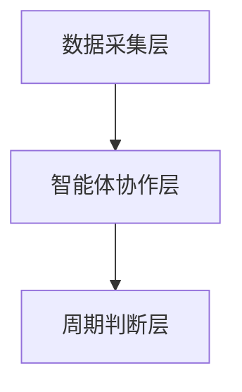

                 


# 智能体协作提升价值投资的行业周期判断

> 关键词：智能体协作，价值投资，行业周期，时间序列分析，机器学习，多智能体系统

> 摘要：本文探讨了智能体协作在价值投资中的应用，特别是如何通过行业周期判断来优化投资决策。文章从背景介绍、核心概念、算法原理、系统架构、项目实战到总结与展望，详细阐述了智能体协作与行业周期判断的结合，结合实例和代码实现，为读者提供了从理论到实践的全面指导。

---

# 第一部分: 背景介绍与核心概念

## 第1章: 智能体协作与价值投资概述

### 1.1 智能体协作的定义与背景

智能体协作是指多个智能体（Intelligent Agents）通过协同工作，共同完成复杂任务的过程。智能体可以是软件程序、算法或AI模型，能够感知环境、自主决策并执行任务。在价值投资中，智能体协作通过分析市场数据、识别趋势和预测周期，帮助投资者做出更明智的决策。

#### 1.1.1 智能体协作的基本概念
智能体协作的核心在于分布式系统中多个智能体的协同工作。每个智能体都有特定的目标和功能，通过通信和协调实现整体目标。例如，在价值投资中，一个智能体可以负责数据采集，另一个负责周期分析，第三个负责风险评估。

#### 1.1.2 价值投资的定义与特点
价值投资是一种长期投资策略，注重分析企业的内在价值，寻找市场价格低于内在价值的投资机会。其特点是注重基本面分析、长期持有和逆向思维。智能体协作通过提高分析效率和准确性，为价值投资者提供了新的工具。

#### 1.1.3 智能体协作在价值投资中的应用背景
随着市场的复杂化和数据量的增加，传统的人工分析方法逐渐显得效率低下。智能体协作能够处理海量数据，快速识别市场趋势，为投资者提供实时反馈，从而在快速变化的市场中占据优势。

---

### 1.2 行业周期判断的重要性

行业周期是指一个行业在经济发展过程中经历的周期性波动，通常包括衰退、复苏、增长和成熟等阶段。准确判断行业周期对价值投资至关重要，因为它直接影响企业的盈利能力和股票估值。

#### 1.2.1 行业周期的基本概念
行业周期通常分为四个阶段：衰退、复苏、增长和成熟。每个阶段的特点不同，企业的经营状况和股票表现也会随之变化。例如，在衰退期，企业可能面临需求下降和利润减少；而在增长期，企业可能迎来扩张和利润增长。

#### 1.2.2 行业周期对价值投资的影响
价值投资者需要识别行业的周期性波动，以便在低谷期寻找被低估的投资机会，在高峰期避免过度投资。通过智能体协作，投资者可以更准确地判断行业周期，从而优化投资组合。

#### 1.2.3 智能体协作在行业周期判断中的作用
智能体协作能够从多个数据源获取信息，包括宏观经济指标、行业数据和市场情绪等，通过分布式计算和协同分析，快速生成行业周期判断结果。这不仅提高了分析效率，还增强了结果的准确性。

---

## 第2章: 智能体协作的核心概念与联系

### 2.1 智能体协作的核心原理

智能体协作依赖于多个智能体的协同工作，每个智能体都有特定的任务和功能。例如，一个智能体负责数据预处理，另一个负责模型训练，第三个负责结果分析。

#### 2.1.1 多智能体协作的机制
智能体协作通常采用分布式架构，智能体之间通过通信协议交换信息。通信机制可以是同步或异步的，取决于任务的需求。

#### 2.1.2 智能体协作的数学模型
智能体协作的数学模型可以基于图论、博弈论或分布式计算。例如，使用图论模型描述智能体之间的关系和交互。

---

### 2.2 行业周期判断的数学模型

行业周期判断通常涉及时间序列分析和聚类分析。时间序列分析用于识别趋势和周期，聚类分析用于分类行业阶段。

#### 2.2.1 时间序列分析模型
时间序列分析是行业周期判断的核心方法之一。常用模型包括ARIMA和LSTM。

#### 2.2.2 趋势分析与周期识别
趋势分析用于识别行业的主要趋势，周期识别用于判断行业所处的周期阶段。

---

### 2.3 智能体协作与行业周期的关系

智能体协作能够显著提高行业周期判断的效率和准确性。通过分布式计算和协同分析，智能体协作能够处理海量数据，生成实时反馈。

---

### 2.4 核心概念对比分析

智能体协作与传统投资分析的对比：

| 对比维度 | 智能体协作 | 传统投资分析 |
|----------|------------|---------------|
| 数据来源 | 多源数据 | 单一数据源 |
| 分析效率 | 高效 | 低效 |
| 决策依据 | 数据驱动 | 经验驱动 |

---

## 第3章: 算法原理与数学模型

### 3.1 智能体协作算法原理

智能体协作算法通常采用分布式计算和联合学习。例如，使用分布式协作算法实现智能体之间的信息共享和协同决策。

#### 3.1.1 分布式协作算法
分布式协作算法通过智能体之间的通信协议实现信息共享和协同决策。例如，使用Gossip算法实现信息传播。

#### 3.1.2 联合学习算法
联合学习算法通过智能体之间的协作实现模型训练。例如，使用联邦学习（Federated Learning）实现数据隐私保护下的模型训练。

---

### 3.2 行业周期判断算法

行业周期判断算法通常基于时间序列分析和机器学习。例如，使用LSTM模型进行时间序列预测。

#### 3.2.1 时间序列预测算法
时间序列预测算法用于识别行业周期的波动。例如，使用ARIMA模型进行预测。

#### 3.2.2 聚类分析与周期识别
聚类分析用于分类行业周期阶段。例如，使用K-means算法进行行业阶段分类。

---

### 3.3 算法流程图



---

## 第4章: 系统分析与架构设计

### 4.1 问题场景介绍

智能体协作系统用于价值投资中的行业周期判断。系统需要处理海量数据，实时分析行业周期，并为投资者提供决策支持。

---

### 4.2 系统功能设计

系统功能包括数据采集、智能体协作和周期判断。数据采集模块负责获取市场数据，智能体协作模块负责协同分析，周期判断模块负责生成周期判断结果。

#### 4.2.1 领域模型（mermaid类图）



---

### 4.3 系统架构设计

系统架构采用分布式架构，包括数据采集层、智能体协作层和周期判断层。数据采集层负责数据获取，智能体协作层负责协同分析，周期判断层负责生成结果。

#### 4.3.1 系统架构图（mermaid架构图）



---

## 第5章: 项目实战

### 5.1 环境安装

需要安装Python、TensorFlow、Keras和scikit-learn等工具。

### 5.2 系统核心实现

以下是核心代码示例：

```python
import numpy as np
import pandas as pd
from sklearn.model_selection import train_test_split
from tensorflow.keras.models import Sequential
from tensorflow.keras.layers import LSTM, Dense

# 数据预处理
data = pd.read_csv('market_data.csv')
features = data[['revenue', 'profit', 'growth']]
labels = data['phase']

# 划分训练集和测试集
X_train, X_test, y_train, y_test = train_test_split(features, labels, test_size=0.2)

# 模型训练
model = Sequential()
model.add(LSTM(64, input_shape=(None, 3)))
model.add(Dense(4, activation='softmax'))
model.compile(loss='sparse_categorical_crossentropy', optimizer='adam', metrics=['accuracy'])
model.fit(X_train, y_train, epochs=10, batch_size=32)

# 模型预测
y_pred = model.predict(X_test)
```

---

### 5.3 实际案例分析

以某个行业的数据为例，分析如何通过智能体协作进行周期判断，并优化投资策略。

---

## 第6章: 总结与展望

### 6.1 最佳实践 tips

- 数据预处理是关键，确保数据质量和准确性。
- 模型选择要根据具体问题，尝试不同的算法。
- 系统架构设计要合理，确保高效协同。

### 6.2 小结

智能体协作通过提高分析效率和准确性，为价值投资中的行业周期判断提供了新的工具。未来，随着AI技术的发展，智能体协作将在投资领域发挥更大的作用。

### 6.3 注意事项

- 数据隐私和安全问题需要重视。
- 模型的可解释性需要加强，以便投资者理解和信任。
- 系统的实时性和稳定性需要优化，以应对市场的快速变化。

### 6.4 拓展阅读

推荐阅读《机器学习实战》和《分布式系统设计艺术》等书籍，深入理解智能体协作和分布式系统设计。

---

通过以上内容，我们详细探讨了智能体协作在价值投资中的应用，特别是在行业周期判断方面的潜力和实现方法。希望读者能够通过本文的指导，更好地理解和应用智能体协作技术，优化投资决策。

