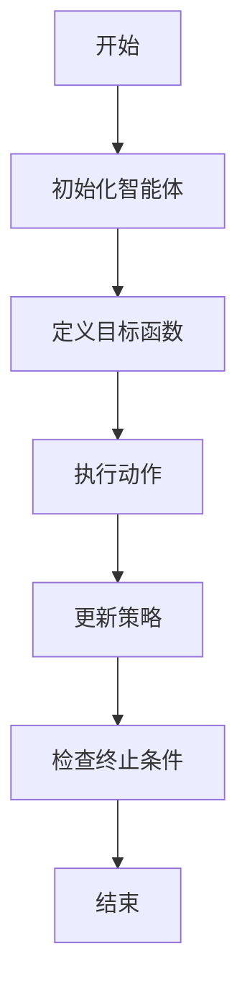
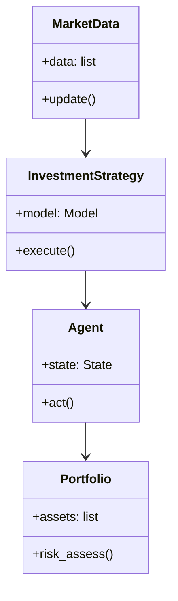
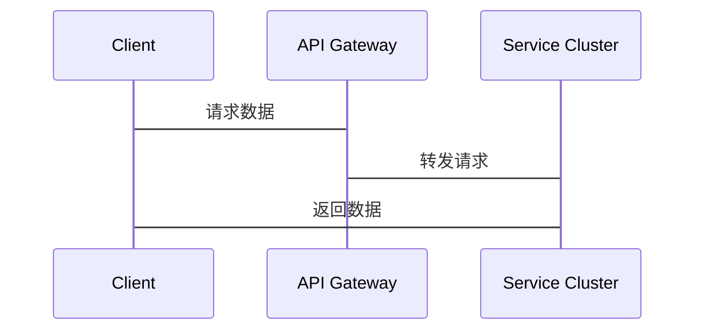

                 


```
# 第1章: 智能体协作与价值投资的背景介绍

## 1.1 智能体协作的定义与特点
### 1.1.1 智能体协作的核心概念
智能体协作是指多个智能体通过协同工作，共同完成某个任务或目标的过程。这些智能体可以是软件程序、算法或任何能够感知环境并采取行动的实体。智能体协作的关键在于它们之间的通信、协调和合作，以实现个体目标和集体目标的统一。

### 1.1.2 智能体协作的属性特征对比
以下是智能体协作的几个关键属性特征的对比表：

| 属性 | 特征描述 | 示例 |
|------|---------|------|
| 分布性 | 智能体分布在不同的物理或计算环境中 | 分布式计算系统中的多个节点 |
| 协作性 | 智能体之间需要进行信息交换和协同决策 | 多人在线游戏中玩家的合作 |
| 独立性 | 每个智能体具有一定的自主性和独立性 | 自动化机器人在工厂中的独立操作 |

### 1.1.3 智能体协作的边界与外延
智能体协作的边界是指其与其他系统的接口或界面，通常涉及数据输入和输出。外延则包括智能体协作可以扩展或延伸的功能或应用场景，例如从简单的数据处理扩展到复杂的决策支持。

## 1.2 价值投资的背景与现状
### 1.2.1 价值投资的基本概念
价值投资是一种以基本面分析为基础的投资策略，旨在通过识别市场中被低估的资产，长期持有以实现资本增值。其核心在于寻找具有良好基本面、低于内在价值的证券。

### 1.2.2 传统价值投资的局限性
传统价值投资依赖于人工分析，存在效率低、覆盖面窄、依赖个人经验等局限性。此外，市场环境的变化和信息的爆炸式增长也使得传统方法难以适应现代金融市场的复杂性。

### 1.2.3 智能体协作在价值投资中的应用潜力
智能体协作可以通过自动化分析、实时数据处理和多维度决策支持，显著提升价值投资的效率和准确性。例如，多个智能体可以分别负责数据收集、模型构建和风险评估，协同完成投资决策。

## 1.3 智能体协作与价值投资的结合意义
### 1.3.1 提升投资效率的潜力
智能体协作可以通过并行处理和自动化分析，显著提高投资分析的效率。多个智能体可以同时处理不同的数据源和模型，缩短决策时间。

### 1.3.2 降低投资风险的可能性
通过智能体协作，投资者可以实时监控市场变化，快速识别潜在风险，并采取相应的对策。多个智能体可以从不同角度分析市场动态，提供全面的风险评估。

### 1.3.3 行业壁垒的构建与突破
智能体协作可以为机构投资者提供差异化的优势，通过技术创新构建行业壁垒。同时，智能体协作的应用也可能打破传统行业壁垒，推动市场更加高效和透明。

# 第2章: 智能体协作的核心概念与联系

## 2.1 智能体协作的原理分析
### 2.1.1 多智能体协作的基本原理
多智能体协作涉及多个智能体之间的通信、协调和合作。每个智能体都有自己的目标和决策机制，通过信息共享和任务分配实现集体目标。

### 2.1.2 智能体协作的通信机制
智能体之间的通信可以通过多种方式进行，包括消息传递、数据共享和事件驱动。通信机制的设计直接影响协作效率和系统性能。

### 2.1.3 智能体协作的决策过程
智能体的决策过程通常包括感知环境、分析信息、制定策略和执行行动。在协作环境中，智能体需要与其他智能体协调决策，以实现集体目标。

## 2.2 价值投资的分析框架
### 2.2.1 价值投资的关键要素
价值投资的关键要素包括基本面分析、估值指标、市场情绪和风险管理。这些要素构成了价值投资的核心框架。

### 2.2.2 价值投资的决策流程
价值投资的决策流程通常包括数据收集、分析评估、策略制定和投资执行。每个步骤都需要精确的分析和判断。

### 2.2.3 价值投资的风险评估
风险评估是价值投资的重要组成部分，包括市场风险、流动性风险和信用风险等。通过智能体协作，可以更全面地评估和管理投资风险。

## 2.3 智能体协作与价值投资的ER实体关系图
### 2.3.1 实体关系图的构建
以下是智能体协作与价值投资的ER实体关系图：


### 2.3.2 实体关系图的分析
通过ER图可以看出，智能体协作与价值投资之间的关系是多对多的。多个智能体可以处理不同的市场数据和策略，为多个投资组合提供支持。

### 2.3.3 实体关系图的应用
ER图可以用于系统设计和数据库建模，帮助开发人员更好地理解系统结构和数据关系。

# 第3章: 智能体协作的算法原理

## 3.1 多智能体协作算法概述
### 3.1.1 多智能体协作的基本算法
多智能体协作算法包括分布式算法、协商算法和协调算法。每种算法都有其独特的应用场景和优势。

### 3.1.2 基于强化学习的协作算法
强化学习是一种通过试错机制来优化决策的算法。在多智能体协作中，强化学习可以用于协调智能体之间的行动和策略。

### 3.1.3 基于博弈论的协作算法
博弈论为多智能体协作提供了理论基础。通过分析智能体之间的博弈关系，可以设计出更加高效的协作算法。

## 3.2 基于强化学习的智能体协作算法
### 3.2.1 强化学习的基本原理
强化学习通过智能体与环境的交互，逐步学习最优策略。智能体会根据当前状态采取行动，并根据反馈调整策略。

### 3.2.2 多智能体强化学习的挑战
多智能体强化学习面临通信开销大、协调困难和策略同步等问题。需要设计高效的算法来应对这些挑战。

### 3.2.3 多智能体强化学习的解决方案
一种常用的解决方案是使用分布式强化学习，通过分割任务和协调智能体之间的行动来提高协作效率。

## 3.3 智能体协作的数学模型与公式
### 3.3.1 单智能体强化学习公式
$$ V(s) = \max_a Q(s,a) $$

### 3.3.2 多智能体协作的数学模型
$$ Q_i(s,a_i) = r_i + \gamma \max_{a_j} Q_j(s',a_j) $$

### 3.3.3 算法流程图
以下是多智能体协作算法的流程图：



# 第4章: 智能体协作的系统分析与架构设计

## 4.1 问题场景介绍
智能体协作在价值投资中的应用场景包括实时数据分析、投资策略优化和风险控制等。需要设计一个高效的系统来支持这些功能。

## 4.2 系统功能设计
### 4.2.1 领域模型类图
以下是系统功能的领域模型类图：



### 4.2.2 系统架构图
以下是系统的整体架构图：

```mermaid
archiitecture
    Client --> API Gateway
    API Gateway --> Load Balancer
    Load Balancer --> Service Cluster
    Service Cluster --> Database
```

## 4.3 系统接口设计
系统接口包括数据接口、智能体接口和用户接口。数据接口用于获取市场数据，智能体接口用于协调智能体的协作，用户接口用于与最终用户交互。

## 4.4 系统交互序列图
以下是系统交互的序列图：



# 第5章: 项目实战

## 5.1 环境安装
需要安装Python、TensorFlow和Kubernetes等工具。以下是安装命令：

```bash
pip install tensorflow
pip install kubernetes
```

## 5.2 核心代码实现
以下是核心代码实现：

```python
class Agent:
    def __init__(self, state):
        self.state = state

    def act(self):
        # 具体实现
        pass

def main():
    agent = Agent(initial_state)
    agent.act()

if __name__ == "__main__":
    main()
```

## 5.3 实际案例分析
通过具体案例分析智能体协作在价值投资中的应用，例如利用智能体分析市场数据并制定投资策略。

## 5.4 项目小结
总结项目实施的经验和教训，提出改进建议。

# 第6章: 最佳实践、小结与注意事项

## 6.1 最佳实践
### 6.1.1 系统设计中的注意事项
设计系统时需要注意智能体之间的通信效率和数据安全。

### 6.1.2 算法实现中的注意事项
实现算法时需要考虑收敛速度和计算资源的分配。

### 6.1.3 项目实施中的注意事项
项目实施中需要注意团队协作和风险管理。

## 6.2 小结
总结全文的主要内容和观点，强调智能体协作在价值投资中的重要性。

## 6.3 注意事项
提醒读者在实际应用中需要注意的事项，例如数据隐私和系统稳定性。

## 6.4 拓展阅读
推荐相关的书籍和资源，供读者进一步学习和研究。
```

