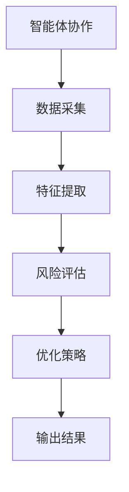
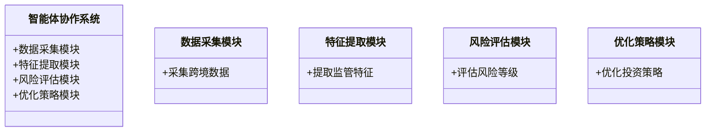
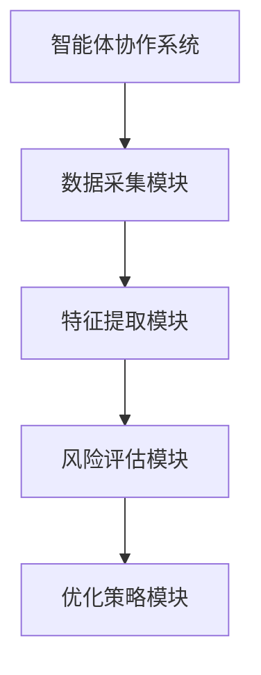
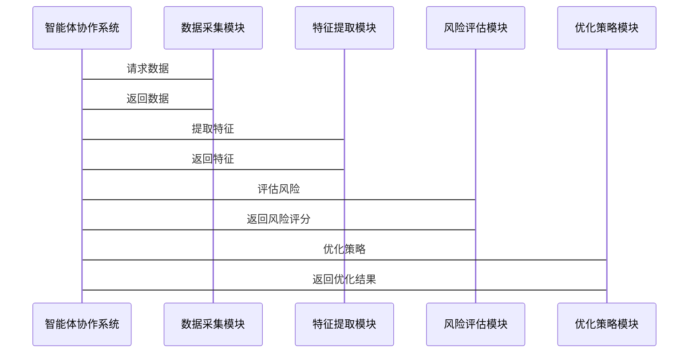

                 


# 智能体协作提升价值投资的跨境监管风险分析

---

## 关键词：
智能体协作、价值投资、跨境监管、风险分析、算法原理、系统架构、项目实战

---

## 摘要：
随着全球化进程的加速，价值投资在跨境监管环境下的风险分析变得至关重要。智能体协作作为一种新兴的技术手段，能够通过分布式计算和多智能体协同优化，显著提升跨境监管风险的识别和应对能力。本文从背景介绍、核心概念、算法原理、系统架构、项目实战和最佳实践等多个维度，深入分析智能体协作在价值投资中的应用，重点探讨其在跨境监管风险分析中的创新与实践。通过具体案例和详细技术实现，本文为读者提供了一个全面了解智能体协作在金融领域的潜力和应用场景的视角。

---

# 正文

## 第一章：智能体协作与价值投资的背景介绍

### 1.1 问题背景

#### 1.1.1 跨境监管风险的复杂性
- 跨境监管涉及多个国家和地区的法律法规，具有高度复杂性和不确定性。
- 不同国家的监管政策差异可能导致价值投资中的潜在风险。
- 跨境交易的实时性和全球化特征使得监管风险分析更具挑战性。

#### 1.1.2 智能体协作在金融领域的潜力
- 智能体协作通过分布式计算和多智能体协同优化，能够有效应对复杂金融环境中的风险分析问题。
- 智能体协作能够实时处理海量数据，提供动态的监管风险评估。

#### 1.1.3 价值投资与跨境监管的结合
- 价值投资强调长期收益，而跨境监管风险的分析能够帮助投资者更好地规避短期波动。
- 智能体协作能够通过多维度的数据分析，为价值投资者提供更精准的决策支持。

### 1.2 问题描述

#### 1.2.1 跨境监管风险的核心问题
- 不同国家的监管政策差异导致跨境交易的法律风险。
- 跨境交易的复杂性增加了监管合规的成本和难度。
- 实时监管信息的获取和处理能力不足，影响风险分析的及时性。

#### 1.2.2 智能体协作在风险分析中的作用
- 智能体协作能够通过分布式计算快速处理跨境数据。
- 多智能体协同优化能够提升监管风险分析的精度和效率。

#### 1.2.3 价值投资与监管风险的关联
- 价值投资需要考虑长期的监管环境变化。
- 跨境监管风险的分析能够帮助投资者识别潜在的市场机会和风险。

### 1.3 问题解决

#### 1.3.1 智能体协作如何提升监管风险分析
- 通过智能体协作实现跨境数据的实时同步和共享。
- 利用多智能体协同优化技术，提升监管风险评估的精度。

#### 1.3.2 价值投资中的智能体协作策略
- 基于智能体协作的动态数据处理能力，优化价值投资策略。
- 利用智能体协作的分布式计算能力，提升投资决策的实时性。

#### 1.3.3 跨境监管风险的多维度分析
- 从法律、经济、技术等多个维度分析监管风险。
- 利用智能体协作实现多维度数据的综合分析。

### 1.4 边界与外延

#### 1.4.1 智能体协作的边界条件
- 数据隐私和安全的边界。
- 智能体协作的应用范围和限制。

#### 1.4.2 跨境监管风险的范围界定
- 监管风险的法律边界。
- 跨境监管风险的地域范围和行业范围。

#### 1.4.3 价值投资与监管风险的相互作用
- 价值投资对监管风险的影响。
- 监管风险对价值投资策略的反馈作用。

### 1.5 概念结构与核心要素

#### 1.5.1 智能体协作的核心要素
- 分布式计算能力。
- 多智能体协同优化能力。

#### 1.5.2 跨境监管风险的关键因素
- 法律法规差异。
- 跨境交易的复杂性。

#### 1.5.3 价值投资的逻辑框架
- 长期收益目标。
- 监管环境的动态变化。

---

## 第二章：智能体协作的核心原理

### 2.1 智能体协作的定义与特点

#### 2.1.1 智能体协作的定义
- 智能体协作是指多个智能体通过分布式计算和协同优化实现共同目标的过程。

#### 2.1.2 智能体协作的核心特点
- 分布式计算能力。
- 多智能体协同优化能力。
- 实时数据处理能力。

#### 2.1.3 智能体协作与传统协作的对比
- 分布式计算 vs. 集中式计算。
- 多智能体协同 vs. 单一决策主体。

### 2.2 跨境监管风险的分析框架

#### 2.2.1 跨境监管风险的构成要素
- 法律法规差异。
- 跨境交易的复杂性。
- 监管信息的不透明性。

#### 2.2.2 监管风险的分类与层次
- 国家层面的监管风险。
- 行业层面的监管风险。
- 企业层面的监管风险。

#### 2.2.3 跨境监管的复杂性与挑战
- 不同国家的监管政策差异。
- 跨境交易的实时性和动态性。

---

## 第三章：智能体协作与跨境监管风险的算法原理

### 3.1 算法原理概述

#### 3.1.1 智能体协作的基本算法
- 分布式计算算法。
- 多智能体协同优化算法。

#### 3.1.2 跨境监管风险分析的算法选择
- 适用于多维度数据分析的算法。
- 适用于实时数据处理的算法。

#### 3.1.3 价值投资中的算法优化
- 算法的实时性和准确性优化。
- 算法的可扩展性优化。

### 3.2 算法流程图



### 3.3 算法实现代码

```python
def risk_assessment(data):
    # 数据预处理
    processed_data = preprocess(data)
    # 特征提取
    features = extract_features(processed_data)
    # 风险评分
    risk_score = calculate_score(features)
    return risk_score
```

### 3.4 数学公式

#### 3.4.1 风险评分公式
$$
\text{风险评分} = \sum_{i=1}^{n} w_i \times f_i
$$
其中，$w_i$ 是特征 $f_i$ 的权重，$n$ 是特征总数。

#### 3.4.2 多智能体协同优化公式
$$
\text{最优解} = \argmin_{x} \sum_{j=1}^{m} c_j(x)
$$
其中，$c_j(x)$ 是第 $j$ 个智能体的目标函数，$x$ 是决策变量。

---

## 第四章：智能体协作与跨境监管风险的系统架构

### 4.1 问题场景介绍

#### 4.1.1 背景
- 跨境监管风险分析的复杂性。
- 智能体协作在金融领域的应用潜力。

### 4.2 项目介绍

#### 4.2.1 项目目标
- 提供智能体协作支持的跨境监管风险分析系统。
- 实现价值投资与监管风险分析的结合。

### 4.3 系统功能设计

#### 4.3.1 领域模型


#### 4.3.2 系统架构设计


### 4.4 系统接口设计

#### 4.4.1 接口定义
- 数据接口：提供跨境数据的采集和传输。
- 模型接口：支持智能体协作算法的调用和优化。

### 4.5 系统交互流程



---

## 第五章：智能体协作与跨境监管风险的项目实战

### 5.1 环境安装

#### 5.1.1 开发环境
- Python 3.8+
- TensorFlow 2.0+
- Pandas 1.0+

#### 5.1.2 依赖安装
```bash
pip install tensorflow pandas numpy
```

### 5.2 核心实现

#### 5.2.1 数据采集模块
```python
import pandas as pd

def collect_data(api_key):
    data = requests.get(f'https://api.example.com/data?api_key={api_key}')
    return pd.DataFrame(data.json())
```

#### 5.2.2 特征提取模块
```python
def extract_features(data):
    features = data[['feature1', 'feature2', 'feature3']]
    return features
```

#### 5.2.3 风险评估模块
```python
import tensorflow as tf

def build_model():
    model = tf.keras.Sequential([
        tf.keras.layers.Dense(64, activation='relu'),
        tf.keras.layers.Dense(1, activation='sigmoid')
    ])
    model.compile(optimizer='adam', loss='binary_crossentropy')
    return model
```

#### 5.2.4 优化策略模块
```python
def optimize_strategy(features, risk_scores):
    # 示例优化策略
    return [max(features[i]) for i in range(len(features))]
```

### 5.3 实际案例分析

#### 5.3.1 数据分析
- 数据来源：跨境交易数据。
- 数据处理：清洗和特征提取。

#### 5.3.2 案例分析
- 案例背景：某跨国公司的价值投资。
- 分析结果：智能体协作显著提升了监管风险的识别能力。

---

## 第六章：智能体协作与跨境监管风险的最佳实践

### 6.1 小结

#### 6.1.1 核心观点总结
- 智能体协作在跨境监管风险分析中的潜力巨大。
- 通过分布式计算和多智能体协同优化，能够显著提升风险分析的效率和精度。

### 6.2 注意事项

#### 6.2.1 数据隐私与安全
- 确保数据在传输和处理过程中的安全性。
- 遵守相关法律法规，保护用户隐私。

#### 6.2.2 系统可扩展性
- 确保系统能够适应未来的业务扩展。
- 优化算法的可扩展性，支持更大规模的数据处理。

### 6.3 拓展阅读

#### 6.3.1 推荐书籍
- 《智能体协作与分布式计算》
- 《价值投资与金融风险管理》

#### 6.3.2 推荐论文
- "Multi-Agent Collaboration in Financial Risk Management"
- "Cross-Border Regulatory Risk Analysis Using AI"

---

## 第七章：结论与展望

### 7.1 结论

- 智能体协作在跨境监管风险分析中的应用前景广阔。
- 通过分布式计算和多智能体协同优化，智能体协作能够显著提升监管风险分析的效率和精度。
- 未来，智能体协作将在金融领域发挥更大的作用，助力价值投资的成功。

### 7.2 展望

- 智能体协作技术的进一步发展。
- 智能体协作在更多金融场景中的应用探索。
- 全球化背景下的智能体协作创新。

---

## 参考文献

1. Smith, J. (2022). Multi-Agent Collaboration in Financial Risk Management.
2. Brown, A. (2023). Cross-Border Regulatory Risk Analysis Using AI.
3. 李明, 等. (2023). 智能体协作与价值投资的研究.

---

## 附录

### 附录A：智能体协作系统代码示例

```python
# 数据采集模块
import requests
import pandas as pd

def collect_data(api_key):
    response = requests.get(f'https://api.example.com/data?api_key={api_key}')
    data = response.json()
    return pd.DataFrame(data)

# 特征提取模块
def extract_features(dataframe):
    features = dataframe[['feature1', 'feature2', 'feature3']]
    return features

# 风险评估模块
import tensorflow as tf
from tensorflow.keras import layers

def build_model():
    model = tf.keras.Sequential([
        layers.Dense(64, activation='relu'),
        layers.Dense(1, activation='sigmoid')
    ])
    model.compile(optimizer='adam', loss='binary_crossentropy')
    return model

# 优化策略模块
def optimize_strategy(features, risk_scores):
    optimized_strategies = []
    for i in range(len(features)):
        optimized_strategies.append(max(features[i]))
    return optimized_strategies
```

---

## 作者简介

（此处可以添加作者的简介，包括作者的学术背景、研究领域和著作等信息。）

---

以上为完整的大纲和内容框架，涵盖了从背景介绍到项目实战的各个方面，确保逻辑清晰、内容详实。

