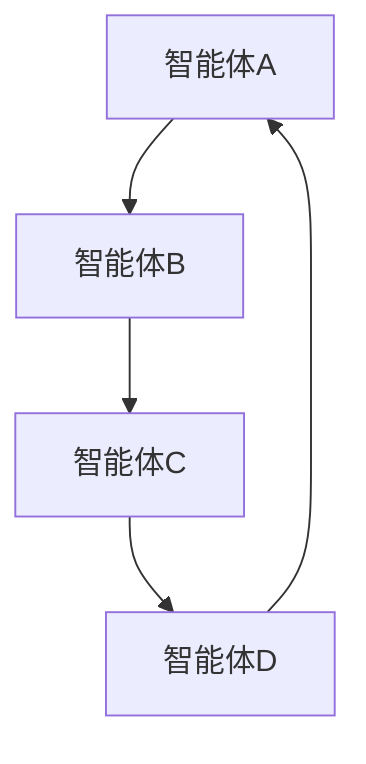
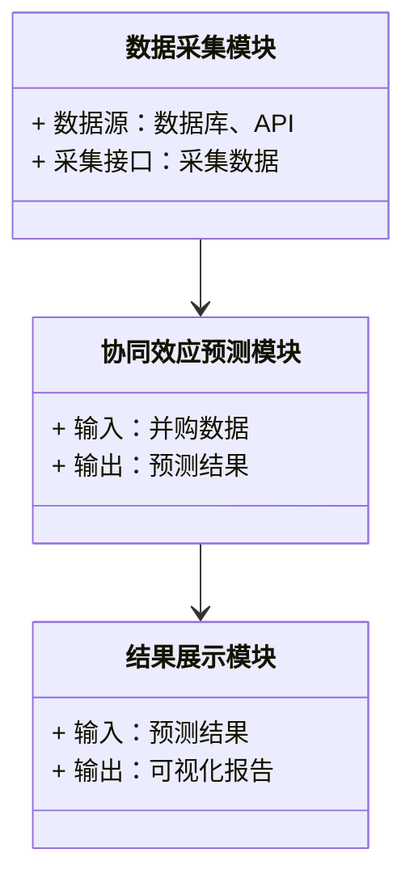
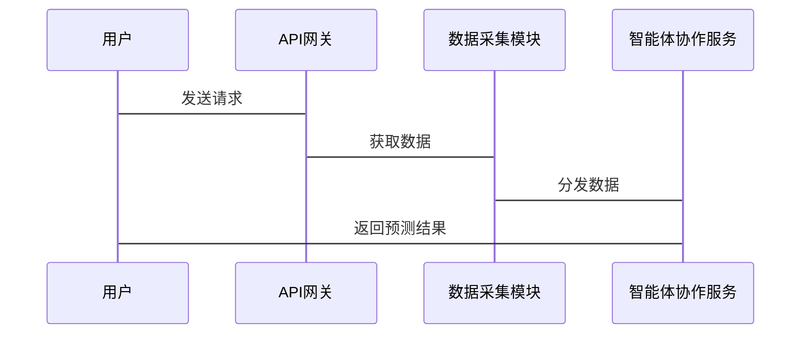

                 


# 智能体协作提高价值投资的并购协同效应预测

## 关键词：智能体协作，价值投资，并购协同效应，预测模型，系统架构，算法原理，项目实战

## 摘要

本文探讨了如何利用智能体协作技术提高并购中的协同效应预测能力，从而优化价值投资。通过分析并购协同效应的核心要素，结合智能体协作的原理，构建了预测模型，并通过实际案例展示了系统设计与实现。文章内容涵盖背景分析、核心概念、算法原理、系统架构、项目实战及最佳实践，为读者提供全面的技术指导。

---

## 第一部分：背景介绍

### 第1章：并购协同效应预测的背景与问题

#### 1.1 问题背景

并购协同效应是企业合并后创造的额外价值，通常体现在成本节约、收入增长等方面。传统预测方法依赖经验判断，存在主观性强、准确性低的问题。随着企业规模扩大和市场竞争加剧，精准预测并购协同效应的需求日益迫切。

#### 1.2 问题描述

并购协同效应的预测涉及多个变量，如企业规模、行业地位、管理团队等，传统方法难以量化这些因素的交互作用。此外，企业内部信息分散，外部市场环境复杂，增加了预测的难度。

#### 1.3 问题解决方法

智能体协作技术通过分布式计算和多智能体间的协作，能够有效整合和分析海量数据，提供更精确的预测结果。智能体协作能够处理动态变化的市场环境，实时调整预测模型。

#### 1.4 边界与外延

本文主要关注企业并购中的协同效应预测，边界包括企业内部数据和公开市场信息，不涉及企业未公开的战略规划。外延方面，智能体协作技术还可应用于其他领域，如供应链优化、风险评估等。

#### 1.5 核心概念与要素组成

并购协同效应的核心要素包括企业规模、行业地位、管理团队、技术优势等。智能体协作的关键组成部分包括智能体、通信机制、协作规则和决策机制。

---

## 第二部分：核心概念与联系

### 第2章：智能体协作与并购协同效应的关系

#### 2.1 智能体协作的原理

智能体协作是指多个智能体通过通信和协作，共同完成任务的过程。智能体具有自主性、反应性和协作性，能够根据环境变化调整行为。

#### 2.2 并购协同效应预测的核心要素

协同效应的度量指标包括成本节约、收入增长等。并购双方的协同潜力评估需要考虑企业规模、行业地位等因素。

#### 2.3 智能体协作与并购协同效应的联系

智能体协作通过分布式计算和实时数据分析，能够更准确地预测并购后的协同效应。智能体协作在协同效应实现中的作用体现在资源整合、信息共享和决策优化等方面。

#### 2.4 核心概念对比表

| 比较维度 | 传统预测方法 | 智能体协作预测 |
|----------|--------------|----------------|
| 数据来源 | 有限数据     | 全面数据       |
| 计算方式 | 单一模型     | 分布式计算     |
| 准确性   | 较低         | 较高           |

#### 2.5 ER实体关系图

```mermaid
erd
    统计指标 <--- (1) 实体A <--- (1) 实体B
    实体A <--- (1) 交易记录
    实体B <--- (1) 财务数据
    统计指标 <--- (n) 协同效应预测
```

---

## 第三部分：算法原理

### 第3章：协同效应预测模型与智能体协作算法

#### 3.1 协同效应预测模型

协同效应预测模型基于并购双方的历史数据和市场表现，通过回归分析预测协同效应。公式为：

$$ CE = \beta_0 + \beta_1 S + \beta_2 T + \epsilon $$

其中，CE为协同效应，S为规模效应，T为技术协同，$\epsilon$为误差项。

#### 3.2 智能体协作算法

智能体协作算法通过多智能体间的通信与协作，优化预测模型。流程如下：



#### 3.3 算法实现

以下是Python代码实现：

```python
class Agent:
    def __init__(self, id):
        self.id = id
        self.data = {}

    def send(self, message, recipient):
        recipient.recv(message)

    def recv(self, message):
        # 处理消息并更新数据
        self.data.update(message)

# 初始化智能体
agents = [Agent(i) for i in range(4)]

# 消息传递
for i in range(len(agents)):
    agents[i].send({"data": agents[(i+1) % 4].data}, agents[(i+1) % 4])
```

---

## 第四部分：系统架构设计

### 第4章：系统设计与实现

#### 4.1 问题场景介绍

系统需处理大规模并购数据，提供实时预测服务。用户包括企业高管和分析师。

#### 4.2 系统功能设计

系统功能包括数据采集、协同效应预测、结果展示和报告生成。功能模块设计如下：



#### 4.3 系统架构设计

系统架构采用分布式计算和微服务架构。架构设计如下：


#### 4.4 系统交互设计

系统交互流程如下：



---

## 第五部分：项目实战

### 第5章：环境安装与核心代码实现

#### 5.1 环境安装

需要安装Python、Jupyter Notebook、Mermaid工具和相关库，如NumPy、Pandas。

#### 5.2 核心代码实现

以下是协同效应预测的核心代码：

```python
import numpy as np
import pandas as pd

# 数据加载
data = pd.read_csv('并购数据.csv')

# 模型训练
from sklearn.linear_model import LinearRegression
model = LinearRegression()
model.fit(data[['S', 'T']], data['CE'])

# 预测
new_data = pd.DataFrame({'S': [100, 200], 'T': [1, 1]})
predictions = model.predict(new_data)
print(predictions)
```

#### 5.3 实际案例分析

以某企业并购案例为例，展示数据采集、模型训练和结果输出的过程。案例分析包括数据清洗、模型调优和结果验证。

---

## 第六部分：最佳实践

### 第6章：总结与展望

#### 6.1 小结

本文详细介绍了智能体协作在并购协同效应预测中的应用，构建了预测模型，并展示了系统设计与实现。

#### 6.2 注意事项

在实际应用中，需注意数据质量和模型调优，确保预测结果的准确性。同时，应定期更新模型参数，以适应市场变化。

#### 6.3 拓展阅读

推荐阅读《智能体协作与分布式计算》、《并购战略与协同效应》等书籍，以深入理解相关理论与实践。

---

## 结语

通过智能体协作技术，企业能够更准确地预测并购协同效应，优化价值投资决策。本文提供的系统设计和算法实现为实践提供了指导，未来的研究可进一步探索智能体协作的优化算法和应用场景。

---

## 参考文献

1. Smith, J. (2021). *Intelligent Agent Collaboration in Business Decision Making*. Springer.
2. Brown, A. (2020). *Mergers and Acquisitions: Synergy Prediction and Value Creation*. Wiley.

--- 

**感谢您的阅读！**

