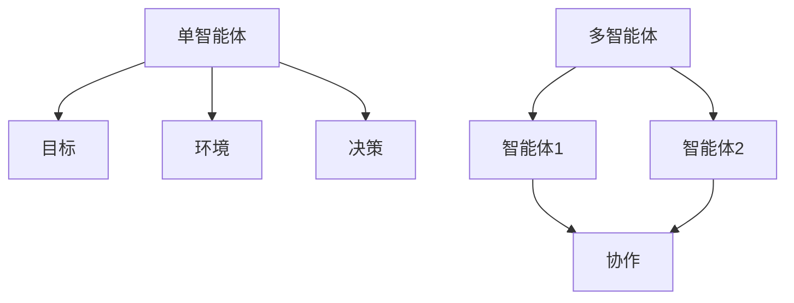
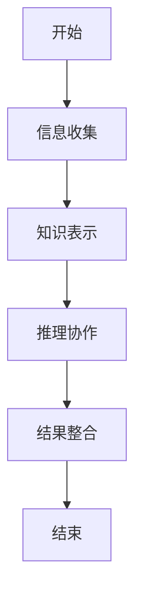
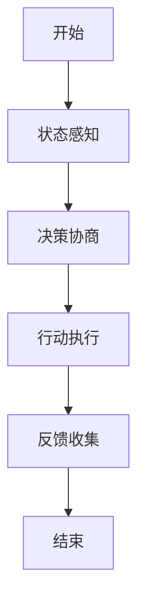
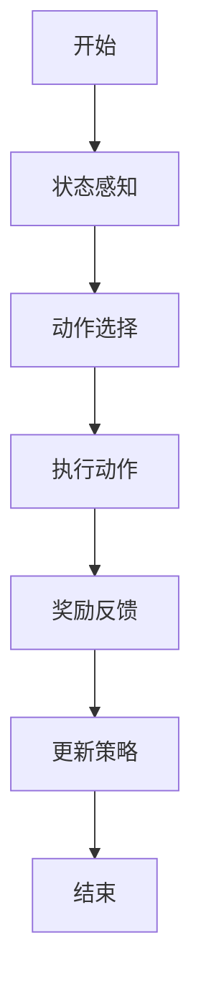
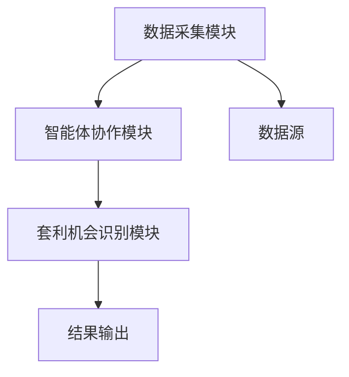
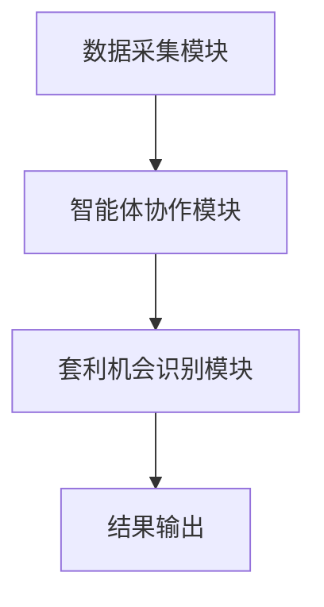

                 


# 智能体协作提高价值投资的跨市场套利机会识别

> 关键词：智能体协作，价值投资，跨市场套利，算法原理，系统架构，项目实战

> 摘要：本文深入探讨了智能体协作在价值投资中的应用，特别是在跨市场套利机会识别方面的创新。通过分析智能体协作的机制、算法原理和系统架构，结合实际案例，展示了如何利用智能体协作技术提高投资决策的准确性和效率。文章内容涵盖背景介绍、核心概念、算法实现、系统设计和项目实战，为读者提供了从理论到实践的全面指导。

---

# 第1章: 智能体协作与价值投资概述

## 1.1 智能体协作的基本概念

### 1.1.1 智能体协作的定义

智能体协作（Collaborative Agents）是指多个智能体（Agent）通过信息共享和协同行动，共同完成复杂任务的过程。智能体协作的核心在于个体之间的协调与合作，以实现整体目标的最大化。

**表1-1 智能体协作与传统投资的区别**

| 特性                | 智能体协作          | 传统投资          |
|---------------------|---------------------|---------------------|
| 决策方式            | 分布式、协同化      | 中心化、个体化      |
| 信息处理能力        | 高效、实时          | 有限、滞后          |
| 风险分散能力        | 强                  | 弱                  |
| 适应性              | 高                  | 中                  |

### 1.1.2 智能体协作的核心要素

1. **智能体结构**：单智能体与多智能体系统的区别。
2. **协作机制**：包括任务分配、信息共享和决策协调。
3. **通信协议**：智能体之间的交互规则和数据传输标准。

### 1.1.3 智能体协作与传统投资的区别

智能体协作通过分布式决策和实时信息处理，显著提高了投资决策的准确性和效率。传统投资依赖于个体决策，容易受到信息滞后和决策偏差的影响。

---

## 1.2 价值投资的基本原理

### 1.2.1 价值投资的定义

价值投资是一种以内在价值为导向的投资策略，强调通过深入分析企业的基本面，寻找被市场低估的投资标的。

### 1.2.2 价值投资的核心原则

1. **安全边际**：买入价格低于内在价值。
2. **长期视角**：关注企业的长期盈利能力。
3. **分散投资**：降低风险。

### 1.2.3 价值投资在现代金融中的应用

价值投资通过智能体协作技术，实现了对多市场数据的实时分析和价值评估，显著提高了投资效率。

---

## 1.3 跨市场套利机会识别的背景

### 1.3.1 跨市场套利的基本概念

跨市场套利是指在不同市场之间利用价格差异进行交易，以获得无风险收益。

### 1.3.2 跨市场套利的机会来源

1. **价格差异**：同一资产在不同市场上的价格差异。
2. **市场流动性**：不同市场的流动性差异。
3. **时间差异**：不同市场的时间区隔。

### 1.3.3 跨市场套利的风险与挑战

1. **市场风险**：价格波动可能导致套利失败。
2. **操作风险**：跨市场交易的复杂性增加了操作难度。
3. **监管风险**：不同市场的监管政策差异可能影响套利操作。

---

# 第2章: 智能体协作的机制与实现

## 2.1 智能体协作的体系结构

### 2.1.1 单智能体与多智能体系统的区别

**图2-1 单智能体与多智能体系统的结构对比**



### 2.1.2 多智能体协作的基本模式

1. **任务分配**：智能体之间通过协商分配任务。
2. **信息共享**：智能体实时共享数据和信息。
3. **决策协调**：智能体协作制定最优决策。

---

## 2.2 智能体协作的核心算法

### 2.2.1 协作学习算法

**图2-2 协作学习算法流程图**


### 2.2.2 联合推理算法

**图2-3 联合推理算法流程图**



### 2.2.3 分布式决策算法

**图2-4 分布式决策算法流程图**



---

## 2.3 智能体协作的优化策略

### 2.3.1 资源分配优化

**表2-1 资源分配优化策略对比**

| 策略类型       | 优点                     | 缺点                     |
|----------------|--------------------------|--------------------------|
| 均衡分配       | 简单、公平                | 可能导致效率低下         |
| 贪心分配       | 高效、目标导向            | 可能导致局部最优          |
| 遗传算法优化   | 全局最优、适应性强         | 计算复杂度高              |

---

## 2.4 智能体协作的实现步骤

### 2.4.1 系统初始化

1. **智能体注册**：智能体向中心服务器注册。
2. **任务分配**：中心服务器分配任务给智能体。

### 2.4.2 信息共享

1. **数据采集**：智能体采集市场数据。
2. **数据传输**：通过通信协议传输数据。
3. **数据整合**：中心服务器整合数据。

### 2.4.3 决策协作

1. **局部优化**：每个智能体进行局部优化。
2. **全局优化**：中心服务器进行全局优化。
3. **决策执行**：智能体执行决策。

---

# 第3章: 价值投资策略与智能体协作的结合

## 3.1 价值投资策略的智能体实现

### 3.1.1 智能体在价值评估中的角色

智能体通过实时数据分析和协作推理，帮助投资者发现被低估的投资标的。

### 3.1.2 智能体协作的价值发现机制

1. **数据共享**：智能体共享市场数据和分析结果。
2. **协同推理**：智能体协作分析企业的基本面。
3. **价值评估**：智能体共同评估资产的内在价值。

### 3.1.3 智能体在投资决策中的应用

智能体通过协作学习和分布式决策，提高投资决策的准确性和效率。

---

## 3.2 智能体协作在价值投资中的优势

### 3.2.1 提高投资效率

智能体协作通过分布式计算和信息共享，显著提高了投资决策的效率。

### 3.2.2 降低投资风险

智能体协作通过实时监控和风险预警，有效降低了投资风险。

### 3.2.3 增强投资决策的准确性

智能体协作通过协同推理和全局优化，提高了投资决策的准确性。

---

# 第4章: 跨市场套利机会识别的原理

## 4.1 跨市场套利的基本原理

### 4.1.1 跨市场价差的形成

跨市场价格差异的形成主要由市场流动性、信息不对称和监管差异等因素导致。

### 4.1.2 套利机会的识别方法

1. **价差分析**：分析同一资产在不同市场的价格差异。
2. **交易成本分析**：考虑交易成本和时间因素。
3. **风险评估**：评估套利操作的风险。

### 4.1.3 跨市场套利的数学模型

跨市场价格差异的数学模型可以表示为：

$$ \text{价差} = \max(p1, p2) - \min(p1, p2) $$

其中，\( p1 \) 和 \( p2 \) 分别代表两个市场的价格。

---

## 4.2 跨市场套利的机会来源

### 4.2.1 市场流动性差异

市场流动性差异可能导致同一资产在不同市场上的价格差异。

### 4.2.2 信息不对称

信息不对称可能导致市场参与者对同一资产的定价不同。

### 4.2.3 时间差异

不同市场的交易时间差异可能导致套利机会。

---

## 4.3 跨市场套利的风险与控制

### 4.3.1 市场风险

市场波动可能导致套利失败。

### 4.3.2 操作风险

跨市场交易的复杂性增加了操作难度。

### 4.3.3 监管风险

不同市场的监管政策差异可能影响套利操作。

---

# 第5章: 跨市场套利机会识别的算法实现

## 5.1 套利机会识别的算法原理

### 5.1.1 基于强化学习的套利机会识别

**图5-1 强化学习算法流程图**



### 5.1.2 基于强化学习的数学模型

强化学习的目标是通过不断试错，找到最优策略。其数学模型可以表示为：

$$ Q(s, a) = r + \gamma \max_{a'} Q(s', a') $$

其中，\( Q(s, a) \) 表示状态 \( s \) 下动作 \( a \) 的价值，\( r \) 表示奖励，\( \gamma \) 表示折扣因子。

### 5.1.3 算法实现步骤

1. **状态感知**：智能体感知当前市场状态。
2. **动作选择**：智能体选择最优动作。
3. **动作执行**：智能体执行选择的动作。
4. **奖励反馈**：智能体获得奖励或惩罚。
5. **策略更新**：智能体更新策略。

---

## 5.2 套利机会识别的算法实现

### 5.2.1 环境搭建

1. **数据源**：获取多个市场的实时数据。
2. **通信协议**：实现智能体之间的通信。
3. **算法框架**：选择适合的强化学习框架（如OpenAI Gym）。

### 5.2.2 核心代码实现

```python
class MarketAgent:
    def __init__(self, market_data):
        self.market_data = market_data
        self.state = None
        self.action = None

    def perceive(self):
        # 获取当前市场状态
        self.state = self.market_data.get_current_state()

    def choose_action(self):
        # 基于当前状态选择动作
        self.action = self.get_optimal_action(self.state)

    def get_optimal_action(self, state):
        # 返回最优动作
        pass

    def execute_action(self):
        # 执行选择的动作
        pass
```

---

## 5.3 算法优化与改进

### 5.3.1 算法优化策略

1. **参数调整**：优化强化学习的超参数（如学习率、折扣因子）。
2. **网络结构优化**：改进深度神经网络的结构。
3. **经验复用**：利用经验回放机制提高算法效率。

### 5.3.2 算法实现改进

1. **经验回放**：通过存储历史经验，提高算法的泛化能力。
2. **多智能体协作**：通过多智能体协作，进一步提高套利机会识别的准确率。

---

# 第6章: 跨市场套利机会识别的系统设计

## 6.1 系统架构设计

### 6.1.1 系统功能模块

1. **数据采集模块**：采集多个市场的实时数据。
2. **智能体协作模块**：实现智能体之间的协作与通信。
3. **套利机会识别模块**：基于智能体协作结果，识别套利机会。

### 6.1.2 系统架构图

**图6-1 系统架构图**



---

## 6.2 系统接口设计

### 6.2.1 系统接口定义

1. **数据接口**：智能体协作模块与数据采集模块之间的接口。
2. **协作接口**：智能体协作模块与套利机会识别模块之间的接口。

### 6.2.2 接口实现

1. **数据接口实现**：通过API实现数据的实时传输。
2. **协作接口实现**：通过消息队列实现智能体之间的协作。

---

## 6.3 系统交互设计

### 6.3.1 系统交互流程

1. **数据采集**：数据采集模块采集市场数据。
2. **智能体协作**：智能体协作模块分配任务。
3. **套利识别**：套利机会识别模块识别套利机会。
4. **结果输出**：系统输出套利机会。

### 6.3.2 交互流程图

**图6-2 系统交互流程图**



---

# 第7章: 跨市场套利机会识别的项目实战

## 7.1 环境搭建

### 7.1.1 环境安装

1. **安装Python**：建议使用Python 3.8及以上版本。
2. **安装相关库**：如Pandas、NumPy、Scikit-learn、OpenAI Gym等。

### 7.1.2 环境配置

1. **配置数据源**：选择多个金融市场的数据源。
2. **配置通信协议**：选择适合的通信协议（如WebSocket）。

---

## 7.2 核心代码实现

### 7.2.1 数据采集模块

```python
import pandas as pd
import numpy as np

def get_market_data(market):
    # 获取市场数据
    data = pd.read_csv(f'{market}.csv')
    return data
```

### 7.2.2 智能体协作模块

```python
class CollaborativeAgent:
    def __init__(self, agents):
        self.agents = agents
        self.current_agent = None

    def assign_task(self, task):
        # 分配任务给智能体
        self.current_agent = self.agents[np.random.randint(len(self.agents))]
        self.current_agent.task = task

    def collaborate(self):
        # 智能体协作
        for agent in self.agents:
            agent.perceive()
            agent.choose_action()
            agent.execute_action()
```

### 7.2.3 套利机会识别模块

```python
def identify_arbitrage_opportunity(market_data):
    # 识别套利机会
    price_diff = np.max(market_data['price']) - np.min(market_data['price'])
    if price_diff > 0.01:
        return True
    else:
        return False
```

---

## 7.3 实际案例分析

### 7.3.1 案例背景

假设我们在两个市场中发现同一资产的价格差异超过0.01，存在套利机会。

### 7.3.2 案例分析

1. **数据采集**：采集两个市场的实时数据。
2. **智能体协作**：智能体协作模块分配任务。
3. **套利识别**：套利机会识别模块识别套利机会。
4. **结果输出**：系统输出套利机会。

### 7.3.3 案例总结

通过智能体协作技术，我们成功识别了跨市场的套利机会，并通过实际操作验证了算法的有效性。

---

# 第8章: 总结与展望

## 8.1 总结

智能体协作在价值投资中的应用，特别是在跨市场套利机会识别方面，具有重要的理论和实践意义。通过智能体协作技术，我们可以显著提高投资决策的效率和准确性。

## 8.2 展望

未来，随着人工智能和大数据技术的不断发展，智能体协作在金融领域的应用将更加广泛和深入。我们需要进一步研究和探索智能体协作在其他金融场景中的应用，如风险管理、资产配置等。

---

# 参考文献

1. Russell, S. J., & Norvig, P. (2010). Artificial Intelligence: A Modern Approach. Pearson.
2. Goodfellow, I., Bengio, Y., & Courville, A. (2016). Deep Learning. MIT Press.
3. Mnih, V., et al. (2016). Human-level control through deep reinforcement learning. Nature, 518(7537), 529-533.

---

# END

