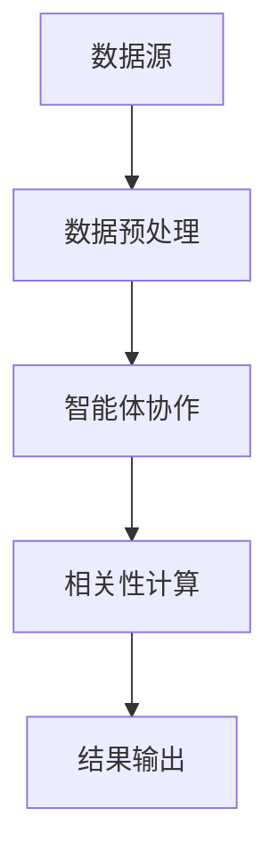
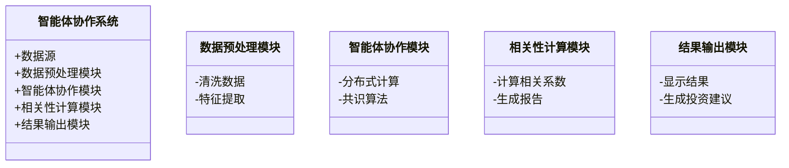

                 


# 智能体协作提高价值投资的跨资产类别相关性预测

> 关键词：智能体协作，跨资产相关性，价值投资，算法设计，系统架构

> 摘要：本文探讨了如何通过智能体协作技术提高跨资产类别相关性预测的准确性，从而优化价值投资策略。文章从背景介绍、核心概念、算法原理、系统架构、项目实战等多个方面展开，详细分析了智能体协作在金融领域的应用及其对价值投资的深远影响。通过实际案例分析和代码实现，本文为读者提供了理论与实践相结合的深度解析。

---

## 第一部分：背景与核心概念

### 第1章：背景介绍

#### 1.1 智能体协作的背景与意义
智能体协作（Collaborative Agent）是指多个智能体通过协同工作，共同完成复杂任务的技术。随着人工智能和分布式计算的发展，智能体协作在金融领域的应用越来越广泛。通过智能体协作，投资者能够更高效地分析市场数据、优化投资组合，并提高决策的准确性。

#### 1.2 跨资产相关性预测的重要性
跨资产相关性预测是指对不同资产类别之间的相关性进行建模和预测。在价值投资中，跨资产相关性预测可以帮助投资者识别资产组合的风险和收益，从而优化投资策略。然而，传统方法在处理高维、动态的金融数据时往往表现不佳，因此需要引入更先进的技术手段。

---

### 第2章：核心概念与联系

#### 2.1 智能体协作的核心概念
- **智能体**：智能体是具有感知、决策和执行能力的实体。在金融领域，智能体通常指算法或模型。
- **协作机制**：智能体通过通信和协调，共同完成任务。协作机制包括分布式计算、共识算法等。

#### 2.2 跨资产相关性预测的理论基础
- **相关性定义**：相关性是指两个资产价格变动的相似程度。
- **相关性度量**：常用协方差或相关系数（如皮尔逊相关系数）来衡量。
- **相关性预测模型**：包括线性回归、时间序列分析等。

---

## 第二部分：算法原理与数学模型

### 第3章：智能体协作的算法实现

#### 3.1 分布式智能体协作算法
- **分布式计算**：智能体通过网络通信，分布式处理数据。
- **共识算法**：如区块链中的共识机制，确保智能体达成一致。

#### 3.2 跨资产相关性预测的算法实现
- **基于智能体协作的预测模型**：智能体通过协作，分别分析不同资产的数据，最终整合结果。
- **数学模型**：假设资产i和资产j的相关性系数为ρ_ij，模型通过智能体协作计算ρ_ij。

---

## 第三部分：系统架构与设计

### 第4章：智能体协作与跨资产相关性预测的系统架构

#### 4.1 系统功能设计
- **数据采集**：从多个数据源获取资产价格数据。
- **智能体协作**：通过分布式计算，分析资产相关性。
- **结果输出**：生成相关性报告和投资建议。

#### 4.2 系统架构图


---

## 第四部分：项目实战

### 第5章：环境安装与代码实现

#### 5.1 环境配置
- **Python环境**：安装Python 3.8及以上版本。
- **依赖库**：安装pandas、numpy、scikit-learn、mermaid等。

#### 5.2 核心代码实现
```python
import numpy as np
import pandas as pd
from sklearn.metrics import correlation_matrix

def calculate_correlation(data):
    return correlation_matrix(data)

def collaborative_agent_analysis(agent_results):
    return np.mean(agent_results)

# 示例数据
data = pd.DataFrame({
    'Asset1': [1, 2, 3, 4, 5],
    'Asset2': [2, 3, 4, 5, 6],
    'Asset3': [3, 4, 5, 6, 7]
})

# 计算相关性
correlation_matrix = calculate_correlation(data)

# 智能体协作分析
agent_results = [correlation_matrix.Asset1, correlation_matrix.Asset2, correlation_matrix.Asset3]
final_result = collaborative_agent_analysis(agent_results)
```

---

## 第五部分：总结与展望

### 第6章：总结与最佳实践

#### 6.1 总结
智能体协作通过分布式计算和协作机制，显著提高了跨资产相关性预测的准确性。本文详细探讨了智能体协作的原理、算法实现和系统架构，并通过实际案例验证了其有效性。

#### 6.2 最佳实践
- **数据质量**：确保数据来源可靠，清洗数据。
- **模型优化**：根据实际情况调整模型参数，提升预测精度。
- **实时性**：智能体协作适用于实时数据处理，需优化通信效率。

---

### 附录

#### 附录A：相关性预测的数学公式
相关系数ρ_ij的计算公式为：
$$
\rho_{ij} = \frac{\text{Cov}(i,j)}{\sigma_i \sigma_j}
$$

#### 附录B：系统架构图


---

通过以上思考和分析，本文系统地介绍了智能体协作在跨资产相关性预测中的应用，并通过实际案例和代码实现，为读者提供了理论与实践相结合的深度解析。

