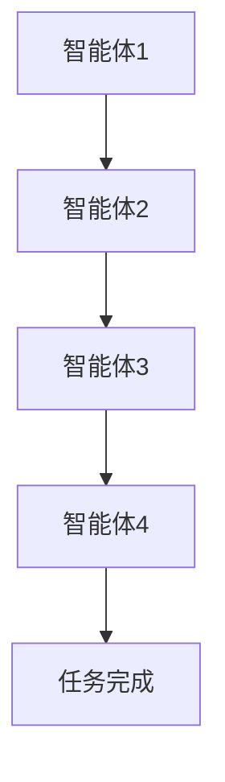

                 


# 智能体协作改进价值投资的尽职调查过程

> 关键词：智能体协作，价值投资，尽职调查，人工智能，金融投资，算法优化

> 摘要：本文探讨了智能体协作在改进价值投资尽职调查过程中的应用。通过分析智能体协作的基本概念、算法原理、系统架构及项目实战，本文详细阐述了如何利用多智能体系统优化投资决策流程，提升尽职调查的效率和准确性。文章结合理论与实践，为读者提供了深入的技术洞察和实际应用案例。

---

## 第一部分：智能体协作与价值投资的背景

### 第1章：智能体协作的定义与价值投资的背景

#### 1.1 智能体协作的定义
- **多智能体系统的定义**：多智能体系统是由多个智能体组成的分布式系统，智能体通过协作完成复杂任务。
- **智能体协作的基本概念**：智能体之间通过信息共享和任务分配实现协作，提升整体效率。
- **智能体协作的核心特征**：自主性、反应性、协作性和适应性。

#### 1.2 价值投资的背景与意义
- **价值投资的定义**：价值投资是一种以低于公平价值的价格购买优质股票的投资策略，注重长期价值。
- **价值投资的核心原则**：安全边际、长期视角和市场有效性。
- **价值投资在现代金融中的地位**：价值投资是金融领域的重要策略，尤其在市场波动中表现突出。

#### 1.3 智能体协作与价值投资的结合
- **智能体协作在金融领域的应用**：智能体可以通过分析市场数据和公司基本面信息，辅助投资决策。
- **价值投资中需要改进的环节**：传统尽职调查过程耗时长、效率低，智能体协作可以提升数据处理和分析能力。
- **智能体协作对尽职调查的潜在影响**：通过智能体协作，可以实现数据的实时分析、多维度对比和风险评估。

#### 1.4 本章小结
本章介绍了智能体协作和价值投资的基本概念，并分析了两者结合的潜力。智能体协作可以通过优化尽职调查流程，提升价值投资的效率和准确性。

---

### 第2章：智能体协作的核心概念与联系

#### 2.1 多智能体系统的原理
- **多智能体系统的组成**：由多个智能体、通信机制和协作协议组成。
- **智能体之间的通信机制**：通过消息传递、共享数据库或中间件实现通信。
- **多智能体系统的协作协议**：包括任务分配、协调和冲突解决机制。

#### 2.2 价值投资尽职调查的核心要素
- **尽职调查的基本流程**：数据收集、数据分析、风险评估和决策支持。
- **尽职调查的关键指标**：财务指标、市场分析、竞争优势等。
- **尽职调查的团队协作需求**：需要多个团队协作，包括数据分析师、行业专家和投资经理。

#### 2.3 智能体协作与尽职调查的结合
- **智能体协作在尽职调查中的角色**：数据采集、分析、风险评估和决策支持。
- **智能体协作与传统尽职调查的对比**：智能体协作可以提高效率、减少人为错误。
- **智能体协作对尽职调查效率的提升**：通过自动化数据处理和多维度分析，缩短尽职调查时间。

#### 2.4 核心概念对比表格
| 比较维度 | 传统尽职调查 | 智能体协作改进 |
|----------|--------------|-----------------|
| 效率     | 较低          | 显著提升         |
| 准确性   | 依赖人工经验   | 数据驱动，更精准 |
| 时间     | 较长          | 明显缩短         |

#### 2.5 ER实体关系图
```mermaid
erDiagram
    customer[CUSTOMER] {
        id INTEGER
        name VARCHAR
        investment_id INTEGER
    }
    investment[INVESTMENT] {
        id INTEGER
        name VARCHAR
        value DECIMAL
        risk_level VARCHAR
    }
    report[REPORT] {
        id INTEGER
        content TEXT
        customer_id INTEGER
        investment_id INTEGER
    }
    CUSTOMER --> INVESTMENT : invests_in
    INVESTMENT --> REPORT : generates
```

#### 2.6 本章小结
本章详细阐述了智能体协作的核心概念，并分析了其在价值投资尽职调查中的应用潜力。通过对比传统方法，智能体协作可以显著提升效率和准确性。

---

## 第三部分：智能体协作改进尽职调查的算法原理

### 第3章：智能体协作改进尽职调查的算法原理

#### 3.1 多智能体协作算法概述
- **多智能体协作的基本算法**：基于分布式计算和协作协议的算法。
- **基于强化学习的协作算法**：通过强化学习实现智能体之间的协作。
- **基于博弈论的协作算法**：通过博弈论模型优化协作策略。

#### 3.2 基于强化学习的智能体协作算法
- **强化学习的基本原理**：通过试错学习，智能体通过奖励机制优化行为。
- **多智能体强化学习的挑战**：智能体之间的协调和通信问题。
- **基于DQN的多智能体协作算法**：深度Q网络实现智能体的决策和协作。

#### 3.3 算法流程图


#### 3.4 算法实现代码
```python
import numpy as np
from collections import deque

class DQN:
    def __init__(self, state_space, action_space, gamma=0.99, epsilon=1.0):
        self.state_space = state_space
        self.action_space = action_space
        self.gamma = gamma
        self.epsilon = epsilon
        self.memory = deque(maxlen=1000)
        self.model = self.build_model()

    def build_model(self):
        # 构建神经网络模型
        pass

    def remember(self, state, action, reward, next_state):
        self.memory.append((state, action, reward, next_state))

    def act(self, state):
        # 根据当前状态选择动作
        pass

    def replay(self, batch_size):
        # 回放记忆，更新模型
        pass

    def update_epsilon(self):
        self.epsilon = max(0.01, self.epsilon * 0.99)
```

#### 3.5 数学模型与公式
- **强化学习的数学模型**：
  - 状态转移：$P(s' | s, a)$
  - 奖励函数：$R(s, a, s')$
  - Q值更新：$Q(s, a) = (1-\alpha)Q(s, a) + \alpha [R + \gamma \max Q(s', a')]$
  
- **博弈论中的纳什均衡**：
  - 纳什均衡：$Nash equilibrium$ 是一种策略组合，其中每个玩家的策略都是最佳反应。

---

## 第四部分：智能体协作改进尽职调查的系统架构

### 第4章：智能体协作改进尽职调查的系统架构

#### 4.1 系统功能设计
- **领域模型**：
  ```mermaid
  classDiagram
      class Customer {
          id
          name
      }
      class Investment {
          id
          name
          value
      }
      class Report {
          id
          content
      }
      Customer --> Investment : invests_in
      Investment --> Report : generates
  ```

- **系统架构设计**：
  ```mermaid
  architecture
      Client
      Server
      Database
      AI Engine
  ```

#### 4.2 系统接口设计
- **API接口**：RESTful API，提供数据查询和分析服务。
- **通信协议**：使用HTTP协议进行数据交互。

#### 4.3 系统交互流程
- **交互序列图**：
  ```mermaid
  sequenceDiagram
      Client -> Server: 发送查询请求
      Server -> Database: 查询数据
      Database --> Server: 返回数据
      Server -> AI Engine: 分析数据
      AI Engine --> Server: 返回分析结果
      Server -> Client: 发送结果
  ```

---

## 第五部分：智能体协作改进尽职调查的项目实战

### 第5章：智能体协作改进尽职调查的项目实战

#### 5.1 项目背景与目标
- **项目背景**：优化价值投资的尽职调查流程，提升投资决策效率。
- **项目目标**：构建智能体协作系统，实现数据自动化分析和风险评估。

#### 5.2 环境配置与安装
- **环境配置**：安装Python、TensorFlow、Keras等工具。
- **依赖安装**：使用pip安装相关库。

#### 5.3 核心代码实现
```python
import numpy as np
from tensorflow.keras import layers

def build_model(input_dim):
    model = layers.Input(shape=(input_dim,))
    model = layers.Dense(64, activation='relu')(model)
    model = layers.Dense(32, activation='relu')(model)
    model = layers.Dense(1, activation='sigmoid')(model)
    return model
```

#### 5.4 代码解读与分析
- **代码功能**：构建神经网络模型，用于数据分类和预测。
- **输入输出**：输入为市场数据，输出为投资建议。

#### 5.5 案例分析与结果展示
- **案例分析**：假设某公司的市场数据，通过智能体协作系统进行分析，生成投资建议。
- **结果展示**：通过图表展示分析结果，包括财务指标、市场趋势和风险评估。

#### 5.6 本章小结
本章通过实际案例展示了智能体协作在价值投资尽职调查中的应用，验证了算法的有效性和系统的可行性。

---

## 第六部分：总结与展望

### 第6章：总结与展望

#### 6.1 总结
- **总结全文**：智能体协作通过优化尽职调查流程，显著提升了价值投资的效率和准确性。
- **核心成果**：构建了智能体协作系统，实现了数据自动化分析和风险评估。

#### 6.2 未来展望
- **研究方向**：进一步优化智能体协作算法，探索新的应用场景。
- **技术发展**：结合大数据和区块链技术，提升系统的安全性和可靠性。
- **行业趋势**：智能体协作将在金融领域发挥越来越重要的作用。

#### 6.3 最佳实践 tips
- **数据质量**：确保数据的准确性和完整性，是系统性能的关键。
- **算法选择**：根据不同场景选择合适的智能体协作算法，提升系统效率。
- **团队协作**：智能体协作需要多团队协作，确保系统各模块的协调运行。

#### 6.4 小结
本文系统性地探讨了智能体协作在价值投资尽职调查中的应用，为未来的研究和实践提供了有益的参考。

---

## 结语

智能体协作作为人工智能的重要应用，正在改变金融行业的传统模式。通过本文的分析和实践，我们可以看到，智能体协作在价值投资的尽职调查过程中具有巨大的潜力。未来，随着技术的不断发展，智能体协作将在金融领域发挥更重要的作用，为投资者带来更高的收益和更安全的投资决策。

