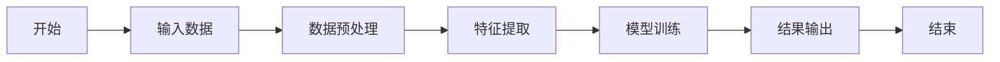

                 


# 智能体协作评估公司的人才吸引力：人力资本质量指标

## 关键词：智能体协作、人才吸引力、人力资本、质量指标、企业评估、算法原理、系统架构

## 摘要：本文探讨了如何利用智能体协作评估公司的人才吸引力，重点分析了人力资本质量指标的设计与实现。通过系统化的分析和案例研究，本文提出了基于智能体协作的评估模型，结合算法原理和系统架构设计，为企业提供有效的评估方法。文章内容涵盖背景介绍、核心概念、算法原理、系统设计、项目实战和最佳实践，旨在为企业在人才管理中提供科学的决策支持。

---

# 第一部分: 智能体协作评估公司的人才吸引力背景与概念

## 第1章: 人力资本质量指标概述

### 1.1 人力资本的定义与重要性
#### 1.1.1 人力资本的核心概念
人力资本是指企业在员工身上投入的资本，包括知识、技能、经验和创新能力。人力资本的质量直接关系到企业的竞争力和长期发展。

#### 1.1.2 人力资本在企业中的作用
人力资本是企业的核心资源，决定了企业的创新能力、市场响应能力和组织执行力。高素质的人力资本能够提升企业的整体绩效和市场地位。

#### 1.1.3 人力资本质量的衡量标准
人力资本质量的衡量标准包括员工的教育背景、工作经验、技能水平、创新能力、团队协作能力和绩效表现等。

### 1.2 智能体协作的定义与特点
#### 1.2.1 智能体的基本概念
智能体（Intelligent Agent）是指具有感知环境、自主决策和执行任务能力的实体。智能体可以通过协作完成复杂任务，提升整体效率。

#### 1.2.2 智能体协作的核心特征
智能体协作的核心特征包括目标一致性、信息共享、协同决策和动态适应性。通过协作，智能体能够充分发挥各自的优势，实现更高的目标。

#### 1.2.3 智能体协作的优势与挑战
智能体协作的优势在于能够提升任务效率、优化资源配置和增强问题解决能力。然而，协作过程中也面临信息不对称、协调成本高和决策冲突等挑战。

### 1.3 人才吸引力的定义与影响因素
#### 1.3.1 人才吸引力的内涵
人才吸引力是指企业在吸引和留住高素质人才方面的能力，反映了企业在人才市场上的竞争力。

#### 1.3.2 影响人才吸引力的关键因素
影响人才吸引力的关键因素包括企业的声誉、职业发展机会、薪酬福利、工作环境、企业文化和社会责任等。

#### 1.3.3 企业人才吸引力的评估方法
企业人才吸引力的评估方法包括定量分析（如招聘效率、员工留存率）和定性分析（如员工满意度、品牌影响力）。

### 1.4 本章小结
本章介绍了人力资本质量指标的核心概念、智能体协作的基本特征以及人才吸引力的定义和影响因素。通过这些分析，为后续的智能体协作评估模型奠定了理论基础。

---

# 第二部分: 人力资本质量指标的核心概念与联系

## 第2章: 人力资本质量指标体系

### 2.1 核心概念与属性对比
#### 2.1.1 核心概念的定义与特征
人力资本质量指标体系的核心概念包括员工能力、员工绩效、员工满意度和员工流动性等。

#### 2.1.2 核心概念的属性对比表格
以下是核心概念的属性对比表格：

| 概念       | 属性1（定义）                  | 属性2（特征）                  | 属性3（影响因素）              |
|------------|-------------------------------|-------------------------------|-------------------------------|
| 员工能力   | 员工的知识、技能和经验         | 技能水平、学习能力、创新能力   | 职位要求、培训机会、工作挑战   |
| 员工绩效   | 员工的工作成果和目标达成情况   | 工作效率、质量、成果           | 个人能力、工作环境、管理支持   |
| 员工满意度 | 员工对工作条件和环境的满意程度 | 工作满意度、职业发展机会       | 薪酬福利、工作环境、企业文化   |
| 员工流动性 | 员工的离职率和留存率           | 离职意向、职业发展机会         | 薪酬福利、工作环境、外部机会   |

#### 2.1.3 实体关系图
以下是人力资本质量指标体系的实体关系图：

```mermaid
entity HumanCapital {
  id
  name
  qualityMetrics
}
entity CollaborationAgent {
  id
  role
  capability
}
relationship Collaborates {
  HumanCapital --> CollaborationAgent
  CollaborationAgent --> HumanCapital
}
```

### 2.2 本章小结
本章通过对比分析人力资本质量指标的核心概念，揭示了各概念之间的相互关系和影响。实体关系图进一步明确了各实体之间的协作关系，为后续的智能体协作评估模型提供了理论支持。

---

# 第三部分: 智能体协作评估的算法原理

## 第3章: 评估模型的算法原理

### 3.1 算法原理概述
#### 3.1.1 算法的基本思路
智能体协作评估模型的基本思路是通过智能体之间的协作，对人力资本质量指标进行综合评估。模型采用多智能体协作算法，结合回归分析和聚类分析，对员工能力和绩效进行预测和分类。

#### 3.1.2 算法的输入与输出
- **输入**：员工的基本信息（教育背景、工作经验）、绩效数据（工作效率、质量）、满意度数据（工作满意度、职业发展机会）。
- **输出**：员工综合能力评估结果、团队协作能力评估结果和企业人才吸引力指数。

#### 3.1.3 算法的流程图
以下是智能体协作评估模型的流程图：



### 3.2 数学模型与公式
智能体协作评估模型的核心公式如下：

$$
\text{综合能力评估} = \alpha \times \text{员工能力} + \beta \times \text{员工绩效} + \gamma \times \text{员工满意度}
$$

其中，$\alpha$、$\beta$、$\gamma$ 是各指标的权重系数，通常通过主成分分析或层次分析法确定。

### 3.3 通俗易懂的举例说明
假设某公司有100名员工，其中50名为高能力员工，30名为中等能力员工，20名为低能力员工。通过智能体协作评估模型，可以将高能力员工的绩效和满意度进行综合评估，最终得出高能力员工的综合能力评估为85分，中等能力员工为70分，低能力员工为55分。

### 3.4 本章小结
本章通过算法流程图和数学公式，详细讲解了智能体协作评估模型的原理和实现方法。通过实例分析，进一步验证了模型的有效性和可行性。

---

## 通过以上目录结构，可以开始撰写完整的文章内容，确保每个章节都有详细的解释和实例分析。

