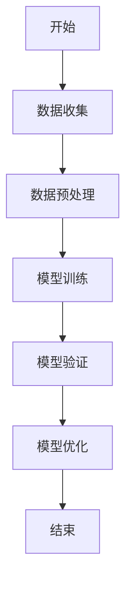
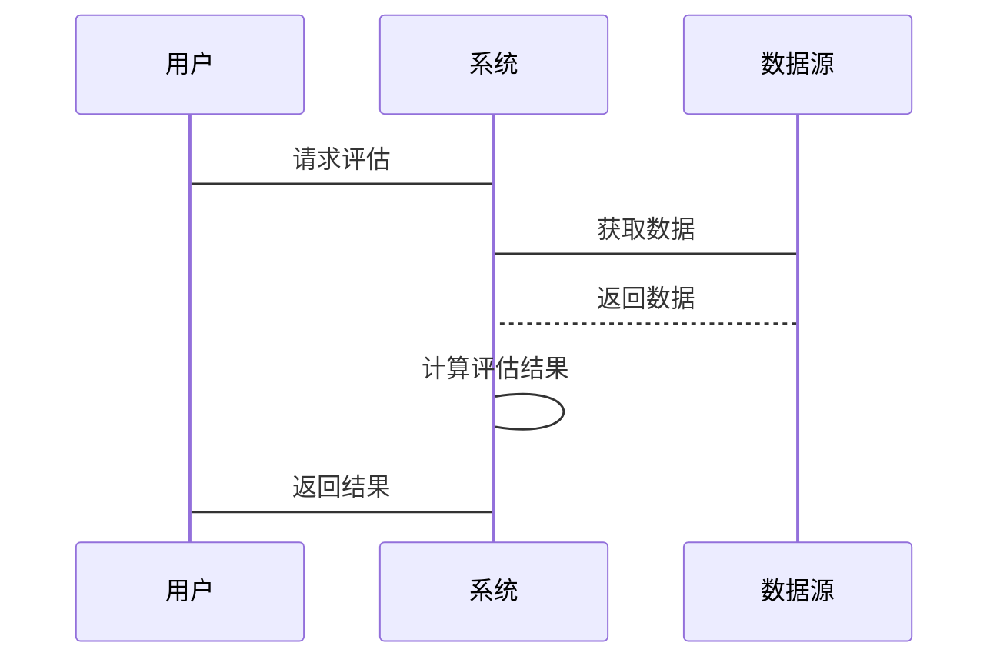

                 


# 智能体协作评估公司的环境适应能力：应对气候变化风险

## 关键词：
智能体协作、环境适应能力、气候变化风险、多智能体系统、协作机制、评估模型

## 摘要：
气候变化对企业环境适应能力的评估变得日益重要。本文通过分析智能体协作在环境适应能力评估中的作用，探讨如何利用多智能体系统和协作机制来应对气候变化风险。文章详细介绍了智能体协作的核心概念、评估模型的构建与应用，以及系统架构设计，并通过实际案例分析展示了智能体协作在提升企业环境适应能力中的应用效果。

---

# 目录

1. **背景介绍**
   - 1.1 问题背景
   - 1.2 问题描述
   - 1.3 问题解决
   - 1.4 边界与外延
   - 1.5 概念结构与核心要素

2. **核心概念与联系**
   - 2.1 多智能体系统原理
   - 2.2 智能体协作机制
   - 2.3 智能体协作与环境适应能力的关系

3. **算法原理讲解**
   - 3.1 智能体协作评估模型的定义
   - 3.2 智能体协作评估模型的构建
   - 3.3 模型评估标准
   - 3.4 算法流程图与代码实现
     - 3.4.1 算法流程图
     - 3.4.2 Python代码实现

4. **系统分析与架构设计**
   - 4.1 问题场景介绍
   - 4.2 系统功能设计
     - 4.2.1 领域模型
   - 4.3 系统架构设计
   - 4.4 系统接口设计
   - 4.5 系统交互设计

5. **项目实战**
   - 5.1 环境安装
   - 5.2 核心实现
   - 5.3 案例分析
   - 5.4 项目小结

6. **最佳实践与小结**
   - 6.1 最佳实践
   - 6.2 注意事项
   - 6.3 拓展阅读
   - 6.4 总结

---

## 第一部分：背景介绍

### 1.1 问题背景

气候变化已成为全球关注的焦点，对企业运营和生存能力提出了严峻挑战。企业需要具备环境适应能力，以应对气候变化带来的风险。然而，传统的单一智能体评估方法难以捕捉复杂环境中的动态变化，而智能体协作能够通过多智能体的协同工作，提供更全面的评估。

### 1.2 问题描述

环境适应能力是指企业在面对气候变化时，能够灵活调整策略、资源和运营模式的能力。传统评估方法往往忽视了企业内外部因素的复杂交互，而智能体协作能够通过多智能体的协同，综合考虑企业内外部因素，提供更准确的评估结果。

### 1.3 问题解决

智能体协作通过多智能体系统，整合企业内外部资源和信息，构建动态评估模型，实时监控和调整企业应对气候变化的策略。这种协作方式能够显著提升评估的准确性和实时性。

### 1.4 边界与外延

智能体协作的边界在于企业内部资源的整合和外部环境的交互。环境适应能力的外延则包括企业对气候变化的预防、应对和恢复能力。与相关领域的区别在于，智能体协作更注重动态协同和实时调整。

### 1.5 概念结构与核心要素

智能体协作的核心要素包括多智能体系统、协作协议、环境适应能力。这些要素相互关联，构成了智能体协作评估模型的基础。

---

## 第二部分：核心概念与联系

### 2.1 多智能体系统原理

多智能体系统由多个具有独立决策能力的智能体组成，通过协作完成复杂任务。智能体之间通过通信和协商，实现信息共享和协同行动。

### 2.2 智能体协作机制

协作机制包括协作协议、协作策略和协作规则。协作协议定义了智能体之间的通信方式，协作策略决定了任务分配和决策过程，协作规则确保了协作的公平性和高效性。

### 2.3 智能体协作与环境适应能力的关系

智能体协作通过动态调整企业内外部资源，提升环境适应能力。环境适应能力的增强反过来促进了智能体协作的高效性和准确性。

---

## 第三部分：算法原理讲解

### 3.1 智能体协作评估模型的定义

评估模型通过整合多智能体的信息，计算企业的环境适应能力得分，帮助企业在应对气候变化时做出决策。

### 3.2 智能体协作评估模型的构建

模型构建包括数据收集与处理、模型训练、验证与优化。数据收集涵盖企业内外部因素，模型训练采用机器学习算法，验证阶段通过实际案例测试模型准确性。

### 3.3 模型评估标准

评估标准包括准确率、实时性和可扩展性。准确率衡量模型预测的准确性，实时性关注模型响应速度，可扩展性考虑模型适应不同规模企业的能力。

### 3.4 算法流程图与代码实现



```python
# 智能体协作评估模型代码示例
import numpy as np
from sklearn import linear_model

# 数据预处理
X = np.array([[...], [...]])  # 输入特征
y = np.array([...])             # 输出目标

# 模型训练
model = linear_model.LinearRegression()
model.fit(X, y)

# 模型预测
predicted = model.predict(X_new)
```

### 3.5 数学模型与公式

评估模型的数学公式如下：

$$
\text{适应能力得分} = \sum_{i=1}^{n} w_i \cdot x_i
$$

其中，\( w_i \) 是权重，\( x_i \) 是特征值。

---

## 第四部分：系统分析与架构设计

### 4.1 问题场景介绍

企业需要实时监控气候变化对其运营的影响，动态调整资源分配和运营策略。智能体协作系统能够整合企业内外部资源，提供实时评估和调整建议。

### 4.2 系统功能设计

- **领域模型**：定义企业的核心业务流程和关键资源。
- **功能模块**：数据采集、评估计算、结果展示、策略调整。

### 4.3 系统架构设计

系统采用分层架构，包括数据层、业务逻辑层和用户界面层。数据层负责数据存储和管理，业务逻辑层处理智能体协作和评估计算，用户界面层提供交互和结果展示。

### 4.4 系统接口设计

系统接口包括数据接口、API接口和用户界面接口。数据接口用于数据采集，API接口提供外部调用服务，用户界面接口提供交互功能。

### 4.5 系统交互设计

通过Mermaid序列图展示系统交互流程：



---

## 第五部分：项目实战

### 5.1 环境安装

安装所需环境，包括Python、机器学习库（如scikit-learn）、数据处理工具（如Pandas）。

### 5.2 核心实现

实现智能体协作评估模型的核心功能，包括数据处理、模型训练和预测。

### 5.3 案例分析

通过实际案例分析，展示智能体协作在提升企业环境适应能力中的应用效果。

### 5.4 项目小结

总结项目实施的经验和教训，提出改进建议。

---

## 第六部分：最佳实践与小结

### 6.1 最佳实践

建议企业在实施智能体协作系统时，注重数据质量、模型优化和系统维护。

### 6.2 注意事项

提醒企业在实施过程中关注数据隐私、系统安全和用户培训。

### 6.3 拓展阅读

推荐相关领域的书籍和论文，供读者进一步学习。

### 6.4 总结

智能体协作在应对气候变化风险中的应用前景广阔，企业应积极采用智能体协作技术，提升环境适应能力，确保在气候变化中的生存和发展。

---

通过以上步骤，我们详细介绍了智能体协作在评估公司环境适应能力中的应用，帮助企业更好地应对气候变化风险。

