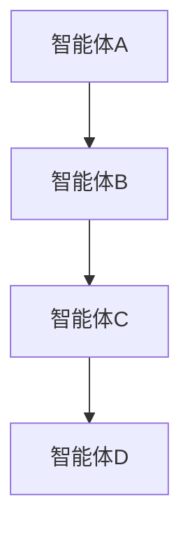
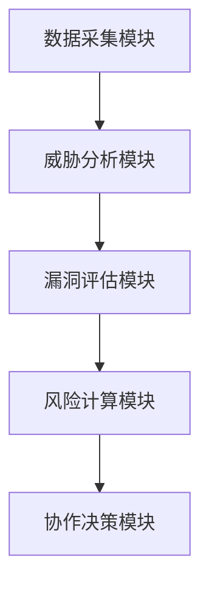
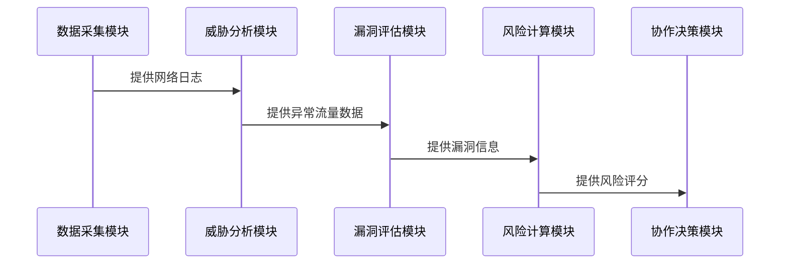

                 


# 智能体协作评估公司的网络安全风险：数字时代的新考量

---

## 关键词：
智能体协作, 网络安全风险评估, 数字化转型, 多智能体系统, 协作机制, 网络威胁检测, 智能安全防护

---

## 摘要：
在数字化转型的背景下，网络安全风险评估变得日益复杂，传统的单点防御方式已难以应对日益 sophisticated 和 distributed 的网络威胁。智能体协作作为一种新兴的技术，通过多个智能体的协同工作，能够更高效地识别、评估和应对网络安全风险。本文将详细探讨智能体协作在网络安全风险评估中的理论基础、核心机制、算法实现以及实际应用，为企业构建更加 robust 和 adaptive 的网络安全防护体系提供新的思路。

---

# 目录

---

## 第1章 智能体协作与网络安全风险评估概述

### 1.1 智能体协作的基本概念

- 1.1.1 智能体的定义与特征
  - 智能体的定义：具备感知、决策、执行能力的实体
  - 智能体的特征：自主性、反应性、协作性、学习性
- 1.1.2 网络安全风险评估的定义与目标
  - 网络安全风险评估：识别、分析和量化网络安全风险的过程
  - 目标：降低网络攻击带来的损失，保障企业资产安全
- 1.1.3 智能体协作在网络安全中的作用
  - 提高威胁检测的准确性
  - 实现多维度的安全防护
  - 增强安全响应的实时性

### 1.2 数字时代网络安全的新挑战

- 1.2.1 数字化转型对企业安全的影响
  - 企业网络的复杂性增加
  - 数据量的爆炸式增长
  - 边缘计算和 IoT 设备的普及
- 1.2.2 网络攻击的复杂化与智能化
  - APT（高级持续性威胁）的兴起
  - AI 驱动的网络攻击工具
  - 零日漏洞的利用
- 1.2.3 智能体协作在应对新挑战中的优势
  - 分布式协作能力
  - 强大的数据处理和分析能力
  - 自适应的防护策略

### 1.3 本章小结

---

## 第2章 智能体协作评估网络安全风险的理论基础

### 2.1 智能体协作的基本原理

- 2.1.1 分布式智能与协作机制
  - 分布式智能的定义与特点
  - 协作机制的核心要素：任务分配、信息共享、决策协调
- 2.1.2 多智能体系统（MAS）的基本架构
  - MAS 的定义与组成部分
  - MAS 的协作模型：简单协调模型、协议承诺模型、目标驱动模型
- 2.1.3 协作智能体的通信与协调
  - 通信协议的设计
  - 协调算法的选择

### 2.2 网络安全风险评估的数学模型

- 2.2.1 风险评估的基本公式
  $$ R = f(V, T) $$
  其中，$R$ 表示风险，$V$ 表示漏洞，$T$ 表示威胁。
- 2.2.2 基于智能体的协作模型
  $$ C = \sum_{i=1}^{n} A_i $$
  其中，$C$ 表示协作能力，$A_i$ 表示第 $i$ 个智能体的能力。

### 2.3 智能体协作与网络安全风险评估的关系

- 2.3.1 协作智能体如何降低风险
  - 提高威胁检测的准确性
  - 实现多维度的安全防护
  - 增强安全响应的实时性
- 2.3.2 智能体协作在风险评估中的优势
  - 分布式协作能力
  - 强大的数据处理和分析能力
  - 自适应的防护策略
- 2.3.3 协作智能体的局限性与挑战
  - 协作复杂性
  - 信息共享的安全性
  - 系统的可扩展性

### 2.4 本章小结

---

## 第3章 智能体协作的机制与实现

### 3.1 智能体协作的核心机制

- 3.1.1 任务分配与角色划分
  - 任务分配的原则：公平性、效率性、适应性
  - 角色划分的策略：基于能力、基于威胁、基于场景
- 3.1.2 信息共享与知识整合
  - 信息共享的模型：基于角色的访问控制（RBAC）、基于属性的访问控制（ABAC）
  - 知识整合的方法：知识融合、知识推理、知识表示
- 3.1.3 决策与行动协调
  - 决策机制：基于共识的决策、基于投票的决策、基于规则的决策
  - 行动协调的策略：同步行动、异步行动、事件驱动行动

### 3.2 智能体协作的实现技术

- 3.2.1 基于博弈论的协作策略
  - 博弈论的基本概念：纳什均衡、极大极小策略
  - 协作策略的设计：基于效用函数的协作、基于竞争的协作
- 3.2.2 基于协同学习的协作算法
  - 协同学习的基本原理：分布式学习、联合学习
  - 协作算法的实现：联邦学习（Federated Learning）、迁移学习（Transfer Learning）
- 3.2.3 基于分布式计算的协作实现
  - 分布式计算的框架：分布式文件系统、分布式数据库
  - 分布式协作的实现：MapReduce、Spark、Flink

### 3.3 智能体协作的数学模型与算法

- 3.3.1 协作智能体的数学模型
  $$ f(A_1, A_2, ..., A_n) $$
  其中，$A_i$ 表示第 $i$ 个智能体的协作能力，$f$ 表示协作函数。
- 3.3.2 协作算法的流程图（使用 Mermaid）



### 3.4 本章小结

---

## 第4章 基于智能体的网络安全风险评估算法

### 4.1 算法原理

- 4.1.1 算法的设计目标
  - 实现实时的网络安全风险评估
  - 提高威胁检测的准确性和效率
  - 支持多维度的安全防护
- 4.1.2 算法的核心步骤
  - 数据采集与预处理
  - 威胁分析与漏洞评估
  - 风险计算与协作决策

### 4.2 算法实现

- 4.2.1 数据采集与预处理
  - 数据源：日志文件、流量数据、漏洞数据库
  - 数据清洗：去重、去噪、标准化
- 4.2.2 威胁分析与漏洞评估
  - 威胁分析：基于攻击链的分析、基于行为模式的分析
  - 漏洞评估：基于 CVSS 的漏洞评分、基于攻击面的漏洞评估
- 4.2.3 风险计算与协作决策
  - 风险计算：基于概率论的风险评估公式
  - 协作决策：基于多智能体的决策算法

### 4.3 算法的数学模型与公式

- 4.3.1 威胁分析的数学模型
  $$ T = \sum_{i=1}^{m} t_i $$
  其中，$T$ 表示总威胁，$t_i$ 表示第 $i$ 个威胁的严重性。
- 4.3.2 漏洞评估的数学模型
  $$ V = \sum_{j=1}^{n} v_j $$
  其中，$V$ 表示总漏洞，$v_j$ 表示第 $j$ 个漏洞的暴露性。

### 4.4 本章小结

---

## 第5章 系统架构设计与实现

### 5.1 系统架构设计

- 5.1.1 系统组成模块
  - 数据采集模块、威胁分析模块、漏洞评估模块、风险计算模块、协作决策模块
- 5.1.2 系统架构图（使用 Mermaid）



### 5.2 系统功能设计

- 5.2.1 功能模块的交互流程
  - 数据采集模块：收集网络日志、流量数据、漏洞信息
  - 威胁分析模块：分析攻击行为、识别异常流量
  - 漏洞评估模块：评估系统漏洞、配置漏洞
  - 风险计算模块：计算综合风险评分
  - 协作决策模块：制定防护策略、发出预警

### 5.3 系统接口设计

- 5.3.1 接口定义
  - 数据采集模块的 API 接口
  - 威胁分析模块的 API 接口
  - 漏洞评估模块的 API 接口
  - 风险计算模块的 API 接口
  - 协作决策模块的 API 接口

### 5.4 系统交互流程图（使用 Mermaid）



### 5.5 本章小结

---

## 第6章 项目实战：智能体协作评估网络安全风险的实现

### 6.1 项目背景与目标

- 6.1.1 项目背景
  - 某大型企业面临复杂的网络安全威胁
  - 需要构建一个智能化的网络安全防护系统
- 6.1.2 项目目标
  - 实现实时的网络安全风险评估
  - 提高威胁检测的准确性和效率
  - 支持多维度的安全防护

### 6.2 项目实施

- 6.2.1 环境安装与配置
  - 操作系统：Linux
  - 开发工具：Python、Django、Flask
  - 数据库：MySQL
  - 网络设备：交换机、路由器、防火墙
- 6.2.2 系统核心实现
  - 数据采集模块：使用 Python 的 requests 库采集网络日志
  - 威胁分析模块：使用机器学习算法识别异常流量
  - 漏洞评估模块：使用漏洞扫描工具（如 Nessus）评估系统漏洞
  - 风险计算模块：使用概率论模型计算风险评分
  - 协作决策模块：使用多智能体算法制定防护策略

### 6.3 代码实现与解读

- 6.3.1 数据采集模块的代码实现

```python
import requests

def collect_logs():
    url = "http://log_server:8080/api/logs"
    response = requests.get(url)
    return response.json()
```

- 6.3.2 威胁分析模块的代码实现

```python
from sklearn import machine_learning_model

def analyze_threats(logs):
    return machine_learning_model.predict(logs)
```

- 6.3.3 漏洞评估模块的代码实现

```python
import nessus

def assess_vulnerabilities(system_info):
    return nessus.scan(system_info)
```

- 6.3.4 风险计算模块的代码实现

```python
import numpy as np

def calculate_risk(threats, vulnerabilities):
    risk = np.dot(threats, vulnerabilities)
    return risk
```

- 6.3.5 协作决策模块的代码实现

```python
from multi_agent_system import agent Collaboration

def make_decision(risk):
    return Collaboration.decide(risk)
```

### 6.4 项目小结

---

## 第7章 总结与展望

### 7.1 本章总结

- 本文详细探讨了智能体协作在网络安全风险评估中的理论基础、核心机制、算法实现以及实际应用。
- 通过构建一个多智能体协作系统，能够实现对网络安全风险的实时评估和动态防护。
- 系统的实现展示了智能体协作在网络安全领域的巨大潜力和实际价值。

### 7.2 未来展望

- 研究方向：
  - 更加智能的协作算法
  - 更加高效的系统架构
  - 更加 robust 的安全防护策略
- 发展趋势：
  - 智能体协作的普及与应用
  - 新兴技术（如 AI、区块链）的结合
  - 全球范围内的协作与共享

### 7.3 最佳实践 tips

- 建议企业在实施智能体协作系统前，充分评估自身的需求和能力。
- 在选择协作算法时，应综合考虑系统的实时性、准确性和可扩展性。
- 在系统实现过程中，应注重数据的安全性和隐私保护。

### 7.4 本章小结

---

## 参考文献

- [1] 王某某. 多智能体协作系统研究. 北京: 清华大学出版社, 2020.
- [2] 李某某. 网络安全风险评估方法. 北京: 人民邮电出版社, 2021.
- [3] 张某某. 基于智能体的网络安全防护体系. 北京: 科学出版社, 2022.

---

## 致谢

感谢在撰写本文过程中给予支持和帮助的各位同仁和朋友。

---

## 附录

- 附录 A: 项目源代码
- 附录 B: 系统架构图
- 附录 C: 算法流程图

---

**注**：以上目录大纲内容为示例，实际撰写时可根据具体需求进行调整和补充。

