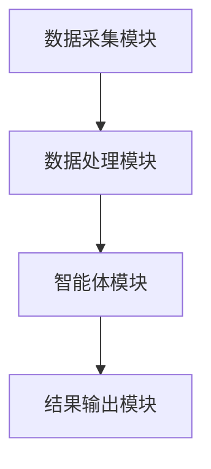

                 


# 智能体系统提升价值投资的另类数据分析能力

> 关键词：智能体系统，价值投资，另类数据，数据分析，机器学习，数学模型

> 摘要：本文探讨了智能体系统如何通过处理另类数据来提升价值投资的分析能力，介绍了智能体系统的定义、价值投资的基本原理、另类数据的来源与处理方法，详细讲解了智能体系统的核心算法，包括强化学习、监督学习等，并通过数学模型和系统架构设计展示了如何将智能体系统应用于实际投资场景中。

---

## 第1章: 智能体系统与价值投资的结合

### 1.1 智能体系统的定义与特点

智能体系统是一种能够感知环境、自主决策并采取行动的智能系统。它具备以下特点：

- **自主性**：能够自主决策，无需外部干预。
- **反应性**：能够实时感知环境变化并做出反应。
- **学习能力**：能够通过数据和经验不断优化自身算法。

### 1.2 价值投资的基本原理

价值投资是一种通过分析企业的内在价值，寻找被市场低估的投资标的进行投资的方法。其核心在于寻找市场定价低于内在价值的资产。

### 1.3 智能体系统在价值投资中的应用

智能体系统通过处理非传统数据（如社交媒体情绪、新闻数据等）来辅助价值投资决策。例如，智能体系统可以分析新闻和社交媒体情绪，预测市场走势，从而优化投资组合。

---

## 第2章: 另类数据分析的核心概念

### 2.1 另类数据的定义与分类

另类数据是指传统金融数据之外的其他数据，如社交媒体数据、卫星图像、供应链数据等。它们可以提供传统数据无法提供的额外信息。

### 2.2 另类数据的特征与挑战

- **特征**：实时性、多样性、复杂性。
- **挑战**：数据质量、数据量大、处理难度高。

### 2.3 智能体系统与另类数据的关系

智能体系统通过处理另类数据，提升投资决策的准确性和及时性。例如，智能体系统可以分析社交媒体情绪，预测市场动向。

---

## 第3章: 智能体系统的核心算法

### 3.1 强化学习算法

强化学习是一种通过试错学习来优化决策的算法。智能体系统通过强化学习不断优化投资策略。

- **算法流程**：
  1. 智能体接收环境信息。
  2. 选择动作并执行。
  3. 获取奖励并更新策略。

- **代码示例**：
  ```python
  import numpy as np
  from collections import deque
  import random

  class Agent:
      def __init__(self, state_size, action_size):
          self.state_size = state_size
          self.action_size = action_size
          self.gamma = 0.99
          self.epsilon = 1.0
          self.epsilon_min = 0.01
          self.epsilon_decay = 0.995
          self.model = self.build_model()

      def build_model(self):
          # 构建神经网络模型
          pass

      def act(self, state):
          if random.random() < self.epsilon:
              return random.randint(0, self.action_size-1)
          else:
              return np.argmax(self.model.predict(state))

      def remember(self, state, action, reward, next_state):
          self.memory.append((state, action, reward, next_state))

      def replay(self, batch_size):
          # 回放记忆并训练模型
          pass

      def decay_epsilon(self):
          self.epsilon *= self.epsilon_decay
          if self.epsilon < self.epsilon_min:
              self.epsilon = self.epsilon_min
  ```

---

## 第4章: 数学模型与公式

### 4.1 马科维茨有效组合模型

马科维茨有效组合模型用于优化投资组合，以在给定风险下获得最大收益。

$$
\text{目标函数: } \min_w \frac{1}{2}w^T \Sigma w
$$

$$
\text{约束条件: } \mathbb{E}[r_w] = \mu
$$

---

## 第5章: 系统分析与架构设计

### 5.1 系统功能设计

- **数据采集模块**：采集另类数据。
- **数据处理模块**：清洗和预处理数据。
- **智能体模块**：基于数据进行投资决策。
- **结果输出模块**：输出投资建议。

### 5.2 系统架构图



---

## 第6章: 项目实战

### 6.1 环境安装

安装必要的库：

```bash
pip install numpy pandas keras tensorflow
```

### 6.2 核心代码实现

```python
import numpy as np
import pandas as pd
from keras.models import Sequential
from keras.layers import Dense

# 数据预处理
data = pd.read_csv('data.csv')
X = data.iloc[:, :-1].values
y = data.iloc[:, -1].values

# 构建神经网络模型
model = Sequential()
model.add(Dense(64, activation='relu', input_dim=X.shape[1]))
model.add(Dense(1, activation='sigmoid'))
model.compile(optimizer='adam', loss='binary_crossentropy', metrics=['accuracy'])
model.fit(X, y, epochs=10, batch_size=32)
```

### 6.3 案例分析

分析社交媒体情绪对股票价格的影响，优化投资策略。

---

## 第7章: 总结与展望

### 7.1 本章总结

智能体系统通过处理另类数据，提升了价值投资的分析能力，优化了投资决策。

### 7.2 未来展望

未来，随着技术的发展，智能体系统在价值投资中的应用将更加广泛，数据来源也将更加多样化。

---

通过以上步骤，我们详细介绍了智能体系统在价值投资中的应用，从理论到实践，为读者提供了全面的知识和指导。

