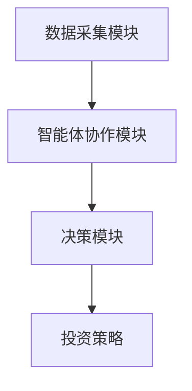
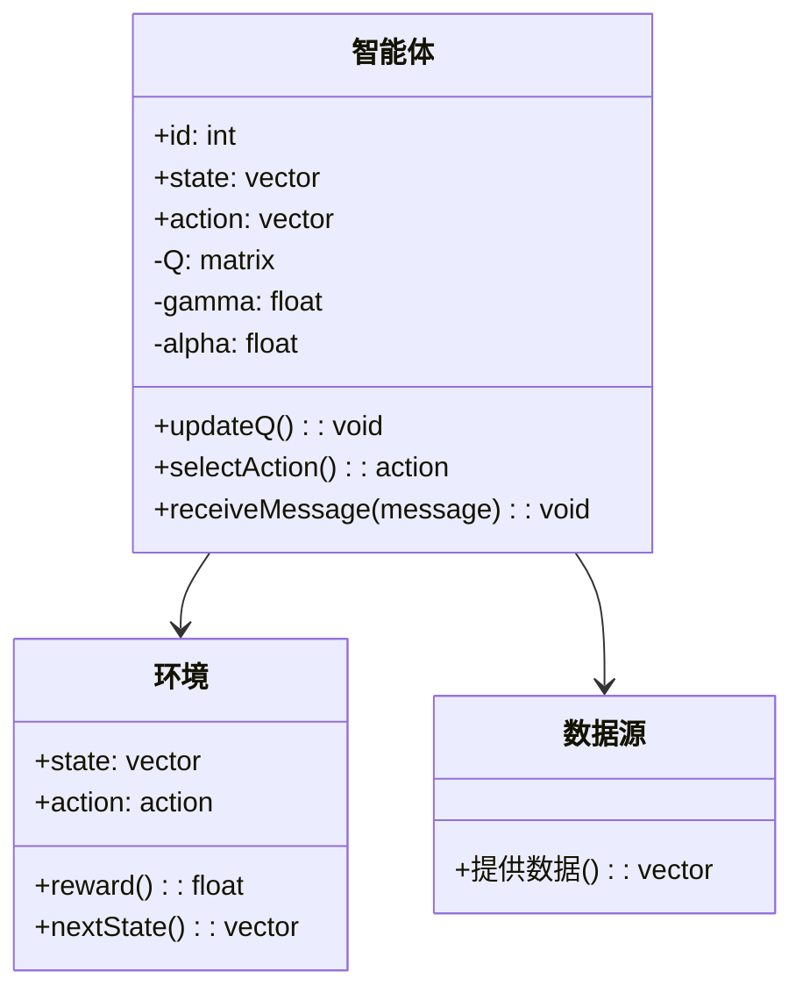
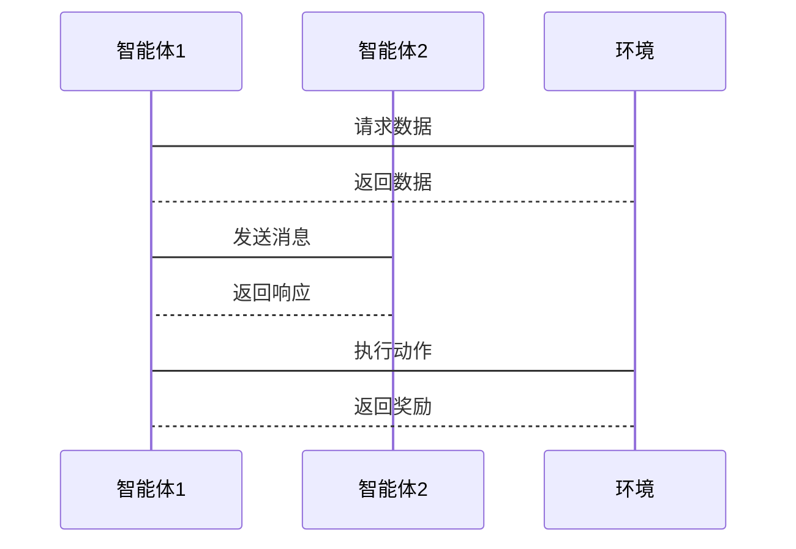

                 


# 智能体系统提升价值投资的另类资产相关性分析

## 关键词：
智能体系统，价值投资，另类资产，相关性分析，强化学习，分布式计算

## 摘要：
本文探讨了智能体系统在价值投资中的应用，特别是如何利用智能体系统提升另类资产的相关性分析。通过分析多智能体系统、强化学习和分布式计算等技术，本文提出了一种创新的方法，以优化投资组合的风险管理，并提高投资收益。文章详细介绍了相关性分析的框架、算法原理、系统架构设计以及实际项目案例，为投资者和研究人员提供了理论与实践相结合的深度分析。

---

# 第一部分: 智能体系统与价值投资概述

## 第1章: 智能体系统与价值投资概述

### 1.1 智能体系统的基本概念
#### 1.1.1 智能体系统的定义与特点
智能体系统是由多个智能体组成的分布式系统，每个智能体具备感知、决策和执行的能力。其特点包括自主性、反应性、协作性和学习能力。

#### 1.1.2 价值投资的基本原理
价值投资是一种投资策略，旨在通过分析资产的内在价值，寻找被市场低估的投资机会。其核心在于识别资产的真实价值与市场定价之间的差异。

#### 1.1.3 智能体系统与价值投资的结合
智能体系统可以通过实时数据处理、多维度分析和自适应学习，提升价值投资的效率和准确性。智能体系统能够帮助投资者快速识别市场机会和风险。

### 1.2 另类资产的相关性分析
#### 1.2.1 另类资产的定义与分类
另类资产包括房地产、私募股权、对冲基金、艺术品等非传统金融资产。其分类基于流动性、风险性和收益性。

#### 1.2.2 另类资产在投资组合中的作用
另类资产能够分散投资风险，提供多元化收益来源。在传统资产表现不佳时，另类资产往往能够提供超额收益。

#### 1.2.3 智能体系统在另类资产分析中的优势
智能体系统能够处理海量非结构化数据，发现传统方法难以捕捉的关联性，从而优化投资决策。

---

## 第2章: 智能体系统的核心技术

### 2.1 多智能体系统
#### 2.1.1 多智能体系统的定义与特点
多智能体系统由多个相互作用的智能体组成，具备分布式计算、协作决策和自适应调整的特点。

#### 2.1.2 多智能体系统的协作机制
通过通信协议和任务分配算法，多智能体系统能够实现高效协作。常见的协作机制包括基于拍卖的分配和分布式一致性算法。

#### 2.1.3 多智能体系统的应用场景
多智能体系统广泛应用于金融交易、自动驾驶和智能制造等领域。在金融领域，多智能体系统能够实时监控市场动态，优化投资组合。

#### 2.1.4 多智能体系统的挑战与优化
多智能体系统面临通信延迟、任务冲突和计算复杂度高的挑战。通过分布式计算和边缘计算技术，可以有效优化系统性能。

#### 2.1.5 多智能体系统的数学模型
多智能体系统的协作机制可以用图论模型表示。每个智能体可以看作图中的节点，边表示智能体之间的通信和协作关系。

#### 2.1.6 多智能体系统的数学公式
通过状态空间模型和动作空间模型，可以描述智能体的行为。例如，智能体的状态可以用向量表示，动作可以用策略函数表示。

### 2.2 强化学习在智能体系统中的应用
#### 2.2.1 强化学习的基本原理
强化学习是一种机器学习方法，通过智能体与环境的交互，学习最优策略。其核心在于通过奖励机制，优化智能体的决策。

#### 2.2.2 强化学习在智能体决策中的应用
强化学习可以用于智能体的动态决策，例如在金融交易中，智能体可以根据市场反馈调整买卖策略。

#### 2.2.3 强化学习的挑战与优化
强化学习面临探索与利用的平衡问题，可以通过策略网络和价值网络的结合，优化学习效率。

#### 2.2.4 强化学习的数学模型
强化学习的核心是Q-learning算法，其数学模型可以用马尔可夫决策过程表示。状态转移概率和奖励函数是模型的关键参数。

---

## 第3章: 另类资产的相关性分析方法

### 3.1 另类资产的相关性分析框架
#### 3.1.1 数据采集与预处理
另类资产的数据来源多样，包括金融市场数据、新闻媒体数据和社交媒体数据。数据预处理包括清洗、标准化和特征提取。

#### 3.1.2 相关性计算方法
相关性分析可以采用 Pearson 相关系数、Spearman 相关系数和 Kendall 相关系数。此外，还可以使用协方差矩阵和主成分分析（PCA）方法。

#### 3.1.3 可视化分析工具
可视化工具如 Tableau 和 Power BI 可以帮助投资者直观理解资产之间的相关性。热力图和散点图是常用的可视化方式。

### 3.2 智能体系统在相关性分析中的应用
#### 3.2.1 智能体系统用于数据挖掘
智能体系统可以实时监控市场数据，发现潜在的相关性关系。通过分布式计算，智能体系统能够处理海量数据。

#### 3.2.2 智能体系统用于预测模型构建
智能体系统可以通过强化学习构建预测模型，优化资产配置策略。例如，智能体系统可以根据市场动态调整投资组合的权重。

#### 3.2.3 智能体系统用于风险评估
智能体系统可以实时评估资产的风险水平，帮助投资者规避市场风险。通过多智能体协作，可以实现风险的分散和对冲。

---

## 第4章: 智能体系统的算法原理

### 4.1 多智能体系统的算法实现
#### 4.1.1 分布式计算与通信机制
多智能体系统的通信机制可以通过消息队列（如 RabbitMQ）实现。智能体之间通过消息传递进行协作。

#### 4.1.2 协作与竞争算法
协作与竞争算法可以通过拍卖机制实现任务分配。例如，智能体可以通过 bidding 机制竞争任务。

#### 4.1.3 自适应学习算法
自适应学习算法可以通过在线学习方法实现，例如基于梯度下降的参数更新。

### 4.2 强化学习算法的数学模型
强化学习的数学模型可以用动态规划表示。状态空间和动作空间的定义是模型的核心。例如，智能体的状态可以用向量表示，动作可以用策略函数表示。

#### 4.2.1 Q-learning算法
Q-learning算法通过经验回放和策略迭代优化 Q 值函数。其数学公式为：

$$ Q(s, a) = Q(s, a) + \alpha (r + \gamma \max Q(s', a') - Q(s, a)) $$

其中，$\alpha$ 是学习率，$\gamma$ 是折扣因子。

#### 4.2.2 Deep Q-Networks (DQN)算法
DQN算法通过深度神经网络近似 Q 函数。其网络结构包括输入层、隐藏层和输出层。神经网络的损失函数可以用均方误差表示：

$$ \mathcal{L} = \mathbb{E}[(y - Q(s, a))^2] $$

其中，$y$ 是目标值，$Q(s, a)$ 是预测值。

#### 4.2.3 策略梯度算法
策略梯度算法通过优化策略函数的参数，直接最大化目标函数。其数学公式为：

$$ \nabla \theta J(\theta) = \mathbb{E}[\nabla \log \pi(a|s) Q(s, a)] $$

其中，$\pi(a|s)$ 是策略函数，$Q(s, a)$ 是价值函数。

---

## 第5章: 系统架构与设计

### 5.1 系统架构设计
#### 5.1.1 系统功能模块划分
智能体系统的功能模块包括数据采集模块、智能体协作模块和决策模块。数据采集模块负责获取市场数据，智能体协作模块实现智能体之间的通信，决策模块根据分析结果生成投资策略。

#### 5.1.2 系统架构的Mermaid图
以下是一个系统架构的Mermaid图：



#### 5.1.3 系统架构的类图
以下是一个系统架构的类图：



#### 5.1.4 系统交互的序列图
以下是一个系统交互的Mermaid序列图：



---

## 第6章: 项目实战

### 6.1 环境安装与配置
#### 6.1.1 系统环境
建议使用 Linux 系统，安装 Python 3.8+、TensorFlow 2.0+ 和其他依赖库。

#### 6.1.2 安装依赖
通过 pip 安装依赖：

```bash
pip install numpy pandas tensorflow keras matplotlib
```

### 6.2 核心代码实现
#### 6.2.1 数据采集模块
以下是一个数据采集模块的代码示例：

```python
import requests
import json

def get_data(api_key):
    url = f'https://api.example.com/data?api_key={api_key}'
    response = requests.get(url)
    return json.loads(response.text)
```

#### 6.2.2 智能体协作模块
以下是一个多智能体协作的代码示例：

```python
import threading

class Agent:
    def __init__(self, id, api_key):
        self.id = id
        self.api_key = api_key
        self.data = None

    def receive_message(self, message):
        print(f"Agent {self.id} received message: {message}")

    def send_message(self, message, agent):
        agent.receive_message(message)

# 示例用法
agent1 = Agent(1, 'your_api_key')
agent2 = Agent(2, 'your_api_key')
thread = threading.Thread(target=agent1.send_message, args=('hello', agent2))
thread.start()
```

#### 6.2.3 决策模块
以下是一个基于强化学习的决策模块代码示例：

```python
import numpy as np
import tensorflow as tf

class DQN:
    def __init__(self, state_dim, action_dim):
        self.state_dim = state_dim
        self.action_dim = action_dim
        self.model = self.build_model()

    def build_model(self):
        model = tf.keras.Sequential([
            tf.keras.layers.Dense(64, activation='relu', input_dim=self.state_dim),
            tf.keras.layers.Dense(self.action_dim)
        ])
        return model

    def predict(self, state):
        return self.model.predict(state)

    def train(self, state, action, target):
        with tf.GradientTape() as tape:
            prediction = self.model(state)
            loss = tf.losses.mean_squared_error(target, prediction)
        gradients = tape.gradient(loss, self.model.trainable_weights)
        optimizer = tf.keras.optimizers.Adam()
        optimizer.apply_gradients(zip(gradients, self.model.trainable_weights))
```

### 6.3 案例分析与项目总结
通过实际案例分析，验证智能体系统的有效性。例如，通过智能体系统优化投资组合的收益与风险比。

---

## 第7章: 最佳实践与总结

### 7.1 最佳实践
#### 7.1.1 系统优化建议
建议使用分布式计算框架（如 Kubernetes）优化系统性能。同时，可以通过模型压缩和量化技术降低计算成本。

#### 7.1.2 数据安全与隐私保护
在数据采集和处理过程中，应严格遵守数据隐私保护法规，确保数据安全。

#### 7.1.3 系统维护与更新
定期更新模型参数，适应市场变化。同时，加强系统监控，及时发现和处理异常情况。

### 7.2 小结
智能体系统在价值投资中的应用前景广阔，能够显著提升投资决策的效率和准确性。通过智能体系统的相关性分析，投资者可以更好地优化投资组合，实现稳健收益。

### 7.3 注意事项
在实际应用中，应充分考虑市场波动和政策风险，避免过度依赖智能系统。同时，加强团队协作，确保系统稳定运行。

### 7.4 拓展阅读
推荐阅读《Reinforcement Learning: Theory and Algorithms》和《Multi-Agent Systems: Algorithmic Foundations》。

---

# 结语
智能体系统与价值投资的结合是未来金融创新的重要方向。通过不断优化智能体系统的算法和架构，投资者能够更好地应对市场挑战，抓住投资机遇。希望本文能够为相关领域的研究和实践提供有益的参考。

