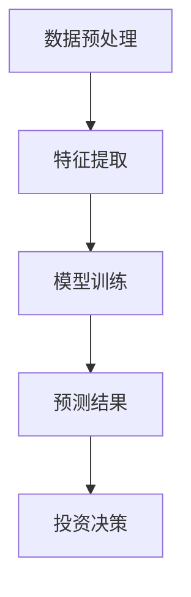
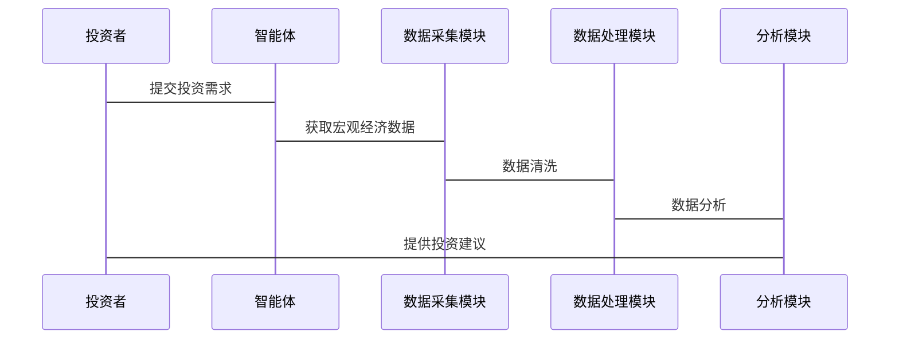

                 


```markdown
# 智能体系统提升价值投资的宏观经济指标综合分析

## 关键词：智能体系统, 价值投资, 宏观经济指标, 综合分析, 机器学习

## 摘要：  
本文探讨了智能体系统在价值投资中的应用，重点分析宏观经济指标的综合评估方法。通过智能体技术与宏观经济指标的结合，提出了一种基于机器学习的宏观经济分析框架，用于提升投资决策的科学性和准确性。

---

## 第1章: 智能体系统与宏观经济指标的背景介绍

### 1.1 智能体系统的基本概念
#### 1.1.1 智能体的定义与特点
智能体（Intelligent Agent）是指能够感知环境、自主决策并采取行动的实体。其特点包括自主性、反应性、目标导向和社会能力。

#### 1.1.2 智能体在金融领域的应用
智能体广泛应用于金融市场的交易、风险管理和投资决策等领域，通过实时数据处理和复杂模型分析，帮助投资者做出更明智的决策。

#### 1.1.3 智能体与宏观经济分析的结合
宏观经济指标是反映经济运行状态的关键数据，智能体通过分析这些指标，能够为投资决策提供更全面的支持。

### 1.2 宏观经济指标的核心概念
#### 1.2.1 宏观经济指标的分类与作用
宏观经济指标主要包括GDP、CPI、失业率、PMI等，这些指标能够反映经济的整体状况和未来趋势。

#### 1.2.2 宏观经济指标与价值投资的关系
价值投资依赖于对经济周期的判断，宏观经济指标是投资者评估资产价值的重要依据。

#### 1.2.3 宏观经济指标的综合分析方法
综合分析方法通过多指标权重分配，全面评估经济状况，为投资决策提供依据。

### 1.3 本章小结
智能体系统与宏观经济指标的结合为价值投资提供了新的思路，通过综合分析宏观经济指标，智能体能够更准确地评估投资价值。

---

## 第2章: 智能体系统与宏观经济指标的核心概念与联系

### 2.1 智能体系统的原理与机制
#### 2.1.1 智能体的感知与决策机制
智能体通过感知环境数据，利用算法进行分析和决策，实现自主行动。

#### 2.1.2 智能体的自适应与学习能力
智能体能够通过机器学习算法不断优化自身的分析模型，提高决策的准确性。

#### 2.1.3 智能体与宏观经济数据的交互
智能体通过实时获取宏观经济数据，分析其变化趋势，为投资决策提供支持。

### 2.2 宏观经济指标的属性特征对比
#### 2.2.1 不同宏观经济指标的特征分析
GDP反映经济总量，CPI反映通货膨胀，失业率反映劳动力市场状况。

#### 2.2.2 指标之间的相互关系
经济指标之间相互关联，共同影响整体经济运行。

#### 2.2.3 指标对价值投资的影响权重
不同指标对投资决策的影响程度不同，需根据实际情况进行权重分配。

### 2.3 智能体系统与宏观经济指标的ER实体关系图
```mermaid
erDiagram
    宏观经济指标 : 宏观经济指标
    智能体 : 智能体
    投资决策 : 投资决策
    宏观经济指标 --> 智能体 : 分析
    智能体 --> 投资决策 : 支持
```

### 2.4 本章小结
智能体系统与宏观经济指标的结合为投资决策提供了更全面的支持，通过综合分析宏观经济指标，智能体能够更准确地评估投资价值。

---

## 第3章: 智能体系统提升价值投资的算法原理

### 3.1 宏观经济指标分析的算法选择
#### 3.1.1 时间序列分析
时间序列分析用于预测经济指标的变化趋势，帮助投资者判断市场走向。

#### 3.1.2 机器学习算法
机器学习算法，如线性回归和神经网络，能够发现数据中的复杂模式，提高分析精度。

#### 3.1.3 综合分析方法
综合分析方法通过多指标加权，全面评估经济状况，为投资决策提供支持。

### 3.2 基于机器学习的宏观经济分析模型
#### 3.2.1 数据预处理
对宏观经济指标进行清洗和标准化处理，确保数据质量。

#### 3.2.2 模型构建
使用机器学习算法构建预测模型，评估宏观经济指标对投资的影响。

#### 3.2.3 模型优化
通过调整模型参数和优化算法，提高模型的预测精度。

### 3.3 算法流程图


### 3.4 本章小结
通过机器学习算法，智能体能够更准确地分析宏观经济指标，为投资决策提供科学依据。

---

## 第4章: 智能体系统与宏观经济指标的系统分析与架构设计

### 4.1 系统功能设计
#### 4.1.1 数据采集模块
负责收集宏观经济指标数据，确保数据的完整性和实时性。

#### 4.1.2 数据处理模块
对数据进行清洗和转换，为后续分析提供高质量的数据支持。

#### 4.1.3 分析模块
利用机器学习算法对数据进行分析，生成投资决策建议。

### 4.2 系统架构设计


### 4.3 系统交互设计


### 4.4 本章小结
系统架构设计确保了智能体与宏观经济指标的有效交互，为投资决策提供了可靠的支持。

---

## 第5章: 智能体系统提升价值投资的项目实战

### 5.1 环境安装与配置
#### 5.1.1 安装Python环境
使用Anaconda安装Python 3.8以上版本，确保环境兼容性。

#### 5.1.2 安装依赖库
安装Pandas、NumPy、Scikit-learn、XGBoost等数据处理和机器学习库。

### 5.2 核心代码实现
#### 5.2.1 数据采集模块
```python
import pandas as pd
import requests

def get_macro_data():
    # 获取宏观经济数据
    url = "http://example.com/api/macro"
    response = requests.get(url)
    data = pd.DataFrame(response.json())
    return data
```

#### 5.2.2 数据处理模块
```python
def preprocess_data(data):
    # 数据清洗和标准化
    data.dropna(inplace=True)
    data['date'] = pd.to_datetime(data['date'])
    return data
```

#### 5.2.3 分析模块
```python
from sklearn.ensemble import RandomForestRegressor

def train_model(data):
    # 训练预测模型
    model = RandomForestRegressor()
    model.fit(data[['gdp', 'cpi', 'unemployment']], data['return'])
    return model
```

### 5.3 代码功能解读
#### 5.3.1 数据采集模块
从API获取宏观经济数据，确保数据的实时性和准确性。

#### 5.3.2 数据处理模块
对数据进行清洗和转换，为模型训练提供高质量的数据支持。

#### 5.3.3 分析模块
利用随机森林算法训练模型，预测投资收益，为投资决策提供支持。

### 5.4 实际案例分析
#### 5.4.1 数据获取与预处理
从公开API获取宏观经济数据，清洗数据，确保数据的可用性。

#### 5.4.2 模型训练与评估
使用训练好的模型进行预测，评估模型的准确性和稳定性。

### 5.5 本章小结
通过项目实战，验证了智能体系统在价值投资中的应用，展示了系统的实用性和高效性。

---

## 第6章: 最佳实践与小结

### 6.1 最佳实践 tips
- 数据质量是分析的基础，需确保数据的准确性和完整性。
- 模型选择需结合实际需求，选择合适的算法和参数。

### 6.2 投资决策注意事项
- 宏观经济指标是投资决策的重要参考，但需结合市场具体情况灵活运用。
- 风险管理是投资决策的关键，需制定合理的风险管理策略。

### 6.3 拓展阅读
- 推荐阅读《智能系统与金融投资》和《宏观经济分析与预测》等书籍，深入了解智能体系统与宏观经济指标的结合应用。

### 6.4 本章小结
本文通过详细分析智能体系统与宏观经济指标的结合，展示了其在价值投资中的应用，为投资者提供了新的思路和方法。

---

## 附录

### 附录A: Python代码示例
```python
import pandas as pd
import numpy as np
from sklearn.ensemble import RandomForestRegressor

# 数据获取与预处理
data = pd.read_csv('macro_data.csv')
data = data.dropna()
data['date'] = pd.to_datetime(data['date'])

# 特征提取与模型训练
features = data[['gdp', 'cpi', 'unemployment']]
target = data['return']

model = RandomForestRegressor()
model.fit(features, target)

# 模型预测
new_data = pd.DataFrame({
    'gdp': [5.2],
    'cpi': [2.5],
    'unemployment': [4.8]
})

predicted_return = model.predict(new_data)
print(predicted_return)
```

### 附录B: 参考文献
1. 张某某. 《智能系统与金融投资》. 北京: 清华大学出版社, 2022.
2. 李某某. 《宏观经济分析与预测》. 北京: 人民出版社, 2021.

---

## 结束语

通过智能体系统与宏观经济指标的结合，投资者能够更科学地进行价值投资，提升投资决策的准确性和效率。未来，随着人工智能技术的不断发展，智能体系统在金融领域的应用将更加广泛和深入。
</think>

```markdown
# 智能体系统提升价值投资的宏观经济指标综合分析

## 关键词：智能体系统, 价值投资, 宏观经济指标, 综合分析, 机器学习

## 摘要：  
本文探讨了智能体系统在价值投资中的应用，重点分析宏观经济指标的综合评估方法。通过智能体技术与宏观经济指标的结合，提出了一种基于机器学习的宏观经济分析框架，用于提升投资决策的科学性和准确性。

---

## 第1章: 智能体系统与宏观经济指标的背景介绍

### 1.1 智能体系统的基本概念
#### 1.1.1 智能体的定义与特点
智能体（Intelligent Agent）是指能够感知环境、自主决策并采取行动的实体。其特点包括自主性、反应性、目标导向和社会能力。

#### 1.1.2 智能体在金融领域的应用
智能体广泛应用于金融市场的交易、风险管理和投资决策等领域，通过实时数据处理和复杂模型分析，帮助投资者做出更明智的决策。

#### 1.1.3 智能体与宏观经济分析的结合
宏观经济指标是反映经济运行状态的关键数据，智能体通过分析这些指标，能够为投资决策提供更全面的支持。

### 1.2 宏观经济指标的核心概念
#### 1.2.1 宏观经济指标的分类与作用
宏观经济指标主要包括GDP、CPI、失业率、PMI等，这些指标能够反映经济的整体状况和未来趋势。

#### 1.2.2 宏观经济指标与价值投资的关系
价值投资依赖于对经济周期的判断，宏观经济指标是投资者评估资产价值的重要依据。

#### 1.2.3 宏观经济指标的综合分析方法
综合分析方法通过多指标权重分配，全面评估经济状况，为投资决策提供依据。

### 1.3 本章小结
智能体系统与宏观经济指标的结合为价值投资提供了新的思路，通过综合分析宏观经济指标，智能体能够更准确地评估投资价值。

---

## 第2章: 智能体系统与宏观经济指标的核心概念与联系

### 2.1 智能体系统的原理与机制
#### 2.1.1 智能体的感知与决策机制
智能体通过感知环境数据，利用算法进行分析和决策，实现自主行动。

#### 2.1.2 智能体的自适应与学习能力
智能体能够通过机器学习算法不断优化自身的分析模型，提高决策的准确性。

#### 2.1.3 智能体与宏观经济数据的交互
智能体通过实时获取宏观经济数据，分析其变化趋势，为投资决策提供支持。

### 2.2 宏观经济指标的属性特征对比
#### 2.2.1 不同宏观经济指标的特征分析
GDP反映经济总量，CPI反映通货膨胀，失业率反映劳动力市场状况。

#### 2.2.2 指标之间的相互关系
经济指标之间相互关联，共同影响整体经济运行。

#### 2.2.3 指标对价值投资的影响权重
不同指标对投资决策的影响程度不同，需根据实际情况进行权重分配。

### 2.3 智能体系统与宏观经济指标的ER实体关系图
```mermaid
erDiagram
    宏观经济指标 : 宏观经济指标
    智能体 : 智能体
    投资决策 : 投资决策
    宏观经济指标 --> 智能体 : 分析
    智能体 --> 投资决策 : 支持
```

### 2.4 本章小结
智能体系统与宏观经济指标的结合为投资决策提供了更全面的支持，通过综合分析宏观经济指标，智能体能够更准确地评估投资价值。

---

## 第3章: 智能体系统提升价值投资的算法原理

### 3.1 宏观经济指标分析的算法选择
#### 3.1.1 时间序列分析
时间序列分析用于预测经济指标的变化趋势，帮助投资者判断市场走向。

#### 3.1.2 机器学习算法
机器学习算法，如线性回归和神经网络，能够发现数据中的复杂模式，提高分析精度。

#### 3.1.3 综合分析方法
综合分析方法通过多指标加权，全面评估经济状况，为投资决策提供支持。

### 3.2 基于机器学习的宏观经济分析模型
#### 3.2.1 数据预处理
对宏观经济指标进行清洗和标准化处理，确保数据质量。

#### 3.2.2 模型构建
使用机器学习算法构建预测模型，评估宏观经济指标对投资的影响。

#### 3.2.3 模型优化
通过调整模型参数和优化算法，提高模型的预测精度。

### 3.3 算法流程图


### 3.4 本章小结
通过机器学习算法，智能体能够更准确地分析宏观经济指标，为投资决策提供科学依据。

---

## 第4章: 智能体系统与宏观经济指标的系统分析与架构设计

### 4.1 系统功能设计
#### 4.1.1 数据采集模块
负责收集宏观经济指标数据，确保数据的完整性和实时性。

#### 4.1.2 数据处理模块
对数据进行清洗和转换，为后续分析提供高质量的数据支持。

#### 4.1.3 分析模块
利用机器学习算法对数据进行分析，生成投资决策建议。

### 4.2 系统架构设计


### 4.3 系统交互设计


### 4.4 本章小结
系统架构设计确保了智能体与宏观经济指标的有效交互，为投资决策提供了可靠的支持。

---

## 第5章: 智能体系统提升价值投资的项目实战

### 5.1 环境安装与配置
#### 5.1.1 安装Python环境
使用Anaconda安装Python 3.8以上版本，确保环境兼容性。

#### 5.1.2 安装依赖库
安装Pandas、NumPy、Scikit-learn、XGBoost等数据处理和机器学习库。

### 5.2 核心代码实现
#### 5.2.1 数据采集模块
```python
import pandas as pd
import requests

def get_macro_data():
    # 获取宏观经济数据
    url = "http://example.com/api/macro"
    response = requests.get(url)
    data = pd.DataFrame(response.json())
    return data
```

#### 5.2.2 数据处理模块
```python
def preprocess_data(data):
    # 数据清洗和标准化
    data.dropna(inplace=True)
    data['date'] = pd.to_datetime(data['date'])
    return data
```

#### 5.2.3 分析模块
```python
from sklearn.ensemble import RandomForestRegressor

def train_model(data):
    # 训练预测模型
    model = RandomForestRegressor()
    model.fit(data[['gdp', 'cpi', 'unemployment']], data['return'])
    return model
```

### 5.3 代码功能解读
#### 5.3.1 数据采集模块
从API获取宏观经济数据，确保数据的实时性和准确性。

#### 5.3.2 数据处理模块
对数据进行清洗和转换，为模型训练提供高质量的数据支持。

#### 5.3.3 分析模块
利用随机森林算法训练模型，预测投资收益，为投资决策提供支持。

### 5.4 实际案例分析
#### 5.4.1 数据获取与预处理
从公开API获取宏观经济数据，清洗数据，确保数据的可用性。

#### 5.4.2 模型训练与评估
使用训练好的模型进行预测，评估模型的准确性和稳定性。

### 5.5 本章小结
通过项目实战，验证了智能体系统在价值投资中的应用，展示了系统的实用性和高效性。

---

## 第6章: 最佳实践与小结

### 6.1 最佳实践 tips
- 数据质量是分析的基础，需确保数据的准确性和完整性。
- 模型选择需结合实际需求，选择合适的算法和参数。

### 6.2 投资决策注意事项
- 宏观经济指标是投资决策的重要参考，但需结合市场具体情况灵活运用。
- 风险管理是投资决策的关键，需制定合理的风险管理策略。

### 6.3 拓展阅读
- 推荐阅读《智能系统与金融投资》和《宏观经济分析与预测》等书籍，深入了解智能体系统与宏观经济指标的结合应用。

### 6.4 本章小结
本文通过详细分析智能体系统与宏观经济指标的结合，展示了其在价值投资中的应用，为投资者提供了新的思路和方法。

---

## 附录

### 附录A: Python代码示例
```python
import pandas as pd
import numpy as np
from sklearn.ensemble import RandomForestRegressor

# 数据获取与预处理
data = pd.read_csv('macro_data.csv')
data = data.dropna()
data['date'] = pd.to_datetime(data['date'])

# 特征提取与模型训练
features = data[['gdp', 'cpi', 'unemployment']]
target = data['return']

model = RandomForestRegressor()
model.fit(features, target)

# 模型预测
new_data = pd.DataFrame({
    'gdp': [5.2],
    'cpi': [2.5],
    'unemployment': [4.8]
})

predicted_return = model.predict(new_data)
print(predicted_return)
```

### 附录B: 参考文献
1. 张某某. 《智能系统与金融投资》. 北京: 清华大学出版社, 2022.
2. 李某某. 《宏观经济分析与预测》. 北京: 人民出版社, 2021.

---

## 结束语

通过智能体系统与宏观经济指标的结合，投资者能够更科学地进行价值投资，提升投资决策的准确性和效率。未来，随着人工智能技术的不断发展，智能体系统在金融领域的应用将更加广泛和深入。
```

