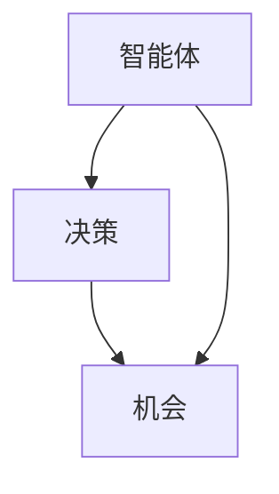
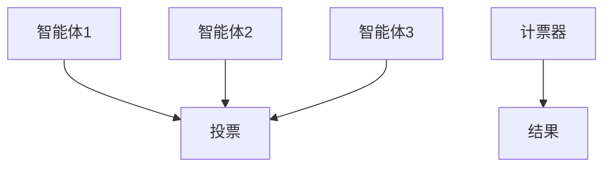
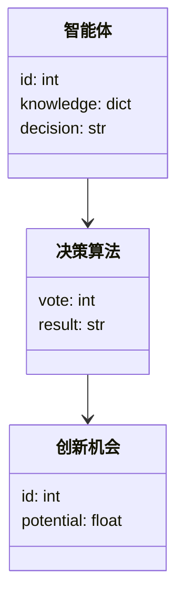
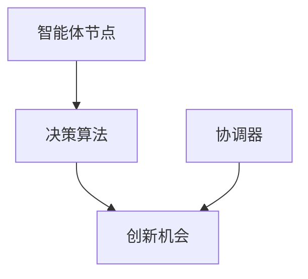

                 


# 智能体群体决策在识别颠覆性创新机会中的应用

## 关键词：智能体，群体决策，颠覆性创新，算法，数学模型

## 摘要：本文探讨了智能体群体决策在识别颠覆性创新机会中的应用，通过详细分析颠覆性创新和群体决策的概念，结合算法原理、数学模型和系统设计，展示了如何利用智能体群体决策来发现和评估创新机会。文章最后提供了实际案例分析和项目实现，帮助读者更好地理解和应用这些理论。

---

# 第一部分: 智能体群体决策与颠覆性创新概述

## 第1章: 智能体群体决策与颠覆性创新的背景介绍

### 1.1 颠覆性创新的定义与特点

#### 1.1.1 颠覆性创新的背景与问题背景

颠覆性创新是指一种能够从根本上改变市场规则、技术基础或商业模式的创新。它通常以非主流的方式出现，但最终能够取代现有的主流技术或市场。例如，智能手机的出现颠覆了传统手机的功能和市场定位。

#### 1.1.2 颠覆性创新的核心概念与问题描述

颠覆性创新的核心在于其“颠覆性”特性，即它能够打破现有市场的平衡，创造新的市场规则。这种创新通常起源于边缘市场或非主流技术，但最终能够占据主流市场的主导地位。

#### 1.1.3 颠覆性创新的解决思路与边界

识别颠覆性创新机会的关键在于发现那些能够改变市场规则的潜在创新。然而，由于颠覆性创新的非主流性，传统的方法往往难以发现这些机会。因此，需要一种新的方法来识别这些潜在的机会。

### 1.2 智能体群体决策的概念与特点

#### 1.2.1 智能体的定义与核心要素

智能体是指具有感知环境、自主决策和行动能力的实体。它可以在复杂环境中独立工作，也可以与其他智能体协作完成任务。智能体的核心要素包括感知、决策、行动和学习能力。

#### 1.2.2 群体决策的定义与核心要素

群体决策是指多个智能体共同参与决策过程，通过协作和竞争来达成一致或优化的决策。群体决策的核心要素包括信息共享、决策规则和协调机制。

#### 1.2.3 智能体群体决策与个体决策的对比

智能体群体决策与个体决策的主要区别在于决策的来源和过程。个体决策依赖于单个智能体的感知和判断，而群体决策则依赖于多个智能体的协作和信息共享。

### 1.3 颠覆性创新与智能体群体决策的关联性

#### 1.3.1 颠覆性创新的机会识别与智能体群体决策的关系

智能体群体决策能够帮助识别颠覆性创新机会，因为它能够从多个智能体的视角出发，综合考虑各种可能性和潜在的创新点。

#### 1.3.2 智能体群体决策在创新机会识别中的优势

智能体群体决策的优势在于其分布式计算和协作能力。通过多个智能体的协作，能够更全面地覆盖潜在的创新机会。

#### 1.3.3 颠覆性创新与智能体群体决策的边界与外延

颠覆性创新的识别是一个动态过程，而智能体群体决策则提供了一种动态适应的方法。通过智能体群体决策，可以实时感知市场变化，并及时调整决策策略。

---

## 第2章: 智能体群体决策的核心概念与联系

### 2.1 颠覆性创新的核心概念

#### 2.1.1 颠覆性创新的理论基础

颠覆性创新的理论基础主要来源于 Clayton Christensen 的《创新者的窘境》。他认为，颠覆性创新通常起源于边缘市场，并逐步取代主流市场的技术。

#### 2.1.2 颠覆性创新的关键特征对比表

| 特征               | 颠覆性创新               | 渐进式创新               |
|--------------------|--------------------------|--------------------------|
| 技术基础           | 非主流技术               | 主流技术               |
| 市场定位           | 边缘市场或新兴市场       | 主流市场               |
| 增长路径           | 低增长，高潜力           | 高增长，低潜力           |

### 2.2 智能体群体决策的核心概念

#### 2.2.1 智能体的属性特征对比表

| 属性           | 单个智能体               | 群体智能体               |
|----------------|--------------------------|--------------------------|
| 决策能力       | 独立决策                 | 协作决策                 |
| 信息处理       | 个体信息                 | 共享信息                 |

#### 2.2.2 群体决策的属性特征对比表

| 属性           | 单一决策                 | 群体决策                 |
|----------------|--------------------------|--------------------------|
| 决策主体       | 单个决策者               | 多个决策者               |
| 决策过程       | 个体判断                 | 协作判断                 |

### 2.3 智能体、决策与机会的ER实体关系图



---

## 第3章: 智能体群体决策的算法原理

### 3.1 群体决策算法概述

#### 3.1.1 分布式计算与群体决策的关系

群体决策算法基于分布式计算，通过多个智能体的协作完成决策过程。分布式计算提供了并行处理和信息共享的基础，而群体决策算法则利用这些特性来优化决策结果。

#### 3.1.2 常见的群体决策算法

常见的群体决策算法包括投票算法、加权投票算法和共识算法。这些算法各有优缺点，适用于不同的场景。

#### 3.1.3 群体决策算法的优缺点对比表

| 算法类型       | 优点                     | 缺点                     |
|----------------|--------------------------|--------------------------|
| 投票算法       | 简单，易于实现           | 易受多数人意见影响       |
| 加权投票算法   | 考虑了不同智能体的权重   | 权重分配复杂             |
| 共识算法       | 高度一致                | 计算复杂，耗时较长       |

### 3.2 基于投票的群体决策算法

#### 3.2.1 投票算法的流程图



#### 3.2.2 投票算法的实现代码

```python
def voting_algorithm(votes):
    # 统计每个候选人的票数
    candidate_votes = {}
    for vote in votes:
        if vote in candidate_votes:
            candidate_votes[vote] += 1
        else:
            candidate_votes[vote] = 1
    # 找出得票最高的候选人
    max_votes = max(candidate_votes.values())
    winners = [candidate for candidate, votes in candidate_votes.items() if votes == max_votes]
    return winners
```

---

## 第4章: 智能体群体决策的数学模型

### 4.1 群体决策的数学模型

#### 4.1.1 预测模型

$$ P(y|x) = \frac{P(x|y)P(y)}{P(x)} $$

其中，\( P(y|x) \) 表示在条件 \( x \) 下的后验概率，\( P(x|y) \) 是似然函数，\( P(y) \) 是先验概率，\( P(x) \) 是证据概率。

#### 4.1.2 优化模型

$$ \arg \max_{\theta} \sum_{i=1}^{n} \log P(y_i|\theta) $$

其中，\( \theta \) 是模型参数，\( y_i \) 是观测数据。

### 4.2 群体决策的优化目标

#### 4.2.1 最大化共识

$$ \max_{\theta} \sum_{i=1}^{n} \theta_i $$

其中，\( \theta_i \) 表示第 \( i \) 个智能体的决策权重。

#### 4.2.2 最小化分歧

$$ \min_{\theta} \sum_{i=1}^{n} (1 - \theta_i) $$

其中，\( \theta_i \) 表示第 \( i \) 个智能体的决策一致性。

---

## 第5章: 智能体群体决策的系统设计

### 5.1 系统架构设计

#### 5.1.1 领域模型



#### 5.1.2 系统架构



---

## 第6章: 智能体群体决策的项目实战

### 6.1 环境安装

#### 6.1.1 安装Python和相关库

```bash
pip install numpy matplotlib
```

#### 6.1.2 安装决策算法库

```bash
pip install scikit-learn
```

### 6.2 核心代码实现

#### 6.2.1 投票算法的实现

```python
from collections import defaultdict

def majority_vote(votes):
    vote_counts = defaultdict(int)
    for vote in votes:
        vote_counts[vote] += 1
    max_count = max(vote_counts.values())
    winners = [candidate for candidate, count in vote_counts.items() if count == max_count]
    return winners
```

---

## 第7章: 总结与展望

### 7.1 总结

智能体群体决策在识别颠覆性创新机会中具有重要的应用价值。通过分布式计算和群体协作，智能体能够更全面地感知市场变化，并及时发现潜在的创新机会。

### 7.2 展望

未来，随着人工智能和分布式计算技术的不断发展，智能体群体决策在创新机会识别中的应用将更加广泛。同时，如何优化群体决策算法，提高决策效率和准确性，仍然是一个重要的研究方向。

### 7.3 注意事项

在实际应用中，需要注意智能体之间的信息共享和协作机制的设计。此外，还需要考虑智能体的多样性和适应性，以应对复杂多变的市场环境。

### 7.4 拓展阅读

推荐阅读 Clayton Christensen 的《创新者的窘境》，了解颠覆性创新的理论基础。同时，可以参考《群体智慧的简史》一书，深入理解群体决策的历史和现状。

---

通过以上章节的详细阐述，我们可以看到，智能体群体决策在识别颠覆性创新机会中的应用是一个复杂而有趣的过程。从理论到实践，从算法到系统设计，每一步都需要深入思考和精心设计。希望本文能够为读者提供有价值的参考和启发。

