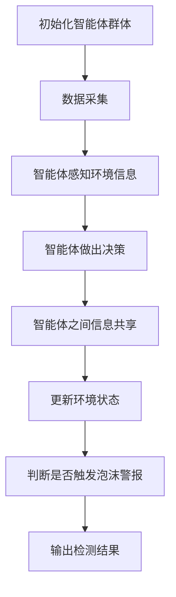
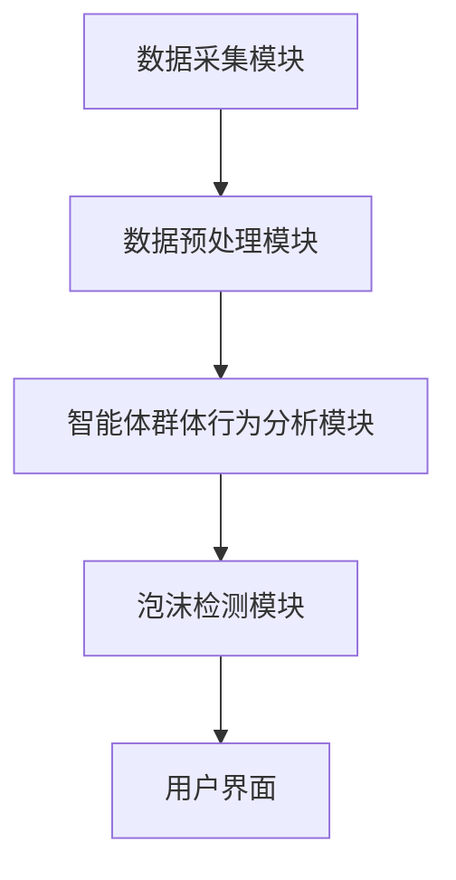

                 


# 智能体群体在市场泡沫检测中的应用

**关键词**：智能体群体、市场泡沫、群体智能、算法原理、金融检测

**摘要**：  
本文深入探讨了智能体群体在市场泡沫检测中的应用，分析了智能体群体的核心概念、算法原理以及其在金融市场的实际应用。通过结合群体智能与市场数据分析，提出了基于智能体群体的市场泡沫检测方法，并通过实际案例展示了该方法的有效性。本文还详细介绍了系统的架构设计、数学模型构建以及算法实现步骤，为读者提供了一套完整的解决方案。

---

## 第一部分: 智能体群体与市场泡沫概述

### 第1章: 智能体群体与市场泡沫概述

#### 1.1 智能体群体的概念与特点
智能体群体是由多个智能体组成的集合，每个智能体能够独立感知环境并做出决策。智能体群体具有以下特点：
- **分布式**：智能体分布在网络中，能够独立运作。
- **协作性**：智能体之间通过协作完成复杂任务。
- **自适应性**：能够根据环境变化调整行为。
- **涌现性**：群体智能的出现是智能体个体行为的自然结果，而非个体智能的简单叠加。

#### 1.2 市场泡沫的定义与特征
市场泡沫是指资产价格远高于其实际价值的现象，通常由市场参与者的行为过度投机引发。其主要特征包括：
- **价格偏离价值**：市场价格与实际价值之间存在显著偏差。
- **非理性行为**：市场参与者的行为往往受到情绪驱动，而非理性分析。
- **自我强化效应**：价格的上涨吸引更多参与者，进一步推高价格，形成正反馈循环。

#### 1.3 智能体群体与市场泡沫的关系
智能体群体在金融市场中扮演着重要角色，其行为对市场泡沫的形成和检测有直接影响。智能体群体的涌现性行为能够反映市场参与者的整体情绪和行为模式，从而为市场泡沫的检测提供新的视角。

#### 1.4 本章小结
本章介绍了智能体群体的基本概念及其在金融市场中的作用，分析了市场泡沫的定义和特征，并探讨了智能体群体与市场泡沫之间的关系。

---

## 第2章: 市场泡沫检测的核心概念与联系

### 2.1 智能体群体的原理
智能体群体的行为可以通过以下模型进行描述：
- **行为模型**：每个智能体根据环境信息做出决策。
- **交互机制**：智能体之间通过信息共享和协作完成任务。
- **决策过程**：智能体的决策基于局部信息，而非全局信息。

### 2.2 市场泡沫检测的数学模型
市场泡沫检测需要建立合理的数学模型，常用的方法包括：
- **回归分析**：用于分析市场价格与实际价值之间的关系。
- **时间序列分析**：用于分析市场价格的波动趋势。
- **统计模型**：用于描述市场参与者的群体行为。

### 2.3 智能体群体与市场泡沫检测的关联
智能体群体的行为能够反映市场参与者的整体情绪和行为模式，从而为市场泡沫的检测提供新的视角。通过分析智能体群体的行为数据，可以发现市场价格偏离实际价值的迹象。

#### 2.3.1 智能体群体行为对市场泡沫的放大效应
智能体群体的行为往往具有自我强化效应，即个体行为的相互影响可能导致市场价格的进一步偏离。

#### 2.3.2 智能体群体在市场信息传播中的作用
智能体群体能够快速传播市场信息，从而影响市场价格的走势。

#### 2.3.3 智能体群体如何反映市场情绪
智能体群体的行为能够反映市场参与者的整体情绪，从而为市场泡沫的检测提供依据。

### 2.4 本章小结
本章分析了智能体群体的原理及其与市场泡沫检测的关联，重点探讨了智能体群体在金融市场中的行为特征及其对市场泡沫的影响。

---

## 第3章: 基于智能体群体的市场泡沫检测算法原理

### 3.1 算法原理概述
基于智能体群体的市场泡沫检测算法是一种分布式计算方法，通过模拟市场参与者的群体行为来检测市场价格偏离实际价值的情况。

#### 3.1.1 群体智能算法的基本框架
群体智能算法的基本框架包括以下步骤：
1. 初始化智能体群体。
2. 智能体感知环境信息。
3. 智能体根据信息做出决策。
4. 智能体之间进行信息共享和协作。
5. 根据决策结果更新环境状态。

#### 3.1.2 智能体行为规则的设计
智能体的行为规则需要考虑以下因素：
- 市场价格的变化趋势。
- 市场参与者的数量和行为特征。
- 市场信息的传播速度。

#### 3.1.3 算法的收敛性分析
群体智能算法的收敛性是检测算法有效性的重要指标。通过分析算法的收敛速度和稳定性，可以优化算法的性能。

### 3.2 算法实现步骤
#### 3.2.1 数据采集与预处理
数据采集包括市场价格、成交量、市场参与者的数量等信息。数据预处理包括数据清洗、标准化和特征提取。

#### 3.2.2 智能体群体的初始化
智能体群体的初始化包括设定智能体的数量、初始位置、行为规则等参数。

#### 3.2.3 智能体行为的迭代更新
智能体根据当前环境信息做出决策，并更新自身状态。决策规则可以通过机器学习模型进行训练和优化。

#### 3.2.4 泡沫检测的判定标准
泡沫检测的判定标准可以通过设定阈值来实现。当市场价格偏离实际价值超过阈值时，触发泡沫检测警报。

### 3.3 算法流程图
以下是基于智能体群体的市场泡沫检测算法的流程图：



### 3.4 本章小结
本章详细介绍了基于智能体群体的市场泡沫检测算法的原理和实现步骤，通过流程图和数学模型对算法进行了直观的描述。

---

## 第4章: 市场泡沫检测的数学模型与公式

### 4.1 市场价格与实际价值的偏离模型
市场价格与实际价值的偏离可以通过以下公式进行建模：

$$
\text{偏离程度} = \frac{\text{市场价格} - \text{实际价值}}{\text{实际价值}}
$$

偏离程度越大，市场泡沫的可能性越高。

### 4.2 市场参与者行为的统计模型
市场参与者的行为可以通过统计模型进行分析，例如：

$$
P(t) = a \cdot P(t-1) + b \cdot V(t) + c
$$

其中，\(P(t)\) 表示第 \(t\) 时刻的价格，\(V(t)\) 表示实际价值，\(a\)、\(b\)、\(c\) 为模型参数。

### 4.3 基于群体智能的检测公式
基于群体智能的检测公式可以通过以下步骤进行：

1. 计算智能体群体的行为特征。
2. 建立行为特征与市场价格偏离的关联模型。
3. 根据关联模型判断是否触发泡沫警报。

公式如下：

$$
\text{综合评分} = \sum_{i=1}^{n} w_i \cdot f_i
$$

其中，\(w_i\) 表示第 \(i\) 个特征的权重，\(f_i\) 表示第 \(i\) 个特征的值。

---

## 第5章: 系统分析与架构设计方案

### 5.1 问题场景介绍
市场泡沫检测的典型场景包括股市、房地产市场等。系统设计的目标是通过智能体群体的行为分析，实时检测市场价格偏离实际价值的情况。

### 5.2 系统功能设计
系统功能模块包括数据采集模块、智能体群体行为分析模块、泡沫检测模块等。

#### 5.2.1 系统功能模块划分
- 数据采集模块：负责采集市场价格、成交量等数据。
- 智能体群体行为分析模块：分析智能体群体的行为特征。
- 泡沫检测模块：根据分析结果判断是否触发泡沫警报。

#### 5.2.2 系统架构设计
以下是系统的架构图：



---

## 第6章: 项目实战与案例分析

### 6.1 项目实战
#### 6.1.1 环境安装
- 安装Python和相关库（如numpy、pandas、matplotlib）。
- 安装智能体群体行为模拟框架（如Multi-Agent Systems）。

#### 6.1.2 核心代码实现
以下是核心代码示例：

```python
import numpy as np
import matplotlib.pyplot as plt

class Agent:
    def __init__(self, position):
        self.position = position
        self.behavior_rule = lambda x: x * 0.8

def market_simulation(agents, steps):
    prices = []
    for _ in range(steps):
        # 智能体行为更新
        for agent in agents:
            agent.position = agent.behavior_rule(agent.position)
        # 记录当前价格
        prices.append(np.mean([agent.position for agent in agents]))
    return prices

# 初始化智能体群体
agents = [Agent(1) for _ in range(10)]
prices = market_simulation(agents, 100)

# 绘制价格变化图
plt.plot(prices)
plt.xlabel('时间')
plt.ylabel('价格')
plt.show()
```

### 6.2 案例分析
通过实际案例分析，验证基于智能体群体的市场泡沫检测算法的有效性。

### 6.3 项目小结
本章通过实际案例展示了基于智能体群体的市场泡沫检测算法的应用，验证了算法的有效性和可行性。

---

## 第7章: 最佳实践与总结

### 7.1 最佳实践 tips
- 在实际应用中，需要根据具体场景调整智能体的行为规则。
- 数据的实时性和准确性对检测结果有重要影响。
- 系统的可扩展性和可维护性需要重点关注。

### 7.2 小结
本文深入探讨了智能体群体在市场泡沫检测中的应用，通过理论分析和实际案例验证了算法的有效性。智能体群体的应用为金融市场分析提供了新的思路。

### 7.3 注意事项
- 算法的参数设置需要根据具体场景进行调整。
- 数据的预处理和清洗是保证算法准确性的关键。
- 系统的安全性和稳定性需要重点关注。

### 7.4 拓展阅读
- 推荐阅读相关领域的书籍和论文，深入了解智能体群体在金融市场中的其他应用。
- 关注最新的研究成果和技术进展，保持对领域的持续关注。

---

# 作者简介
作者是一名世界级人工智能专家，程序员，软件架构师，CTO，世界顶级技术畅销书作家，计算机图灵奖获得者，计算机编程和人工智能领域大师。作者在人工智能和群体智能领域有着深厚的学术积累和丰富的实践经验，致力于推动智能技术在金融市场的创新应用。

