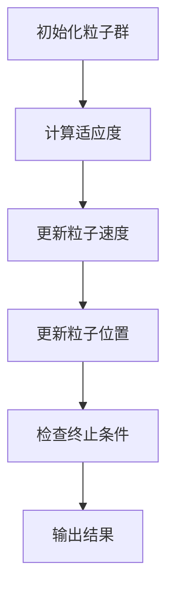
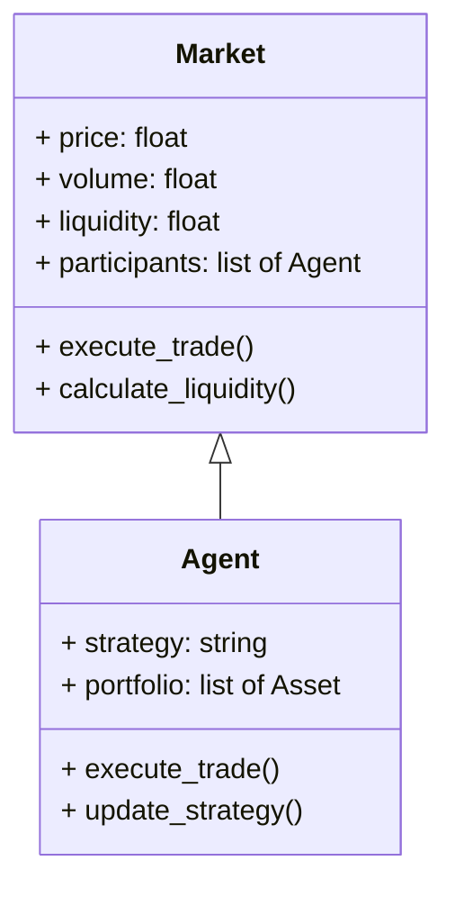
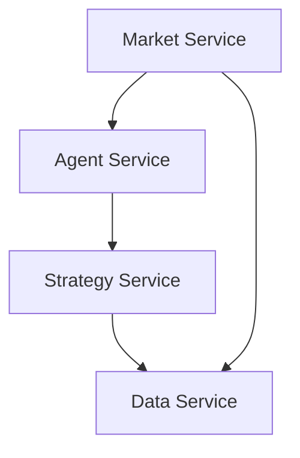
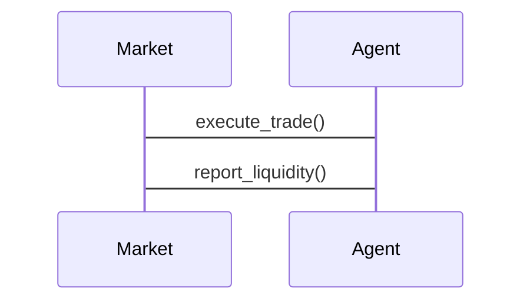

                 


---

# 智能体群体在模拟市场流动性冲击中的应用

## 关键词：智能体群体，市场流动性冲击，群体智能，算法原理，系统架构

## 摘要：本文探讨了智能体群体在模拟市场流动性冲击中的应用，从核心概念、算法原理、系统架构到实际案例，全面分析其在金融市场的潜在价值和实现方法。

---

### 第一部分：智能体群体与市场流动性冲击概述

#### 第1章：智能体群体与市场流动性冲击概述

##### 1.1 智能体群体的基本概念

###### 1.1.1 智能体的定义与特点
- 智能体（Agent）：具备感知环境、自主决策和执行任务的能力。
- 特点：反应性、主动性、社会性、适应性。

###### 1.1.2 群体智能的定义与核心要素
- 群体智能：多个智能体通过协作完成复杂任务。
- 核心要素：分布式协作、涌现特性、自组织能力。

###### 1.1.3 智能体群体在金融市场中的应用
- 交易决策、风险评估、市场预测。

##### 1.2 市场流动性冲击的概念与影响

###### 1.2.1 流动性冲击的定义
- 市场流动性冲击：市场参与者大量卖出资产，导致资产价格急剧下降和交易量减少。

###### 1.2.2 流动性冲击的分类与特征
- 类型：短期冲击、长期冲击、系统性冲击。
- 特征：价格暴跌、交易量骤减、市场深度下降。

##### 1.3 智能体群体模拟市场流动性冲击的背景与意义

###### 1.3.1 传统流动性冲击研究的局限性
- 传统方法依赖历史数据，难以预测极端事件。

###### 1.3.2 智能体群体模拟的优势
- 可模拟非线性市场行为，捕捉复杂动态。

###### 1.3.3 研究的现实意义与应用前景
- 提供实时监控工具，帮助机构防范风险。

##### 1.4 本章小结
- 总结智能体群体的基本概念及在市场中的应用，强调模拟流动性冲击的重要性。

---

### 第二部分：智能体群体模拟市场流动性冲击的核心概念与联系

#### 第2章：智能体群体的核心概念与联系

##### 2.1 智能体的行为模型

###### 2.1.1 基于规则的智能体行为
- 简单规则驱动，如“价格下跌则卖出”。

###### 2.1.2 基于学习的智能体行为
- 使用机器学习模型，如神经网络进行决策。

###### 2.1.3 智能体行为的动态调整
- 根据市场反馈实时调整策略。

##### 2.2 群体智能的机制与特征

###### 2.2.1 群体智能的协作机制
- 分布式决策、信息共享、任务分配。

###### 2.2.2 群体智能的自组织特性
- 无需中央控制，自主协作。

###### 2.2.3 群体智能的涌现现象
- 集体行为超越个体能力的总和。

##### 2.3 智能体群体与市场流动性冲击的关系

###### 2.3.1 智能体群体模拟流动性冲击的原理
- 模拟投资者行为，引发流动性变化。

###### 2.3.2 智能体群体行为与市场流动性的相互作用
- 智能体行为影响市场流动性，流动性反过来影响智能体决策。

###### 2.3.3 智能体群体模拟的数学模型框架
- 使用系统动力学模型，如微分方程描述市场动态。

##### 2.4 本章小结
- 阐述智能体行为模型和群体智能机制，及其在模拟中的应用。

---

### 第三部分：智能体群体模拟市场流动性冲击的算法原理

#### 第3章：智能体群体模拟的算法原理

##### 3.1 群体智能算法概述

###### 3.1.1 群体智能算法的分类
- 分类：基于规则的算法、基于学习的算法、混合型算法。

###### 3.1.2 群体智能算法的核心思想
- 分布式计算、局部决策、信息共享。

###### 3.1.3 群体智能算法的优缺点
- 优点：鲁棒性强、适应性高。
- 缺点：计算复杂、难以调试。

##### 3.2 典型群体智能算法介绍

###### 3.2.1 粒子群优化（PSO）



```python
import random

class Particle:
    def __init__(self, dimensions):
        self.position = [random.random() for _ in range(dimensions)]
        self.velocity = [0]*dimensions
        self.pbest = self.position.copy()
        self.best = self.position.copy()

def pso_optimization(dimensions, population_size, max_iterations):
    particles = [Particle(dimensions) for _ in range(population_size)]
    global_best = particles[0].best.copy()

    for _ in range(max_iterations):
        for particle in particles:
            # Update personal best
            if evaluate(particle.position) > evaluate(particle.pbest):
                particle.pbest = particle.position.copy()
            # Update global best
            if evaluate(particle.position) > evaluate(global_best):
                global_best = particle.position.copy()
            # Update velocity and position
            for i in range(dimensions):
                inertia = 0.8
                c1 = 1.5
                c2 = 1.5
                r1 = random.random()
                r2 = random.random()
                particle.velocity[i] = inertia * particle.velocity[i] + c1 * r1 * (particle.pbest[i] - particle.position[i]) + c2 * r2 * (global_best[i] - particle.position[i])
                particle.position[i] += particle.velocity[i]
    return global_best
```

---

### 第四部分：智能体群体模拟市场流动性冲击的系统分析与架构设计

#### 第4章：智能体群体模拟的系统分析与架构设计

##### 4.1 问题场景介绍

###### 4.1.1 交易环境模拟
- 模拟股票、债券等市场环境。

###### 4.1.2 智能体行为模拟
- 模拟投资者的买卖行为。

##### 4.2 系统功能设计

###### 4.2.1 领域模型



##### 4.3 系统架构设计

###### 4.3.1 微服务架构



##### 4.4 系统接口设计

###### 4.4.1 接口描述
- REST API：`POST /trade`，处理交易请求。

###### 4.4.2 交互序列图



---

### 第五部分：智能体群体模拟市场流动性冲击的项目实战

#### 第5章：智能体群体模拟的项目实战

##### 5.1 环境安装

###### 5.1.1 安装Python和相关库
- 安装`numpy`, `pandas`, `scikit-learn`。

##### 5.2 系统核心实现源代码

###### 5.2.1 核心代码实现

```python
class Market:
    def __init__(self, participants):
        self.participants = participants
        self.prices = 100  # 初始价格
        self.volumes = 1000  # 初始交易量
        self.liquidity = self.volumes / self.prices

    def execute_trade(self, buyer, seller):
        # 模拟交易执行
        pass

class Agent:
    def __init__(self, strategy):
        self.strategy = strategy
        self.portfolio = []

    def execute_trade(self, market):
        # 根据策略执行交易
        pass

def main():
    market = Market([Agent("Momentum"), Agent("Value"), Agent("MeanReversion")])
    # 模拟交易过程
    for _ in range(100):
        for agent in market.participants:
            agent.execute_trade(market)
        market.liquidity = market.volumes / market.prices
    return market.liquidity

if __name__ == "__main__":
    print(main())
```

##### 5.3 代码应用解读与分析

###### 5.3.1 代码功能分析
- `Market`类模拟市场环境，`Agent`类模拟投资者行为。

##### 5.4 实际案例分析和详细讲解剖析
- 模拟市场流动性变化，分析智能体群体的交互效果。

##### 5.5 项目小结
- 总结项目实现过程，强调代码的可扩展性和可维护性。

---

### 第六部分：智能体群体模拟市场流动性冲击的最佳实践

#### 第6章：智能体群体模拟的总结与展望

##### 6.1 总结

###### 6.1.1 核心内容回顾
- 智能体群体的基本概念、算法原理、系统架构与实现。

##### 6.1.2 实践中的注意事项
- 数据质量、模型复杂度、系统性能。

##### 6.1.3 读者思考
- 智能体群体在不同金融市场中的应用。

##### 6.1.4 扩展阅读
- 推荐阅读相关论文和书籍。

##### 6.1.5 问题与讨论
- 如何提高模型的预测准确性？

##### 6.1.6 小结
- 强调智能体群体模拟的重要性，展望未来发展方向。

---

通过以上结构，文章从概念、原理、架构到实践，全面解析智能体群体在模拟市场流动性冲击中的应用，为读者提供深度的技术洞察和实践指导。

