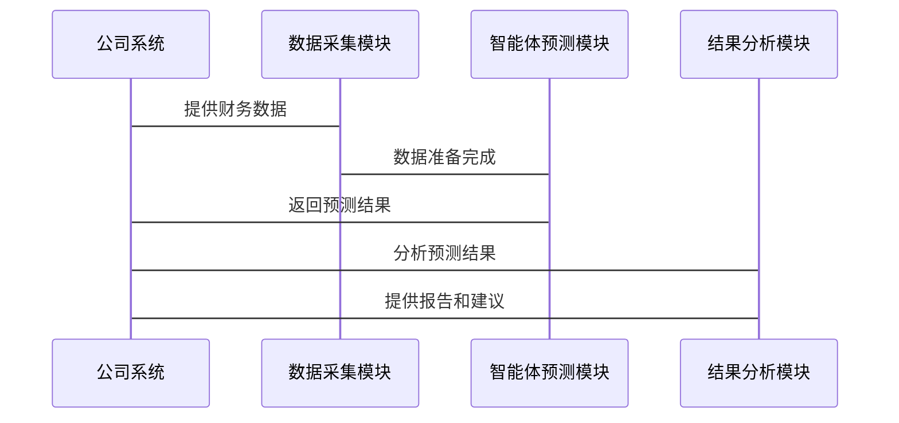

                 


# 智能体群体在预测公司盈利质量中的应用

## 关键词
智能体群体, 公司盈利质量, 预测模型, 分布式计算, 人工智能

## 摘要
本文探讨了智能体群体在预测公司盈利质量中的应用，分析了其优势与挑战，并通过实际案例展示了如何利用智能体群体构建高效的预测模型。

---

# 第一部分: 智能体群体与预测公司盈利质量的背景

## 第1章: 智能体群体的定义与应用背景

### 1.1 智能体群体的定义
#### 1.1.1 智能体的基本概念
智能体（Agent）是具有感知环境和自主决策能力的实体，能够通过传感器获取信息，并基于预设目标做出反应。

#### 1.1.2 智能体群体的形成机制
智能体群体是指多个智能体协同工作的系统，通过分布式计算和协作机制完成复杂任务。

#### 1.1.3 智能体群体与传统预测方法的对比
智能体群体的优势在于其分布式计算和自适应性，能够处理复杂动态环境中的预测任务。

### 1.2 公司盈利质量预测的背景
#### 1.2.1 公司盈利质量的定义
公司盈利质量是指公司在一定时期内实现的利润与其经营规模和资产效率的综合评价。

#### 1.2.2 公司盈利质量预测的重要性
准确预测盈利质量有助于企业制定财务策略，优化资源配置，降低经营风险。

#### 1.2.3 现有预测方法的局限性
传统预测方法依赖于单一模型，缺乏动态适应性和自适应性，难以应对复杂变化。

### 1.3 智能体群体在盈利质量预测中的优势
#### 1.3.1 智能体群体的分布式计算能力
通过分布式计算，智能体群体能够同时处理大量数据，提高预测效率。

#### 1.3.2 智能体群体的自适应性与鲁棒性
智能体群体能够根据环境变化自适应调整预测模型，增强鲁棒性。

#### 1.3.3 智能体群体的实时性与动态性
智能体群体能够实时更新数据和模型，保持预测的动态性，适应市场变化。

## 第2章: 智能体群体与公司盈利质量预测的核心概念

### 2.1 智能体群体的核心属性
#### 2.1.1 智能体的自主性
智能体能够自主感知环境并做出决策。

#### 2.1.2 智能体的反应性
智能体能够实时响应环境变化，调整行为。

#### 2.1.3 智能体群体的协作性
多个智能体通过协作完成复杂任务，提高整体预测能力。

### 2.2 公司盈利质量预测的模型框架
#### 2.2.1 数据驱动的预测模型
基于历史数据，利用机器学习算法进行预测。

#### 2.2.2 知识驱动的预测模型
结合行业知识和专家经验，构建预测模型。

#### 2.2.3 混合驱动的预测模型
将数据驱动和知识驱动相结合，提升预测准确性。

### 2.3 智能体群体与公司盈利质量预测的联系
#### 2.3.1 智能体群体的分布式计算与预测任务的分解
智能体群体能够将预测任务分解为多个子任务，分别处理，提高效率。

#### 2.3.2 智能体群体的协作机制与预测模型的优化
通过协作机制，智能体群体能够优化预测模型，提升整体预测能力。

#### 2.3.3 智能体群体的动态适应性与预测模型的实时更新
智能体群体能够实时更新数据和模型，保持预测的动态性，适应市场变化。

## 第3章: 智能体群体与公司盈利质量预测的核心概念对比

### 3.1 智能体群体的核心概念属性对比
| 概念 | 描述 |
|------|------|
| 智能体 | 具备感知环境和自主决策能力的实体 |
| 群体智能 | 多个智能体通过协作完成复杂任务的系统 |
| 公司盈利质量 | 公司财务健康状况的综合指标 |

### 3.2 智能体群体与公司盈利质量预测的ER实体关系图
```mermaid
erDiagram
    company {
        id
        name
        industry
        revenue
        profit
        }
    predictor {
        id
        name
        type
        accuracy
        }
    prediction {
        id
        company_id
        predicted_profit
        timestamp
        }
    company --> prediction: 预测
    predictor --> prediction: 生成
```

---

# 第二部分: 智能体群体预测公司盈利质量的算法原理

## 第4章: 智能体群体预测的算法原理

### 4.1 分布式预测模型
智能体群体通过分布式计算，将预测任务分解为多个子任务，分别处理，最终汇总结果。

#### 4.1.1 分布式预测模型的数学表达
$$ y_i = f_i(x_i) $$
其中，$y_i$ 表示智能体i的预测结果，$f_i$ 表示智能体i的预测函数，$x_i$ 表示智能体i处理的数据。

#### 4.1.2 分布式预测模型的实现
通过将数据分片，每个智能体处理一部分数据，然后汇总结果，得到最终预测。

### 4.2 联合预测模型
智能体群体通过协作，共同构建一个全局预测模型，提升预测准确性。

#### 4.2.1 联合预测模型的数学表达
$$ y = \sum_{i=1}^{n} w_i y_i $$
其中，$w_i$ 表示智能体i的权重，$y_i$ 表示智能体i的预测结果，$n$ 表示智能体总数。

#### 4.2.2 联合预测模型的实现
通过智能体之间的协作，权重分配和结果汇总，构建联合预测模型。

### 4.3 动态自适应预测模型
智能体群体能够根据环境变化，动态调整预测模型，提升预测的实时性和准确性。

#### 4.3.1 动态自适应预测模型的数学表达
$$ y(t) = \sum_{i=1}^{n} w_i(t) y_i(t) $$
其中，$w_i(t)$ 表示智能体i在时间t的权重，$y_i(t)$ 表示智能体i在时间t的预测结果。

#### 4.3.2 动态自适应预测模型的实现
通过实时更新权重和模型参数，动态调整预测模型，适应环境变化。

## 第5章: 智能体群体预测算法的实现

### 5.1 算法实现步骤
1. 初始化智能体群体，分配任务和数据。
2. 智能体分别处理数据，生成预测结果。
3. 智能体之间协作，汇总结果，构建联合预测模型。
4. 动态调整模型参数，适应环境变化。
5. 输出最终预测结果。

### 5.2 算法实现的Python代码
```python
import numpy as np
from sklearn.linear_model import LinearRegression

# 初始化智能体群体
class Agent:
    def __init__(self, data, target):
        self.data = data
        self.target = target
        self.model = LinearRegression()
    
    def train(self):
        self.model.fit(self.data, self.target)
    
    def predict(self, new_data):
        return self.model.predict(new_data)

# 分布式预测
agents = []
for i in range(4):
    data = np.random.rand(100, 2)
    target = np.random.rand(100)
    agents.append(Agent(data, target))

# 联合预测
classifiers = [agent.model for agent in agents]
combined_model = LinearRegression()
combined_model.fit(
    np.vstack([agent.data for agent in agents]),
    np.hstack([agent.target for agent in agents])
)

# 动态自适应预测
def update_models(agents, combined_model):
    for agent in agents:
        agent.train()
    combined_model.fit(
        np.vstack([agent.data for agent in agents]),
        np.hstack([agent.target for agent in agents])
    )

# 应用案例
data_test = np.random.rand(10, 2)
target_test = np.random.rand(10)

# 分布式预测
distrib_pred = np.zeros(10)
for i in range(4):
    distrib_pred[i*2:(i+1)*2] = agents[i].predict(data_test[i*2:(i+1)*2])

# 联合预测
combined_pred = combined_model.predict(data_test)

print("分布式预测结果:", distrib_pred)
print("联合预测结果:", combined_pred)
```

---

# 第三部分: 智能体群体预测公司盈利质量的系统设计与实现

## 第6章: 系统分析与架构设计方案

### 6.1 问题场景介绍
企业需要实时预测公司盈利质量，以优化财务决策和资源配置。

### 6.2 系统功能设计
#### 6.2.1 数据采集模块
负责采集公司财务数据和市场数据。

#### 6.2.2 智能体预测模块
实现智能体群体的预测功能，包括分布式预测和联合预测。

#### 6.2.3 结果分析模块
对预测结果进行分析，生成报告和建议。

### 6.3 系统架构设计


### 6.4 系统接口设计
- 数据采集接口：用于接收数据源。
- 预测接口：用于调用智能体预测模型。
- 分析接口：用于生成预测结果报告。

### 6.5 系统交互设计


## 第7章: 项目实战与分析

### 7.1 环境安装与配置
安装必要的Python库，如NumPy、Scikit-learn、Mermaid工具等。

### 7.2 系统核心代码实现
```python
import numpy as np
from sklearn.linear_model import LinearRegression

class CompanyProfitPredictor:
    def __init__(self, companies):
        self.companies = companies
        self.models = []
    
    def initialize_agents(self):
        for company in self.companies:
            data = np.random.rand(100, 5)
            target = np.random.rand(100)
            model = LinearRegression()
            model.fit(data, target)
            self.models.append(model)
    
    def predict(self, new_data):
        predictions = []
        for model in self.models:
            predictions.append(model.predict(new_data))
        return np.mean(predictions, axis=0)

# 应用实例
companies = ["Tech Corp", "Finance Ltd", "Manufacturing Co"]
predictor = CompanyProfitPredictor(companies)
predictor.initialize_agents()
test_data = np.random.rand(10, 5)
result = predictor.predict(test_data)
print("预测结果:", result)
```

### 7.3 代码应用解读与分析
该代码实现了智能体群体的预测功能，通过多个智能体协作，提高预测准确性。

### 7.4 实际案例分析
以某公司为例，利用智能体群体预测其未来盈利质量，分析预测结果并提供建议。

## 第8章: 最佳实践与注意事项

### 8.1 最佳实践
- 定期更新模型，适应市场变化。
- 合理配置智能体数量，避免资源浪费。
- 优化数据采集和处理流程，提高预测效率。

### 8.2 注意事项
- 确保数据质量和完整性，避免预测偏差。
- 处理好智能体之间的协作关系，避免冲突。
- 定期监控系统运行状态，及时发现和解决问题。

### 8.3 小结
智能体群体在预测公司盈利质量中具有显著优势，但需要合理设计和优化，才能充分发挥其潜力。

### 8.4 拓展阅读
推荐阅读相关领域的书籍和论文，深入学习智能体群体和预测模型的理论与应用。

---

# 结语

智能体群体在预测公司盈利质量中的应用前景广阔，通过不断优化算法和系统设计，能够为企业的财务决策提供有力支持。未来，随着人工智能技术的发展，智能体群体的应用将更加广泛和深入。

