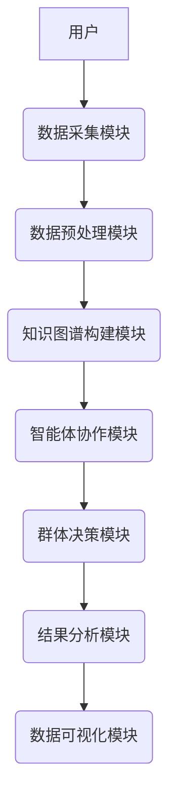
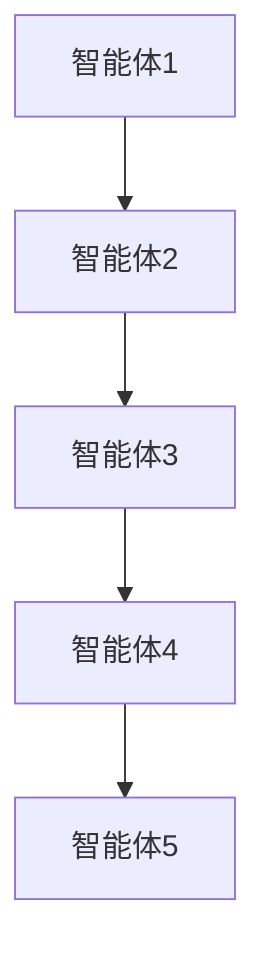
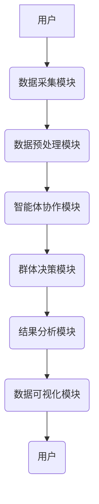

                 


# 智能体群体智慧在识别新兴产业机会中的应用：布局未来

> 关键词：智能体、群体智慧、新兴产业、人工智能、数据挖掘

> 摘要：智能体群体智慧是一种通过多个智能体协作，利用集体智慧来识别和分析新兴产业发展机会的技术。本文将从智能体群体智慧的基本概念、核心算法、系统架构设计、项目实战等多个方面进行详细分析，探讨其在识别新兴产业机会中的应用，并结合实际案例，总结其优势与挑战，为未来的商业布局提供参考。

---

## 第一部分: 智能体群体智慧概述

### 第1章: 智能体群体智慧概述

#### 1.1 智能体的基本概念

智能体（Agent）是指具有感知环境、做出决策、执行任务能力的实体。它可以是一个软件程序、机器人或任何能够自主行动的系统。智能体的核心特点包括自主性、反应性、目标导向性和社交能力。

- **自主性**：智能体能够在没有外部干预的情况下自主决策。
- **反应性**：智能体能够根据环境的变化调整自身行为。
- **目标导向性**：智能体的行为旨在实现特定目标。
- **社交能力**：智能体能够与其他智能体或人类进行交互和协作。

#### 1.2 群体智能的核心要素

群体智能（Swarm Intelligence）是指通过多个智能体的协作，实现比单个智能体更复杂、更高效的目标。其核心要素包括：

1. **分布式性**：智能体分布在不同的位置，具有独立性。
2. **协作性**：智能体通过信息共享和协作完成共同目标。
3. **自适应性**：群体能够根据环境变化动态调整行为。

#### 1.3 智能体群体智慧在商业中的应用

智能体群体智慧在商业中的应用广泛，尤其是在新兴产业识别方面。通过分析市场数据、消费者行为和趋势，智能体群体智慧能够帮助企业提前发现潜在机会，优化资源配置，降低风险。

### 1.4 智能体群体智慧的优势与挑战

- **优势**：
  - **高效性**：多个智能体协同工作，能够快速处理大量数据。
  - **鲁棒性**：群体智能能够容忍部分智能体的故障，保持整体功能。
  - **创新性**：通过多个智能体的协作，能够发现新的模式和机会。

- **挑战**：
  - **复杂性**：智能体之间的协作需要复杂的算法和协调机制。
  - **数据隐私**：在数据采集和分析过程中，隐私保护是一个重要问题。
  - **计算资源**：处理大规模数据和复杂算法需要强大的计算能力。

---

## 第二部分: 智能体群体智慧的核心算法

### 第2章: 协作过滤算法

协作过滤是一种基于用户相似性推荐物品的算法。通过分析用户的行为和偏好，协作过滤能够找到与目标用户相似的用户群体，推荐他们喜欢的物品。

#### 2.1 基于用户的协作过滤

基于用户的协作过滤算法通过计算用户之间的相似性，推荐相似用户的偏好物品。其基本步骤如下：

1. **数据采集**：收集用户的评分数据。
2. **相似性计算**：使用余弦相似性或皮尔逊相关系数计算用户相似性。
3. **推荐生成**：根据相似用户的评分，加权计算目标用户的推荐结果。

#### 2.2 基于物品的协作过滤

基于物品的协作过滤算法通过分析物品之间的相似性，推荐与目标用户已评分物品相似的其他物品。其基本步骤如下：

1. **数据采集**：收集用户的评分数据。
2. **相似性计算**：计算物品之间的相似性。
3. **推荐生成**：根据目标用户已评分的物品，推荐相似物品。

### 第3章: 聚类分析算法

聚类分析是一种将数据点划分为若干簇的算法。通过聚类分析，可以发现数据中的潜在结构，帮助识别新兴产业的趋势和模式。

#### 3.1 K-means算法

K-means算法是一种常用的聚类算法，通过将数据点划分为K个簇，使得簇内数据点的相似性最大化。其基本步骤如下：

1. **初始化**：随机选择K个簇中心。
2. **迭代优化**：计算每个数据点到簇中心的距离，将数据点分配到最近的簇，更新簇中心。
3. **收敛判断**：当簇中心不再变化或达到预设迭代次数时，算法结束。

#### 3.2 层次聚类算法

层次聚类算法通过构建层次化的簇结构，将数据点逐步聚合为更大的簇。其基本步骤如下：

1. **初始化**：将每个数据点视为一个簇。
2. **距离计算**：计算数据点或簇之间的距离。
3. **聚合同一步骤**：根据距离最小化原则，将最接近的簇合并，形成新的簇。
4. **收敛判断**：当所有数据点合并为一个簇时，算法结束。

### 第4章: 群体决策算法

群体决策算法是一种通过多个决策者协作，实现最优决策的算法。通过群体决策，可以提高决策的准确性和鲁棒性。

#### 4.1 加权投票算法

加权投票算法通过给每个决策者分配权重，计算决策结果的加权和，实现最优决策。其基本步骤如下：

1. **权重分配**：根据决策者的 expertise 或历史表现分配权重。
2. **投票计算**：将每个决策者的投票结果加权求和，确定最终决策。

#### 4.2 融合算法

融合算法通过结合多个决策者的输出，生成最终的决策结果。常用的融合方法包括加法融合、乘法融合和 D-S 融合等。

---

## 第三部分: 智能体群体智慧的系统架构设计

### 第5章: 系统功能设计

#### 5.1 数据采集与处理

智能体群体智慧系统需要采集大量的市场数据，包括消费者行为数据、行业趋势数据等。数据采集可以通过爬虫、API调用等方式实现。

1. **数据采集**：通过爬虫或API获取市场数据。
2. **数据预处理**：清洗数据，去除噪声，构建数据仓库。
3. **数据建模**：构建知识图谱，分析数据之间的关系。

#### 5.2 智能体协作与决策

智能体协作与决策模块是系统的核心部分，通过智能体之间的协作，实现新兴产业机会的识别。

1. **智能体协作**：通过分布式计算和消息传递，实现智能体之间的协作。
2. **群体决策**：基于群体决策算法，生成最优决策。
3. **结果分析**：对决策结果进行分析和评估。

#### 5.3 结果分析与可视化

结果分析与可视化模块用于对智能体群体智慧的输出结果进行分析和展示。

1. **结果分析**：对决策结果进行评估，计算准确率、召回率等指标。
2. **数据可视化**：通过图表、仪表盘等方式，直观展示分析结果。

### 第6章: 系统架构设计

#### 6.1 系统整体架构图

以下是智能体群体智慧系统的整体架构图：



#### 6.2 智能体协作模块架构图

以下是智能体协作模块的架构图：



### 第7章: 接口设计与交互流程

#### 7.1 系统接口设计

1. **数据接口**：提供数据采集和数据预处理的接口。
2. **智能体接口**：提供智能体协作和决策的接口。
3. **可视化接口**：提供结果展示和数据可视化的接口。

#### 7.2 系统交互流程图

以下是系统的交互流程图：



---

## 第四部分: 项目实战

### 第8章: 项目实战

#### 8.1 环境安装

1. **安装Python**：需要安装Python 3.8及以上版本。
2. **安装依赖库**：安装numpy、pandas、scikit-learn等依赖库。

#### 8.2 核心代码实现

以下是协作过滤算法的Python代码实现：

```python
from sklearn.metrics.pairwise import cosine_similarity
import numpy as np

# 示例数据：用户-物品评分矩阵
user_item_matrix = np.array([
    [4, 3, 0, 0],
    [4, 0, 3, 0],
    [0, 4, 3, 0],
    [0, 0, 4, 3]
])

# 计算用户相似性矩阵
similarity_matrix = cosine_similarity(user_item_matrix)

# 定义推荐函数
def recommend(user_id, similarity_matrix, user_item_matrix):
    similar_users = np.argsort(similarity_matrix[user_id])[::-1]
   推荐物品 = []
    for user in similar_users:
        if user != user_id:
           推荐物品.extend(np.where(user_item_matrix[user] > 0)[0])
    return 推荐物品

# 推荐结果
user_id = 0
print("推荐给用户", user_id, "的物品为：", recommend(user_id, similarity_matrix, user_item_matrix))
```

#### 8.3 案例分析与详细解读

通过上述代码实现，我们可以看到协作过滤算法在推荐系统中的应用。通过对用户相似性的计算，算法能够找到与目标用户相似的用户群体，并推荐他们喜欢的物品。

#### 8.4 项目小结

通过本项目的实战，我们了解了智能体群体智慧在推荐系统中的应用，掌握了协作过滤算法的实现方法，为后续的研究和实践打下了基础。

---

## 第五部分: 总结与展望

### 第9章: 总结与展望

#### 9.1 总结

智能体群体智慧是一种通过多个智能体协作，利用集体智慧来识别和分析新兴产业发展机会的技术。通过本文的分析，我们了解了智能体群体智慧的基本概念、核心算法、系统架构设计和项目实战。

#### 9.2 未来展望

随着人工智能和大数据技术的不断发展，智能体群体智慧将在更多的领域得到应用。未来的研究方向包括：

1. **算法优化**：进一步优化协作过滤、聚类分析和群体决策算法，提高其准确性和效率。
2. **分布式计算**：研究分布式计算技术，提高系统的扩展性和容错性。
3. **数据隐私保护**：研究数据隐私保护技术，确保系统的安全性和合规性。

---

通过本文的分析和探讨，我们希望读者能够对智能体群体智慧在识别新兴产业机会中的应用有更深入的理解，并能够在实际应用中发挥其潜力。

