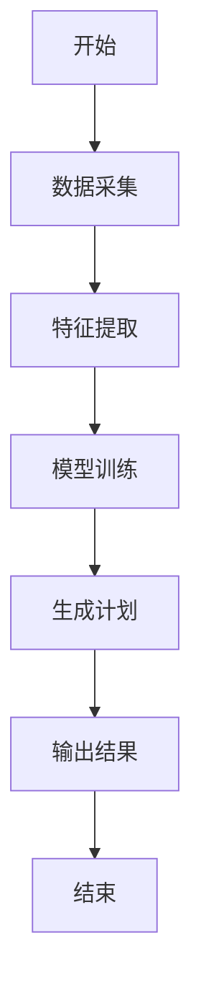
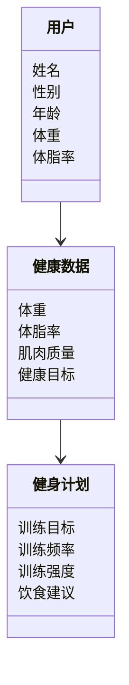
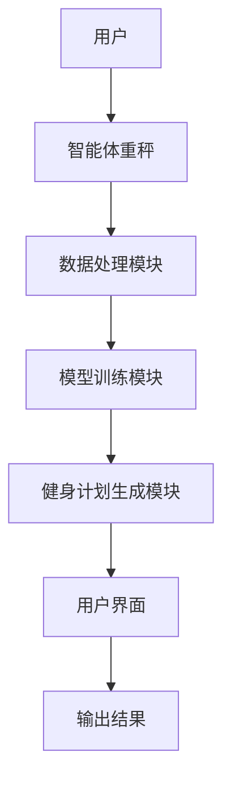

                 

# 智能体重秤：AI Agent的个性化健身计划生成

## 关键词：智能体重秤，AI Agent，个性化健身计划，机器学习，深度学习，强化学习

## 摘要：
智能体重秤与AI Agent的结合为个性化健身计划的生成提供了新的可能性。通过智能体重秤的数据采集和AI Agent的智能分析，可以实现个性化的健身建议，帮助用户更有效地管理健康。本文详细介绍了智能体重秤与AI Agent的基本概念，分析了个性化健身计划生成的核心算法原理，并通过系统架构设计展示了如何将这些技术应用于实际场景。最后，通过项目实战展示了如何实现一个完整的个性化健身计划生成系统。

---

# 第一章：智能体重秤与AI Agent概述

## 1.1 智能体重秤的发展历程

### 1.1.1 传统体重秤的功能与局限性
传统体重秤只能测量体重，无法提供其他健康数据，如体脂率、肌肉质量等。此外，传统体重秤无法与智能设备或其他系统连接，无法提供个性化的健康建议。

### 1.1.2 智能体重秤的定义与特点
智能体重秤是一种结合了传感器技术和智能计算的设备，能够测量并分析用户的体重、体脂、肌肉质量等数据，并通过无线通信技术将数据传输到手机或其他智能设备。其特点包括高精度测量、数据存储与分析、以及与健康管理系统联动。

### 1.1.3 智能体重秤在健康管理中的作用
智能体重秤通过实时测量和数据分析，能够帮助用户了解自己的身体状况，为个性化健身计划的制定提供数据支持。

## 1.2 AI Agent的基本概念

### 1.2.1 人工智能的基本原理
人工智能（AI）是指通过计算机模拟人类智能的技术，包括学习、推理、自我改进等能力。

### 1.2.2 AI Agent的定义与分类
AI Agent是一种智能体，能够感知环境、执行任务并做出决策。根据智能水平，AI Agent可以分为简单反应式Agent、基于模型的反应式Agent、目标驱动的Agent和效用驱动的Agent。

### 1.2.3 AI Agent在智能设备中的应用
AI Agent可以应用于智能体重秤中，通过分析用户的健康数据，提供个性化的健康建议和健身计划。

## 1.3 智能体重秤与AI Agent的结合

### 1.3.1 智能体重秤与AI Agent的协同工作
智能体重秤负责采集用户的健康数据，AI Agent负责分析数据并生成个性化的健身计划。

### 1.3.2 AI Agent在个性化健身计划中的作用
AI Agent可以根据用户的体重、体脂、肌肉质量等数据，结合用户的健康目标，制定个性化的健身计划。

### 1.3.3 个性化健身计划的背景与价值
个性化健身计划能够根据用户的实际情况提供针对性的建议，帮助用户更有效地达成健康目标。

---

# 第二章：个性化健身计划生成的核心概念

## 2.1 个性化健身计划的背景介绍

### 2.1.1 个性化健身计划的定义
个性化健身计划是指根据用户的健康状况、健身目标和生活习惯，量身定制的健身方案。

### 2.1.2 个性化健身计划的核心要素
个性化健身计划的核心要素包括用户的基本信息、健康目标、健身目标、健康数据等。

### 2.1.3 个性化健身计划的实现方式
个性化健身计划的实现方式包括数据采集、数据分析、模型训练和计划生成。

## 2.2 AI Agent在个性化健身计划中的核心作用

### 2.2.1 AI Agent的数据处理能力
AI Agent能够处理和分析大量的健康数据，提取有用的特征，为个性化健身计划的生成提供数据支持。

### 2.2.2 AI Agent的决策逻辑
AI Agent可以根据健康数据和用户需求，通过机器学习算法生成个性化的健身计划。

### 2.2.3 AI Agent的自适应能力
AI Agent可以根据用户的反馈和数据变化，动态调整健身计划，提高计划的有效性。

## 2.3 智能体重秤与个性化健身计划的关系

### 2.3.1 数据采集与分析
智能体重秤采集用户的体重、体脂、肌肉质量等数据，并通过AI Agent进行分析。

### 2.3.2 数据驱动的个性化推荐
AI Agent根据分析结果，生成个性化的健身计划，并通过智能体重秤反馈给用户。

### 2.3.3 实时反馈与调整机制
AI Agent可以根据用户的实时数据和反馈，动态调整健身计划，确保计划的有效性和安全性。

---

# 第三章：AI Agent的算法原理与数学模型

## 3.1 AI Agent的核心算法

### 3.1.1 机器学习算法
机器学习算法包括线性回归、逻辑回归、支持向量机（SVM）等。

### 3.1.2 深度学习算法
深度学习算法包括神经网络、卷积神经网络（CNN）、循环神经网络（RNN）等。

### 3.1.3 强化学习算法
强化学习算法包括Q-learning、深度Q网络（DQN）等。

## 3.2 个性化健身计划生成的数学模型

### 3.2.1 数据预处理与特征提取
数据预处理包括数据清洗、标准化等，特征提取包括主成分分析（PCA）等。

### 3.2.2 回归分析模型
回归分析模型用于预测用户的健康指标，如体重、体脂率等。

### 3.2.3 分类模型与聚类模型
分类模型用于分类用户的健康状态，聚类模型用于将用户分成不同的健康群体。

## 3.3 算法实现的数学公式

### 3.3.1 线性回归公式
$$ y = \beta_0 + \beta_1 x + \epsilon $$

### 3.3.2 逻辑回归公式
$$ P(y=1|x) = \frac{e^{\beta_0 + \beta_1 x}}{1 + e^{\beta_0 + \beta_1 x}} $$

### 3.3.3 决策树算法的数学表达
决策树算法通过信息增益或基尼指数选择最优特征进行分类。

## 3.4 算法流程图

---

# 第四章：系统架构与接口设计

## 4.1 系统架构设计

### 4.1.1 系统模块划分
系统模块包括数据采集模块、数据处理模块、模型训练模块、计划生成模块和用户界面模块。

### 4.1.2 领域模型类图

### 4.1.3 系统架构设计

---

通过以上思考过程，我逐步构建了《智能体重秤：AI Agent的个性化健身计划生成》这篇文章的框架，涵盖了从背景介绍到系统实现的各个方面。接下来，我会根据这个框架撰写完整的内容。

