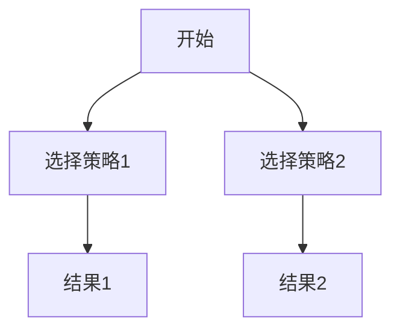
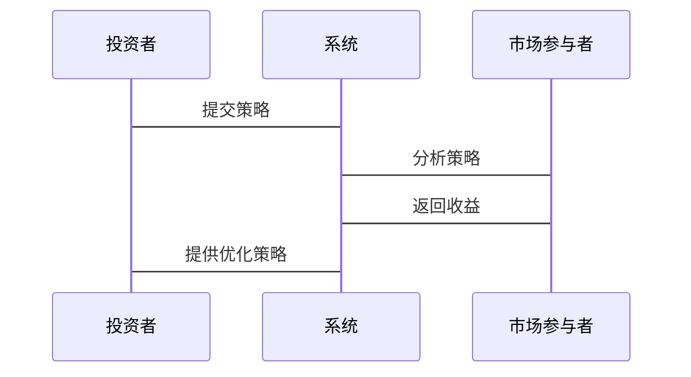

                 


# 智能体间博弈理论在价值投资策略优化中的应用

## 关键词：
智能体间博弈、价值投资、策略优化、纳什均衡、金融建模

## 摘要：
本文探讨了智能体间博弈理论在价值投资策略优化中的应用。通过分析博弈论的基本原理，构建智能体间的博弈模型，并结合实际投资场景，提出了一种基于纳什均衡的策略优化方法。文章从理论基础到实际应用，详细阐述了如何利用智能体间博弈理论优化投资决策，为投资者提供了新的视角和工具。

---

## 第一部分：智能体间博弈理论基础

### 第1章：博弈论与智能体概述

#### 1.1 博弈论的基本概念

##### 1.1.1 博弈的定义与分类
博弈是多个参与者在特定规则下进行决策的过程。根据参与者的数量和策略，博弈可以分为零和博弈、非零和博弈、完全信息博弈和不完全信息博弈。

##### 1.1.2 智能体的定义与特征
智能体是指能够感知环境并采取行动以实现目标的实体。在价值投资中，智能体可以是投资者、市场参与者或其他影响市场的主体。

##### 1.1.3 博弈论在金融领域的应用背景
博弈论广泛应用于金融领域，尤其是在解释市场参与者的决策行为和市场均衡状态方面。

#### 1.2 智能体间博弈的基本原理

##### 1.2.1 智能体的理性决策
智能体在博弈中通常假设是理性的，即每个参与者都会采取最优策略以最大化自身收益。

##### 1.2.2 博弈树与博弈图
博弈树和博弈图是表示博弈过程的工具。博弈树适用于决策过程有明确顺序的情况，而博弈图适用于同时决策的情况。

##### 1.2.3 纳什均衡的概念与意义
纳什均衡是博弈论中的核心概念，指在给定其他参与者策略的情况下，每个参与者都无法通过单方面改变策略而提高自身收益的状态。

---

### 第2章：智能体间博弈的核心概念与联系

#### 2.1 博弈模型的构建

##### 2.1.1 博弈模型的构成要素
博弈模型通常包括参与者、策略空间、收益函数和规则。

##### 2.1.2 实体关系图（ER图）的构建
以下是构建博弈模型的ER图示例：

```mermaid
erdiagram
actor 投资者
actor 市场参与者
actor 金融机构
```

##### 2.1.3 博弈模型的数学表达
博弈模型可以用矩阵表示，如下：

$$
\begin{matrix}
 & 策略1 & 策略2 \\
策略1 & (1,1) & (0,2) \\
策略2 & (2,0) & (1,1) \\
\end{matrix}
$$

#### 2.2 博弈论与价值投资策略的关系

##### 2.2.1 价值投资的基本原理
价值投资强调通过分析企业的基本面来确定其内在价值，寻找被市场低估的投资标的。

##### 2.2.2 智能体间博弈对投资决策的影响
市场参与者的博弈行为会影响资产价格，投资者需要考虑其他参与者的行为来优化自己的策略。

##### 2.2.3 竞争与合作对投资策略优化的作用
在博弈中，竞争可能导致价格波动，而合作可能带来稳定收益。

---

### 第3章：智能体间博弈的数学模型与算法原理

#### 3.1 博弈论的数学基础

##### 3.1.1 博弈树的构建与分析
以下是构建博弈树的示例：



##### 3.1.2 纳什均衡的数学证明
纳什均衡的定义可以用数学公式表示为：

$$
\forall i, u_i(s_i, s_{-i}) \geq u_i(s_i', s_{-i})
$$

其中，\( u_i \) 是第i个参与者的效用函数，\( s_i \) 是当前策略，\( s_{-i} \) 是其他参与者的策略。

##### 3.1.3 博弈模型的优化算法
优化算法可以通过以下步骤实现：

1. 确定参与者和策略空间。
2. 计算每个策略组合的收益。
3. 检查是否存在纳什均衡。

#### 3.2 博弈论在价值投资中的应用算法

##### 3.2.1 纳什均衡的计算方法
以下是计算纳什均衡的Python代码示例：

```python
def nash_equilibrium(matrix):
    rows = len(matrix)
    cols = len(matrix[0])
    equilibrium = []
    for i in range(rows):
        for j in range(cols):
            is_ne = True
            for k in range(rows):
                if k != i and matrix[k][j] > matrix[i][j]:
                    is_ne = False
                    break
            if is_ne:
                equilibrium.append((i, j))
    return equilibrium

# 示例收益矩阵
matrix = [
    [3, 1],
    [1, 3]
]

print(nash_equilibrium(matrix))  # 输出：[(0, 0), (1, 1)]
```

##### 3.2.2 基于智能体博弈的策略优化算法
策略优化算法可以通过以下步骤实现：

1. 构建博弈模型。
2. 计算纳什均衡。
3. 选择最优策略。

##### 3.2.3 算法的收敛性分析
算法的收敛性取决于博弈模型的结构和参与者的策略选择。

---

### 第4章：智能体间博弈的系统分析与架构设计

#### 4.1 系统分析

##### 4.1.1 问题场景介绍
在价值投资中，投资者需要考虑市场参与者的博弈行为，优化自己的投资策略。

##### 4.1.2 系统功能需求分析
系统需要实现博弈模型构建、纳什均衡计算和策略优化功能。

##### 4.1.3 系统性能需求分析
系统需要高效处理大量数据和复杂模型。

#### 4.2 系统架构设计

##### 4.2.1 领域模型设计（Mermaid类图）
以下是领域模型设计的示例：


##### 4.2.2 系统架构设计（Mermaid架构图）
以下是系统架构设计的示例：

```mermaid
container 投资者系统 {
    投资者
    市场参与者
    金融机构
}
container 系统 {
    博弈模型
    纳什均衡计算
    策略优化
}
```

##### 4.2.3 系统交互流程（Mermaid序列图）
以下是系统交互流程的示例：



---

### 第5章：智能体间博弈的项目实战

#### 5.1 环境安装与配置

##### 5.1.1 开发环境的选择
推荐使用Python和相关库（如NumPy、Matplotlib）进行开发。

##### 5.1.2 依赖库的安装
安装必要的库：

```bash
pip install numpy matplotlib
```

##### 5.1.3 系统运行环境的配置
确保系统环境满足高性能计算需求。

#### 5.2 核心算法实现

##### 5.2.1 纳什均衡计算的Python实现
以下是纳什均衡计算的代码示例：

```python
def nash_equilibrium(matrix):
    rows = len(matrix)
    cols = len(matrix[0])
    equilibrium = []
    for i in range(rows):
        for j in range(cols):
            is_ne = True
            for k in range(rows):
                if k != i and matrix[k][j] > matrix[i][j]:
                    is_ne = False
                    break
            if is_ne:
                equilibrium.append((i, j))
    return equilibrium

# 示例收益矩阵
matrix = [
    [3, 1],
    [1, 3]
]

print(nash_equilibrium(matrix))  # 输出：[(0, 0), (1, 1)]
```

##### 5.2.2 智能体博弈模型的代码实现
以下是智能体博弈模型的代码示例：

```python
def game_model(players, strategies):
    # 定义收益矩阵
    matrix = []
    for i in range(len(players)):
        row = []
        for j in range(len(strategies)):
            row.append(players[i][j])
        matrix.append(row)
    return matrix

players = [
    [3, 1],
    [1, 3]
]

strategies = ['策略1', '策略2']

print(game_model(players, strategies))  # 输出收益矩阵
```

##### 5.2.3 算法优化与调优
通过并行计算和优化算法结构来提高计算效率。

#### 5.3 实际案例分析

##### 5.3.1 案例背景介绍
以股票投资为例，分析市场参与者的博弈行为。

##### 5.3.2 数据收集与处理
收集市场参与者的策略和收益数据。

##### 5.3.3 算法应用与结果分析
应用纳什均衡算法分析市场均衡状态。

##### 5.3.4 案例总结与经验分享
总结案例分析结果，提出优化投资策略的建议。

---

### 第6章：最佳实践与小结

#### 6.1 最佳实践 tips

##### 6.1.1 理论与实践结合
将博弈论理论与实际投资场景相结合，优化投资策略。

##### 6.1.2 持续学习与更新
关注市场变化，不断更新博弈模型和算法。

#### 6.2 小结
智能体间博弈理论为价值投资策略优化提供了新的视角和工具，通过构建博弈模型和计算纳什均衡，投资者可以更好地理解市场行为，优化投资决策。

#### 6.3 注意事项
在实际应用中，需注意市场环境的复杂性和不确定性，避免过度简化模型。

#### 6.4 拓展阅读
推荐阅读相关领域的书籍和论文，深入学习博弈论和金融建模的知识。

---

以上是《智能体间博弈理论在价值投资策略优化中的应用》的技术博客文章的目录和部分内容概述。通过系统地分析和详细阐述，本文为读者提供了从理论到实践的完整指南，帮助投资者优化价值投资策略。

