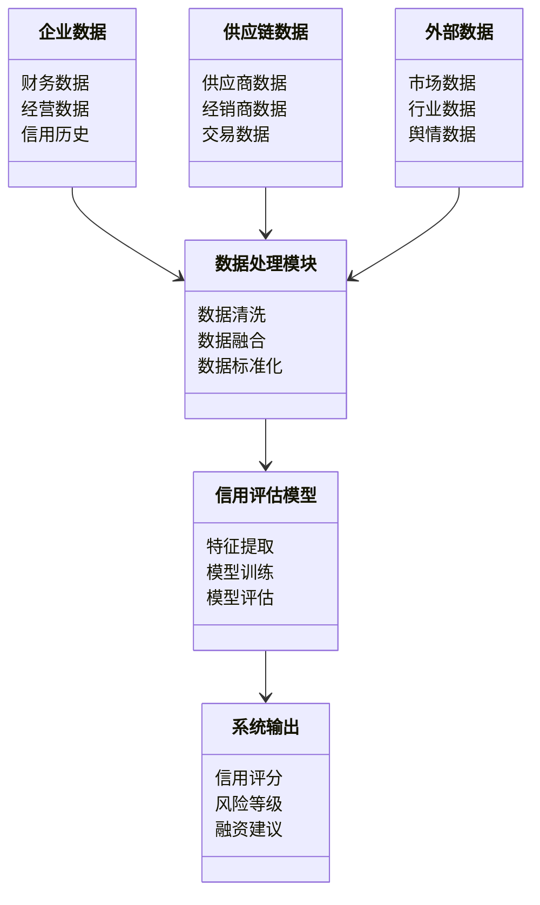
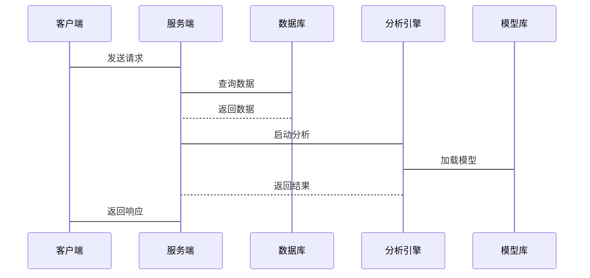

                 


# 智能供应链金融信用评估

## 关键词：智能供应链金融、信用评估、机器学习、深度学习、图论、系统架构

## 摘要：智能供应链金融信用评估是通过智能化技术手段对供应链金融中的信用风险进行评估和控制。本文将从供应链金融的基本概念出发，详细探讨智能供应链金融信用评估的核心概念、算法原理、系统架构设计以及项目实战，最后总结最佳实践和未来发展方向。

---

# 第一部分: 智能供应链金融信用评估概述

## 第1章: 智能供应链金融信用评估的背景与意义

### 1.1 供应链金融的基本概念

供应链金融是指通过整合供应链上下游企业，利用核心企业的信用，为供应链上的中小企业提供融资支持的一种金融模式。其核心在于通过优化资金流、物流和信息流，降低整个供应链的风险，提高供应链的整体效率。

#### 1.1.1 供应链金融的定义
供应链金融是一种基于供应链整体运作的金融模式，旨在通过整合供应链上下游企业，为核心企业及其供应商、经销商等提供融资支持，优化资金流动，降低整体供应链成本。

#### 1.1.2 供应链金融的核心要素
- **核心企业**：供应链中的主导企业，通常为核心企业的信用背书。
- **供应商**：为供应链提供原材料或服务的企业。
- **经销商**：销售供应链产品的下游企业。
- **金融机构**：提供融资支持的银行或其他金融机构。

#### 1.1.3 供应链金融的参与者与流程
供应链金融的参与者包括核心企业、供应商、经销商、金融机构以及物流和信息流平台。其流程通常包括需求分析、融资申请、信用评估、资金发放和后续监管。

### 1.2 供应链金融信用评估的必要性

信用评估是供应链金融中的核心环节，其目的是通过对企业或个人的信用状况进行分析，评估其还款能力和还款意愿，从而降低金融风险。

#### 1.2.1 供应链金融中的信用风险
供应链金融中的信用风险主要来自于以下几点：
1. **核心企业的信用风险**：核心企业可能因经营不善或市场波动导致还款能力下降。
2. **供应商和经销商的信用风险**：中小企业的信用状况不稳定，容易出现违约。
3. **金融机构的风控能力**：传统金融机构在面对复杂供应链关系时，难以快速、准确地评估信用风险。

#### 1.2.2 信用评估在供应链金融中的作用
- **降低金融风险**：通过科学的信用评估，金融机构可以有效识别高风险客户，避免资金损失。
- **提高融资效率**：智能化的信用评估可以快速完成评估过程，缩短融资周期。
- **优化供应链管理**：信用评估不仅服务于融资，还可以帮助供应链企业优化管理和协作。

#### 1.2.3 智能化信用评估的优势
智能化信用评估通过大数据、人工智能和区块链等技术，能够实现以下优势：
- **数据驱动的精准评估**：利用多维度数据，包括企业经营数据、市场数据、交易数据等，进行综合评估。
- **实时监控与预警**：通过实时数据更新和模型迭代，及时发现潜在风险。
- **自动化与智能化**：减少人工干预，提高评估效率和准确性。

### 1.3 智能供应链金融的发展现状

#### 1.3.1 传统供应链金融的局限性
传统供应链金融模式在实践中面临以下问题：
- **信息不对称**：金融机构难以全面掌握供应链上下游企业的详细信息。
- **效率低下**：传统评估方法耗时长，难以满足企业快速融资的需求。
- **风险控制能力弱**：缺乏智能化工具，难以应对复杂多变的市场环境。

#### 1.3.2 智能化技术在供应链金融中的应用
随着大数据、人工智能、区块链等技术的发展，智能供应链金融逐渐成为主流。以下是一些典型的应用场景：
- **大数据分析**：利用企业经营数据、市场数据、交易数据等，构建企业画像，辅助信用评估。
- **人工智能技术**：通过机器学习、深度学习等技术，实现信用评分、风险预测和欺诈检测。
- **区块链技术**：通过区块链技术实现供应链数据的透明化和不可篡改，增强信任。

#### 1.3.3 当前智能供应链金融的发展趋势
1. **技术驱动**：智能化技术的应用越来越广泛，成为供应链金融的核心驱动力。
2. **数据融合**：多源数据的整合和分析能力不断提升，信用评估的精度和效率显著提高。
3. **生态化发展**：供应链金融逐渐向生态化方向发展，形成以核心企业为核心的生态圈。

### 1.4 本章小结
本章从供应链金融的基本概念出发，介绍了供应链金融信用评估的必要性，并详细探讨了智能化信用评估的优势和当前智能供应链金融的发展现状。通过分析传统供应链金融的局限性，提出了智能化技术在供应链金融中的重要性。

---

## 第2章: 供应链金融信用评估的核心概念

### 2.1 信用评估的基本原理

信用评估是通过对企业的信用状况进行分析，评估其还款能力和还款意愿的过程。其基本原理包括以下几个方面：

#### 2.1.1 信用评估的定义与目标
信用评估的目的是通过分析企业的财务状况、经营能力、市场环境等因素，评估其信用风险，为金融机构提供融资决策依据。

#### 2.1.2 信用评估的关键指标
信用评估的关键指标包括：
- **偿债能力**：包括流动比率、速动比率、负债率等。
- **盈利能力**：包括净利率、毛利率、投资回报率等。
- **运营能力**：包括存货周转率、应收账款周转率等。
- **信用历史**：包括企业过去的还款记录和违约情况。

#### 2.1.3 信用评估的分类与方法
信用评估可以分为定性评估和定量评估两种方法。定性评估主要基于企业经营状况、行业环境等因素，而定量评估则基于财务数据、市场数据等量化指标。

### 2.2 智能供应链金融中的信用评估模型

智能供应链金融中的信用评估模型是一种基于大数据和人工智能技术的综合评估系统，能够从多维度数据中提取信息，构建企业的信用评分。

#### 2.2.1 模型的基本结构与功能
智能信用评估模型的基本结构包括数据采集、数据预处理、特征提取、模型训练和评估五个阶段。

#### 2.2.2 模型的输入与输出
模型的输入包括企业的财务数据、交易数据、市场数据等，输出包括信用评分、风险等级和融资建议。

#### 2.2.3 模型的评价标准
模型的评价标准包括准确率、召回率、F1值等指标。

### 2.3 智能供应链金融信用评估的核心要素

智能供应链金融信用评估的核心要素包括供应链网络、多源数据和智能化算法。

#### 2.3.1 数据来源与特征
智能供应链金融信用评估的数据来源包括：
- **企业内部数据**：包括财务数据、经营数据等。
- **供应链数据**：包括供应商和经销商之间的交易数据。
- **外部数据**：包括市场数据、行业数据、舆情数据等。

#### 2.3.2 供应链网络的构建与分析
供应链网络的构建包括节点和边的定义，节点代表企业，边代表企业之间的交易关系。通过分析供应链网络的结构，可以识别关键节点和潜在风险。

#### 2.3.3 风险评估与控制
智能供应链金融信用评估通过分析供应链网络中的风险因素，制定风险控制策略，如分散风险、设置预警机制等。

### 2.4 本章小结
本章详细介绍了信用评估的基本原理和智能供应链金融中的信用评估模型，分析了模型的核心要素和功能。通过对数据来源和供应链网络的构建与分析，提出了风险评估与控制的方法。

---

## 第3章: 信用评估模型的算法原理

### 3.1 基于机器学习的信用评估模型

基于机器学习的信用评估模型是一种通过训练数据构建预测模型的方法，能够从多维度数据中提取特征，实现精准的信用评分。

#### 3.1.1 机器学习在信用评估中的应用
机器学习在信用评估中的应用包括分类、回归和聚类等任务。

#### 3.1.2 常见的机器学习算法
常用的机器学习算法包括逻辑回归、随机森林、支持向量机（SVM）和神经网络等。

#### 3.1.3 算法的优缺点分析
- **逻辑回归**：简单易用，适合二分类问题，但对非线性关系的拟合能力较差。
- **随机森林**：能够处理高维数据，具有较强的抗过拟合能力，但计算复杂度较高。
- **神经网络**：适合处理复杂的非线性关系，但需要大量的训练数据，且计算复杂。

### 3.2 基于图论的供应链网络分析

基于图论的供应链网络分析是一种通过构建供应链网络，分析节点之间的关系和风险传播的方法。

#### 3.2.1 供应链网络的构建与表示
供应链网络的构建包括节点和边的定义，节点代表企业，边代表企业之间的交易关系。通过图论算法，可以识别关键节点和社区结构。

#### 3.2.2 基于图论的信用评估方法
基于图论的信用评估方法包括中心性分析、社区检测和风险传播分析等。

#### 3.2.3 网络分析在风险评估中的应用
通过分析供应链网络的结构，可以识别潜在的风险点，制定风险控制策略。

### 3.3 深度学习在智能信用评估中的应用

深度学习是一种基于人工神经网络的机器学习方法，能够从复杂数据中提取特征，实现精准的信用评分。

#### 3.3.1 深度学习的基本原理
深度学习的基本原理包括神经网络的结构、激活函数、损失函数和优化算法等。

#### 3.3.2 基于深度学习的信用评估模型
常用的深度学习模型包括卷积神经网络（CNN）、循环神经网络（RNN）和长短期记忆网络（LSTM）等。

#### 3.3.3 深度学习的优势与挑战
- **优势**：能够处理复杂的非线性关系，适合大规模数据的分析。
- **挑战**：需要大量的训练数据，计算复杂度高，模型解释性差。

### 3.4 算法实现与优化

#### 3.4.1 算法实现的步骤与流程
信用评估模型的实现步骤包括数据采集、数据预处理、特征提取、模型训练和评估。

#### 3.4.2 算法优化的策略与方法
算法优化的策略包括参数调优、特征选择和模型集成等。

#### 3.4.3 案例分析与结果解读
通过具体案例分析，展示基于机器学习和深度学习的信用评估模型的实现过程和结果。

### 3.5 本章小结
本章详细介绍了基于机器学习和深度学习的信用评估模型，分析了算法的优缺点，并通过具体案例展示了算法的实现过程和结果。

---

## 第4章: 系统分析与架构设计方案

### 4.1 问题场景介绍

智能供应链金融信用评估系统需要解决以下问题：
1. 如何高效地采集和处理多源数据？
2. 如何构建和优化信用评估模型？
3. 如何实现系统的实时监控与预警？

### 4.2 项目介绍

智能供应链金融信用评估系统是一个基于大数据和人工智能技术的综合评估平台，旨在通过多源数据的整合和分析，实现供应链金融中的精准信用评估。

### 4.3 系统功能设计

#### 4.3.1 领域模型（Mermaid 类图）


#### 4.3.2 系统架构设计（Mermaid 架构图）


#### 4.3.3 系统接口设计

系统接口设计包括数据接口、模型接口和用户接口三部分。

#### 4.3.4 系统交互设计（Mermaid 序列图）


### 4.4 本章小结
本章通过问题场景介绍和项目介绍，详细设计了智能供应链金融信用评估系统的功能模块和架构，提出了系统的实现方案。

---

## 第5章: 项目实战

### 5.1 环境安装与配置

#### 5.1.1 安装Python环境
```bash
python --version
pip install --upgrade pip
```

#### 5.1.2 安装依赖库
```bash
pip install numpy pandas scikit-learn tensorflow
```

### 5.2 系统核心实现源代码

#### 5.2.1 数据预处理代码
```python
import pandas as pd
import numpy as np

# 读取数据
data = pd.read_csv('credit_data.csv')

# 数据清洗
data.dropna(inplace=True)
data = pd.get_dummies(data)
```

#### 5.2.2 模型训练代码
```python
from sklearn.model import LogisticRegression
from sklearn.model_selection import train_test_split

# 划分数据集
X_train, X_test, y_train, y_test = train_test_split(data.drop('target', axis=1), data['target'], test_size=0.2)

# 训练模型
model = LogisticRegression()
model.fit(X_train, y_train)

# 模型评估
print(model.score(X_test, y_test))
```

#### 5.2.3 模型解释代码
```python
from sklearn.metrics import classification_report

# 预测结果
y_pred = model.predict(X_test)

# 输出分类报告
print(classification_report(y_test, y_pred))
```

### 5.3 代码应用解读与分析

通过上述代码，我们可以实现一个简单的逻辑回归模型，用于信用评分。数据预处理部分包括数据清洗和特征编码，模型训练部分包括数据划分和模型训练，模型评估部分包括准确率和分类报告。

### 5.4 实际案例分析与详细讲解

通过具体案例分析，展示基于机器学习的信用评估模型的实现过程和结果。

### 5.5 项目小结

本章通过项目实战，详细讲解了智能供应链金融信用评估系统的实现过程，包括环境安装、数据预处理、模型训练和结果分析。

---

## 第6章: 最佳实践与未来展望

### 6.1 小结

智能供应链金融信用评估是供应链金融中的核心环节，其智能化发展离不开大数据和人工智能技术的支持。

### 6.2 注意事项

在实际应用中，需要注意数据隐私和安全问题，同时要定期更新模型，以应对市场环境的变化。

### 6.3 未来研究方向

未来的研究方向包括：
1. **多模态数据的融合**：结合文本、图像等多种数据形式，提高信用评估的准确性。
2. **实时信用评估**：通过实时数据流处理技术，实现信用评估的实时更新。
3. **区块链技术的应用**：利用区块链技术实现供应链数据的可信共享和隐私保护。

### 6.4 拓展阅读

推荐阅读以下书籍和论文：
1. 《供应链金融：理论与实践》
2. 《机器学习实战》
3. 《区块链技术与应用》

### 6.5 本章小结

本章总结了智能供应链金融信用评估的最佳实践，并展望了未来的研究方向和应用前景。

---

## 第7章: 总结

智能供应链金融信用评估是供应链金融中的重要组成部分，其智能化发展离不开大数据和人工智能技术的支持。本文通过详细分析智能供应链金融信用评估的核心概念、算法原理和系统架构设计，提出了基于机器学习和深度学习的信用评估模型，并通过项目实战展示了系统的实现过程。最后，本文总结了最佳实践，并展望了未来的研究方向。

---

**注**：本文为智能供应链金融信用评估技术博客文章的目录大纲，实际文章需要根据以上结构填充具体内容，包括详细的技术分析、代码实现和案例解读。

