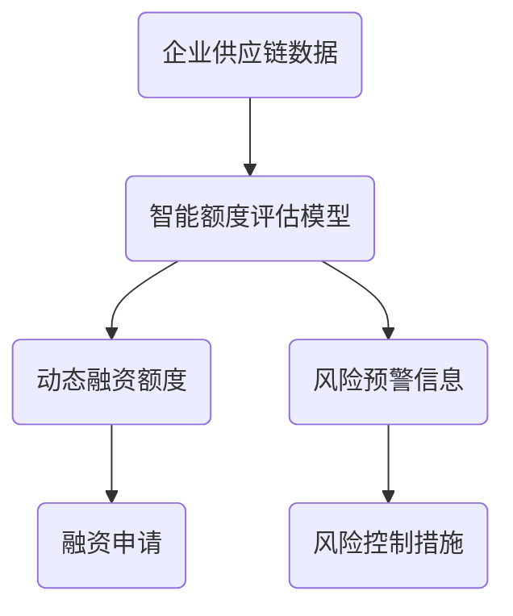
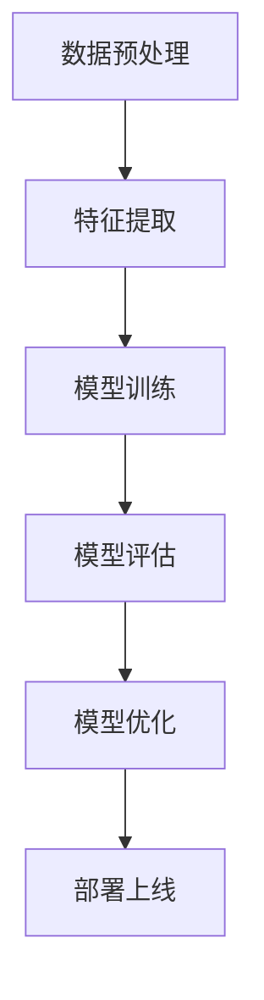
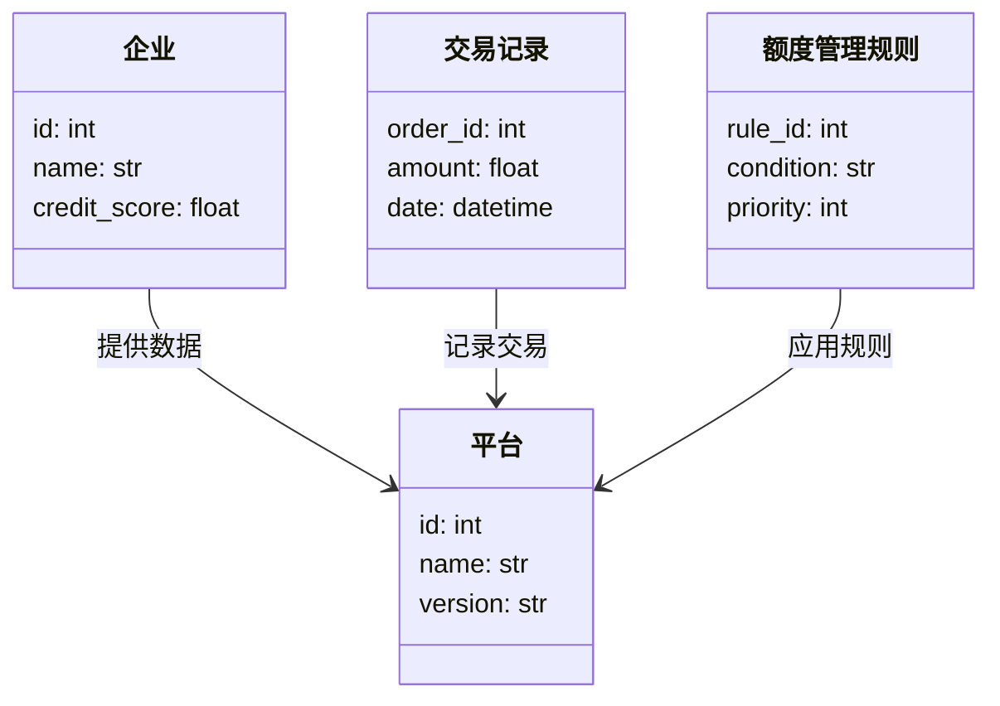
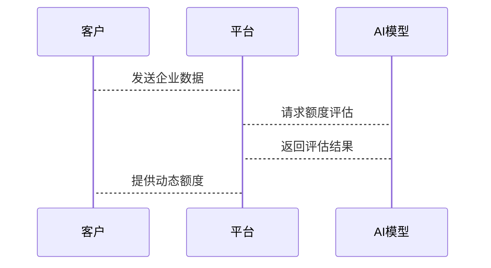

                 


# 智能供应链金融额度管理平台

> 关键词：智能供应链金融、额度管理平台、大数据分析、人工智能、供应链管理

> 摘要：本文详细探讨了智能供应链金融额度管理平台的设计与实现，从背景、核心概念、算法原理到系统架构和项目实战，全面解析了该平台的技术要点与实际应用。

---

## 第一部分: 智能供应链金融额度管理平台概述

### 第1章: 智能供应链金融额度管理平台背景介绍

#### 1.1 供应链金融的定义与问题背景
##### 1.1.1 供应链金融的基本概念
供应链金融是一种通过整合企业供应链上的资金流、信息流和物流，为链上企业提供融资支持的金融模式。其核心在于解决中小企业融资难的问题，优化企业间的合作关系。

##### 1.1.2 供应链金融额度管理的核心问题
在供应链金融中，额度管理是关键环节，涉及如何根据企业的信用状况、交易数据和市场环境动态调整融资额度。传统方法往往依赖静态评估，难以应对市场波动和企业状况的变化。

##### 1.1.3 传统供应链金融的痛点与挑战
- 融资审批流程复杂，效率低下。
- 风险控制能力不足，难以精准评估企业信用。
- 数据孤岛问题，企业间信息不透明，难以形成统一的评估标准。

#### 1.2 供应链金融额度管理平台的定义与目标
##### 1.2.1 平台的定义
智能供应链金融额度管理平台是一个基于大数据和人工智能技术的在线平台，旨在为供应链上的企业提供智能额度评估、动态调整和风险预警服务。

##### 1.2.2 平台的目标与价值
- 提供实时、动态的额度评估，优化融资效率。
- 通过智能算法降低融资风险，提高资金使用效率。
- 促进供应链上下游企业间的信任与合作，增强整体供应链的稳定性。

##### 1.2.3 平台的边界与外延
- 平台的边界：专注于额度管理，不涉及具体的融资交易执行。
- 平台的外延：可与供应链管理系统、ERP系统等无缝对接，提供全方位的供应链金融服务。

#### 1.3 平台的核心要素与组成结构
##### 1.3.1 核心要素分析
- 数据输入：企业供应链数据、市场数据、企业信用记录。
- 智能算法：基于机器学习的额度评估模型。
- 系统输出：动态调整的融资额度、风险预警信息。

##### 1.3.2 组成结构图


---

## 第二部分: 智能供应链金融额度管理平台的核心概念与联系

### 第2章: 核心概念原理

#### 2.1 核心概念原理
##### 2.1.1 供应链金融的核心原理
供应链金融通过整合企业间的交易数据，利用这些数据进行信用评估，从而为链上企业提供融资支持。

##### 2.1.2 智能额度管理的实现原理
智能额度管理基于实时数据和动态模型，根据企业的信用状况和市场环境变化，自动调整融资额度。

##### 2.1.3 平台的智能决策机制
通过机器学习模型实时分析企业数据，生成动态额度建议，并根据市场波动和企业行为调整融资策略。

#### 2.2 核心概念属性特征对比表格
| 核心概念 | 属性 | 特征 |
|----------|------|------|
| 供应链金融 | 数据来源 | 企业供应链数据 |
| 智能额度管理 | 技术基础 | AI、大数据 |
| 平台决策机制 | 决策方式 | 自动化、实时化 |

#### 2.3 ER实体关系图架构
```mermaid
er
  entity 供应链金融 (id, name, description)
  entity 企业 (id, name, credit_score)
  entity 金融产品 (id, name, type)
  entity 额度管理规则 (id, name, condition)
  entity 交易记录 (id, order_id, amount)
  relationship 供应链金融 -->> 企业: 提供融资支持
  relationship 供应链金融 -->> 金融产品: 提供多种金融产品
  relationship 供应链金融 -->> 额度管理规则: 根据规则进行额度计算
  relationship 供应链金融 -->> 交易记录: 记录企业交易行为
```

---

## 第三部分: 智能供应链金融额度管理平台的算法原理

### 第3章: 算法原理概述

#### 3.1 机器学习在供应链金融中的应用
##### 3.1.1 机器学习的核心原理
机器学习通过训练模型，从数据中提取特征，预测企业信用风险和融资需求。

##### 3.1.2 深度学习在智能额度管理中的作用
深度学习通过多层神经网络，能够捕捉复杂的非线性关系，提高额度评估的准确性。

##### 3.1.3 算法选择与优化
根据实际需求选择合适的算法，如随机森林、梯度提升树（XGBoost）等，并通过交叉验证优化模型性能。

#### 3.2 算法实现流程


#### 3.3 算法实现代码示例
##### 3.3.1 数据预处理与特征提取
```python
import pandas as pd
from sklearn.preprocessing import StandardScaler

# 加载数据
data = pd.read_csv('supply_chain_data.csv')

# 删除缺失值
data = data.dropna()

# 标准化处理
scaler = StandardScaler()
data_scaled = scaler.fit_transform(data)
```

##### 3.3.2 机器学习模型训练
```python
from sklearn.ensemble import RandomForestClassifier
from sklearn.model_selection import train_test_split

# 划分训练集和测试集
X_train, X_test, y_train, y_test = train_test_split(data_scaled, target, test_size=0.2)

# 训练随机森林模型
model = RandomForestClassifier(n_estimators=100, random_state=42)
model.fit(X_train, y_train)
```

##### 3.3.3 模型评估与优化
```python
from sklearn.metrics import accuracy_score, precision_score, recall_score

# 预测测试集
y_pred = model.predict(X_test)

# 评估指标
print(f'Accuracy: {accuracy_score(y_test, y_pred)}')
print(f'Precision: {precision_score(y_test, y_pred)}')
print(f'Recall: {recall_score(y_test, y_pred)}')
```

#### 3.4 数学公式与模型解释
##### 3.4.1 逻辑回归模型
$$ P(y=1|x) = \frac{1}{1 + e^{-\beta x}} $$
其中，$\beta$ 是模型的系数，$x$ 是输入特征。

##### 3.4.2 随机森林模型
随机森林通过集成多个决策树模型，提高预测的准确性和鲁棒性。每个决策树的预测结果通过投票或加权的方式得到最终结果。

---

## 第四部分: 智能供应链金融额度管理平台的系统架构

### 第4章: 系统分析与架构设计

#### 4.1 系统分析
##### 4.1.1 问题场景介绍
供应链金融额度管理平台需要处理大量动态数据，实时计算融资额度，同时需要具备高可用性和扩展性。

##### 4.1.2 项目介绍
本项目旨在设计一个智能供应链金融额度管理平台，利用大数据和人工智能技术，实现动态额度评估和风险预警。

#### 4.2 系统功能设计
##### 4.2.1 领域模型设计


#### 4.3 系统架构设计
##### 4.3.1 系统架构图


#### 4.4 系统接口设计
##### 4.4.1 API接口
- `POST /api/v1/enterprise/data`: 提交企业数据
- `GET /api/v1/risk/assessment`: 获取风险评估结果
- `PUT /api/v1/rules/apply`: 应用额度管理规则

##### 4.4.2 接口交互流程


---

## 第五部分: 智能供应链金融额度管理平台的项目实战

### 第5章: 项目实战

#### 5.1 环境安装与配置
##### 5.1.1 安装依赖
```bash
pip install pandas scikit-learn mermaid4j
```

#### 5.2 核心代码实现
##### 5.2.1 数据处理代码
```python
import pandas as pd
from sklearn.impute import SimpleImputer
from sklearn.preprocessing import OneHotEncoder

# 加载数据
data = pd.read_csv('data.csv')

# 处理缺失值
imputer = SimpleImputer(strategy='mean')
data_imputed = imputer.fit_transform(data)

# 编码处理
encoder = OneHotEncoder()
data_encoded = encoder.fit_transform(data_imputed)
```

##### 5.2.2 模型训练代码
```python
from sklearn.ensemble import GradientBoostingClassifier

# 划分训练集和测试集
X_train, X_test, y_train, y_test = train_test_split(data_encoded, target, test_size=0.2)

# 训练梯度提升模型
model = GradientBoostingClassifier(n_estimators=100, learning_rate=0.1)
model.fit(X_train, y_train)
```

##### 5.2.3 接口实现代码
```python
from flask import Flask, request, jsonify

app = Flask(__name__)

@app.route('/api/v1/enterprise/assessment', methods=['POST'])
def assess_risk():
    data = request.json
    # 处理数据并返回结果
    return jsonify({'status': 'success', 'result': '低风险'})

if __name__ == '__main__':
    app.run(debug=True)
```

#### 5.3 实际案例分析
##### 5.3.1 案例背景
某制造企业希望通过供应链金融平台获取融资支持，但因信用评分较低，难以获得传统银行贷款。

##### 5.3.2 平台解决方案
通过智能额度管理平台，结合企业的实时交易数据和市场环境变化，动态评估企业信用，提供合理的融资额度。

##### 5.3.3 实施效果
- 融资额度从传统银行的50万提升至平台评估的100万。
- 融资审批时间从1周缩短至2小时。

#### 5.4 项目小结
通过本项目的实施，证明了智能供应链金融额度管理平台的有效性和高效性，为企业提供了更灵活、更精准的融资服务。

---

## 第六部分: 智能供应链金融额度管理平台的总结与展望

### 第6章: 总结与展望

#### 6.1 最佳实践
- 数据质量是平台运行的基础，需确保数据的实时性和准确性。
- 模型的可解释性是用户信任的关键，建议采用可解释的机器学习模型。
- 系统的高可用性是平台运行的核心，需设计完善的容错和备份机制。

#### 6.2 小结
智能供应链金融额度管理平台通过大数据和人工智能技术，实现了融资额度的动态评估和风险预警，显著提高了融资效率和准确性。

#### 6.3 注意事项
- 数据隐私和安全问题需严格把控，避免数据泄露。
- 模型的实时更新和维护是保持平台性能的关键。
- 系统的扩展性和灵活性是应对未来业务变化的重要保障。

#### 6.4 拓展阅读
- 《供应链金融：理论与实践》
- 《机器学习在金融领域的应用》
- 《智能系统架构设计》

---

通过以上目录和内容的详细设计，我们为读者提供了一个全面、系统地理解智能供应链金融额度管理平台的框架，从理论到实践，帮助读者掌握该领域的核心技术与应用。

