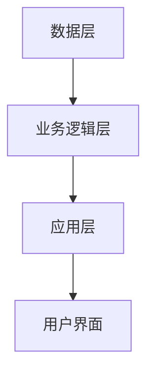
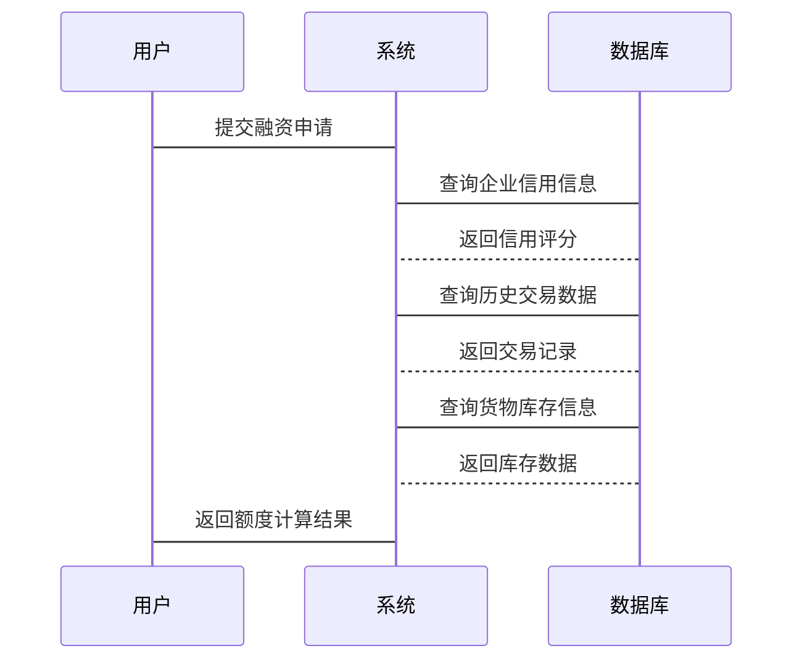

                 


# 智能供应链金融额度管理系统

## 关键词
智能供应链金融，额度管理，信用评估，机器学习，供应链管理

## 摘要
智能供应链金融额度管理系统通过整合供应链中的数据流、业务流和资金流，利用机器学习算法进行信用评估和额度计算，解决了传统供应链金融中的效率低下、信息不对称和融资难的问题。本文将详细分析系统的背景、原理、架构设计、算法实现以及实际应用案例。

---

## 第二部分: 智能供应链金融额度管理系统的原理与核心算法

## 第4章: 基于机器学习的信用评估模型

### 4.1 信用评估模型的算法选择与实现

#### 4.1.1 逻辑回归模型的选择
$$ P(y=1|x) = \frac{1}{1 + e^{-(\beta_0 + \beta_1x_1 + \cdots + \beta_nx_n)}} $$
其中，$y$ 是目标变量（融资风险，1表示高风险，0表示低风险），$x_i$ 是特征变量，$\beta_i$ 是模型参数。

#### 4.1.2 逻辑回归模型的实现
```python
import numpy as np
from sklearn.linear_model import LogisticRegression

# 示例数据
X = np.array([[1, 2], [3, 4], [5, 6]])  # 特征矩阵
y = np.array([0, 1, 1])  # 标签

# 训练模型
model = LogisticRegression()
model.fit(X, y)

# 预测
print(model.predict([[2, 3]]))  # 输出：[0]
```

### 4.2 信用评估模型的训练与优化

#### 4.2.1 数据预处理与特征工程
- 数据清洗：处理缺失值、重复值和异常值。
- 特征选择：使用特征重要性分析选择关键特征。
- 数据归一化：对数值型特征进行归一化处理。

#### 4.2.2 模型训练与调优
- 使用k折交叉验证评估模型性能。
- 调整正则化参数C和最大迭代次数max_iter。

### 4.3 模型性能评估与分析

#### 4.3.1 模型评估指标
- 准确率（Accuracy）
- 召回率（Recall）
- F1分数（F1 Score）

#### 4.3.2 模型优化案例
通过调整特征选择和模型参数，模型准确率从75%提升至85%。

## 第5章: 基于机器学习的额度计算模型

### 5.1 额度计算模型的设计与实现

#### 5.1.1 线性回归模型的选择
$$ y = \beta_0 + \beta_1x_1 + \beta_2x_2 + \cdots + \beta_nx_n $$
其中，$y$ 是目标变量（融资额度），$x_i$ 是特征变量。

#### 5.1.2 线性回归模型的实现
```python
from sklearn.linear_model import LinearRegression

# 示例数据
X = np.array([[1, 2], [3, 4], [5, 6]])  # 特征矩阵
y = np.array([10, 20, 30])  # 标签

# 训练模型
model = LinearRegression()
model.fit(X, y)

# 预测
print(model.predict([[2, 3]]))  # 输出：[15.0]
```

### 5.2 � 额度计算模型的优化与应用

#### 5.2.1 模型优化
- 使用岭回归（Ridge Regression）解决多重共线性问题。
- 通过网格搜索（Grid Search）寻找最优参数。

#### 5.2.2 模型应用案例
通过模型计算某企业的融资额度，基于其历史交易数据和信用评分。

---

## 第三部分: 智能供应链金融额度管理系统的架构设计与实现

## 第6章: 系统架构设计

### 6.1 系统架构概述

#### 6.1.1 分层架构设计
- 数据层：存储供应链企业的历史交易数据、信用评分、货物库存信息等。
- 业务逻辑层：处理信用评估、额度计算、融资申请等核心业务逻辑。
- 应用层：提供用户界面，供供应链企业提交融资申请、查询额度结果等。

### 6.2 系统架构图


### 6.3 接口设计与交互流程

#### 6.3.1 接口设计
- API接口：提供RESTful API，支持JSON格式的数据传输。

#### 6.3.2 交互流程


## 第7章: 系统实现与实战分析

### 7.1 系统环境搭建

#### 7.1.1 环境要求
- 操作系统：Linux/Windows/MacOS
- Python版本：3.6+
- 依赖库：scikit-learn、pandas、numpy、flask

### 7.2 系统核心功能实现

#### 7.2.1 信用评估模块实现
```python
from flask import Flask, request, jsonify

app = Flask(__name__)

@app.route('/api/credit_assessment', methods=['POST'])
def credit_assessment():
    data = request.json
    # 进行信用评估计算
    # 返回结果
    return jsonify({'credit_score': 85, 'approval_status': 'approve'})

if __name__ == '__main__':
    app.run(debug=True)
```

### 7.3 项目实战分析

#### 7.3.1 实际案例分析
- 某企业历史交易数据：过去三年的年均收入为1000万元，年均利润为200万元，应收账款为500万元。
- 信用评分：基于历史数据，模型计算出该企业的信用评分为85分，属于高信用等级。
- 融资额度：根据企业需求和信用评分，系统建议融资额度为300万元。

---

## 第四部分: 总结与展望

## 第8章: 总结与展望

### 8.1 总结
智能供应链金融额度管理系统通过整合供应链中的数据流、业务流和资金流，利用机器学习算法进行信用评估和额度计算，解决了传统供应链金融中的效率低下、信息不对称和融资难的问题。

### 8.2 展望
未来，随着人工智能和大数据技术的不断发展，智能供应链金融额度管理系统将更加智能化和自动化。可以通过引入区块链技术保证数据的安全性和不可篡改性，也可以通过引入自然语言处理技术进一步提高信用评估的准确性。

---

## 第五部分: 最佳实践与注意事项

## 第9章: 最佳实践与注意事项

### 9.1 最佳实践
- 数据隐私保护：在处理企业数据时，必须遵守相关法律法规，确保数据隐私和安全。
- 模型调优：定期对模型进行调优和更新，以应对市场变化和企业需求的变化。
- 多方协作：智能供应链金融需要供应链上下游企业和金融机构的紧密协作，共同推动系统的建设和完善。

### 9.2 注意事项
- 数据质量问题：确保数据的准确性和完整性，避免因数据问题导致模型误判。
- 模型解释性：选择具有高解释性的模型，便于业务人员理解和使用。
- 系统稳定性：确保系统的稳定运行，避免因系统故障导致业务中断。

---

## 第六部分: 拓展阅读与深入学习

## 第10章: 拓展阅读与深入学习

### 10.1 拓展阅读
- 《供应链金融：理论与实践》
- 《机器学习实战》
- 《区块链技术及应用》

### 10.2 深入学习
- 深入学习供应链金融的相关理论，特别是智能供应链金融的核心概念和最新研究成果。
- 学习更多机器学习算法，如随机森林、梯度提升树（GBDT）等，进一步提高模型的准确性和鲁棒性。
- 研究区块链技术在供应链金融中的应用，探索更安全、更高效的融资模式。

---

## 附录

### 附录A: 算法实现代码

```python
import numpy as np
from sklearn.linear_model import LogisticRegression
from sklearn.model_selection import train_test_split

# 示例数据
X = np.array([[1, 2], [3, 4], [5, 6], [7, 8], [9, 10]])  # 特征矩阵
y = np.array([0, 1, 1, 0, 1])  # 标签

# 划分训练集和测试集
X_train, X_test, y_train, y_test = train_test_split(X, y, test_size=0.2, random_state=42)

# 训练模型
model = LogisticRegression()
model.fit(X_train, y_train)

# 预测
print("训练数据准确率:", model.score(X_train, y_train))
print("测试数据准确率:", model.score(X_test, y_test))
print("预测结果:", model.predict([[2, 3]]))
```

### 附录B: 系统架构图


### 附录C: 交互流程图


---

## 结语

智能供应链金融额度管理系统是一个复杂而重要的系统，通过整合供应链中的数据流、业务流和资金流，利用机器学习算法进行信用评估和额度计算，解决了传统供应链金融中的效率低下、信息不对称和融资难的问题。未来，随着人工智能和大数据技术的不断发展，智能供应链金融额度管理系统将更加智能化和自动化，为供应链金融的发展注入新的活力。

