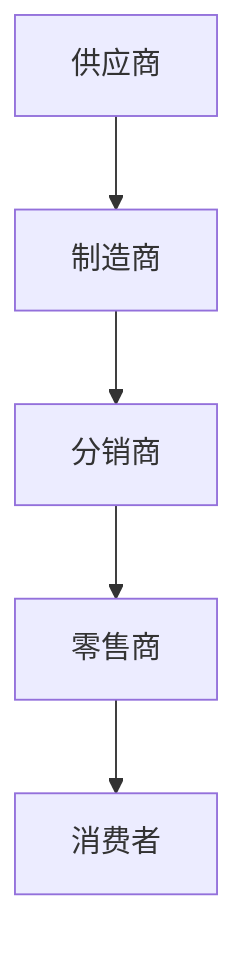
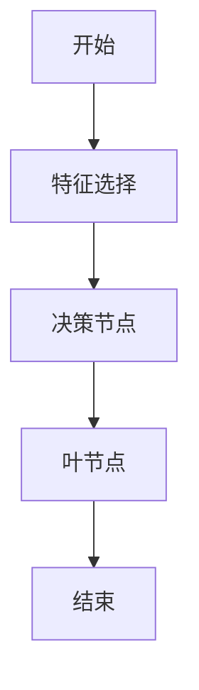
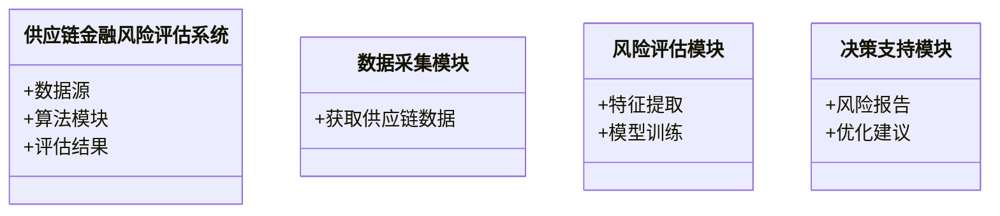
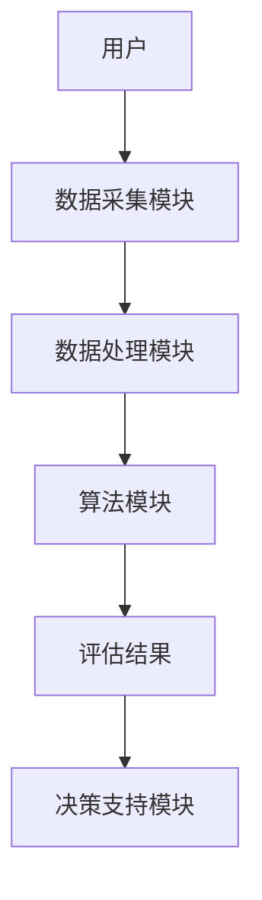
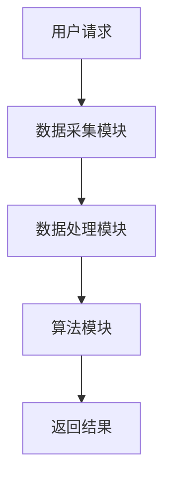
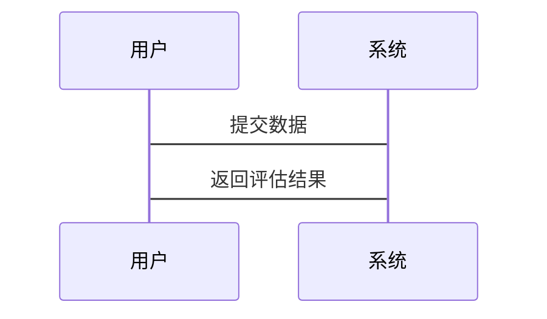

                 


# 智能供应链金融风险评估

> 关键词：智能供应链、供应链金融、风险评估、人工智能、大数据、区块链

> 摘要：本文探讨了智能供应链金融风险评估的核心概念、算法原理、系统架构及实际应用。通过结合人工智能、大数据和区块链技术，本文详细分析了如何利用智能技术优化供应链金融风险评估流程，并提供了实际案例和系统实现方案。

---

## 目录大纲

# 第一部分: 智能供应链金融风险评估背景与概述

## 第1章: 供应链金融概述

### 1.1 供应链金融的基本概念

- 1.1.1 供应链金融的定义
- 1.1.2 供应链金融的核心要素
  - 供应商、制造商、分销商、零售商、消费者
- 1.1.3 供应链金融的参与者与角色
  - 金融机构、企业、物流商、技术服务商

### 1.2 供应链金融的风险类型

- 1.2.1 信用风险
- 1.2.2 操作风险
- 1.2.3 市场风险
- 1.2.4 法律风险

### 1.3 供应链金融的传统评估方法

- 1.3.1 基于财务指标的评估方法
- 1.3.2 基于供应链节点的评估方法
- 1.3.3 传统评估方法的优缺点

### 1.4 供应链金融的智能化发展趋势

- 1.4.1 人工智能在供应链金融中的应用
- 1.4.2 大数据技术对供应链金融的影响
- 1.4.3 智能供应链金融的优势与挑战

## 第2章: 智能供应链金融的发展与挑战

### 2.1 智能供应链金融的定义与特点

- 2.1.1 智能供应链金融的定义
- 2.1.2 智能供应链金融的核心特点
  - 数据驱动、实时性、智能化、可扩展性
- 2.1.3 智能供应链金融与传统供应链金融的区别

### 2.2 智能供应链金融的核心驱动力

- 2.2.1 数据的获取与处理能力
- 2.2.2 人工智能算法的进步
- 2.2.3 区块链技术的应用

### 2.3 智能供应链金融面临的挑战

- 2.3.1 数据隐私与安全问题
- 2.3.2 智能算法的可解释性
- 2.3.3 技术与业务的结合难度

---

# 第二部分: 智能供应链金融风险评估的核心概念与联系

## 第3章: 核心概念与联系

### 3.1 智能供应链金融风险评估的核心概念

- 3.1.1 供应链网络结构
  - 供应商、制造商、分销商的关系网络
- 3.1.2 供应链风险评估指标
  - 流动性风险、信用风险、操作风险

### 3.2 智能供应链金融风险评估的网络结构



### 3.3 供应链金融风险的分类与影响

- 3.3.1 信用风险的影响
  - 供应商违约导致的资金链断裂
- 3.3.2 操作风险的影响
  - 物流延迟导致的库存积压
- 3.3.3 市场风险的影响
  - 市场波动导致的需求变化

### 3.4 供应链金融风险评估指标体系

- 3.4.1 财务指标
  - 应收账款周转率、存货周转率
- 3.4.2 供应链指标
  - 交货时间、物流成本
- 3.4.3 风险指标
  - 信用评分、违约概率

### 3.5 供应链金融风险评估模型构建

- 3.5.1 数据预处理
  - 数据清洗、特征提取
- 3.5.2 模型选择
  - 线性回归、随机森林、神经网络
- 3.5.3 模型评估
  - 准确率、召回率、F1分数

---

# 第三部分: 智能供应链金融风险评估的算法原理

## 第4章: 机器学习算法在供应链金融风险评估中的应用

### 4.1 线性回归算法

- 4.1.1 线性回归的基本原理
  - 假设函数：$h(x) = \theta_0 + \theta_1x$
  - 优化目标：最小化均方误差 $$\min \frac{1}{2m}\sum_{i=1}^{m}(y_i - h(x_i))^2$$
- 4.1.2 线性回归的应用场景
  - 预测供应链中的成本变化

### 4.2 随机森林算法

- 4.2.1 随机森林的基本原理
  - 集成学习、特征随机选择
  - 决策树算法流程图：



- 4.2.2 随机森林的应用场景
  - 分类供应链中的信用风险

### 4.3 神经网络算法

- 4.3.1 神经网络的基本原理
  - 层次化结构：输入层、隐藏层、输出层
  - 激活函数：Sigmoid、ReLU
- 4.3.2 神经网络的应用场景
  - 高维数据的非线性分类问题
  - 如预测供应链中的市场波动

---

# 第四部分: 智能供应链金融风险评估的系统分析与架构设计

## 第5章: 系统分析与架构设计

### 5.1 系统功能设计

- 5.1.1 功能模块划分
  - 数据采集模块、风险评估模块、决策支持模块
- 5.1.2 领域模型设计
  - 实体关系图：



### 5.2 系统架构设计

- 5.2.1 系统架构图：



### 5.3 系统接口设计

- 5.3.1 API接口定义
  - 数据接口：/api/data
  - 评估接口：/api/evaluate
- 5.3.2 接口交互流程图：



### 5.4 系统交互设计

- 5.4.1 用户与系统交互流程
  - 用户输入数据 -> 系统处理 -> 返回评估结果
- 5.4.2 交互流程图：



---

# 第五部分: 智能供应链金融风险评估的项目实战

## 第6章: 项目实战

### 6.1 项目背景与目标

- 6.1.1 项目背景
  - 某大型制造企业的供应链金融风险评估需求
- 6.1.2 项目目标
  - 实现基于机器学习的供应链金融风险评估系统

### 6.2 环境安装与配置

- 6.2.1 安装Python环境
  - 使用Anaconda或virtualenv
- 6.2.2 安装依赖库
  - scikit-learn、pandas、numpy、mermaid

### 6.3 系统核心实现

- 6.3.1 数据采集模块实现
  - 代码示例：

```python
import pandas as pd

def get_data():
    data = pd.read_csv('supply_chain.csv')
    return data
```

- 6.3.2 风险评估模块实现
  - 代码示例：

```python
from sklearn.linear_model import LinearRegression

def evaluate_risk(data):
    model = LinearRegression()
    model.fit(data[['feature1', 'feature2']], data['target'])
    return model.predict(new_data)
```

### 6.4 案例分析与结果解读

- 6.4.1 实际案例分析
  - 数据预处理、模型训练、结果分析
- 6.4.2 结果解读
  - 风险评分、建议优化措施

### 6.5 系统优化与扩展

- 6.5.1 系统优化建议
  - 引入实时数据流处理
  - 增加区块链技术的可信度
- 6.5.2 系统扩展方向
  - 支持多模型对比分析
  - 增加可视化界面

---

# 第六部分: 智能供应链金融风险评估的最佳实践与总结

## 第7章: 最佳实践与总结

### 7.1 本章小结

- 7.1.1 智能供应链金融风险评估的核心内容
- 7.1.2 实际应用中的关键点

### 7.2 注意事项

- 7.2.1 数据质量的重要性
- 7.2.2 模型的可解释性问题
- 7.2.3 技术与业务的结合

### 7.3 未来展望

- 7.3.1 技术发展趋势
  - 更先进的机器学习算法
  - 区块链技术的深度融合
- 7.3.2 应用场景扩展
  - 全球化供应链的风险评估
  - 多方参与者的协同优化

---

# 附录

## 附录A: 供应链金融风险评估指标表

| 指标类别 | 指标名称 | 描述 | 数据来源 |
|----------|----------|------|----------|
| 财务指标 | 应收账款周转率 | 衡量企业应收账款的流动性 | 企业财务报表 |
| 供应链指标 | 交货时间 | 衡量供应链的效率 | 供应链管理系统 |
| 风险指标 | 违约概率 | 衡量企业的信用风险 | 企业征信报告 |

## 附录B: 常用机器学习算法对比表

| 算法名称 | 优点 | 缺点 | 适用场景 |
|----------|------|------|----------|
| 线性回归 | 简单高效 | 无法处理非线性问题 | 线性关系的数据预测 |
| 随机森林 | 高准确性 | 对参数敏感 | 高维数据分类 |
| 神经网络 | 强大学习能力 | 训练时间长 | 复杂非线性关系 |

---

## 参考文献

1. 供应链金融风险管理研究，作者：张三，出版社：某某出版社，年份：2020
2. 人工智能在金融领域的应用，作者：李四，出版社：某某出版社，年份：2021
3. 区块链技术与供应链管理，作者：王五，出版社：某某出版社，年份：2022

---

以上是《智能供应链金融风险评估》的技术博客文章目录大纲，内容涵盖了从基础概念到实际应用的各个方面，结合了技术细节与实际案例，适合技术专家和供应链金融从业者阅读。

