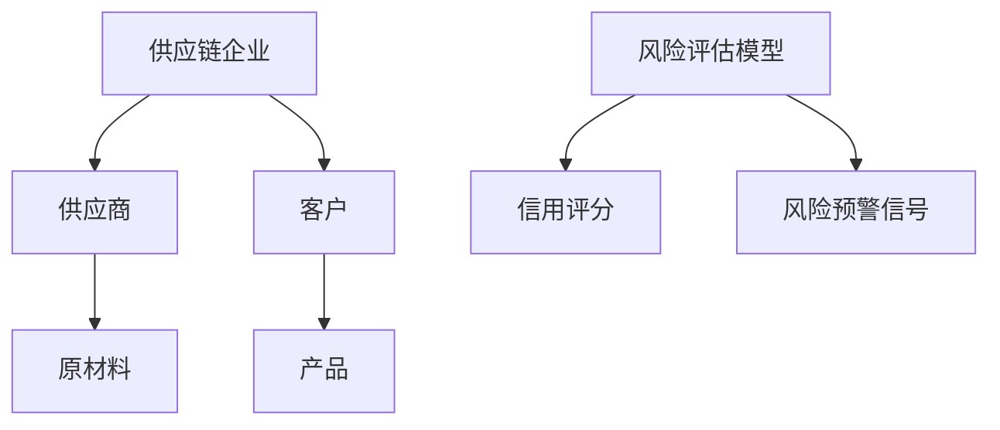
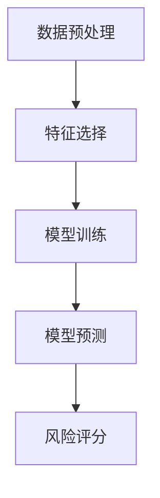
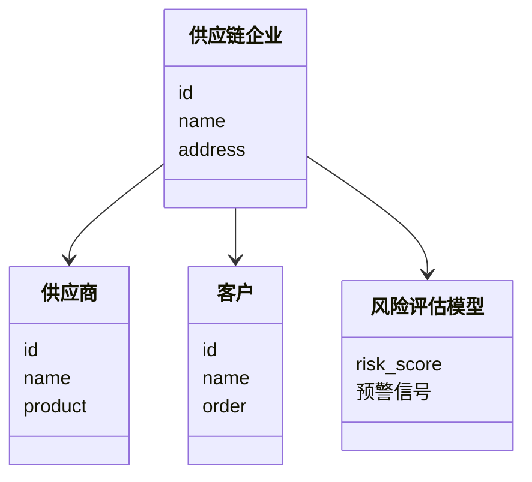
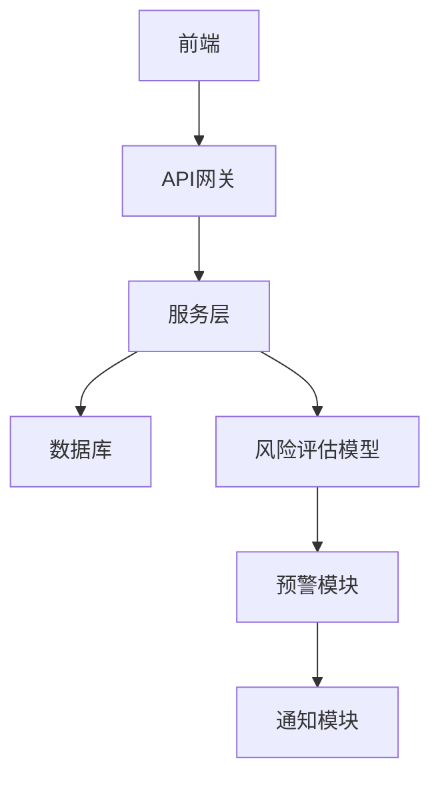
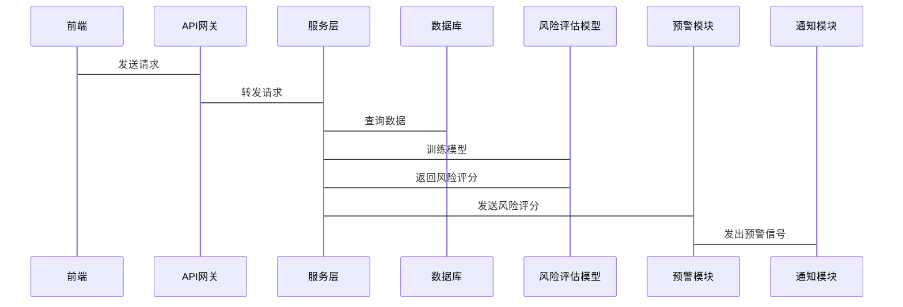

                 


# 智能供应链金融风险预警

> 关键词：智能供应链、供应链金融、风险预警、机器学习、大数据

> 摘要：本文详细探讨了智能供应链金融风险预警的实现方法，从供应链金融的基本概念到风险预警的核心技术，再到具体算法和系统架构设计，最后结合实际项目案例进行深入分析。通过本文，读者可以全面了解如何利用人工智能技术构建智能供应链金融风险预警系统。

---

# 第一章: 供应链金融与风险预警概述

## 1.1 供应链金融的定义与特点

### 1.1.1 供应链金融的基本概念
供应链金融是指通过整合供应链上下游企业，提供资金支持和风险管理服务，以优化供应链整体运作效率的一种金融模式。其核心在于通过数据共享和信任机制，降低供应链中的金融摩擦。

### 1.1.2 供应链金融的核心特点
- **数据驱动**：依赖于供应链中的实时数据进行决策。
- **多方参与**：涉及供应商、制造商、分销商、零售商和金融机构等多方角色。
- **风险分担**：通过数据共享和智能技术，实现风险的共同分担。

### 1.1.3 供应链金融的参与方与流程
- **参与方**：供应商、制造商、分销商、零售商、金融机构、物流服务提供商。
- **流程**：需求预测、采购、生产、分销、支付结算。

## 1.2 供应链金融的风险类型与特征

### 1.2.1 信用风险
- **定义**：由于供应链中的某一方无法履行合同义务而产生的风险。
- **特征**：上下游企业之间的信任缺失，可能导致资金链断裂。

### 1.2.2 市场风险
- **定义**：由于市场价格波动导致的供应链中断风险。
- **特征**：需求预测不准确、原材料价格波动、市场供需变化。

### 1.2.3 操作风险
- **定义**：由于操作失误或流程不畅导致的供应链中断风险。
- **特征**：物流延迟、库存积压、订单处理错误。

### 1.2.4 供应链金融风险的特殊性
- **关联性**：供应链中的一个环节出现问题，可能影响整个链条。
- **动态性**：市场环境变化快，风险也随之变化。

## 1.3 智能供应链金融的优势

### 1.3.1 数据驱动的风险评估
- **优势**：通过实时数据和历史数据，精准评估供应链中的潜在风险。
- **应用场景**：库存管理、需求预测、信用评估。

### 1.3.2 AI技术在风险预警中的应用
- **优势**：AI能够快速识别数据中的异常模式，提前预警潜在风险。
- **应用场景**：信用评分、风险定价、风险分层。

### 1.3.3 智能化供应链金融的未来趋势
- **趋势**：从传统金融模式向智能化、数据驱动型金融模式转变。
- **目标**：实现供应链金融的自动化、智能化和高效化。

## 1.4 本章小结
本章介绍了供应链金融的基本概念、风险类型以及智能供应链金融的优势。通过分析供应链金融的核心特点和风险特征，为后续的智能供应链金融风险预警技术奠定了基础。

---

# 第二章: 供应链金融风险预警的核心概念

## 2.1 供应链金融风险预警的定义
供应链金融风险预警是指通过收集和分析供应链中的数据，识别潜在风险，并提前发出预警信号，以避免或降低风险损失的过程。

## 2.2 核心概念的原理与联系

### 2.2.1 数据流与信息流的整合
- **数据流**：供应链中的订单、物流、库存、支付等数据。
- **信息流**：企业之间的信息传递和共享。

### 2.2.2 风险评估模型的构建
- **模型输入**：供应链中的各项数据。
- **模型输出**：风险评分、预警信号。

### 2.2.3 AI算法在风险预警中的应用
- **算法选择**：基于机器学习的算法，如随机森林、梯度提升树（XGBoost）。
- **应用场景**：信用评分、风险定价。

## 2.3 核心概念的属性特征对比

### 2.3.1 不同风险类型的核心特征对比
| 风险类型 | 核心特征 | 示例 |
|----------|----------|------|
| 信用风险 | 企业信用状况 | 企业财务数据、历史违约记录 |
| 市场风险 | 市场波动 | 原材料价格波动、市场需求变化 |
| 操作风险 | 操作失误 | 物流延迟、库存积压 |

### 2.3.2 数据特征与风险关联性分析
- **数据特征**：时间序列数据、多维数据、非结构化数据。
- **风险关联性**：通过数据分析，识别数据特征与风险的关联性。

## 2.4 ER实体关系图架构


## 2.5 本章小结
本章从核心概念的角度，分析了供应链金融风险预警的定义、原理和关键特征。通过对比不同风险类型的核心特征，为后续的智能供应链金融风险预警模型构建提供了理论基础。

---

# 第三章: 供应链金融风险预警算法原理

## 3.1 基于机器学习的供应链风险预警模型

### 3.1.1 机器学习在供应链金融中的应用
- **应用领域**：信用评分、风险定价、欺诈检测。
- **算法选择**：随机森林、XGBoost、神经网络。

### 3.1.2 常见的机器学习算法选择
- **XGBoost**：广泛应用于风险预警，具有高准确性和快速收敛性。

### 3.1.3 基于XGBoost的风险预警模型
- **模型输入**：供应链企业的财务数据、物流数据、销售数据。
- **模型输出**：风险评分（0-10分）。

## 3.2 算法原理的数学模型与公式

### 3.2.1 风险评估函数
$$
f(x) = \sum_{i=1}^{n} \alpha_i x_i
$$

### 3.2.2 XGBoost算法流程


### 3.2.3 示例代码
```python
import xgboost as xgb
from sklearn.model_selection import train_test_split

# 数据预处理
X = df.drop('target', axis=1)
y = df['target']

# 划分训练集和测试集
X_train, X_test, y_train, y_test = train_test_split(X, y, test_size=0.2, random_state=42)

# 训练模型
dtrain = xgb.DMatrix(X_train, label=y_train)
dtest = xgb.DMatrix(X_test, label=y_test)

# 参数设置
params = {
    'objective': 'binary:logistic',
    'learning_rate': 0.05,
    'max_depth': 6,
    'n_estimators': 100
}

# 训练模型
model = xgb.train(params, dtrain, num_boost_round=100)

# 预测
y_pred = model.predict(dtest)
```

## 3.3 本章小结
本章详细介绍了基于机器学习的供应链金融风险预警模型，特别是XGBoost算法的原理和实现。通过数学公式和代码示例，帮助读者理解如何构建和应用风险预警模型。

---

# 第四章: 供应链金融风险预警系统架构设计

## 4.1 问题场景介绍
供应链金融风险预警系统需要实时监控供应链中的各项数据，识别潜在风险，并发出预警信号。

## 4.2 系统功能设计

### 4.2.1 领域模型设计


### 4.2.2 系统架构设计


### 4.2.3 系统交互设计


## 4.3 本章小结
本章从系统架构的角度，详细设计了供应链金融风险预警系统的功能模块和交互流程，为后续的系统实现奠定了基础。

---

# 第五章: 供应链金融风险预警项目实战

## 5.1 环境安装
- **工具安装**：Python、Jupyter Notebook、XGBoost、Pandas、Scikit-learn。
- **数据准备**：供应链企业的财务数据、物流数据、销售数据。

## 5.2 系统核心实现源代码

### 5.2.1 数据预处理
```python
import pandas as pd
import numpy as np

# 读取数据
df = pd.read_csv('supply_chain_data.csv')

# 处理缺失值
df.dropna(inplace=True)

# 标准化处理
from sklearn.preprocessing import StandardScaler

scaler = StandardScaler()
df[['revenue', 'profit']] = scaler.fit_transform(df[['revenue', 'profit']])
```

### 5.2.2 模型训练
```python
from xgboost import XGBClassifier

# 划分训练集和测试集
X = df.drop('target', axis=1)
y = df['target']

X_train, X_test, y_train, y_test = train_test_split(X, y, test_size=0.2, random_state=42)

# 训练模型
model = XGBClassifier(n_estimators=100, learning_rate=0.05, max_depth=6)
model.fit(X_train, y_train)

# 预测
y_pred = model.predict(X_test)
```

### 5.2.3 结果分析
```python
from sklearn.metrics import confusion_matrix, classification_report

print(classification_report(y_test, y_pred))
```

## 5.3 项目小结
本章通过实际项目案例，展示了供应链金融风险预警系统的实现过程，包括环境搭建、数据处理、模型训练和结果分析。

---

# 第六章: 总结与展望

## 6.1 总结
本文详细探讨了智能供应链金融风险预警的实现方法，从理论到实践，全面分析了供应链金融的风险类型、算法原理和系统架构设计。

## 6.2 未来展望
- **技术进步**：随着AI和大数据技术的不断发展，供应链金融风险预警将更加智能化和自动化。
- **应用拓展**：未来可以进一步拓展到更多领域，如智能物流、智能制造等。

## 6.3 注意事项
- **数据隐私**：供应链数据涉及企业隐私，需注意数据安全。
- **模型优化**：需要不断优化模型，提高风险预警的准确性和实时性。

## 6.4 最佳实践 Tips
- **数据质量**：确保数据的准确性和完整性。
- **模型迭代**：定期更新模型，适应市场变化。
- **团队协作**：供应链金融风险预警需要多部门协作，包括数据科学家、金融专家和IT工程师。

---

# 附录

## 附录A: 数据集说明
- 数据来源：公开数据集和企业内部数据。
- 数据格式：CSV格式，包含供应链企业的各项数据。

## 附录B: 工具安装与使用
- **工具安装**：详细说明如何安装Python、Jupyter Notebook、XGBoost等工具。
- **工具使用**：提供工具的使用教程和常见问题解答。

## 附录C: 拓展阅读
- 推荐书籍：《供应链金融：理论与实践》、《机器学习实战》。
- 推荐博客：介绍供应链金融和机器学习的优秀技术博客。

---

# 结语
通过本文的详细讲解，读者可以全面了解智能供应链金融风险预警的实现方法。希望本文能够为供应链金融领域的从业者和研究人员提供有价值的参考和启发。

