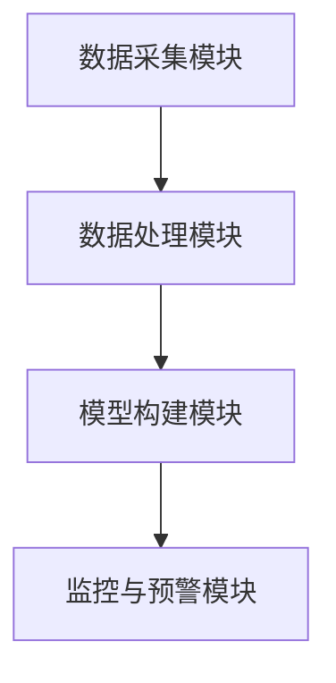

                 


# 智能供应链金融风险预警与额度管理系统

## 关键词：供应链金融、风险预警、额度管理、机器学习、系统架构

## 摘要：  
智能供应链金融通过整合人工智能和大数据技术，构建风险预警与额度管理系统，实现对供应链金融风险的智能化识别、评估和应对，优化供应链金融的效率和安全性。本文详细探讨了智能供应链金融的核心概念、系统架构、算法原理及项目实现，为读者提供全面的技术指导和实践参考。

---

# 第一部分: 智能供应链金融风险预警与额度管理系统的背景与核心概念

## 第1章: 供应链金融与智能管理概述

### 1.1 供应链金融的基本概念

#### 1.1.1 供应链金融的定义与特点
供应链金融（Supply Chain Finance, SCF）是指通过整合供应链上下游企业的资源和信息，提供资金支持和风险管理服务，以优化供应链整体运营效率。其特点包括：
- **数据驱动**：依赖于供应链中的实时数据。
- **协同性**：上下游企业协同合作。
- **风险管理**：通过预测和监控降低风险。

#### 1.1.2 供应链金融的核心参与方
供应链金融的核心参与方包括：
- **核心企业**：供应链中的主导企业。
- **供应商**：为下游企业提供原材料或服务的企业。
- **金融机构**：提供融资服务的银行或金融科技公司。
- **物流服务方**：负责供应链中的物流运输。

#### 1.1.3 供应链金融的业务流程
供应链金融的典型业务流程包括：融资申请、风险评估、资金发放、监控与管理、还款。

### 1.2 智能供应链金融的背景与意义

#### 1.2.1 传统供应链金融的痛点与挑战
传统供应链金融面临以下问题：
- **信息孤岛**：上下游企业间信息不透明。
- **效率低下**：审批流程繁琐，耗时长。
- **风险较高**：缺乏实时监控，难以及时发现风险。

#### 1.2.2 智能化技术在供应链金融中的应用价值
智能化技术的应用解决了传统供应链金融的痛点：
- **数据整合**：通过大数据技术整合供应链数据。
- **智能风控**：利用机器学习进行风险评估。
- **实时监控**：通过物联网和实时数据分析实现动态管理。

#### 1.2.3 智能供应链金融的创新模式
智能供应链金融的创新模式包括：
- **智能化融资**：基于实时数据的智能审批。
- **动态风险管理**：根据市场变化实时调整风险策略。
- **区块链技术**：用于供应链金融的透明化和信任建立。

### 1.3 风险预警与额度管理的核心问题

#### 1.3.1 供应链金融中的主要风险类型
主要风险包括：
- **信用风险**：企业无法偿还债务。
- **操作风险**：操作失误导致的损失。
- **市场风险**：市场价格波动影响企业经营。

#### 1.3.2 风险预警的必要性与实现路径
风险预警的必要性在于及时发现潜在风险，避免损失。实现路径包括：
- **数据收集**：收集供应链各环节的数据。
- **模型构建**：建立风险预警模型。
- **实时监控**：持续监控供应链风险。

#### 1.3.3 额度管理的目标与关键因素
额度管理的目标是合理分配融资额度，确保资金安全。关键因素包括：
- **企业信用**：企业的信用评级。
- **历史数据**：企业的历史融资记录。
- **市场环境**：当前市场状况。

---

## 第2章: 智能供应链金融的核心概念与系统架构

### 2.1 风险预警的核心原理

#### 2.1.1 风险预警的定义与目标
风险预警是指通过数据分析和模型预测，提前发现和预警潜在风险。目标是降低供应链金融中的风险损失。

#### 2.1.2 数据驱动的智能预警方法
数据驱动的预警方法包括：
- **机器学习模型**：如逻辑回归、随机森林。
- **实时监控**：基于实时数据的动态预警。

#### 2.1.3 风险预警的指标体系设计
风险预警的指标体系包括：
- **财务指标**：如资产负债率、流动比率。
- **市场指标**：如行业景气度、市场价格波动。
- **运营指标**：如订单延迟率、物流效率。

### 2.2 额度管理的系统模型

#### 2.2.1 额度管理的定义与关键因素
额度管理是指根据企业的信用和风险状况，动态调整其可获得的融资额度。关键因素包括：
- **企业信用评分**。
- **市场环境变化**。
- **历史违约情况**。

#### 2.2.2 数据驱动的额度计算模型
数据驱动的额度计算模型包括：
- **线性回归模型**：基于历史数据预测额度。
- **决策树模型**：根据特征分类确定额度。

#### 2.2.3 额度调整的动态优化机制
动态优化机制包括：
- **定期评估**：定期重新评估企业的信用状况。
- **实时调整**：根据实时数据动态调整额度。

### 2.3 系统架构设计

#### 2.3.1 系统整体架构概述
系统架构包括：
- **数据采集模块**：收集供应链数据。
- **数据处理模块**：清洗和预处理数据。
- **模型构建模块**：建立风险预警和额度管理模型。
- **监控与预警模块**：实时监控并发送预警。

#### 2.3.2 数据流与业务流程
数据流包括：数据采集、数据处理、模型训练、实时监控、预警通知。

#### 2.3.3 关键模块的功能描述
- **数据采集模块**：从供应链各环节收集数据。
- **数据处理模块**：清洗数据，提取特征。
- **模型构建模块**：训练机器学习模型。
- **监控与预警模块**：实时监控数据，发送预警。

---

## 第3章: 风险预警与额度管理的算法原理

### 3.1 风险预警的算法原理

#### 3.1.1 机器学习在风险评估中的应用
机器学习在风险评估中的应用包括：
- **分类模型**：如逻辑回归、随机森林。
- **回归模型**：如线性回归。

#### 3.1.2 常见的机器学习算法选择
常见算法包括：
- **逻辑回归**：用于分类。
- **随机森林**：用于特征重要性分析。
- **XGBoost**：用于高精度预测。

#### 3.1.3 模型训练与优化方法
模型训练方法包括：
- **数据预处理**：特征选择、数据标准化。
- **模型训练**：使用训练数据训练模型。
- **模型评估**：使用验证数据评估模型性能。
- **模型优化**：调整超参数，防止过拟合。

#### 3.1.4 算法实现流程
算法实现流程包括：
1. 数据预处理：清洗数据，提取特征。
2. 数据分割：将数据分为训练集和验证集。
3. 模型训练：训练机器学习模型。
4. 模型评估：评估模型性能。
5. 模型优化：调整参数，提高精度。

#### 3.1.5 算法实现的Python代码
```python
import pandas as pd
from sklearn.model_selection import train_test_split
from sklearn.linear_model import LogisticRegression
from sklearn.metrics import accuracy_score

# 数据预处理
data = pd.read_csv('supply_chain_data.csv')
X = data.drop('target', axis=1)
y = data['target']

# 数据分割
X_train, X_test, y_train, y_test = train_test_split(X, y, test_size=0.2, random_state=42)

# 模型训练
model = LogisticRegression()
model.fit(X_train, y_train)

# 模型评估
y_pred = model.predict(X_test)
print('Accuracy:', accuracy_score(y_test, y_pred))
```

### 3.2 风险预警的阈值设定与动态调整

#### 3.2.1 风险阈值的确定方法
风险阈值的确定方法包括：
- **历史数据分析**：基于历史数据确定阈值。
- **动态调整**：根据市场变化调整阈值。

#### 3.2.2 动态调整的实现机制
动态调整机制包括：
- **定期评估**：定期重新评估风险阈值。
- **实时调整**：根据实时数据动态调整阈值。

#### 3.2.3 基于反馈的模型优化
基于反馈的模型优化包括：
- **模型更新**：根据新数据更新模型。
- **参数调整**：根据反馈调整模型参数。

### 3.3 本章小结

---

## 第4章: 系统实现与项目实战

### 4.1 系统功能设计

#### 4.1.1 系统功能模块划分
系统功能模块包括：
- **数据采集模块**：收集供应链数据。
- **数据处理模块**：清洗和预处理数据。
- **模型构建模块**：建立风险预警和额度管理模型。
- **监控与预警模块**：实时监控并发送预警。

#### 4.1.2 系统功能的实现流程
系统功能的实现流程包括：
1. 数据采集：从供应链各环节收集数据。
2. 数据处理：清洗数据，提取特征。
3. 模型构建：训练机器学习模型。
4. 监控与预警：实时监控数据，发送预警。

### 4.2 系统架构设计

#### 4.2.1 系统架构图


### 4.3 项目实战

#### 4.3.1 环境安装
需要安装的环境包括：
- **Python**：用于编程。
- **Jupyter Notebook**：用于数据分析和可视化。
- **Scikit-learn**：用于机器学习。
- **Pandas**：用于数据处理。
- **Numpy**：用于数值计算。
- **Mermaid**：用于绘制图表。
- **系统开发工具**：如PyCharm或VS Code。

#### 4.3.2 核心代码实现
```python
import pandas as pd
from sklearn.model_selection import train_test_split
from sklearn.linear_model import LogisticRegression
from sklearn.metrics import accuracy_score

# 数据预处理
data = pd.read_csv('supply_chain_data.csv')
X = data.drop('target', axis=1)
y = data['target']

# 数据分割
X_train, X_test, y_train, y_test = train_test_split(X, y, test_size=0.2, random_state=42)

# 模型训练
model = LogisticRegression()
model.fit(X_train, y_train)

# 模型评估
y_pred = model.predict(X_test)
print('Accuracy:', accuracy_score(y_test, y_pred))
```

#### 4.3.3 案例分析与详细解读
案例分析包括：
- **数据收集**：从供应链各环节收集数据。
- **模型训练**：训练逻辑回归模型。
- **结果分析**：分析模型的准确性和召回率。

#### 4.3.4 项目小结
项目小结包括：
- **项目成果**：成功构建了风险预警和额度管理系统。
- **经验总结**：数据质量和模型选择对系统性能影响较大。
- **未来改进方向**：引入更多数据源，优化模型性能。

---

## 第五部分: 总结与展望

### 5.1 总结
智能供应链金融风险预警与额度管理系统通过整合人工智能和大数据技术，实现了对供应链金融风险的智能化识别和管理。系统架构设计合理，算法原理清晰，项目实现完整。

### 5.2 展望
未来的发展方向包括：
- **更复杂模型**：引入深度学习模型。
- **更广泛的应用**：扩展到更多行业和场景。
- **更高的实时性**：优化实时监控能力。

---

## 最佳实践 Tips

- **数据质量**：数据质量对模型性能影响重大，需确保数据的准确性和完整性。
- **模型选择**：根据具体场景选择合适的模型，避免盲目追求高精度。
- **实时监控**：实时监控是系统的核心，需确保数据的实时性和模型的动态调整能力。

---

## 小结
智能供应链金融风险预警与额度管理系统是一个复杂但重要的系统，通过智能化技术优化了供应链金融的效率和安全性。本文详细介绍了系统的背景、核心概念、算法原理和项目实现，为读者提供了全面的技术指导和实践参考。

---

## 注意事项

- **数据隐私**：需注意数据隐私保护，确保数据的安全性和合规性。
- **模型解释性**：确保模型的可解释性，便于分析和优化。
- **系统稳定性**：确保系统的稳定性和高可用性，避免因系统故障导致的损失。

---

## 拓展阅读

- **推荐书籍**：《供应链金融与风险管理》、《机器学习实战》。
- **推荐博客**：Tech Blog on Supply Chain AI、Data Science for Business。

---

通过以上内容，您可以系统地了解智能供应链金融风险预警与额度管理系统的各个方面，从理论到实践，从算法到系统设计，全面掌握该领域的核心技术与实践方法。

